# Kafka Zero to Hero — Part 05: Consumer Groups and Partitions

> Notes from episode 5 of the *Kafka Zero to Hero* series.
> Start multiple consumers, watch the problems appear, fix them with consumer groups, hit the next problem, fix *that* with partitions and a partition key — then watch a rebalance. Nothing skipped, with animated diagrams.
>
> Commands in one place: **[commands.md](commands.md)**
>
> Previous: [04 — Topics, producing, consuming, offsets](../04-cli-produce-consume/README.md) · Next: [06 — Rebalancing and scaling scenarios](../06-rebalancing-and-scaling-scenarios/README.md)

---

## Contents

1. [Where part 4 left us](#1-where-part-4-left-us)
2. [Today's agenda](#2-todays-agenda)
3. [Setup — three terminals](#3-setup--three-terminals)
4. [Problem 1 — two consumers, both get everything](#4-problem-1--two-consumers-both-get-everything)
5. [What a consumer group actually is](#5-what-a-consumer-group-actually-is)
6. [Demo — with a group](#6-demo--with-a-group)
7. [Problem 2 — one instance works, the other is idle](#7-problem-2--one-instance-works-the-other-is-idle)
8. [Why not just spray messages across instances](#8-why-not-just-spray-messages-across-instances)
9. [Partitions — how Kafka actually scales](#9-partitions--how-kafka-actually-scales)
10. [The partition key](#10-the-partition-key)
11. [Demo — topic with 2 partitions](#11-demo--topic-with-2-partitions)
12. [Choosing a good partition key](#12-choosing-a-good-partition-key)
13. [Rebalancing](#13-rebalancing)
14. [Key takeaways](#14-key-takeaways)
15. [What comes next](#15-what-comes-next)
16. [Check yourself](#16-check-yourself)

---

## 1. Where part 4 left us

Last video was also fully hands-on. We covered:

- The **Kafka topics commands**.
- **Producing** messages with `kafka-console-producer`, and a **consumer** on the other end consuming them.
- **Offsets** — where they come into the picture and why they matter.
- **Where on disk** Kafka stores messages, and **in what format** (binary).
- **Log retention**, and **serialization / deserialization**.
- Some **crucial parameters** — `--timeout`, `max.poll.records` and friends — very useful for production and for tuning to the application load.

---

## 2. Today's agenda

1. Start **multiple consumers** and see what problems show up.
2. Solve those problems using the **consumer group**.
3. Go into consumer groups in detail with the real **e-commerce** example.
4. Then partitions, partition keys, and rebalancing.

---

## 3. Setup — three terminals

```bash
docker compose up          # Kafka server started
docker ps                  # find the container
docker exec -it <id> bash  # interactive shell - do this in all three tabs
```

Then check what's there:

```bash
kafka-topics.sh --bootstrap-server localhost:9092 --list
```

No topics yet. Create the e-commerce one:

```bash
kafka-topics.sh --bootstrap-server localhost:9092 --topic order-events --create
kafka-topics.sh --bootstrap-server localhost:9092 --list
```

The layout for the demo:

- **Left terminal** = the **Order Service**, publishing orders onto the topic.
- **Right two terminals** = **two instances of the Payment Service** — instantiated because of heavy load, or because auto-scaling kicked in. Whatever the reason: two instances of the same service, for scaling.

---

## 4. Problem 1 — two consumers, both get everything

Start a console consumer in **both** right-hand windows, then start the producer on the left and publish `order-1`.

**What *should* happen?** `order-1` should be retrieved by **one** instance of the Payment Service. Because if **both** instances retrieve it:

- both consume the same **network bandwidth**
- both consume the same **CPU bandwidth**
- all the data is transferred to both

…then **there is no point in scaling at all**.

**What actually happens:**


**Both** consumers get the message. Publish `order-3`, `order-4` — both get everything, every time.

> Note the nuance: if one of those were a **Shipping Service** and the other a **Payment Service**, getting all the order messages in both would be **perfectly fine** — they're different services doing different work. But here they're **two instances of the same service**, so every instance is processing **duplicate, redundant messages**.

**Problem 1: scaling is not happening.**

---

## 5. What a consumer group actually is

Picture the full system:

- **Order Service** publishes to the **Kafka server** (server = broker, same thing).
- On the other side there can be many services consuming: **Product Service**, **Shipment Service**, **Payment Service**.
- Say **3 instances of Product Service** and **3 instances of Payment Service**.

Ideally:

- When Product Service picks up a message, **only one of its instances** should get it. There's no point in the other two processing the same message — that's redundant work.
- Same for Payment Service — one instance handles it, and it's done.

If all three instances process the same message, **there's no scaling** — all instances are doing identical work.

**How the consumer group solves it:** it creates a **logical group** over the instances — the dotted box in the diagram.

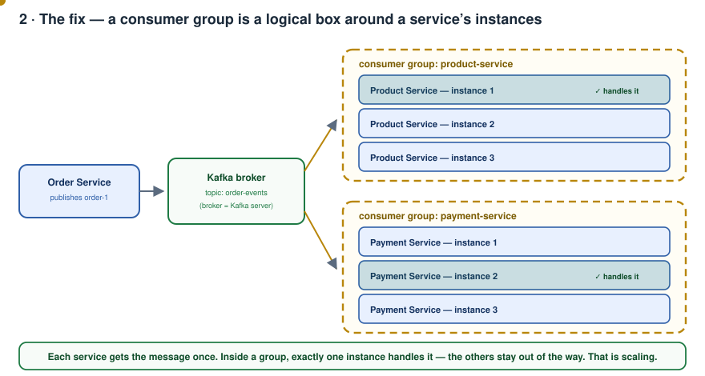

Product Service creates its own group over its three instances. Payment Service creates its own group over its three.

> With a group in place, **only one instance in the group gets the message**. The other instances don't.

That's how the consumer group solves the scaling problem.

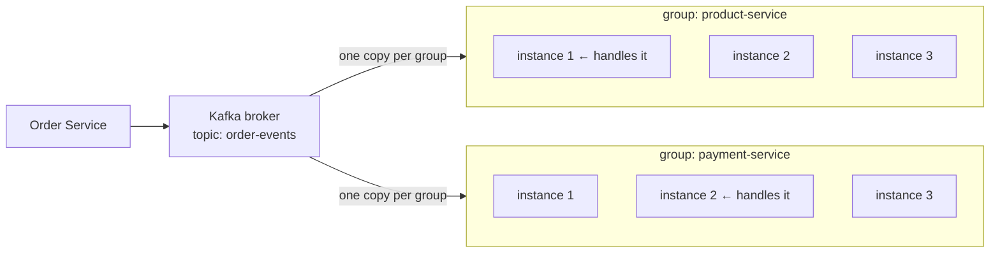

---

## 6. Demo — with a group

Creating the logical group is simple: **provide a group name**.

```bash
kafka-console-consumer.sh --bootstrap-server localhost:9092 \
  --topic order-events --group payment-service
```

Same command, same group name, in **both** consumer terminals.

Now publish `5`, `6`, `7`, `8`, `9`, `10` … `15`.


Consumer 1 gets `5`. Consumer 1 gets `6`. Consumer 1 gets `7`… **only one consumer is retrieving the messages.** The duplicates are gone.

### Now add a consumer in a *different* group

Start a third consumer — say this one is the **Product Service**:

```bash
kafka-console-consumer.sh --bootstrap-server localhost:9092 \
  --topic order-events --group product-service
```

Publish `16`, `17`, `18`. The product-service consumer **also receives all of them**.

> **Different groups → each group gets every message.**
> **Same group → only one instance gets each message.**

---

## 7. Problem 2 — one instance works, the other is idle

Look at the payment-service group again. One consumer is doing all the work; **the other consumer is completely idle**. It's not consuming anything.

That's **problem 2**. Duplicates are gone, but the work still isn't spread — so we still haven't really scaled.

**This is where partitions come in.**

---

## 8. Why not just spray messages across instances

First, why is that consumer idle at all? For that we need how Kafka behaves internally.

Kafka is an **event streaming application**. A topic has **partitions** — and by default only **one** partition is created. We saw it on disk in the earlier videos:

```
order-events-0/
```

`order-events` is the topic name, and `-0` is **partition 0**. That's where Kafka stores the messages.

So there's a single partition with hundreds of messages coming in, and two instances. You could argue: *"why not just send some messages to instance 1 and some to instance 2 — problem solved."*

**That would actually be far more problematic.** Banking example:


Two messages for the **same account ID**:

1. `deposit 100`
2. `withdraw 50`

Now suppose `deposit 100` goes to **instance 2**, and `withdraw 50` goes to **instance 1**. Instance 2 happens to be **slow** while processing; instance 1 is **fast**.

What happens?

- The **withdraw** message is processed first by instance 1.
- It checks the database: does the user have the balance to withdraw?
- The user has **no balance** — so it **rejects the transaction**.

But from the user's point of view, they **deposited 100 first** and *then* requested the withdrawal. Our application behaved incorrectly, purely because the withdraw was processed fast and the deposit late.

> **This is where ordering is very much required in Kafka. And ordering happens inside the partition** — those offsets `0, 1, 2, 3` are **attached to the partition**.

---

## 9. Partitions — how Kafka actually scales

*"But if all events have to be processed one by one, how do we scale?"*

**Scaling happens with the help of partitions.**

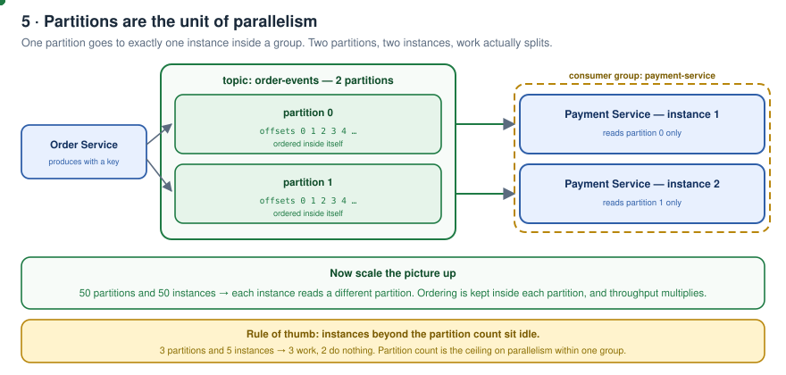

Take the same `order-events` topic and create it with **2 partitions**. With 2 instances of the Payment Service:

- **partition 0 → instance 1**
- **partition 1 → instance 2**

All the messages of partition 0 are consumed by instance 1; all the messages of partition 1 by instance 2. **That is the parallelism, and that is the scaling.**

Now visualise it with 10, 50, 100 partitions. With 50 instances, each one reads from a **different partition**. That's where scaling happens easily.

> Corollary worth remembering: **instances beyond the partition count sit idle.** 3 partitions and 5 instances → 3 work, 2 do nothing. The partition count is the ceiling on parallelism inside one group.

---

## 10. The partition key

Once we talk about partitions, we have to mention a **partition key**.

On the basis of the partition key, the **Kafka broker decides**: for the **same partition key**, the message should go to the **same partition**. How is it calculated the first time? Think of a **Java hash-code function** — hash the key, mod by the partition count.

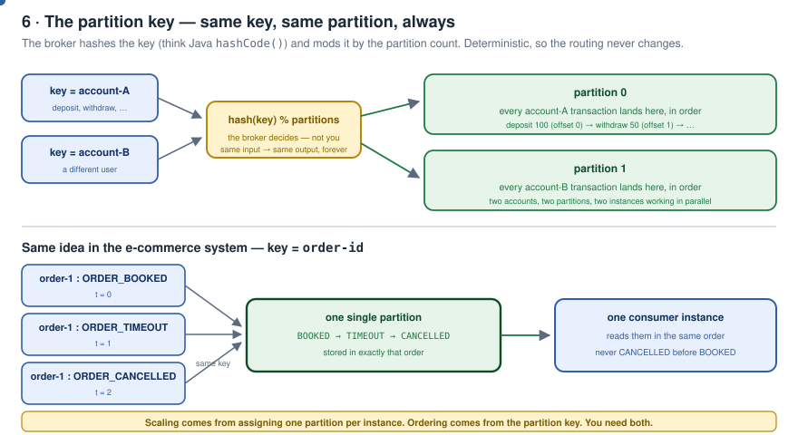

Back to the banking example. Take **account ID** as the partition key, on a topic with 2 partitions:

- Account **A** might be assigned to **partition 0**.
- Account **B** might be assigned to **partition 1**.

And now **all transactions on account A go into the same single partition**, and all of account B's into its own partition.

| Goal | How it is achieved |
|---|---|
| **Scaling** | by assigning an individual partition to an individual instance |
| **Ordering** | by the partition key — the same key always resolves to the same partition, so all its messages stay in one ordered log |

Same idea in e-commerce with `order-id` as the key: `ORDER_BOOKED`, `ORDER_TIMEOUT` and `ORDER_CANCELLED` for order `1` all land in the **same partition**, so they're consumed **completely in order**. It can never happen that `ORDER_CANCELLED` is retrieved first and `ORDER_BOOKED` later.

---

## 11. Demo — topic with 2 partitions

Delete the old topic and recreate it with 2 partitions:

```bash
kafka-topics.sh --bootstrap-server localhost:9092 --topic order-events --delete
kafka-topics.sh --bootstrap-server localhost:9092 --topic order-events --partitions 2 --create
kafka-topics.sh --bootstrap-server localhost:9092 --topic order-events --describe
```

The describe output now shows **PartitionCount: 2**.

Start the two consumers again (same group). Then the producer — but this time we need to pass a **partition key**, so two extra properties:

```bash
kafka-console-producer.sh --bootstrap-server localhost:9092 \
  --topic order-events \
  --property parse.key=true \
  --property key.separator=:
```

> `parse.key=true` tells it a key is being passed; `key.separator=:` says the key ends at the colon.
> And note — **you don't pass `--group` on a producer.** Groups are a consumer concept.


Now publish:

```
> order-1:booked      → instance 2 receives it
> order-2:booked      → instance 1 receives it
> order-3:booked
> order-4:booked
> order-5:booked
```

Messages are spread across the instances. Now republish with the **same partition key** — say order 1 was modified:

```
> order-1:updated     → goes to instance 2, exactly like before
> order-2:updated     → goes to instance 1, exactly like before
```

> **Ordering maintained, and scaling maintained.** Both problems solved.

---

## 12. Choosing a good partition key

There are a few things to always keep in mind. The partition key must be a **good** key — it must not produce an unfair distribution.

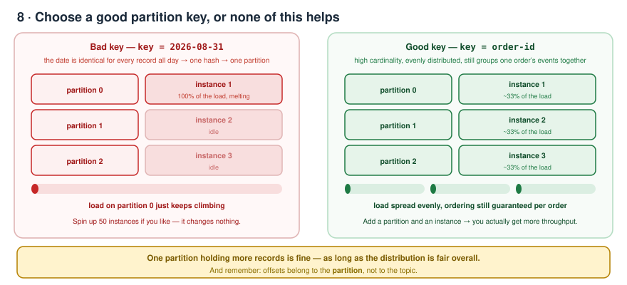

**Bad example: the date.** If your key is a date in `DD-MM-YYYY`, the hash value is **the same for the entire day**. So **all messages for that day go to a single partition**, and the load on that single instance keeps increasing.

> These are factors you must always keep in mind — because no matter how much scaling you do, no matter how many instances you spin up, **it is not going to help at all** if all the load lands on a single partition and a single instance.

**Good example: `order-id`** (or `account-id`) — high cardinality, spreads evenly, and still keeps everything about one order together and in order.

---

## 13. Rebalancing

One more thing. Kill **instance 1** (Ctrl+C) and then publish `order-2` again — the key that used to go to instance 1.


It now goes to the **other instance**. What happened?

> **Partition rebalancing.** The reassignment of partitions has happened — and the **Kafka controller** is the one doing it.

Start the first consumer back up. **The reassignment happens again**, and you'll see it in the logs:

```
[Consumer clientId=..., groupId=payment-service] Request joining group due to: group is already rebalancing
Notifying assignor about the new Assignment: partitions=[order-events-0, order-events-1]
```

These are the logs you'll see whenever you bring a consumer down or up — partitions getting rebalanced.

After the rebalance, publish again: `order-2` goes to one instance, `order-1` to the other — **possibly swapped compared to before**, precisely because of the rebalancing. And if you keep publishing the same key, it keeps going to that same instance.

Nothing is lost. A key may move to a different instance after a rebalance, but it still always lands on **exactly one** instance, in order.

---

## 14. Key takeaways

- **Offsets belong to the partitions, not to the topic.**
- **Choose a good partition key** — otherwise there is no point in instantiating more instances; it is never going to help.
- **One partition can have more records — that's not a problem at all**, as long as the distribution of records is fair overall.

| Problem | Fix |
|---|---|
| Every instance gets every message → duplicates, no scaling | **Consumer group** |
| Only one instance works, others idle | **Partitions** (one per instance) |
| Messages processed out of order | **Partition key** (same key → same partition) |
| One instance overloaded, rest idle | **A better partition key** (never a date) |
| An instance dies or joins | **Rebalance**, done by the controller |

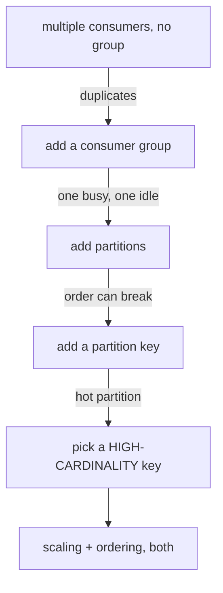

---

## 15. What comes next

The next video covers **more scaling scenarios**, and shows the **benchmark results for why Kafka is fast** — the benchmark code is already written.

---

## 16. Check yourself

1. Two consumers, no group. Who gets `order-1`? Why is that a problem?
2. When would two consumers receiving the same message be perfectly fine?
3. Define a consumer group in one sentence.
4. Three instances of Product Service in one group — how many process a given message?
5. Same group vs different groups — what changes?
6. After adding a group, what is the new problem?
7. Why is splitting one partition's records across instances a bad idea? Walk through the banking example.
8. Where exactly is ordering guaranteed in Kafka?
9. How do partitions deliver scaling? Map 2 partitions onto 2 instances.
10. You have 3 partitions and 5 instances in a group. What happens?
11. What does the broker do with the partition key?
12. Which two properties do you need on the console producer to send a key?
13. Do you pass `--group` to a producer?
14. Why is a date a terrible partition key?
15. Name the three key takeaways from this part.
16. What triggers a rebalance, and who performs it?
17. After a rebalance, can a key land on a different instance? Does that break ordering?

---

<sub>Notes written up from the *Kafka Zero to Hero* series, episode 5. Diagrams and wording are mine; the teaching order follows the video.</sub>
