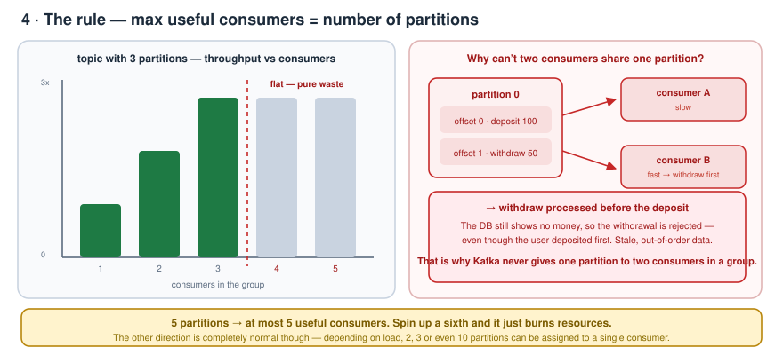
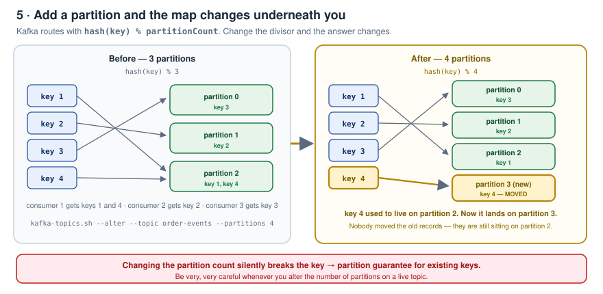
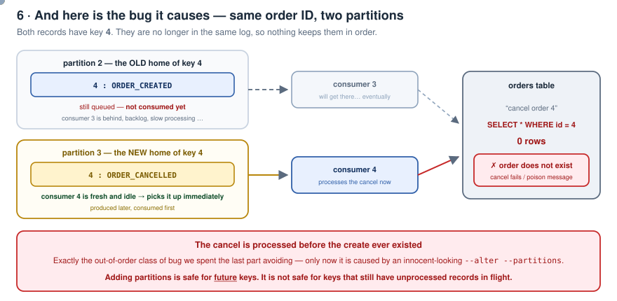
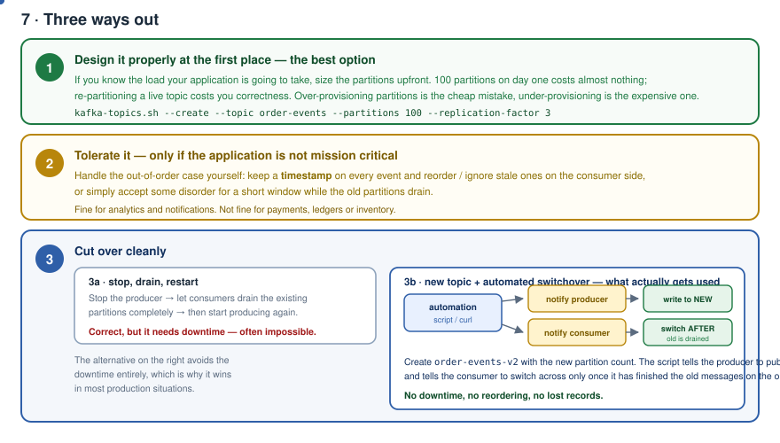
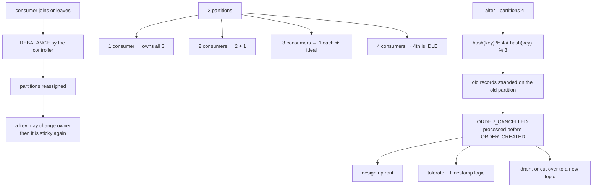

# Kafka Zero to Hero — Part 06: Rebalancing and Scaling Scenarios

> Notes from episode 6 of the *Kafka Zero to Hero* series.
> Partition rebalancing in detail, the four consumer-group scaling cases, the rule that ties consumers to partitions, and the nasty edge case that appears the moment you add a partition to a live topic — plus the three ways out.
>
> **This is the interview-heavy part.** Three or four questions here come up regularly for both mid-level (3–4 years) and senior engineers.
>
> Commands: **[commands.md](commands.md)**
>
> Previous: [05 — Consumer groups and partitions](../05-consumer-groups-and-partitions/README.md) · [04 — CLI, produce/consume, offsets](../04-cli-produce-consume/README.md) · [03 — Local setup](../03-local-setup/README.md) · [02 — Fundamentals](../02-kafka-fundamentals/README.md) · [01 — Why Kafka](../01-why-kafka-and-what-is-kafka/README.md)

---

## Contents

1. [Where part 5 left us](#1-where-part-5-left-us)
2. [Today's agenda](#2-todays-agenda)
3. [The demo — starting point](#3-the-demo--starting-point)
4. [Watching a rebalance happen](#4-watching-a-rebalance-happen)
5. [A key can move — then it is sticky again](#5-a-key-can-move--then-it-is-sticky-again)
6. [The four scaling cases](#6-the-four-scaling-cases)
7. [The rule, and why a partition is never shared](#7-the-rule-and-why-a-partition-is-never-shared)
8. [The edge case — adding a partition to a live topic](#8-the-edge-case--adding-a-partition-to-a-live-topic)
9. [Why the key moves](#9-why-the-key-moves)
10. [How to solve it — three options](#10-how-to-solve-it--three-options)
11. [One-page recap](#11-one-page-recap)
12. [What comes next](#12-what-comes-next)
13. [Interview questions from this part](#13-interview-questions-from-this-part)

---

## 1. Where part 5 left us

- **Partitions**, and how important **partition keys** are.
- **Consumer groups** — why they're required and what problem they solve.
- The practical demo: the problems when you start consumers **without** a consumer group, and how introducing the group solves them.
- How to **scale Kafka while ensuring messages are processed in order** — by increasing the number of partitions.
- How important it is to **select a good partition key**. With a bad key you unnecessarily **under-utilise or over-utilise** your resources. The example: taking the **date** as a partition key in `DD-MM-YY` format (ignoring the time) generates the **same hash code** every time, so **all messages persist in the same partition**.

---

## 2. Today's agenda

1. **Partition rebalancing** in detail.
2. **Scaling scenarios** — barely touched last time, covered in depth here.

---

## 3. The demo — starting point

```bash
docker compose up        # exactly like the last video, nothing else
```

The `order-events` topic from part 5 is still there (2 partitions — nothing was deleted):

```bash
kafka-topics.sh --bootstrap-server localhost:9092 --list
```

Start the consumer with the same group as last time:

```bash
kafka-console-consumer.sh --bootstrap-server localhost:9092 \
  --topic order-events \
  --property print.key=true \
  --group payment-service
```

- `--bootstrap-server` — to connect to the cluster
- `--topic` — which topic to consume
- `--property print.key=true` — so the console shows the **key** alongside the message. Without this property you'd only see the message.
- `--group payment-service` — the consumer group

And the producer:

```bash
kafka-console-producer.sh --bootstrap-server localhost:9092 \
  --topic order-events \
  --property parse.key=true \
  --property key.separator=:
```

> Why those two properties? Because the topic was created with **two partitions**. Without `parse.key` / `key.separator`, Kafka treats the line as a **single string message** — not a key-value pair — and then it has no key to decide a partition from.

Publish:

```
> 1:order-1
```

Key is `1`, value is `order-1`. In real life the **value** would be a JSON with `orderId`, order name, the products/items in the order, the created date and so on — and the **partition key** would be the order ID, or whatever you decide. Here it's a plain string just so we can see **which consumer receives what**.

Publish `2:order-2`, `4:order-4` — all consumed by the one consumer that's running.

---

## 4. Watching a rebalance happen

Now assume load suddenly increased and **auto-scaling started one more instance** of the Payment Service — i.e. one more consumer.



Look at the logs the moment it starts. **Reassignment has happened — partition rebalancing.**

The topic has 2 partitions, so:

- **partition 0 → consumer 1**
- **partition 1 → consumer 2**

Now publish more and watch where things land:

```
> 5:order-5   → instance 2
> 1:order-1   → instance 1
> 2:order-2   → instance 2      ← this used to go to instance 1
> 6:order-6   → instance 2
> 7:order-7   → instance 1
```

Then close one consumer and publish again:

```
> 1:order-1   → instance 2      ← used to be instance 1
> 7:order-7   → instance 2
```

> **In short: whenever any consumer joins or leaves the Kafka cluster, partition rebalancing happens and the partitions get reassigned to the consumers accordingly.**

With two partitions and two consumers, one partition goes to each. With two partitions and one consumer, that consumer takes both. You'll see the rebalance in the logs **every single time** you start or bring down a consumer.

---

## 5. A key can move — then it is sticky again

That `2:order-2` jump deserves a callout, because it looks like ordering just broke.



Earlier `order-2` was going to one consumer; after the rebalance it goes to the other. **Whenever partition rebalancing is happening, there is a chance the messages get consumed by a different consumer.**

What actually happened: the **partition didn't move — its owner did**. Key `2` still hashes to the same partition; that partition is now owned by a different instance.

And once the rebalance settles: **from then on, key `7` always goes to instance 1, key `6` always goes to instance 2.** Send key `6` again with any value and it goes to instance 2, every time.

> Once the partition rebalancing has finished, all messages for a key go to the same consumer — the one the partition was assigned to.

---

## 6. The four scaling cases

Now the important part. We used 2 partitions in the demo, but in production a topic could have **40 partitions, 100 partitions — any number**. (100 is genuinely common.) For visualisation let's use **3 partitions**.



### Case 1 — one consumer

All three partitions are assigned to the **single consumer**. Simple.

### Case 2 — a second consumer joins

Auto-scaling, or any other reason. Now 2 consumers, still 3 partitions.

Rebalance happens. **One partition is assigned to the newly joined consumer**, and the **remaining two stay** with the old one. Previously all three were on one consumer; now it's 2 + 1. (That's exactly what we saw in the demo with 2 partitions.)

### Case 3 — a third consumer joins

3 consumers, 3 partitions. Rebalance again, and now **each partition is assigned to each consumer** — a completely **fair distribution**. This is the ideal case.

### Case 4 — a fourth consumer joins

Load spikes again, so you instantiate one more instance. Now **4 consumers, still 3 partitions.**

> The fourth consumer **sits idle**. It will not receive any messages, because all three partitions are already assigned to the first three consumers and **there is no partition left over to assign to it**.

---

## 7. The rule, and why a partition is never shared

Why doesn't Kafka just let two consumers share a partition to keep the fourth one busy?



Because that would land us straight back in **message ordering / out-of-order** problems — the withdraw/deposit case from the last part. The withdraw gets processed first and the deposit later, so the withdraw is **rejected** because there's no money in the account. Stale data, wrong behaviour.

> **We cannot assign one partition to different consumers.**

So the conclusion is simple:

> **The maximum number of consumers = the number of partitions.**

- Topic has 3 partitions → you can usefully scale up to **3 consumers**.
- Topic has 5 partitions → maximum **5 consumers**. Spin up a sixth and it's **sheer waste of resources** — you achieve nothing.
- Ideally, in the best case, **number of consumers = number of partitions**.

The **other direction is completely normal** though. In production, in large-scale companies, depending on the business use case and the application load, **2, 3 or even 10 partitions may be assigned to a single consumer**. It all depends on your application's behaviour.

---

## 8. The edge case — adding a partition to a live topic

This is the scenario interviewers love.

Start from a topic with **3 partitions**, where the order service has already produced some messages. The partition keys are `1`, `2`, `3`, `4`:

| key | lands on | consumed by |
|---|---|---|
| 3 | partition 0 | consumer 3 |
| 2 | partition 1 | consumer 2 |
| 1, 4 | partition 2 | consumer 1 |

Now **traffic increases**, and three partitions aren't enough. So you add one more partition — a simple `--alter` command — and instantiate one more consumer:

```bash
kafka-topics.sh --bootstrap-server localhost:9092 --topic order-events --alter --partitions 4
```



Now you have **4 partitions and 4 consumers** — back to the ideal one-partition-per-consumer case. Life looks sorted.

**It isn't.**

Key `4` used to go to **partition 2**. After the change, key `4` hashes to the **new partition 3**.

And suppose the old message with key `4` is **still sitting in partition 2, unprocessed**:

- The old, unprocessed record is **`4 : ORDER_CREATED`**
- The new record going to the new partition is **`4 : ORDER_CANCELLED`**

Same order ID. Two different partitions. Two different consumers.



There's a very real chance **`ORDER_CANCELLED` gets consumed first**. That consumer goes to cancel order 4, looks it up, and finds **that order ID does not exist** — because the `ORDER_CREATED` message hasn't been processed yet.

**That's the out-of-order problem, and it's a very big one.**

---

## 9. Why the key moves

Internally, Kafka decides where a message goes like this:

```
partition = hash(key) % numberOfPartitions
```

It hashes the key (order ID, account ID, whatever) and **mods it by the number of partitions**.

> So if the partition count changes — 3 → 4 — **the same key can now resolve to a different partition**.

Nobody migrates the old records. They stay exactly where they were written. Only *future* records for that key go somewhere new.

> Adding partitions is safe for **future** keys. It is **not** safe for keys that still have unprocessed records in flight.

---

## 10. How to solve it — three options

First and foremost: **be very, very careful whenever you change the number of partitions.**



### Option 1 — design properly at the first place

The simplest fix. **If you know your application is going to take this much load, design the topic partitions at that point itself** — 100 partitions upfront, or whatever number matches the expected load.

Over-provisioning partitions is the cheap mistake. Under-provisioning is the expensive one.

### Option 2 — tolerate it, if you can afford to

If the application is **not mission critical**, or you can handle it smartly, put **custom logic for handling out-of-order issues** on the consumer side:

- attach a **timestamp** to every event and reorder / drop stale ones, **or**
- simply **accept the ordering issues for some time** while things settle

Fine for analytics and notifications. Not fine for payments, ledgers or inventory.

### Option 3 — cut over cleanly

**3a — stop, drain, restart.**
**Stop the producer**, let the consumers **drain the existing partitions first**, and only then start the producer again. That guarantees no old key still has records sitting on the old partition while new ones go elsewhere.

The catch: **it's often very hard to take that downtime.**

**3b — new topic + automated switchover.** This is the alternative that actually gets used in production:

1. Create a **new topic** with the new number of partitions.
2. Have custom logic — typically an **automation script** with, say, a `curl` command hitting the producer side — to **notify the producer** to send messages to the **new topic** from now on.
3. The same script also **notifies the consumer** to consume from the new topic — but **only once it is done with the old messages** in the old partitions.

No downtime, no reordering, nothing lost.

---

## 11. One-page recap



| Question | Answer |
|---|---|
| What triggers a rebalance? | Any consumer **joining or leaving** the group |
| Who performs it? | The **controller** |
| Can a key change consumer? | Yes, during a rebalance. Afterwards it's sticky again |
| Did the partition move? | No — its **owner** moved |
| 3 partitions, 4 consumers? | The 4th is **idle** |
| Max useful consumers | **= number of partitions** |
| Can one partition serve two consumers? | **No** — it would break ordering |
| Can one consumer serve many partitions? | **Yes** — 2, 3, 10, whatever the load needs |
| How does Kafka pick the partition? | `hash(key) % partitionCount` |
| What breaks when you add partitions? | Existing keys remap; in-flight records get stranded → out-of-order |
| Can partitions be reduced? | **No** — only increased |
| Best fix | **Size the partitions correctly upfront** |
| Production fix | **New topic + scripted switchover** once the old one drains |

---

## 12. What comes next

The next video goes deeper into **offsets** — very important, and asked in interviews — and then the **benchmark performance test**: live numbers showing **how fast Kafka really is**, and **which factors make Kafka fast**. It may need two videos.

---

## 13. Interview questions from this part

1. What exactly triggers a partition rebalance?
2. Who performs the reassignment?
3. You have 3 partitions and add a second consumer. Describe the assignment before and after.
4. 3 partitions, 4 consumers in one group. What does the 4th do, and why?
5. Why can't Kafka assign one partition to two consumers in the same group? Give the concrete failure.
6. What is the maximum useful number of consumers for a topic with 5 partitions?
7. Is it acceptable for one consumer to own 10 partitions?
8. A key went to consumer 1 yesterday and consumer 2 today. What happened, and is ordering broken?
9. How does Kafka choose the partition for a keyed record?
10. You run `--alter --partitions 4` on a live topic with 3 partitions. What can go wrong?
11. Walk through the `ORDER_CREATED` / `ORDER_CANCELLED` failure.
12. Give three strategies for safely changing the partition count.
13. Why is "create a new topic and switch over" usually preferred to "stop, drain, restart"?
14. Can you reduce the partition count of a topic?
15. Why is a date a bad partition key? (carried over from part 5)

---

<sub>Notes written up from the *Kafka Zero to Hero* series, episode 6. Diagrams and wording are mine; the teaching order follows the video.</sub>
