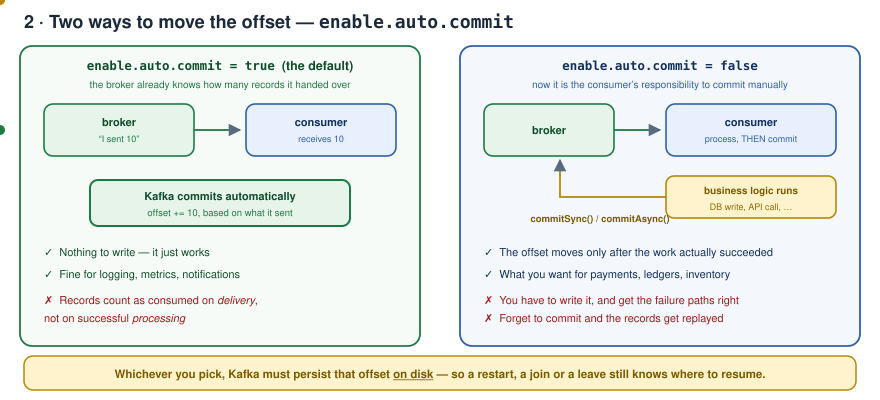
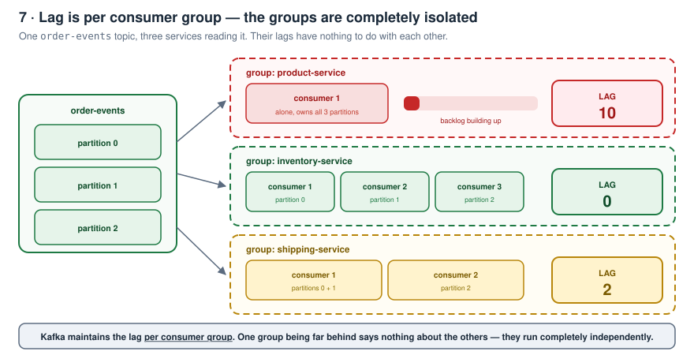
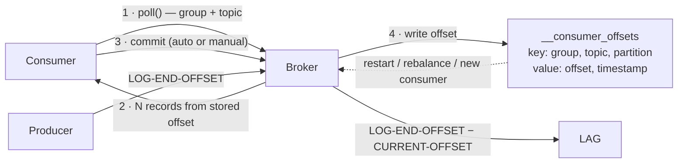

# Kafka Zero to Hero — Part 07: `__consumer_offsets` and Consumer Lag

> Notes from episode 7 of the *Kafka Zero to Hero* series.
> What Kafka actually does behind the scenes when a consumer consumes: the pull loop, offset commits, the `__consumer_offsets` topic decoded field by field, and consumer lag — how to measure it, what it means, and how it behaves across consumer groups.
>
> Commands: **[commands.md](commands.md)**
>
> Previous: [06 — Rebalancing and scaling scenarios](../06-rebalancing-and-scaling-scenarios/README.md) · [05 — Consumer groups and partitions](../05-consumer-groups-and-partitions/README.md) · [04 — CLI, produce/consume, offsets](../04-cli-produce-consume/README.md) · [03 — Local setup](../03-local-setup/README.md) · [02 — Fundamentals](../02-kafka-fundamentals/README.md) · [01 — Why Kafka](../01-why-kafka-and-what-is-kafka/README.md)

---

## Contents

1. [Where part 6 left us](#1-where-part-6-left-us)
2. [Today's agenda](#2-todays-agenda)
3. [Behind the scenes — the pull loop](#3-behind-the-scenes--the-pull-loop)
4. [Two ways to move the offset](#4-two-ways-to-move-the-offset)
5. [Design it yourself first](#5-design-it-yourself-first)
6. [The demo — setting it up](#6-the-demo--setting-it-up)
7. [Reading `__consumer_offsets`](#7-reading-__consumer_offsets)
8. [Consumer lag](#8-consumer-lag)
9. [Why lag matters](#9-why-lag-matters)
10. [Lag scenarios across consumer groups](#10-lag-scenarios-across-consumer-groups)
11. [One-page recap](#11-one-page-recap)
12. [What comes next](#12-what-comes-next)
13. [Check yourself](#13-check-yourself)

---

## 1. Where part 6 left us

- **Partitions** in detail.
- How to **scale Kafka** by introducing more partitions or more consumers.
- How to **ensure messages are processed in order** while scaling.
- The different **trade-offs** and **scaling scenarios**.

---

## 2. Today's agenda

Going deeper into **what Kafka does behind the scenes when a consumer consumes messages**.

There should be a way to know:

- how many messages the **producer** has produced
- how many messages the **consumer** has consumed
- how many messages are **lagging**

And at the end, different scenarios showing **how consumer lag behaves**.

---

## 3. Behind the scenes — the pull loop

Picture it: a producer, a consumer, and a topic partition (partition 0) living on the Kafka broker.

> **Consumers in Kafka work on a pull-based approach.**

When we produce messages to the broker, the broker does **not** go and notify each consumer — *"consumer one, this message is for you; consumer two, this one is yours."* Kafka does not work that way.

Instead, **consumers poll the broker at a periodic interval** and get a number of messages back.



And when the consumer has consumed those messages, it has to **notify the broker** — so that Kafka can **increase the offset for that topic-partition**. There has to be some way of telling the broker "move the offset forward".

---

## 4. Two ways to move the offset

**Way 1 — the consumer commits manually.** The consumer notifies Kafka to commit the records, and only then does Kafka increase the offset.

**Way 2 — Kafka does it itself.** As soon as the consumer consumes, the broker **already knows how many messages it sent** — the consumer asked for 10, the broker handed over 10. So the broker can internally increase the offset based on that information.

Which one you get is a configuration:

```properties
enable.auto.commit=true    # the default
```



| Setting | Behaviour |
|---|---|
| `enable.auto.commit=true` (default) | The broker knows how many messages it sent, so **Kafka automatically commits** the records and increases the offset. |
| `enable.auto.commit=false` | It becomes the **consumer's responsibility** to commit the records manually. Only after that does the broker increase the offset. |

Which approach you choose depends on your use case. But either way:

> **Kafka has to maintain this offset information somewhere on disk.**

Because whenever you restart the Kafka cluster, or a new consumer joins or leaves, Kafka has to know **up to which offset the messages have already been processed** — so it gives only the **new** messages, not the old ones.

**That is where the `__consumer_offsets` topic comes in.** We first saw it back in episodes 2 and 3, while walking the data directory where Kafka stores its data. Today we find out what it holds, and why it is so important — both for maintaining offsets and for **scaling Kafka**.

---

## 5. Design it yourself first

Before looking at the answer, try designing it. The problem statement:

> You are given a **topic**, a **partition** and an **offset**. Multiple consumers are consuming continuously. Design the functionality that tracks **which consumer group has already consumed how many messages** — so that next time a consumer asks for more, you give it only the **new** messages.

Think about it for a minute. It is easier than it sounds, and Kafka does it the same way.

### The solution

What do we have? A **consumer group**, a **topic**, a **partition**, and an **offset**. What do we need to store? Just *which consumer group has consumed how many messages, for which topic-partition.*

So: a **simple dictionary / map**.

```
key   =  offsetKey    =  (groupName, topic, partition)
value =  offsetValue  =  (offset, lastTimestamp)
```



### The flow (assume `enable.auto.commit=true` for simplicity)

1. **The consumer requests 10 messages.** What does it send? The **group** (we always have to mention `--group` when consuming) and the **topic**.
2. **The broker builds the offset key.** Group name and topic come straight from the request. The **partition** it gets from the **metadata it already holds in memory** — which partition is assigned to which consumer. That metadata came from the **controller**, exactly as covered in episode 2.
3. **Kafka gives back the 10 messages**, starting from the stored offset — so only new records are served.
4. **Kafka updates the dictionary:** `offset += 10`, `lastTimestamp = now`.

That's it. That's the whole design — and it is genuinely what Kafka does.

---

## 6. The demo — setting it up

```bash
docker compose up
docker exec -it <container-id> bash

kafka-topics.sh --bootstrap-server localhost:9092 --list
```

The list already includes `__consumer_offsets`. Create a fresh topic to work with:

```bash
kafka-topics.sh --bootstrap-server localhost:9092 --topic test --create
kafka-topics.sh --bootstrap-server localhost:9092 --list
```

Open a second console into the container. Producer on one side (single partition, for simplicity):

```bash
kafka-console-producer.sh --bootstrap-server localhost:9092 --topic test
```

Consumer on the other, with a group:

```bash
kafka-console-consumer.sh --bootstrap-server localhost:9092 \
  --topic test --group test-cg
```

Produce `hello`, `hi`, `bye` — the consumer retrieves them automatically, because it is already running and polling.

---

## 7. Reading `__consumer_offsets`

Open a third console into the container and read the internal topic directly:

```bash
kafka-console-consumer.sh --bootstrap-server localhost:9092 \
  --topic __consumer_offsets --from-beginning
```

You get garbage. Why? Because — as covered earlier — **Kafka stores data in binary format internally**.

To see the actual data there's a **formatter**:

```bash
kafka-console-consumer.sh --bootstrap-server localhost:9092 \
  --topic __consumer_offsets --from-beginning \
  --formatter "org.apache.kafka.tools.consumer.OffsetsMessageFormatter"
```

Produce one more message and look at what shows up:



```
[test-cg,test,0]::OffsetAndMetadata(offset=5, leaderEpoch=Optional[0],
   metadata=, commitTimestamp=1756612345678, expireTimestamp=None)
```

Now decode it against what we designed:

| In the record | What it is | Our design |
|---|---|---|
| `test-cg` | the **consumer group** we passed with `--group` | key part 1 |
| `test` | the **topic** | key part 2 |
| `0` | the **partition** | key part 3 |
| `offset=5` | the **current index** in that partition — how many records this group has already retrieved | value |
| `commitTimestamp` | when it was **last committed** | value |
| `leaderEpoch` | used around **leader election** and **partition rebalancing** — when a consumer joins or leaves, Kafka has to decide which consumer the partition is assigned to, and this is part of how it tracks that | — |

> The exact same key-value dictionary we designed as engineers is what Kafka uses. Nothing difficult about it.

---

## 8. Consumer lag

Now **close the consumer**, leave the producer running, and publish a few more messages — `hello`, `bye`, `test`, `class`, whatever.

How do we know how many messages the producer produced versus how many the consumer consumed? There's a command:

```bash
kafka-consumer-groups.sh --bootstrap-server localhost:9092 \
  --group test-cg --describe
```



```
GROUP    TOPIC  PARTITION  CURRENT-OFFSET  LOG-END-OFFSET  LAG
test-cg  test   0          5               10              5
```

| Column | Meaning |
|---|---|
| **CURRENT-OFFSET** | How far this group has consumed. **The same `5` we just read out of `__consumer_offsets`.** |
| **LOG-END-OFFSET** | How many messages have already been **produced** by the producer. |
| **LAG** | `10 − 5 = 5` — messages **still pending** to be processed by the consumer. |

Now **start the consumer again**. It consumes every pending message it missed. Run `--describe` again:

```
GROUP    TOPIC  PARTITION  CURRENT-OFFSET  LOG-END-OFFSET  LAG
test-cg  test   0          10              10              0
```

**LAG = 0**, because the consumer has consumed everything.

---

## 9. Why lag matters



Based on the lag value you decide whether to **increase the partitions** or **increase the consumers**.

> If you are seeing significant high lag, it means your **production rate is too high and your consuming rate is too low** — your backend services or your Kafka consumers cannot keep up. You need to scale, either the consumers or the partitions.

This is exactly why the number is so important: it tells you **how your Kafka setup is actually behaving**, and it's the basis for crucial production decisions.

And when there is high lag in production, scaling the consumers means the other consumers **pick up some of the partitions** and process those messages separately — so the lag clears **efficiently and quickly**.

(Remember the part 6 rule though: consumers beyond the partition count sit idle, and adding partitions on a live topic remaps existing keys.)

---

## 10. Lag scenarios across consumer groups

Take a topic — say `order-events` — with **3 partitions**, and several different **consumer groups** reading it: product service, inventory service, shipping service, and so on.



> **Kafka maintains the lag by consumer group.**

So it's perfectly possible to see:

| Consumer group | Consumers in the group | LAG |
|---|---|---|
| product-service | 1 | **10** |
| inventory-service | 3 | **0** |
| shipping-service | 2 | **2** |

They are all **operating in isolation**. The lags are **not interrelated** — each one is independent, per consumer group.

The inventory service might be very fast because you designed it with an efficient number of consumers, so its lag drops to zero very quickly. The product-service group has only **one** consumer, so you see a high lag there. The shipping-service group has **two**, so it sits somewhere in between.

> **The gist: lags operate independently, per consumer group.**

Partitions, consumer groups and consumer lag are all very important for **scaling Kafka** — and you will get one question or another on them in interviews.

---

## 11. One-page recap



| Question | Answer |
|---|---|
| Push or pull? | **Pull** — consumers poll at a periodic interval |
| What moves the offset? | A **commit** |
| Who commits by default? | Kafka — `enable.auto.commit=true` |
| What if it's `false`? | The **consumer** must commit manually |
| Where is the offset stored? | On disk, in the **`__consumer_offsets`** topic |
| What is the key? | `(group, topic, partition)` |
| What is the value? | `(offset, commitTimestamp, leaderEpoch, …)` |
| Where does the partition in the key come from? | The broker's **in-memory metadata**, put there by the controller |
| Why is `__consumer_offsets` unreadable? | Kafka stores everything in **binary** — use a `--formatter` |
| CURRENT-OFFSET | how far the group has consumed |
| LOG-END-OFFSET | how much the **producer** has written |
| LAG | the difference — what is still pending |
| High sustained lag means | production rate ≫ consumption rate → **scale** |
| Is lag shared across groups? | **No** — it is tracked and behaves **per consumer group** |

---

## 12. What comes next

The next video goes into **offsets in more detail**, and covers the **Kafka performance benchmark** — live numbers on how fast Kafka really is.

---

## 13. Check yourself

1. Does the broker push records to consumers? What does it do instead?
2. What has to happen before Kafka moves the offset forward?
3. Name the two ways the offset can be committed.
4. What is the default value of `enable.auto.commit`, and what does it do?
5. With auto-commit on, how does the broker know how far to advance the offset?
6. Why must the offset be persisted on disk at all? Give three situations that depend on it.
7. Design the offset store yourself: what's the key, what's the value?
8. When a consumer polls, what information does it actually send?
9. Where does the broker get the **partition** for the offset key?
10. Why is `__consumer_offsets` unreadable without a formatter?
11. Decode `[test-cg,test,0]::OffsetAndMetadata(offset=5, …)` piece by piece.
12. What is `leaderEpoch` there for?
13. Define CURRENT-OFFSET, LOG-END-OFFSET and LAG.
14. Which command shows them?
15. You see a lag of 50,000 that keeps growing. What does it tell you and what do you do?
16. Group A has lag 10 and group B has lag 0 on the same topic. Is something wrong with the topic?

---

<sub>Notes written up from the *Kafka Zero to Hero* series, episode 7. Diagrams and wording are mine; the teaching order follows the video.</sub>
