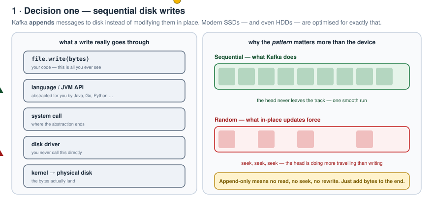
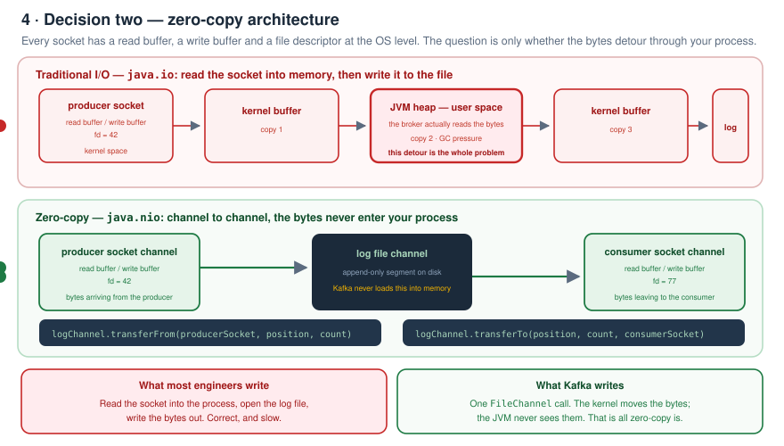
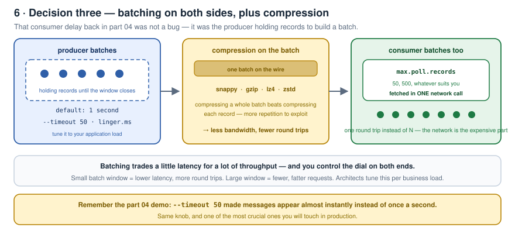
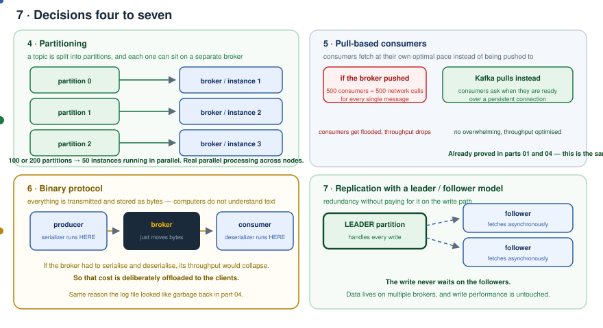
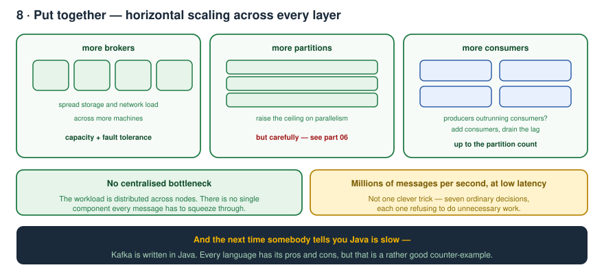
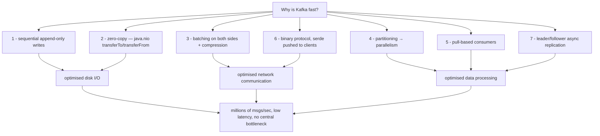

# Kafka Zero to Hero — Part 08: Why Is Kafka Fast?

> Notes from episode 8 of the *Kafka Zero to Hero* series.
> **This is the single most-asked Kafka question in interviews at top companies.** The answer isn't one trick — it's seven design decisions, and most of them have already shown up in the earlier parts. Here they're all collected in one place, with the zero-copy benchmark you can run yourself.
>
> **Runnable benchmark:** [benchmark/](benchmark) — JMH, traditional I/O vs zero-copy.
>
> Previous: [07 — `__consumer_offsets` and lag](../07-consumer-offsets-and-lag/README.md) · Next: [09 — Offset reset, replay and zero-downtime deployment](../09-offset-reset-and-replay/README.md)

---

## The one-line answer

> **Kafka is fast because of its efficient design and architecture, which optimises disk I/O, network communication and data processing.**

That sentence sounds heavy, so the rest of this page unpacks exactly *how* disk I/O is optimised, *how* network communication is optimised, and *how* data processing is done.

---

## Contents

1. [Decision 1 — sequential disk writes](#1-decision-1--sequential-disk-writes)
2. [The update problem — append vs in-place](#2-the-update-problem--append-vs-in-place)
3. [The drawback, and the retention policy](#3-the-drawback-and-the-retention-policy)
4. [Why not compaction?](#4-why-not-compaction)
5. [Decision 2 — zero-copy architecture](#5-decision-2--zero-copy-architecture)
6. [Implementing zero-copy](#6-implementing-zero-copy)
7. [The benchmark](#7-the-benchmark)
8. [Decision 3 — batching and compression](#8-decision-3--batching-and-compression)
9. [Decision 4 — partitioning](#9-decision-4--partitioning)
10. [Decision 5 — pull-based consumers](#10-decision-5--pull-based-consumers)
11. [Decision 6 — binary protocol](#11-decision-6--binary-protocol)
12. [Decision 7 — replication with leader/follower](#12-decision-7--replication-with-leaderfollower)
13. [Putting it together](#13-putting-it-together)
14. [The interview answer, condensed](#14-the-interview-answer-condensed)
15. [What comes next](#15-what-comes-next)

---

## 1. Decision 1 — sequential disk writes

> Kafka **appends messages sequentially** to the disk instead of modifying them in place, which makes disk I/O much faster.

Imagine a file with lines of content. As and when any message or update arrives, it gets **appended at the end**. Programmatically that's all you do — no need to read the file first, no need to do anything else. Just append.

**Modern SSDs, and even HDDs, are optimised for sequential writes.**



### What actually happens when you write

You call `file.write(...)` in whatever language. That call goes to the **disk driver**, which internally calls the **kernel layer** to write the content to the file.

You're not calling the driver directly — it's abstracted away. You use the APIs the Java (or Python, or Go) people gave you, but internally there are **system calls** happening down to the driver. That's how your disk writes work.

### Where Kafka stores it

Producer publishes to the broker, consumer retrieves from the broker. Simple flow. But remember — **Kafka is a stateful application**, so it has to store those messages somewhere: in the **log file** (the data file).

---

## 2. The update problem — append vs in-place

Take an order message: key `1` is the partition key, value is `order-1`. It goes straight to the **end of the file**.

Now the order changes — maybe you added items, maybe the address was updated. An order-update arrives with the **same partition key** but a different value. And by now there are **more messages sitting after** the original entry in the log.

Two approaches:



**Approach 1 — in-place update.** Read the file, delete the old `1 : order-1` entry, write the new `1 : order-1-ABC`. In simple terms, **you are rewriting the whole file.**

**Approach 2 — just append.** Whatever comes in, add it at the end of the log file.

> **Kafka chose approach 2.**

---

## 3. The drawback, and the retention policy

You'd rightly argue: with approach 2 the **log file size increases like anything**, because you're continuously appending.

There is no other way — and **that's the trade-off they took**. They were least bothered about the file growing, because they **optimised for throughput**; they simply don't want to rewrite files again and again.

So how did they solve the growth? Something smart and simple: the **retention policy**.

- How many days do you want to keep the data?
- **By default the retention period is 7 days** — already covered back in part 03/04.
- Tweakable based on your business load, application load, and the criticality of your data.

That's it. The drawback of approach 2 was solved by handing the cleanup decision to the user.

---

## 4. Why not compaction?

Fair follow-up: instead of a retention policy, why not run **log compaction** on a periodic interval? A background job, once or twice a day, that obsoletes the old entries?



It *could* be done. But they wanted to **keep things simple**, for concrete reasons:

**1. Compaction and merging also consume I/O resources.** If Kafka started compacting and merging log files, it would **not be able to support high throughput** — because your system has **limited I/O, limited CPU, limited memory**. Those resources are not infinite.

**2. You lose the trail of messages.** If compaction had happened, the old entries would be deleted — so you could no longer see **the sequence of messages** that were published for an order. That history is gone.

**3. A pile of new cases to handle.** Go down the compaction-and-merging road and problem after problem appears, each needing its own handling.

So they **kept things very simple**: introduce a retention policy, **offload the responsibility to the user**, and clean data on that basis.

> **Simple systems always scale.**

---

## 5. Decision 2 — zero-copy architecture

This is the one where a lot of senior engineers get stuck: *"I wrote this program in Java — how do I call a kernel system call?"* Everything is abstracted behind the APIs, but internally **everything happens via system calls**. Even `file.read()` ultimately tells the disk driver to read from disk.

### What zero-copy means

Producer, broker, consumer. To produce, the producer must establish a **socket connection**. To consume, the consumer must establish one too. And Kafka stores the data in the **log file**.

At the operating-system level, **every socket has a read buffer and a write buffer** — think of it like a class instance: the producer socket and the consumer socket. Everything is tied to a **file descriptor** at the OS level, so the operating system can find the connection associated with that descriptor. That's why the file descriptor exists.

> **Zero-copy means:** the bytes sent by the producer are written **directly into the log file** — Kafka does **not** load them into memory. And when the consumer consumes, the data is transferred **directly from the log file to the consumer socket**.



---

## 6. Implementing zero-copy

**The traditional way** (`java.io`) — what most engineers write: read the socket **into memory, into the process**, then open the log file and write the data out.

**What Kafka does** — it uses **`java.nio`**, which gives you `FileChannel` and `SocketChannel`, with methods that do the transfer directly:

```java
// producer socket  →  log file, with the broker never reading the bytes
logFileChannel.transferFrom(producerSocketChannel, position, count);

// log file  →  consumer socket, the other direction
logFileChannel.transferTo(position, count, consumerSocketChannel);
```

That's it. Whatever data comes from the producer is written straight to the log file. Whatever has to go to the consumer is sent straight from the log file to the socket. **That is the whole of zero-copy.**

---

## 7. The benchmark

Written with **JMH** (the Java Microbenchmark Harness), checked in at [benchmark/](benchmark).

- **Traditional I/O** — read into a buffer, write the buffer out, clear the buffer, repeat.
- **Zero-copy I/O** — transfer from the source channel to the destination channel directly, without reading it into memory.
- `createInputFile()` creates a **10 MB file**, and every iteration copies it to the output file.



| | throughput |
|---|---|
| traditional I/O | **~27 ops/sec** |
| zero-copy I/O | **~256 ops/sec** |

**A massive gain.** And this was 5 iterations with 5 threads on a local machine — on a real Kafka cluster, with a large number of requests coming in, the throughput difference is bigger still.

### Run it yourself

```bash
cd kafka/08-why-kafka-is-fast/benchmark
mvn clean package
java -jar target/benchmarks.jar
```

Requires JDK 17+ and Maven. Expect it to take a couple of minutes — JMH warms up properly before it measures.

---

## 8. Decision 3 — batching and compression

Remember part 04, where messages appeared on the consumer with a visible delay? That wasn't a bug. **The producer batches records on its own**, and once the window closes it sends the **batch** to the broker. We changed `--timeout` to **50 ms** and the messages started arriving much, much faster.



- **Producer side** — batches by default for **1 second**. You choose how long to accumulate records before producing to the broker. A very crucial parameter for production, tuned entirely to your application load.
- **Consumer side** — **`max.poll.records`**: fetch that many records **in one single network call** to the broker.
- So **batching happens on both sides**.
- Kafka also supports **compression** — **Snappy, gzip, lz4** (and zstd) — which **reduces bandwidth**.

---

## 9. Decision 4 — partitioning

Covered in detail in the earlier parts, but here's the performance angle.

Topics in Kafka are divided into **partitions**, and **each partition can be handled by a separate broker**. Two partitions → one goes to instance 1, the other to instance 2.

For a very high workload you can have a topic with **100 or 200 partitions**, and if you have that much load, run e.g. **50 instances in parallel**.

> This enables **parallel processing across multiple nodes and consumers**.



---

## 10. Decision 5 — pull-based consumers

Kafka consumers **pull** data rather than brokers pushing it. That allows consumers to fetch messages at their **optimal pace** — depending entirely on how fast they process.

This **prevents overwhelming the consumers** and optimises throughput.

Imagine the opposite: the broker pushing — *"I have a new message, take it. Another one, take it."* With **100 or 500 consumers**, that's **500 network calls every single time a message arrives**. Performance would fall off a cliff.

---

## 11. Decision 6 — binary protocol

Kafka stores and transmits **everything in binary format**. The serializer and deserializer exist — but **at the producer and consumer side**, not in the broker.

Why does that make it faster? Because **computers understand binary; text is much harder**. And more importantly: if the **broker itself** had to run all the serialization and deserialization logic, its performance would drop. So that responsibility is **deliberately offloaded to the producer and the consumer**.

(This is also why the log file looked like unreadable garbage back in part 04.)

---

## 12. Decision 7 — replication with leader/follower

Kafka **replicates data across multiple brokers**.

- The **leader partition** is responsible for handling the **writes**.
- The **followers fetch the data asynchronously**.

> This improves **redundancy without impacting write performance** — the write never waits on the replicas.

---

## 13. Putting it together

With all of the above, **Kafka scales horizontally** by adding more **brokers**, **partitions** and **consumers**.

If in production you see the producer producing at very high speed while consumers can't process at the same pace, you simply **increase the consumers** or **increase the partitions**.



- Horizontally scalable **across all layers** — brokers, partitions, consumers.
- **No centralised bottlenecks.**
- Workload is **distributed across multiple nodes**.

All these optimisations together make Kafka capable of handling **millions of messages per second with low latency**.

> And a bonus: the next time someone tells you Java isn't fast — **Kafka is written in Java**. Every language has its pros and cons, but that's a rather good counter-example.



---

## 14. The interview answer, condensed

| # | Decision | Why it makes Kafka fast |
|---|---|---|
| 1 | **Sequential disk writes** | Append-only. No read, no seek, no rewrite. SSDs and HDDs are both optimised for it. |
| 2 | **Zero-copy** | `FileChannel.transferTo/transferFrom`. Bytes go socket ↔ log file without entering the JVM heap. ~9× in a local benchmark. |
| 3 | **Batching + compression** | Producer batches (`linger.ms`), consumer batches (`max.poll.records`), payload compressed (snappy/gzip/lz4). Fewer, smaller round trips. |
| 4 | **Partitioning** | Each partition can live on a different broker → genuine parallel processing across nodes and consumers. |
| 5 | **Pull-based consumers** | Consumers fetch at their own pace. No broker fan-out of 500 pushes per message, no overwhelmed consumers. |
| 6 | **Binary protocol** | The broker just moves bytes; serialization/deserialization cost is offloaded to producers and consumers. |
| 7 | **Leader/follower replication** | Only the leader handles writes; followers fetch asynchronously. Redundancy without a write-path penalty. |
| — | **Retention, not compaction** | Cleaning by age costs almost nothing. Compaction would spend the very I/O and CPU that throughput depends on. |
| — | **Horizontal scaling** | Add brokers, partitions or consumers. No centralised bottleneck anywhere. |

**Follow-up questions you should be ready for:**

1. What exactly does "sequential write" buy you over an in-place update?
2. The log grows forever — how is that handled, and why not compaction?
3. What does zero-copy actually copy less of? Name the Java API.
4. Where does serialization happen and why not in the broker?
5. Why is pull better than push at scale?
6. Does replication slow down writes? Why not?
7. Name every place batching happens.

---

## 15. What comes next

The next videos start on the **Kafka cluster** — the design decisions for setting one up in your organisation: how to decide the **replication factor**, how many **partitions**, how many **consumers**, based on your message rate. All the nitty-gritty details.

---

<sub>Notes written up from the *Kafka Zero to Hero* series, episode 8. Diagrams, benchmark code and wording are mine; the teaching order follows the video.</sub>
