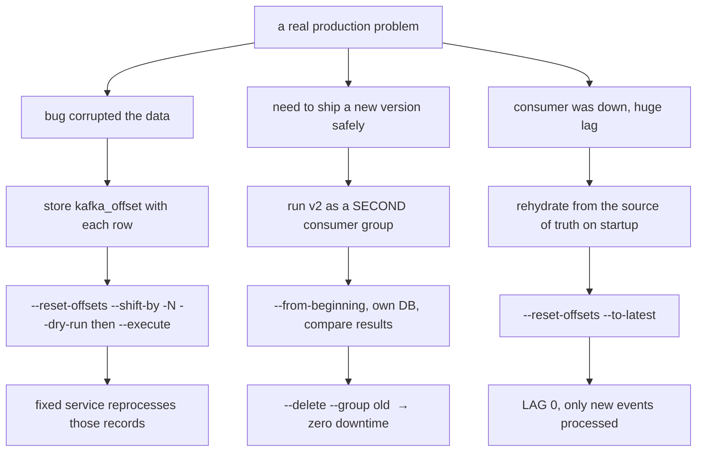

# Kafka Zero to Hero — Part 09: Offset Reset, Replay and Zero-Downtime Deployment

> Notes from episode 9 of the *Kafka Zero to Hero* series.
> Kafka can process millions of events — but real systems have real problems. Three of them, solved with one mechanism: **moving the offset**.
>
> Commands: **[commands.md](commands.md)**
>
> Previous: [08 — Why is Kafka fast?](../08-why-kafka-is-fast/README.md) · Next: [10 — A consumer in plain Java](../10-java-consumer-core-api/README.md)

---

## The three challenges

1. **Your consumer service is down for 2 hours** while every other service keeps ingesting into Kafka. When it comes back up it sees **millions of events** to process. How does it survive that surge?
2. **You need to roll out a new service version** — better performance, richer features. How do you **test it against real production data without any risk**, and deploy it with **zero downtime**? That's blue/green, and this page shows how to do it with Kafka.
3. **Your service had a bug** — data didn't get saved to the database, or got saved wrong. **How do you replay those messages?**

All three are theory *and* practice below.

---

## Contents

1. [Prerequisite — consumer lag](#1-prerequisite--consumer-lag)
2. [The `--from-beginning` gotcha](#2-the---from-beginning-gotcha)
3. [Seeing the lag](#3-seeing-the-lag)
4. [Case 1 — lost or corrupted data](#4-case-1--lost-or-corrupted-data)
5. [Knowing which offset to replay from](#5-knowing-which-offset-to-replay-from)
6. [Resetting the offset — dry-run then execute](#6-resetting-the-offset--dry-run-then-execute)
7. [Case 2 — blue/green with zero downtime](#7-case-2--bluegreen-with-zero-downtime)
8. [Case 3 — consumer downtime and a huge surge](#8-case-3--consumer-downtime-and-a-huge-surge)
9. [The fix — source of truth, then reset to latest](#9-the-fix--source-of-truth-then-reset-to-latest)
10. [All the reset options](#10-all-the-reset-options)
11. [One-page recap](#11-one-page-recap)
12. [What comes next](#12-what-comes-next)
13. [Check yourself](#13-check-yourself)

---

## 1. Prerequisite — consumer lag

> New to the series? Watch parts **5, 6 and 7** first — consumer groups, partitions, rebalancing and offsets are covered there in depth, with the trade-offs and how Kafka does it internally. Very useful both for interviews and for troubleshooting real distributed systems.

Quick refresher. A publisher (Order Service) publishes to a **Kafka topic**, which lives on the **Kafka server**. On the other side, consumers — Product Service, Inventory Service, Shipping Service — **continuously pull** those order events.

And the **consumer group** is what gives you scaling: three instances of the inventory service, or two of the shipping service, all pulling and processing in parallel.



### The demo setup

```bash
docker compose up
docker exec -it kafka bash

kafka-topics.sh --bootstrap-server localhost:9092 --list
kafka-topics.sh --bootstrap-server localhost:9092 --topic order-events --partitions 2 --create
```

Producer in one terminal, consumer in another:

```bash
kafka-console-producer.sh --bootstrap-server localhost:9092 --topic order-events

kafka-console-consumer.sh --bootstrap-server localhost:9092 \
  --topic order-events --property print.key=true --group payment-service
```

`print.key=true` prints the **partition key** next to each message. Publish `order-1` … `order-6` and the consumer picks them up live.

---

## 2. The `--from-beginning` gotcha

Now try to see everything from the start — **with the group**:

```bash
kafka-console-consumer.sh --bootstrap-server localhost:9092 \
  --topic order-events --group payment-service --from-beginning
```

**Nothing arrives.** Now drop the `--group`:

```bash
kafka-console-consumer.sh --bootstrap-server localhost:9092 \
  --topic order-events --from-beginning
```

**Everything arrives.** Why?



Because **Kafka tracks each consumer group separately**. When you provide a group, Kafka knows *"this group has been delivered messages up to this offset"* — so it resumes there and `--from-beginning` is ignored.

When you **don't** mention a group, **Kafka creates one on its own**. Prove it:

```bash
kafka-consumer-groups.sh --bootstrap-server localhost:9092 --list
```

```
payment-service
console-consumer-49032     <- you never created this
```

Kafka's whole mechanism **works on consumer groups only**, so even when you don't specify one, it makes a throwaway group with no stored offset.

> **Side effect worth knowing:** in real production, casually reading a topic "from beginning" adds a **new consumer to the cluster** — and a consumer joining triggers **partition rebalancing**. That's why you sometimes see rebalances you didn't expect.

---

## 3. Seeing the lag

Stop the consumer, then publish three more — `order-8`, `order-9`, `order-10`. Now:

```bash
kafka-consumer-groups.sh --bootstrap-server localhost:9092 \
  --group payment-service --describe
```

```
TOPIC         PARTITION  CURRENT-OFFSET  LOG-END-OFFSET  LAG
order-events  1          4               6               2
order-events  0          3               4               1
```

- **7 messages** had been retrieved in total — 4 from partition 1, 3 from partition 0.
- **`LAG = LOG-END-OFFSET − CURRENT-OFFSET`**, per partition.
- Total pending = **the sum of every partition's lag** = 2 + 1 = **3** — exactly the three messages published while the consumer was down.

---

## 4. Case 1 — lost or corrupted data

A service consumes from the topic, processes, and stores into the database. Then something goes wrong:

- the data **gets lost**, or
- a **NullPointerException** means it never gets stored, or
- there's no exception at all but a **calculation logic mismatch** — so the data is stored **incorrectly**

Either way you now have **corrupted data in the database**. You fix the bug in the service. Now you have to **reprocess** the data — and that's where **Kafka replay** comes in.



---

## 5. Knowing which offset to replay from

The real problem: **how does the program know from which offset to replay?**

The answer is that whenever a consumer consumes a record, it also receives **metadata** — including **which offset the message was at**. You can see it on the CLI:

```bash
kafka-console-consumer.sh --bootstrap-server localhost:9092 \
  --topic order-events --group payment-service \
  --property print.key=true \
  --property print.offset=true
```

```
Offset:3   1   order-3
Offset:4   2   order-4
Offset:5   1   order-5
```

Those are **partition offsets**. So the service can **store this offset in the database alongside the message** — or in a metadata table — and then it always knows *"replay from here"*.

| order_id | amount | **kafka_offset** |
|---|---|---|
| order-3 | NULL ← corrupted | **3** |
| order-4 | -99 ← corrupted | **4** |
| order-5 | 15999 | 5 |

---

## 6. Resetting the offset — dry-run then execute

Replaying is simply **resetting the offset**. Move the current offset backwards, and since `lag = log-end-offset − current-offset`, the lag reappears — and those messages get processed again by the fixed service.

Because resetting can be a crucial operation, Kafka gives you **two modes**: `--dry-run` first, then `--execute` once you're sure.

```bash
# 1. see what WOULD happen - nothing is changed
kafka-consumer-groups.sh --bootstrap-server localhost:9092 \
  --group payment-service --topic order-events \
  --reset-offsets --shift-by -1 --dry-run
```

```
GROUP            TOPIC         PARTITION  NEW-OFFSET
payment-service  order-events  1          1
payment-service  order-events  0          3
```

```bash
# 2. apply it
kafka-consumer-groups.sh --bootstrap-server localhost:9092 \
  --group payment-service --topic order-events \
  --reset-offsets --shift-by -1 --execute

# 3. confirm
kafka-consumer-groups.sh --bootstrap-server localhost:9092 \
  --group payment-service --describe
```

The lag is now `1` — the current offset shifted back by one, and the service will reprocess from there. **`--shift-by` takes negative to go backwards and positive to go forwards.**

> Two practical notes. **The group must have no active members** — stop the consumers before resetting. And when you copy these commands off a web page, stray escape characters and line continuations come along for the ride; if a command fails oddly, retype the backslashes.

---

## 7. Case 2 — blue/green with zero downtime

**What blue/green is:** you run two environments. **Blue** is the version currently live in production. **Green** is the new version that will go live. Instead of updating the live system directly, you deploy the new version **in parallel** to blue, then **test and verify green with production data**. Once you're confident, you **switch the traffic** from blue to green. Blue then sits idle — often kept as a **backup for a few days**, so if anything goes wrong you can reroute traffic straight back.

**The use case:** you're building a new **recommendation engine / ML model**, or a new **payment service version**, that has to be deployed and tested against production data before the actual release. Do you take downtime? No.



### Phase 1 — both versions consume the same stream

The topic gets **two consumer groups**: the **old ML model worker** and the **new ML model worker**, running in parallel, each processing the messages into its **own database**.

```bash
kafka-console-consumer.sh --bootstrap-server localhost:9092 \
  --topic order-events --group payment-service-v2 --from-beginning
```

A brand-new group with `--from-beginning` **replays all the history** — 10 messages here, or 7–8 days of production traffic in real life, or any offset you choose.

At the end of testing you **compare the results** between the two databases and fix any bugs in the new version. Because both versions consume the **same stream**, you can validate:

- business logic
- schema changes
- performance metrics
- and much more

> **Kafka offsets give you precise control over which data the new version sees, when it starts, and how it processes.**

### Phase 2 — retire the old version

```bash
kafka-consumer-groups.sh --bootstrap-server localhost:9092 \
  --delete --group payment-service

kafka-consumer-groups.sh --bootstrap-server localhost:9092 --list
# payment-service-v2
```

Point traffic at the new version, delete the old consumer group. **That's zero-downtime deployment with respect to Kafka consumers.**

---

## 8. Case 3 — consumer downtime and a huge surge

The `inventory-change-events` topic. The **inventory service is down for 2 hours**. Meanwhile 1, 2, 3 million messages land on that topic.

The service comes back up and has to reprocess **3 million messages**. Is that feasible?



Think about what actually happens. If the inventory service starts chewing through 3 million messages, **CPU and every other resource go into the backlog**. What happens to the service's **actual functionality**? It gets starved — and everything downstream **sees the slowness**.

---

## 9. The fix — source of truth, then reset to latest

For critical services, when they go down and come back to find millions of events waiting, the right behaviour is **not** to reprocess everything.

> There should be a **source of truth** available, from which the service can get the data **on startup**.



1. **On startup, rehydrate.** Call the **product catalog API** (or do a bulk export/import, or load a snapshot) to get the complete current state in one shot.
2. **Reset the offset to latest.** `--reset-offsets --to-latest`. There's now **no lag and nothing to reprocess** — because you already have that state.
3. **Process only what's new.** Only fresh inventory changes flow from here.

### The same pattern elsewhere

| Service | Topic | Why replay is pointless |
|---|---|---|
| **Inventory service** | `inventory-change-events` | The catalog API already has the true current stock. |
| **Live occupancy dashboard** (Airbnb-style) | `room-booking-events`, `check-in-events` | A dashboard shows the *current* picture. It can export/import the data from the backend in one call rather than compromising its own functionality replaying hours of events. |
| **Driver state aggregator** (Uber-style) | `driver-status-events` — online, offline, trip started, geolocation pings | Only the **latest** driver position and status matter. Stale locations are worthless. Rebuild state on startup, skip to latest. |

### In code

```java
consumer.seekToEnd(consumer.assignment());   // explicit jump to the end
// or, for a brand new group:
// auto.offset.reset=latest
```

*(Covered properly when the Spring Boot / Java Kafka project starts later in this series.)*

### The demo

Publish `order-11`, `order-12` while `payment-service-v2` isn't consuming:

```bash
kafka-consumer-groups.sh --bootstrap-server localhost:9092 \
  --group payment-service-v2 --describe
# LAG: 2
```

Now imagine that 2 is 3 million. Clear it:

```bash
kafka-consumer-groups.sh --bootstrap-server localhost:9092 \
  --group payment-service-v2 --topic order-events \
  --reset-offsets --to-latest --execute
```

The current offset jumps from 4 to 6. `--describe` again → **LAG 0**. All cleared.

---

## 10. All the reset options



| Option | What it does | When you'd reach for it |
|---|---|---|
| `--shift-by -N` / `+N` | move back / forward by N offsets | replay exactly N records after a bug fix |
| `--to-earliest` | jump to offset 0 | full rebuild of a downstream store |
| `--to-latest` | jump to the log-end offset, lag → 0 | clearing a backlog after downtime |
| `--by-duration PT1H` | move back by a period — 5 minutes, 5 hours | "replay the last hour" without hunting offsets |
| `--to-datetime <ts>` | reset to an exact date and time | rewind to just before a bad deploy |
| `--to-offset N` | jump to a specific offset | you stored the offset in your DB |
| `--dry-run` / `--execute` | preview / apply | **always dry-run first** |

---

## 11. One-page recap



| Idea | The one line |
|---|---|
| Lag | `LOG-END-OFFSET − CURRENT-OFFSET`, per partition; total = the sum |
| `--from-beginning` with a group | does nothing — the group already has a committed offset |
| No `--group` | Kafka silently creates `console-consumer-NNNNN` for you |
| Peeking at a live topic | adds a consumer → triggers a **rebalance** |
| Replay | just move the current offset backwards |
| Knowing where to replay from | persist the record's **offset** alongside the data |
| Safety | `--dry-run` before `--execute`; group must have **no active members** |
| Blue/green | the new version is just **another consumer group** on the same stream |
| Retiring blue | `--delete --group` |
| Huge backlog | rehydrate from a source of truth, then `--to-latest` |
| In code | `seekToEnd()` or `auto.offset.reset=latest` |

---

## 12. What comes next

The series moves on to building the **complete Kafka project in Java / Spring Boot**, where all of this — `seekToEnd`, `auto.offset.reset`, programmatic offset control — gets implemented properly in application code.

---

## 13. Check yourself

1. Define consumer lag, and say how you compute the total across partitions.
2. Why does `--from-beginning` do nothing when you pass an existing `--group`?
3. What is `console-consumer-49032`, and who created it?
4. Why can reading a production topic "from beginning" cause a rebalance?
5. Three ways a bug can leave you with bad data in the DB. Name them.
6. How does a service know which offset to replay from?
7. Which two console-consumer properties expose the key and the offset?
8. Walk through the dry-run → execute flow for `--shift-by -1`.
9. What must be true about the consumer group before you can reset its offsets?
10. Explain blue/green deployment in your own words.
11. How do you run a new version against production data with zero risk, using Kafka?
12. What can you validate by having both versions on the same stream?
13. How do you retire the old version?
14. A consumer is down 2 hours and comes back to 3M messages. What breaks if it just catches up?
15. What is the correct pattern instead, and what are the three steps?
16. Give three real services where "skip to latest" is the right answer, and say why.
17. Name six `--reset-offsets` modes and when you'd use each.
18. What are the two code-level equivalents of `--to-latest`?

---

<sub>Notes written up from the *Kafka Zero to Hero* series, episode 9. Diagrams and wording are mine; the teaching order follows the video.</sub>
