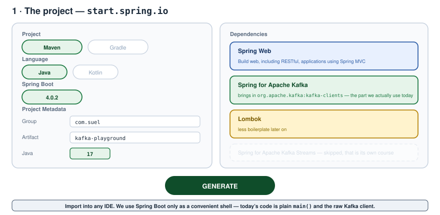
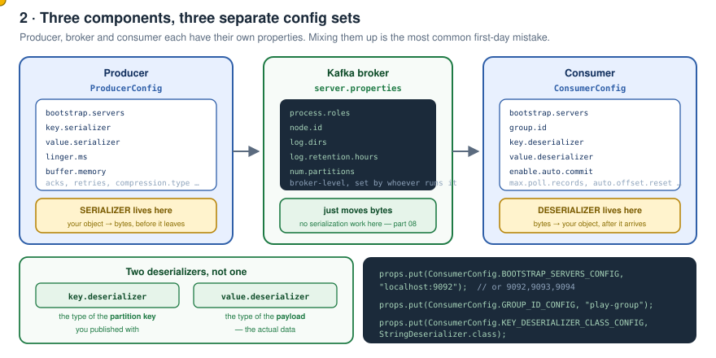
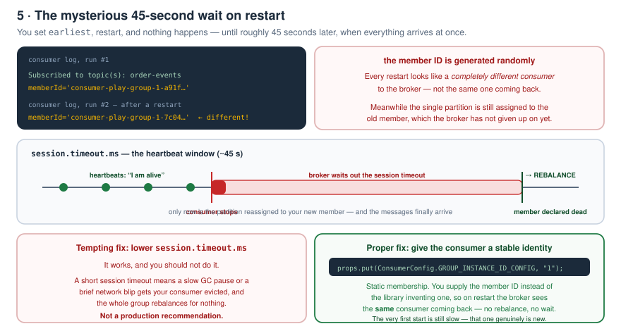
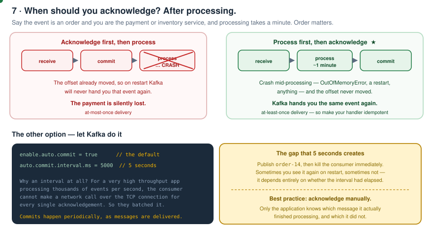

# Kafka Zero to Hero — Part 10: A Consumer in Plain Java

> Notes from episode 10 of the *Kafka Zero to Hero* series — the first coding day.
> Everything so far has been concepts, internals and the CLI. Now we build a real consumer with the **core Java Kafka client APIs**, and all the things the console tools were quietly doing for us become visible: properties, deserializers, `auto.offset.reset`, member IDs, rebalancing and **acknowledgement**.
>
> **Working project:** [kafka-playground/](kafka-playground) — import it and run [`Day01KafkaConsumer`](kafka-playground/src/main/java/com/suel/kafkaplayground/day01/Day01KafkaConsumer.java).
>
> Previous: [09 — Offset reset and replay](../09-offset-reset-and-replay/README.md) · Next: [11 — The Java producer, idempotency and multiple topics](../11-java-producer-and-idempotency/README.md)

---

## Why write code at all

There are properties we never touched while playing with the console producer and consumer — **a lot was hidden from us**. Writing a small Java application makes it all visible:

- the full set of consumer properties
- the **acknowledgement** concept, which we never discussed before
- creating a consumer group, running **multiple instances**, and watching **partition assignment and rebalancing** — when a consumer starts, when it dies, and with multiple partitions

---

## Contents

1. [Project setup](#1-project-setup)
2. [The library underneath](#2-the-library-underneath)
3. [Configuring the consumer](#3-configuring-the-consumer)
4. [Deserializers](#4-deserializers)
5. [Subscribe and poll](#5-subscribe-and-poll)
6. [Logging](#6-logging)
7. [Run it](#7-run-it)
8. [A new consumer group sees nothing](#8-a-new-consumer-group-sees-nothing)
9. [The 45-second wait](#9-the-45-second-wait)
10. [Why the same messages keep coming back](#10-why-the-same-messages-keep-coming-back)
11. [When to acknowledge](#11-when-to-acknowledge)
12. [Auto-commit and its 5-second interval](#12-auto-commit-and-its-5-second-interval)
13. [The finished file](#13-the-finished-file)
14. [What comes next](#14-what-comes-next)
15. [Check yourself](#15-check-yourself)

---

## 1. Project setup

Go to **[start.spring.io](https://start.spring.io)** and pick:



| Field | Value |
|---|---|
| Project | **Maven** |
| Language | **Java** |
| Spring Boot | latest stable |
| Group | `com.suel` |
| Artifact | `kafka-playground` |
| Java | **17** |

Dependencies — three of them:

1. **Spring Web**
2. **Spring for Apache Kafka** — note there are two Kafka entries; take this one, **not** *Spring for Apache Kafka Streams* (streams gets its own course later)
3. **Lombok**

Generate, download, import into your IDE. The `pom.xml` will carry the group ID you chose plus those three dependencies and the compiler plugin, and Spring Boot lays down its standard application class.

> We're using Spring Boot only as a convenient shell today. If you don't know how Spring Boot builds the app behind the scenes, don't worry — that's covered later. The goal here is simply to connect to Kafka and watch messages flow.

### A package per day

Since this is day one of the coding part, create a package `day01` and a class `Day01KafkaConsumer` with a `main` method.

> In a real Spring project you won't see these `main` classes anywhere — there's only the one Spring application main. This is purely so we can see how things work behind the scenes.

---

## 2. The library underneath

`KafkaConsumer` comes from **`org.apache.kafka.clients`**. That library is open source, and it gets pulled in by the Spring Kafka starter.

> Anyone who doesn't want to use Spring Boot at all can just use `org.apache.kafka.clients` directly and it will solve the purpose. **The Spring Boot Kafka starter is just a wrapper on top of this library.**

Today we use the core APIs. The Spring Boot version comes in a later part.

---

## 3. Configuring the consumer

Flash back to the console consumer. What did we pass?

```bash
kafka-console-consumer.sh --bootstrap-server localhost:9092 \
  --topic order-events --group payment-service --from-beginning
```

The `KafkaConsumer` constructor accepts a `Map` or a `Properties`, so those same attributes go in there.



```java
Properties props = new Properties();

props.put(ConsumerConfig.BOOTSTRAP_SERVERS_CONFIG, "localhost:9092");
props.put(ConsumerConfig.GROUP_ID_CONFIG, "play-group");
```

`ConsumerConfig` is the class that holds all consumer-related property names. For **multiple bootstrap servers**, comma-separate them:

```java
props.put(ConsumerConfig.BOOTSTRAP_SERVERS_CONFIG, "localhost:9092,localhost:9093,localhost:9094");
```

We have a single-node cluster, so one entry is enough.

Open `ConsumerConfig` and you'll find 20, 30, 40 properties — `group.id`, `bootstrap.servers`, `enable.auto.commit`, `max.poll.records` and the rest.

### Three components, three config sets

The flow is **producer → Kafka broker → consumer**. Each has its **own configuration**:

| Component | Config | Examples |
|---|---|---|
| Producer | `ProducerConfig` | `key.serializer`, `value.serializer`, `buffer.memory`, `linger.ms` |
| Broker | `server.properties` | `log.retention.hours`, `num.partitions`, `node.id` |
| Consumer | `ConsumerConfig` | `group.id`, `key.deserializer`, `enable.auto.commit`, `auto.offset.reset` |

Retention, for example, is a **broker-level** thing — we covered it back in part 04.

---

## 4. Deserializers

Something we never discussed with the console consumer, and it matters.

Kafka stores everything in **binary format** — byte arrays. But when we're coding in Java, the library gives us a provision to say **what kind of data this consumer is going to receive**: a string, a number, some other type.

There are **two deserializers** at the consumer level:

- **key deserializer** — the type of the **partition key** we published with
- **value deserializer** — the type of the **payload**, the actual data

```java
props.put(ConsumerConfig.KEY_DESERIALIZER_CLASS_CONFIG, StringDeserializer.class);
props.put(ConsumerConfig.VALUE_DESERIALIZER_CLASS_CONFIG, StringDeserializer.class);
```

Pick the right one from the `org.apache.kafka.common.serialization` package.

> **Deserializers are required at the consumer level. Serializers are required at the producer level** — when the producer publishes to the broker it needs `key.serializer` and `value.serializer` from `ProducerConfig`.

And one more, which we'll come back to:

```java
props.put(ConsumerConfig.ENABLE_AUTO_COMMIT_CONFIG, false);
```

The default is **`true`**. We set it to `false` because we don't want the message auto-committed the moment the consumer reads it — we'll do it manually.

---

## 5. Subscribe and poll

The consumer has all the information now, but it still has to subscribe:

```java
consumer.subscribe(List.of("order-events"));
```

`subscribe` takes either a **pattern** or a **list of topics**.



Kafka is **pull-based**, so the consumer has to go to the broker and ask *"please give me new messages"*:

```java
ConsumerRecords<String, String> records = consumer.poll(Duration.ofMillis(1000));
```

The duration is the **timeout for this poll request** — how long it waits before returning so the next call can go out for fresh messages. But that's **one** call, and we need to ask repeatedly — so it goes in a `while` loop.

`ConsumerRecords<String, String>` is generic; both type parameters are `String` here, meaning the partition key is a String and so is the value — matching the deserializers we configured.

Each `ConsumerRecord` gives you a lot more than the value:

```java
record.key()      record.value()      record.offset()
record.partition()  record.topic()    record.timestamp()
record.serializedKeySize()            record.deliveryCount()
```

Wrap it all in `try` / `catch` / `finally`, and **close the consumer** in the `finally`:

```java
} catch (Exception e) {
    log.error("consumer failed", e);
} finally {
    consumer.close();
}
```

---

## 6. Logging

Drop a `logback.xml` into `src/main/resources` — Spring Boot picks it up automatically:

```xml
<configuration>
  <appender name="STDOUT" class="ch.qos.logback.core.ConsoleAppender">
    <encoder>
      <pattern>%d{HH:mm:ss.SSS} [%thread] %-5level %logger{36} - %msg%n</pattern>
    </encoder>
  </appender>
  <root level="info">
    <appender-ref ref="STDOUT"/>
  </root>
</configuration>
```

```java
private static final Logger log = LoggerFactory.getLogger(Day01KafkaConsumer.class);
...
records.forEach(r -> log.info("key={} value={}", r.key(), r.value()));
```

---

## 7. Run it

First make sure the Kafka container is running (part 03 covers the setup):

```bash
docker ps
docker exec -it kafka bash

kafka-topics.sh --bootstrap-server localhost:9092 --list
```

Start clean:

```bash
kafka-topics.sh --bootstrap-server localhost:9092 --topic order-events --delete
kafka-topics.sh --bootstrap-server localhost:9092 --topic order-events --partitions 1 --create
kafka-topics.sh --bootstrap-server localhost:9092 --topic order-events --describe
```

Now run the consumer application. Scroll up in the logs and you'll see **every configuration it started with** — `bootstrap.servers=localhost:9092`, `group.id=play-group`, `enable.auto.commit=false`. It took all of it into account.

Start the console producer and publish:

```bash
kafka-console-producer.sh --bootstrap-server localhost:9092 --topic order-events
> order-1
> order-2
> ... order-7
```

The application logs every one of them.

> **The key is `null`.** Because we're only sending values — no partition key, unlike the keyed demo back in part 05.

---

## 8. A new consumer group sees nothing

Change the group to `play-group-123` and restart. The expectation is that we'd see all seven order events. **We see nothing.**



We've hit this several times already with the console consumer: when a topic already has events and a **brand-new consumer group** comes along for the very first time, it gets the **latest** events only, not the old ones.

Publish `order-8` and it arrives instantly. Publish `order-9`, same.

The console-consumer equivalent was `--from-beginning`. In the application, scroll the startup logs and you'll spot the property:

```
auto.offset.reset = latest        <- the default
```

Change it:

```java
props.put(ConsumerConfig.AUTO_OFFSET_RESET_CONFIG, "earliest");
```

Now you get everything… **eventually**.

---

## 9. The 45-second wait

After switching to `earliest` and restarting, still nothing prints. Be patient — after **40 to 45 seconds** it works. Here's why.



Look at the logs. The consumer subscribes to the topic and is assigned a **member ID** — and it's **different on every startup**, because the Kafka library generates it randomly.

Our topic has **one partition**. That partition was already assigned to the **previous member**, and the broker had already delivered all the events from it to that consumer.

Think of the diagram from the earlier parts: a topic with 3 partitions and a group with 3 consumers, one partition each — the happy case. Now that consumer group dies and a new one comes up. Those partitions have to be **reassigned** to the new consumers before they can receive anything.

> **The Kafka broker checks every 40–45 seconds whether the consumers are still active.** If they aren't, it performs the **partition reassignment** — and only then do the partitions get attached to the new node.

The property behind this is:

```
session.timeout.ms
```

It's a **heartbeat** property. The consumer continuously pings the broker saying *"I'm alive"*. If the broker doesn't receive a heartbeat within that window, it treats the consumer as gone and triggers **partition rebalancing / reassignment**.

### Two options

**Option 1 — lower the session timeout.** It works, but **that's not a production recommendation**: a GC pause or a network blip will get your consumer evicted and rebalance the whole group for nothing.

**Option 2 — provide a valid member ID yourself.** Instead of letting the Kafka library invent one, give the consumer a stable identity, so the broker sees that **the same consumer** is asking for messages:

```java
props.put(ConsumerConfig.GROUP_INSTANCE_ID_CONFIG, "1");
```

That's **static membership**. Restart now and it's fast.

> The **very first** startup is still slow — for the broker, this consumer genuinely is new. Every restart after that is instant.

---

## 10. Why the same messages keep coming back

With that fixed, you notice something else: on **every restart Kafka gives you the same messages again**. Publish `order-10` and you get it; publish `order-11` and you get that too — but restart and the whole history comes back.



Because once the consumer receives events, it has to **tell the broker it processed them** — it has to **acknowledge**.

The partition maintains offsets: a **current offset** and a **log-end offset**, incremented as messages arrive. When a consumer acknowledges *"I've processed up to 5"*, the **current offset moves to 5**.

**Our consumer never acknowledges**, so the current offset stays at **0** — which is exactly why all the messages come back every time.

With the console consumer this was happening behind the scenes for us. Here we set `enable.auto.commit=false`, so we have to do it explicitly:

```java
if (!records.isEmpty()) {
    consumer.commitSync();
}
```

The library gives you both `commitSync()` and `commitAsync()`. And the **emptiness check matters** — `poll()` times out every second, so it may or may not return records.

After this change: publish `order-12`, `order-13`, restart → **nothing is redelivered**. The offset was committed.

---

## 11. When to acknowledge

Should you acknowledge first and then process, or process first and then acknowledge?



> **Process the message first, then acknowledge.**

Real scenario: this is an orders event. Somebody places an order. You're the **inventory service** deducting stock, or the **payment service** processing a payment. Say processing takes a minute.

- You get the event → you process it → you acknowledge → Kafka increases the current offset. Good.
- Now say that **while processing, the machine crashes** — an OutOfMemoryError, someone restarted the server, anything. You hadn't acknowledged, so **the offset never moved**. When you restart, **Kafka gives that event back to you.** Exactly what you want.

Acknowledge first and that event is gone forever, half-processed.

> Because a crash means redelivery, make your handler **idempotent** — this is at-least-once delivery.

---

## 12. Auto-commit and its 5-second interval

One more production scenario. Publish `order-14` and stop the consumer **immediately**. Sometimes on restart you see the event again, sometimes you don't.

That's because of:

```
auto.commit.interval.ms = 5000      # 5 seconds, the default
```

Why an interval at all? Imagine an extremely high-throughput application processing **thousands of events per second**. The consumer cannot make a network call over the TCP connection saying *"hey, I'm acknowledging"* for every single record — so they optimised it into a periodic commit.

If you don't want to acknowledge manually, there's an explicit property:

```java
props.put(ConsumerConfig.ENABLE_AUTO_COMMIT_CONFIG, true);
```

With that set to `true`, along with the 5-second interval, Kafka commits the delivered messages **periodically, behind the scenes**.

> **Acknowledging means committing the offset of what you have consumed.** The Kafka library is committing it for you when auto-commit is on. But the **best practice is to acknowledge manually**, because the **application** knows which message has actually been processed and which hasn't.

---

## 13. The finished file

[`Day01KafkaConsumer.java`](kafka-playground/src/main/java/com/suel/kafkaplayground/day01/Day01KafkaConsumer.java)

```java
Properties props = new Properties();

props.put(ConsumerConfig.BOOTSTRAP_SERVERS_CONFIG, "localhost:9092");
props.put(ConsumerConfig.GROUP_ID_CONFIG, "play-group");
props.put(ConsumerConfig.KEY_DESERIALIZER_CLASS_CONFIG, StringDeserializer.class);
props.put(ConsumerConfig.VALUE_DESERIALIZER_CLASS_CONFIG, StringDeserializer.class);
props.put(ConsumerConfig.ENABLE_AUTO_COMMIT_CONFIG, false);
props.put(ConsumerConfig.AUTO_OFFSET_RESET_CONFIG, "earliest");
props.put(ConsumerConfig.GROUP_INSTANCE_ID_CONFIG, "1");

KafkaConsumer<String, String> consumer = new KafkaConsumer<>(props);
consumer.subscribe(List.of("order-events"));

try {
    while (true) {
        ConsumerRecords<String, String> records = consumer.poll(Duration.ofMillis(1000));

        records.forEach(record -> log.info(
                "partition={} offset={} key={} value={}",
                record.partition(), record.offset(), record.key(), record.value()));

        if (!records.isEmpty()) {
            consumer.commitSync();
        }
    }
} catch (Exception e) {
    log.error("consumer failed", e);
} finally {
    consumer.close();
}
```

| Property | Why it's there |
|---|---|
| `bootstrap.servers` | how to reach the cluster; comma-separate several |
| `group.id` | which consumer group this instance belongs to |
| `key.deserializer` / `value.deserializer` | bytes → objects; the key is the partition key, the value is the payload |
| `enable.auto.commit=false` | we acknowledge by hand, after processing |
| `auto.offset.reset=earliest` | the app-level `--from-beginning`; only applies with no committed offset |
| `group.instance.id` | static membership — no 45-second rebalance wait on restart |

Verify from the CLI at any point:

```bash
kafka-consumer-groups.sh --bootstrap-server localhost:9092 --group play-group --describe
```

---

## 14. What comes next

The next video refactors this very basic consumer into **production-level code** — how applications actually use the consumer behind the scenes — and adds the **producer implementation**. The **Spring Boot version** of the same project comes after that.

---

## 15. Check yourself

1. Which three dependencies did we pick, and which Kafka one did we deliberately skip?
2. Where does `KafkaConsumer` actually come from, and what is Spring Kafka in relation to it?
3. Name the three components and their configuration classes/files.
4. What does the `KafkaConsumer` constructor accept?
5. How do you point at multiple bootstrap servers?
6. Why are there **two** deserializers? What does each one cover?
7. Serializers live on which side, deserializers on which?
8. What does the `Duration` argument to `poll()` actually mean?
9. Why does `poll()` have to sit in a loop?
10. Name four things a `ConsumerRecord` exposes besides the value.
11. Why was the key `null` in our first run?
12. A brand-new group sees no old messages. Which property, and what's its default?
13. Explain the 40–45 second wait. Which property, and what is it really measuring?
14. Two ways to remove that wait — and why one of them is a bad idea in production.
15. Why did the same messages arrive on every restart?
16. What does the emptiness check before `commitSync()` protect against?
17. Acknowledge before or after processing? Justify with a crash scenario.
18. What is `auto.commit.interval.ms`, why does it exist, and what does it make unpredictable?
19. Define "acknowledging" in one sentence.
20. Why is manual commit the best practice?

---

<sub>Notes written up from the *Kafka Zero to Hero* series, episode 10. Diagrams, code and wording are mine; the teaching order follows the video.</sub>
