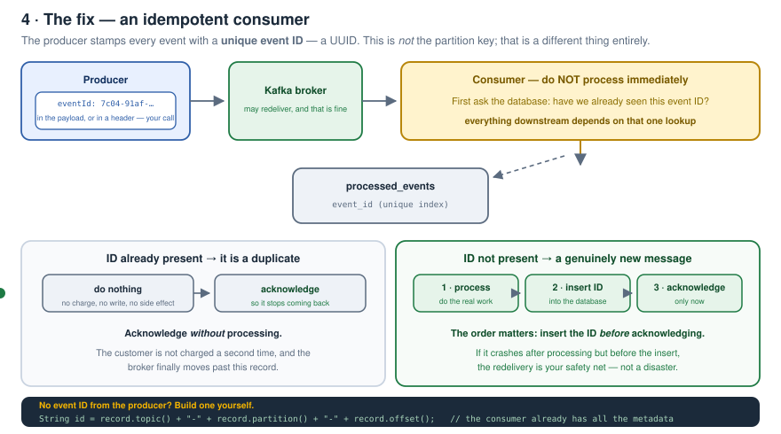
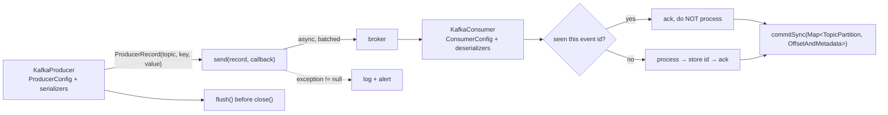

# Kafka Zero to Hero — Part 11: The Java Producer, Idempotency and Multiple Topics

> Notes from episode 11 of the *Kafka Zero to Hero* series.
> Part 10 built a consumer in pure Java. This one completes the picture with the **producer**, and answers the follow-up questions that acknowledgements always raise: what happens when an ack is **skipped**, and what if a consumer processes a message but **acknowledges a later one**. Plus consuming from **multiple topics** with one group.
>
> **Code:** [day02/](day02) — drop these three classes into the `kafka-playground` project from [part 10](../10-java-consumer-core-api/kafka-playground/pom.xml).
>
> Previous: [10 — A consumer in plain Java](../10-java-consumer-core-api/README.md) · [09 — Offset reset and replay](../09-offset-reset-and-replay/README.md) · [08 — Why is Kafka fast?](../08-why-kafka-is-fast/README.md) · [07 — `__consumer_offsets` and lag](../07-consumer-offsets-and-lag/README.md) · [06 — Rebalancing and scaling](../06-rebalancing-and-scaling-scenarios/README.md) · [05 — Consumer groups and partitions](../05-consumer-groups-and-partitions/README.md) · [04 — CLI, produce/consume, offsets](../04-cli-produce-consume/README.md) · [03 — Local setup](../03-local-setup/README.md) · [02 — Fundamentals](../02-kafka-fundamentals/README.md) · [01 — Why Kafka](../01-why-kafka-and-what-is-kafka/README.md)

---

## Contents

1. [An acknowledgement is a bookmark](#1-an-acknowledgement-is-a-bookmark)
2. [Acknowledging one record at a time](#2-acknowledging-one-record-at-a-time)
3. [What if the acknowledgement is skipped?](#3-what-if-the-acknowledgement-is-skipped)
4. [The idempotent consumer](#4-the-idempotent-consumer)
5. [What if the producer doesn't send an ID?](#5-what-if-the-producer-doesnt-send-an-id)
6. [Consuming from multiple topics](#6-consuming-from-multiple-topics)
7. [Implementing the producer](#7-implementing-the-producer)
8. [ProducerRecord and send()](#8-producerrecord-and-send)
9. [flush() before close()](#9-flush-before-close)
10. [Running it end to end](#10-running-it-end-to-end)
11. [One-page recap](#11-one-page-recap)
12. [What comes next](#12-what-comes-next)
13. [Check yourself](#13-check-yourself)

---

## 1. An acknowledgement is a bookmark

Set the scene: a broker, a consumer, a topic and — let's say — **millions of messages**.

The consumer asks the broker to deliver some messages. Of course it doesn't get all million; the broker delivers in **batches**. Say the first four.

The consumer then:

- processes **1** — does **not** acknowledge
- processes **2** — does **not** acknowledge
- processes **3** — does **not** acknowledge
- processes **4** — and **acknowledges 4**

Now the server stops for some reason. It starts again and asks the broker for messages.

**Which messages arrive?** `1, 2, 3, 5, 6, 7`? **No.** You get **`5, 6, 7, …`**



Because the acknowledgement is **like a bookmark** for the broker to track where the consumer is. When the consumer says *"I'm acknowledging 4"*, that implicitly means **it has already seen 1, 2 and 3 and is good with them**. The last acknowledged message was 4, so delivery resumes from 5.

That's exactly what the no-argument commit does:

```java
consumer.commitSync();   // acknowledge the LAST record of the batch
```

---

## 2. Acknowledging one record at a time

In part 10 we never saw how to acknowledge **individual** messages. Let's traverse the records instead.

Two facts drive the API. The consumer gets records **from a partition**, and **offsets are maintained per partition** — so the acknowledgement has to be done **per partition** too. And the record itself carries everything: key, value, topic, partition, offset, all the metadata.



```java
records.forEach(record -> {

    // which log are we talking about
    TopicPartition topicPartition =
            new TopicPartition(record.topic(), record.partition());

    // the offset we want to read NEXT - it is an array index, so move it on by one
    OffsetAndMetadata nextOffset =
            new OffsetAndMetadata(record.offset() + 1);

    consumer.commitSync(Map.of(topicPartition, nextOffset));
});
```

**Why a `Map`?** Key = `TopicPartition`, value = `OffsetAndMetadata`. If your topic has three partitions, you can commit **multiple topic-partitions in a single network call**.

Full file: [day02/Day02KafkaConsumer.java](day02/Day02KafkaConsumer.java)

---

## 3. What if the acknowledgement is skipped?

Say we've built a consumer application that processes **credit card events**. It asks the broker for messages, gets them, **processes all of them, and charges the end users**.

Then, just as it's about to send the acknowledgement:

- a **network issue** — so it never makes it to the broker, **or**
- **someone restarted the server**



After the restart, will Kafka **redeliver** the same messages we already processed? **Yes**, because we never sent the acknowledgement.

So will we process them again? Will we **charge our end users a second time**? **Yes — that could absolutely happen.**

---

## 4. The idempotent consumer

To fix it, we make the **producer** stamp each event with a **unique message/event ID** — something like a **UUID**.

> Note: **I am not talking about the key.** These are different things. This is a very specific unique ID identifying **one particular event**.

The ID can live in the **payload** or in the **header** — that's up to you.



The flow becomes:

1. The producer writes the message to the broker.
2. The consumer asks for messages; the broker delivers them.
3. **Don't process immediately.** Check the **database**: have we seen this event ID already?
4. **If present** → it's a **duplicate**. Don't touch it. **Simply acknowledge, without processing.**
5. **If not present** → it's a new message. **Process it**, then **insert the message ID into the database first**, and **only then acknowledge**.

That's how you make an **idempotent consumer**.

> **This is the consumer's responsibility.** It's not a producer problem, and it's not a Kafka broker problem — it's the application we, as developers, wrote. **There is no consumer-idempotency property at the broker level.** Nothing like that exists.

Working skeleton: [day02/Day02IdempotentConsumer.java](day02/Day02IdempotentConsumer.java)

```java
String eventId = eventIdOf(record);

if (processedEventIds.contains(eventId)) {          // your DB lookup
    acknowledge(consumer, record);                  // ack without processing
    continue;
}

charge(record);                                     // do the real work
processedEventIds.add(eventId);                     // persist the id FIRST
acknowledge(consumer, record);                      // then acknowledge
```

Note the ordering in the happy path. If it crashes **after processing but before the insert**, the redelivery is your safety net rather than a disaster.

---

## 5. What if the producer doesn't send an ID?

Then the consumer builds one itself — because as we saw, **the consumer already has everything**: the key, the value, the topic, the partition, the offset, all the metadata.

```java
String id = record.topic() + "-" + record.partition() + "-" + record.offset();
```

Store that in the database, check it the same way, and process accordingly.

---

## 6. Consuming from multiple topics

**Why would anyone want this?** Imagine an **inventory service** that deducts stock whenever an order is placed. Some customers also **return** orders — maybe they didn't like the product. For scalability (or team ownership, or any other reason) there might be a **separate topic for order returns**.

But the **processing by the inventory service is the same** — deduct the inventory, or increase it. Same consumer, same logic; the topics are segregated for other reasons.



`subscribe()` accepts a **list of topics** or a **pattern**:

```java
consumer.subscribe(Pattern.compile("order.*"));
```

Log the topic too, so you can see where each record came from:

```java
log.info("topic={} key={} value={}", record.topic(), record.key(), record.value());
```

### Demo

```bash
docker exec -it kafka bash
cd /opt/kafka/bin

kafka-topics.sh --bootstrap-server localhost:9092 --list

kafka-topics.sh --bootstrap-server localhost:9092 --topic order-events  --partitions 1 --create
kafka-topics.sh --bootstrap-server localhost:9092 --topic order-returns --partitions 1 --create
```

Open **two terminals**, one console producer on each topic:

```bash
kafka-console-producer.sh --bootstrap-server localhost:9092 --topic order-events
kafka-console-producer.sh --bootstrap-server localhost:9092 --topic order-returns
```

Run the consumer, publish `order-1`, `order-2`, `order-3` on the first and `order-1-return` on the second — everything lands in the same log output, tagged with its topic.

---

## 7. Implementing the producer

Now let's replace the console producer with our own.

Just like the consumer, the producer needs configuration:

- **`bootstrap.servers`**
- a **key serializer** and a **value serializer**

> At the consumer level we needed **deserializers**, because it has to read data from the broker and know what kind of data it is. At the producer level we only need **serializers** — no deserializer.



```java
Properties props = new Properties();
props.put(ProducerConfig.BOOTSTRAP_SERVERS_CONFIG, "localhost:9092");
props.put(ProducerConfig.KEY_SERIALIZER_CLASS_CONFIG, StringSerializer.class);
props.put(ProducerConfig.VALUE_SERIALIZER_CLASS_CONFIG, StringSerializer.class);
```

Two things to notice:

- **No `group.id`.** That's a consumer-level configuration, as covered in part 10. Every component has its own configuration.
- **`ProducerConfig`, not `ConsumerConfig`** — a completely different set of properties.

Then create the producer, declaring the key type and value type it will produce:

```java
KafkaProducer<String, String> producer = new KafkaProducer<>(props);
```

Your IDE will complain here, because `KafkaProducer` implements `AutoCloseable` — not closing it is a **resource leak**. So use **try-with-resources**:

```java
try (KafkaProducer<String, String> producer = new KafkaProducer<>(props)) {
    ...
}
```

> Do the same to the consumer while you're at it — move the whole `while` loop inside a try-with-resources block and the explicit `finally { close(); }` disappears.

---

## 8. `ProducerRecord` and `send()`

To send a message the Kafka library gives you the **`ProducerRecord`** class — it represents a **single record**. Its constructor takes **topic, key, value**:

```java
for (int i = 0; i < 100; i++) {
    String key   = Integer.toString(i);   // the PARTITION key
    String value = "order-" + i;          // the payload

    ProducerRecord<String, String> record =
            new ProducerRecord<>("order-events", key, value);
    ...
}
```

That `key` is the **partition key** we've discussed many times — it's exactly what we were typing as `1:order-1` into the console producer.

To publish it, the producer gives you `send()`. There are two forms — plain, or with a **callback**:

```java
producer.send(record, (metadata, exception) -> {
    if (exception != null) {
        log.error("failed to publish key={}", key, exception);   // never reached the broker
        return;
    }
    log.info("produced correlationId={} partition={} offset={}",
            key, metadata.partition(), metadata.offset());
});
```

The callback gives you a **`RecordMetadata`** and an **`Exception`**. If the exception is **not null**, the message hit a problem and **didn't go through to the broker** — log it. Otherwise log the produced record's correlation id.

A `Thread.sleep(...)` in the loop is purely so you can watch the flow while demoing — there's no other reason for it (and it means declaring `throws InterruptedException`).

Full file: [day02/Day02KafkaProducer.java](day02/Day02KafkaProducer.java)

---

## 9. `flush()` before `close()`

At the end of the loop:

```java
producer.flush();
```



**What it does:** ensures all the sends are completed before the producer is closed.

**Why you need it:** the producer sits in a try-with-resources block, so it gets **closed automatically** when we leave that block. But `send()` is an **asynchronous** call — behind the scenes the client is **sending messages in batches** (part 08). So it's entirely possible that we exit the try block while records are still sitting in the producer's buffer, and they'd go down with it.

`flush()` waits until **all the messages have been produced**, and only then do we come out of the try block.

---

## 10. Running it end to end

With the consumer already running, start the producer.

- The producer publishes `order-0` … `order-99`.
- The consumer logs them arriving, tagged with `topic=order-events`.
- After 100 messages the producer **closes cleanly**.

Restart both and it does the same thing again — but this time the consumer has committed offsets per record, so nothing gets replayed.

---

## 11. One-page recap



| Thing | The one line |
|---|---|
| `commitSync()` no-args | acknowledges the **last** record of the batch |
| Acking record 4 | implicitly acks 1, 2 and 3 — the offset is a position, not a checklist |
| Per-record commit | `Map<TopicPartition, OffsetAndMetadata>` with **`offset() + 1`** |
| Why a Map | commit several partitions in **one network call** |
| Skipped ack | Kafka redelivers → the customer gets charged twice |
| Fix | **idempotent consumer**: unique event ID + a DB check |
| Event ID | a **UUID**, in the payload or a header — **not** the partition key |
| Order of operations | process → **store the ID** → acknowledge |
| Duplicate | acknowledge **without** processing |
| No producer ID? | build one from `topic + partition + offset` |
| Whose problem is idempotency? | the **consumer application's**. No broker setting exists |
| Multiple topics | `subscribe(Pattern.compile("order.*"))` |
| Producer config | `ProducerConfig`, **serializers only**, **no group.id** |
| One message | `ProducerRecord(topic, key, value)` — key is the partition key |
| `send` callback | `(RecordMetadata, Exception)` — non-null exception means it never landed |
| `flush()` | `send()` is async and batched; flush before the block closes the producer |

---

## 12. What comes next

Upcoming videos move on to **Kafka cluster concepts**, some **code refactoring**, and then rebuilding this same producer/consumer setup with **Spring Boot**.

---

## 13. Check yourself

1. A batch of 4 is delivered; only #4 is acknowledged, then the app restarts. Which messages arrive?
2. Why is an acknowledgement described as a bookmark?
3. What does `commitSync()` with no arguments actually commit?
4. Why must an acknowledgement be expressed **per partition**?
5. What two objects do you build for a per-record commit, and what do they hold?
6. Why `record.offset() + 1`?
7. Why does `commitSync` take a `Map`?
8. Walk through the credit-card double-charge scenario.
9. Whose responsibility is idempotency — producer, broker or consumer?
10. What is the unique event ID, where can it live, and how is it different from the key?
11. Give the four steps of the idempotent flow, in order.
12. Why store the ID **before** acknowledging?
13. The producer sends no ID. What do you do?
14. Give a real reason to have `order-events` and `order-returns` as separate topics but one consumer.
15. Two things `subscribe()` accepts.
16. Which config class does the producer use, and which property is conspicuously absent?
17. Serializers or deserializers on the producer? Why?
18. What are the three arguments to `ProducerRecord`?
19. What does the `send` callback give you, and how do you detect a failure?
20. Why is `flush()` necessary in a short-lived producer, and what does its absence cause?

---

<sub>Notes written up from the *Kafka Zero to Hero* series, episode 11. Diagrams, code and wording are mine; the teaching order follows the video.</sub>
