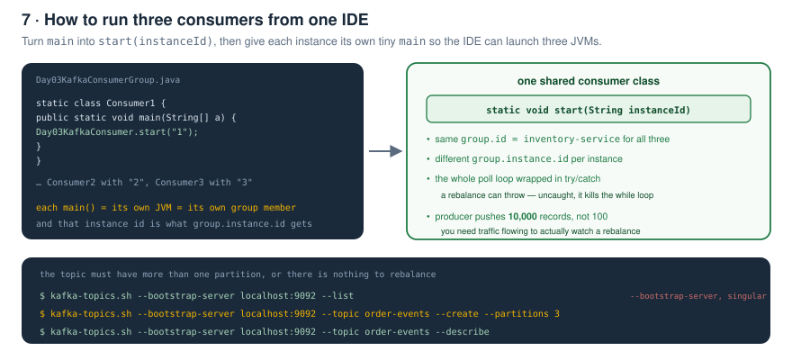
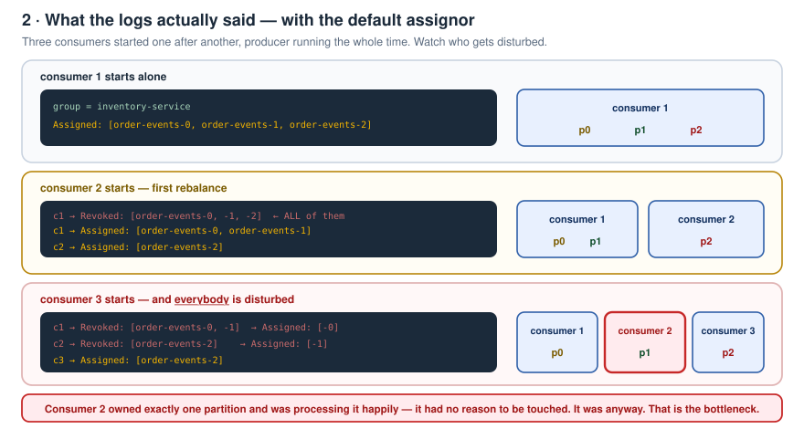
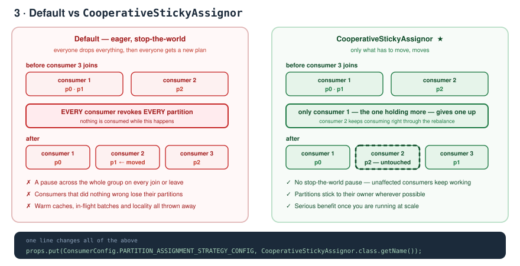
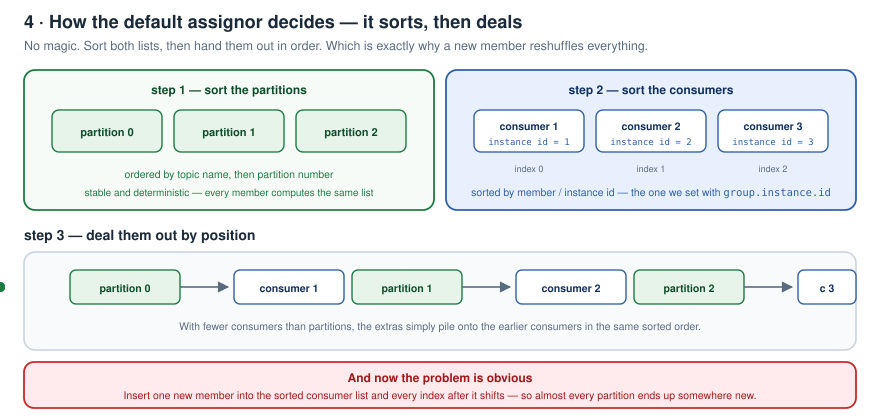
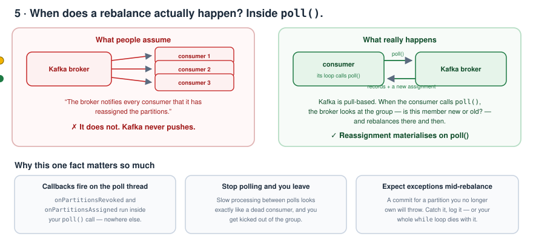
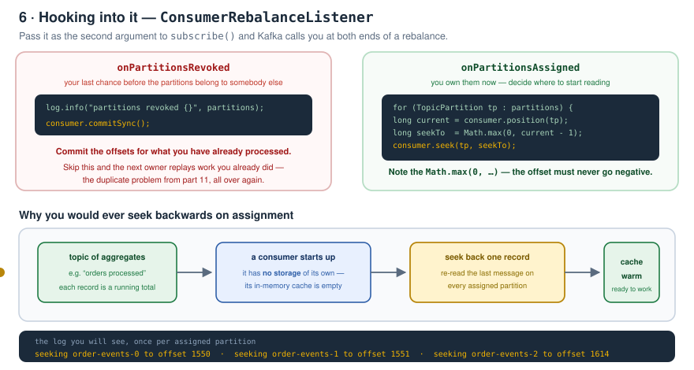
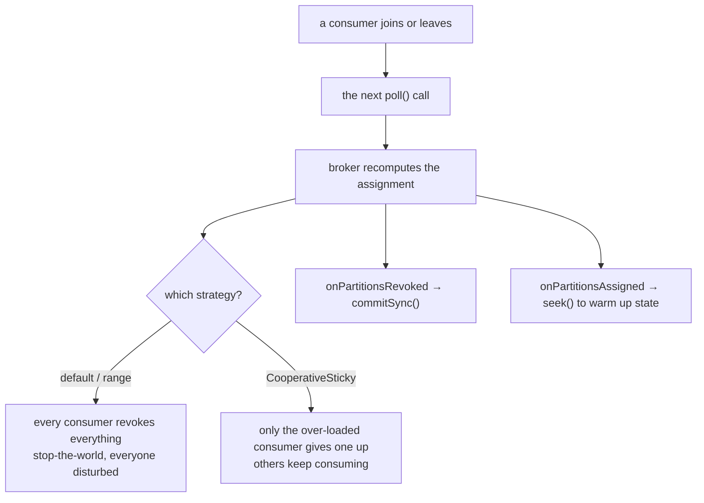

# Kafka Zero to Hero — Part 12: Rebalancing Strategies and Callbacks

> Notes from episode 12 of the *Kafka Zero to Hero* series.
> Partition assignment and rebalancing, done **practically** — by starting and stopping multiple consumer instances in the same group and watching the reassignments happen live. Then the strategies, and why picking the wrong one hurts **every** consumer in production.
>
> This is one of those Kafka topics that looks simple on paper and causes real outages when it's misunderstood.
>
> **Code:** [day03/](day03) — drop into the `kafka-playground` project from [part 10](../10-java-consumer-core-api/kafka-playground/pom.xml).
>
> Previous: [11 — Java producer and idempotency](../11-java-producer-and-idempotency/README.md) · [10 — A consumer in plain Java](../10-java-consumer-core-api/README.md) · [09 — Offset reset and replay](../09-offset-reset-and-replay/README.md) · [08 — Why is Kafka fast?](../08-why-kafka-is-fast/README.md) · [07 — `__consumer_offsets` and lag](../07-consumer-offsets-and-lag/README.md) · [06 — Rebalancing and scaling](../06-rebalancing-and-scaling-scenarios/README.md) · [05 — Consumer groups and partitions](../05-consumer-groups-and-partitions/README.md) · [04 — CLI, produce/consume, offsets](../04-cli-produce-consume/README.md) · [03 — Local setup](../03-local-setup/README.md) · [02 — Fundamentals](../02-kafka-fundamentals/README.md) · [01 — Why Kafka](../01-why-kafka-and-what-is-kafka/README.md)

---

## Contents

1. [The prerequisite](#1-the-prerequisite)
2. [Wiring the demo](#2-wiring-the-demo)
3. [Creating a 3-partition topic](#3-creating-a-3-partition-topic)
4. [Watching the default strategy misbehave](#4-watching-the-default-strategy-misbehave)
5. [The fix — CooperativeStickyAssignor](#5-the-fix--cooperativestickyassignor)
6. [How the default strategy decides](#6-how-the-default-strategy-decides)
7. [How the cooperative sticky strategy decides](#7-how-the-cooperative-sticky-strategy-decides)
8. [When does a rebalance actually happen?](#8-when-does-a-rebalance-actually-happen)
9. [Rebalance callbacks](#9-rebalance-callbacks)
10. [The callbacks in code](#10-the-callbacks-in-code)
11. [One-page recap](#11-one-page-recap)
12. [What comes next](#12-what-comes-next)
13. [Check yourself](#13-check-yourself)

---

## 1. The prerequisite

For partition reassignment / rebalancing to happen at all, you need a topic with **more than one partition**.

Here: `order-events` with **three** partitions — 0, 1 and 2 — and a publisher continuously publishing.



- **Happy case, three consumers** → Kafka assigns **each partition to each consumer**.
- **Only one consumer** → Kafka assigns **all three partitions to that single consumer**.
- Then, for scalability, you **spin up another consumer**. Kafka **removes** a partition from the first and assigns it to the new one. That's the reassignment — the partitions are rebalanced.
- Spin up a third and it happens again.

There are **different strategies** for how those partitions get redistributed, and that choice is the whole point of this part.

---

## 2. Wiring the demo

Create a `day03` package and copy the consumer and producer across, renaming them.

The requirement is to **spin up multiple consumers**. So:



1. Rename the consumer's `main` to **`start(String instanceId)`** and pass the **instance ID** — every consumer gets its own, and it feeds `group.instance.id` (covered in part 10).
2. Wrap the poll loop in a **try/catch**. During partition assignment/rebalancing it can **throw an exception**, and if you don't catch it your `while` loop dies. Log it so you can see something happened.
3. Create a `Day03KafkaConsumerGroup` class holding three **static inner classes** — `Consumer1`, `Consumer2`, `Consumer3` — each with its own `main` calling `start("1")`, `start("2")`, `start("3")`. Each `main` is a separate JVM, so each is a real member of the group.

Files: [Day03KafkaConsumer.java](day03/Day03KafkaConsumer.java) · [Day03KafkaConsumerGroup.java](day03/Day03KafkaConsumerGroup.java) · [Day03KafkaProducer.java](day03/Day03KafkaProducer.java)

---

## 3. Creating a 3-partition topic

```bash
docker exec -it kafka bash
cd kafka/bin

kafka-topics.sh --bootstrap-server localhost:9092 --list
kafka-topics.sh --bootstrap-server localhost:9092 --topic order-events --create --partitions 3
kafka-topics.sh --bootstrap-server localhost:9092 --topic order-events --describe
```

> It's `--bootstrap-server`, **singular** — an easy typo to make.

`--describe` confirms partitions 0, 1 and 2.

Also bump the producer from 100 records to **10,000**, so there's continuous traffic while we start and stop consumers — otherwise there's nothing to observe.

---

## 4. Watching the default strategy misbehave

**Start consumer 1.** Scroll the logs: partitions `order-events-0`, `-1` and `-2` are **all assigned to it**, under consumer group `inventory-service`.

**Start the producer.** Records flow, consumer 1 processes them.

**Start consumer 2.**



- Consumer 2 is assigned **partition 2**.
- Consumer 1's logs show it **revoked all previously assigned partitions** — 0, 1 *and* 2 — and was then **reassigned 0 and 1**.

**Start consumer 3.**

- Consumer 3 gets **partition 2**.
- But look at **consumer 2**: it was happily processing partition 2, and it has **also revoked** everything and been given **partition 1** instead.
- Consumer 1 revoked 0 and 1, and kept only **0**.

> **Every consumer is affected.** Consumer 2 held a single partition and was processing it perfectly well — ideally it should not have been touched at all. It was.

These are exactly the **performance bottlenecks** you'll hit in a production application if you don't tune Kafka and pick the partition strategy correctly.

---

## 5. The fix — `CooperativeStickyAssignor`

There's a property for it:

```java
props.put(ConsumerConfig.PARTITION_ASSIGNMENT_STRATEGY_CONFIG,
        CooperativeStickyAssignor.class.getName());
```



> You can also implement **your own** strategy — it's an interface (`ConsumerPartitionAssignor`), so you can customise the logic to your needs. But this one is the best fit for most cases.

Now run the whole thing again:

- **Consumer 1** starts → all three partitions. Producer starts, records flow.
- **Consumer 2** starts → gets **partition 2**. And note: **no message loss**, because we only commit the offset once the message has been processed successfully.
- **Consumer 3** starts → gets **partition 1**. And **consumer 2 is not touched** — it carries on happily consuming partition 2 throughout.

> **Only the consumer holding more partitions is affected.** Consumer 1 had 0 and 1, so consumer 1 is the one that gives one up. That's a real performance win once you're running at scale.

---

## 6. How the default strategy decides



The default assignor is straightforward:

1. It **sorts all the partitions** in order.
2. It **sorts the consumers by instance ID** — consumer 1 → index 0, consumer 2 → index 1, consumer 3 → index 2.
3. It deals them out according to that sorted order.

Which is precisely why a rebalance disturbs everyone: insert one new member into the sorted consumer list and **every index after it shifts**, so almost every partition lands somewhere new.

Walking through the demo with colours: initially all three partitions to the single consumer. Consumer 2 joins → partition 2 goes to it, the rest stay. Consumer 3 joins → **everything rebalances**, all three consumers are shuffled, and the final state happens to be one partition each.

---

## 7. How the cooperative sticky strategy decides

It's a **sticky-session kind of thing**.

When a new consumer comes up, a partition already assigned to a consumer **sticks** to that consumer and isn't touched. Only the consumer that holds **more** partitions gives one up.

So in the demo: partition 2 is glued to consumer 2. Consumer 1 was the one with two partitions, so consumer 1 is the one that hands one over to consumer 3. Consumer 2 never even notices.

---

## 8. When does a rebalance actually happen?

Important, and widely misunderstood.

> It is **not** the Kafka broker notifying all the consumers that it has reassigned the partitions. That does not happen.

Kafka is **pull-based**. Whenever the consumer calls **`poll()`**, the call goes to the broker. At that moment the broker looks at the state of the group — *is this consumer new, or old?* — and reassigns / rebalances accordingly.



> **Partitions are reassigned and rebalanced on `poll()`.**

Three consequences worth internalising:

- Your **rebalance callbacks fire on the poll thread**, inside your `poll()` call — nowhere else.
- **Stop polling and you leave the group.** Slow processing between polls is indistinguishable from a dead consumer.
- **Expect exceptions mid-rebalance** — a commit for a partition you no longer own will throw. That's the try/catch from step 2.

---

## 9. Rebalance callbacks

If you want to do something when partitions are assigned or revoked, there are callbacks you can implement.

**Why would you?** Imagine a topic carrying **aggregated information** — say the *number of orders processed*, where each record is a running total.

When a consumer comes up it has **no storage of its own** — its in-memory cache is empty. It may need to read the **last message** on each partition to **pre-populate** that aggregated value.



So:

| Callback | What you typically do |
|---|---|
| **`onPartitionsAssigned`** | **seek** the offset back so you can re-read the last message and warm your cache |
| **`onPartitionsRevoked`** | **commit the offsets** for messages you have already processed |

---

## 10. The callbacks in code

Pass a `ConsumerRebalanceListener` as the second argument to `subscribe()`:

```java
consumer.subscribe(List.of(TOPIC), new ConsumerRebalanceListener() {

    @Override
    public void onPartitionsRevoked(Collection<TopicPartition> partitions) {
        log.info("partitions revoked {}", partitions);
        consumer.commitSync();                       // don't lose the work already done
    }

    @Override
    public void onPartitionsAssigned(Collection<TopicPartition> partitions) {
        log.info("partitions assigned {}", partitions);

        for (TopicPartition partition : partitions) {
            long current = consumer.position(partition);
            long seekTo  = Math.max(0, current - 1);  // never let the offset go negative
            consumer.seek(partition, seekTo);
            log.info("seeking {} to offset {}", partition, seekTo);
        }
    }
});
```

Run it and the log shows the seek happening **once per assigned partition**, each with its own offset — because every partition has its own:

```
seeking order-events-0 to offset 1550
seeking order-events-1 to offset 1551
seeking order-events-2 to offset 1614
```

And later, when a further partition is assigned to that consumer, it seeks for **that** partition too.

---

## 11. One-page recap



| Thing | The one line |
|---|---|
| Prerequisite | a topic with **more than one partition** |
| 1 consumer, 3 partitions | it owns **all three** |
| Default assignor | sorts partitions, sorts consumers by instance id, deals in order |
| Cost of that | one new member shifts every index → almost everything moves |
| Observed | consumer 2 owned one partition, was working fine, **still got revoked** |
| Fix | `PARTITION_ASSIGNMENT_STRATEGY_CONFIG` = `CooperativeStickyAssignor` |
| Result | only the consumer holding **more** partitions gives one up |
| Custom strategy | possible — `ConsumerPartitionAssignor` is an interface |
| No message loss | because we commit **only after** successful processing |
| Rebalance trigger | **`poll()`** — the broker never pushes |
| `onPartitionsRevoked` | **commit** what you processed |
| `onPartitionsAssigned` | **seek** to warm caches / rebuild aggregated state |
| Guard | `Math.max(0, position - 1)` — the offset must not go negative |
| Wrap the loop | a rebalance can throw; an uncaught exception kills your consumer |

---

## 12. What comes next

The upcoming videos go much deeper — **fault tolerance demos**, **optimization techniques**, and real-world Kafka scenarios.

---

## 13. Check yourself

1. What must be true of a topic before rebalancing means anything?
2. One consumer, three partitions. What does it own?
3. Walk through what happens to consumer 1 when consumer 2 joins, with the default strategy.
4. What happened to consumer 2 when consumer 3 joined, and why is that bad?
5. How does the default assignor actually compute the assignment?
6. Why does adding one member reshuffle nearly everything?
7. Which property changes the strategy, and to what?
8. With the cooperative sticky assignor, which consumer is disturbed when a new one joins?
9. Can you write your own strategy? What is the interface?
10. Why was there no message loss during any of these rebalances?
11. Does the broker notify consumers about a reassignment? Then how do they find out?
12. Name three consequences of rebalancing being tied to `poll()`.
13. Why does the poll loop need a try/catch here?
14. What do you normally do in `onPartitionsRevoked`?
15. Give a concrete use case for seeking backwards in `onPartitionsAssigned`.
16. Why the `Math.max(0, …)`?
17. How many times does the seek log line appear, and why?
18. Why did the producer publish 10,000 records instead of 100?

---

<sub>Notes written up from the *Kafka Zero to Hero* series, episode 12. Diagrams, code and wording are mine; the teaching order follows the video.</sub>
