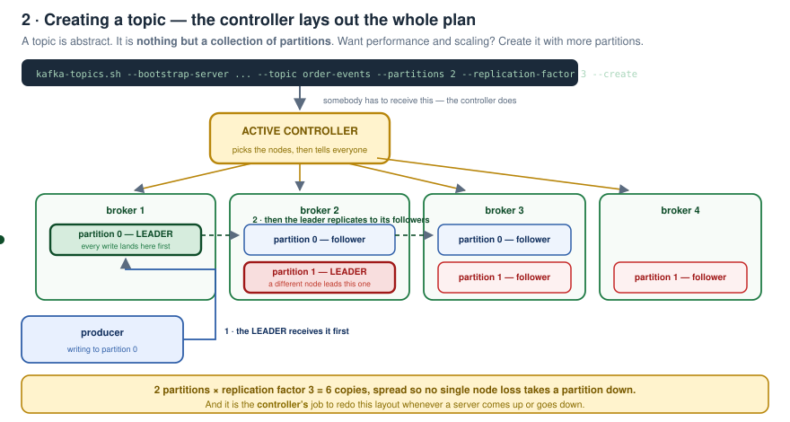
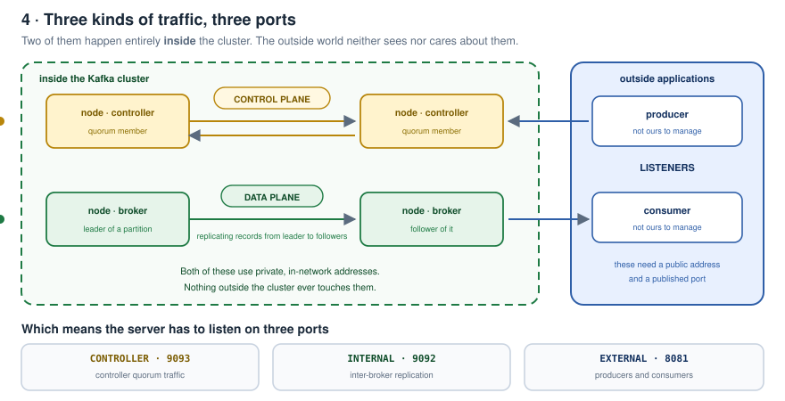
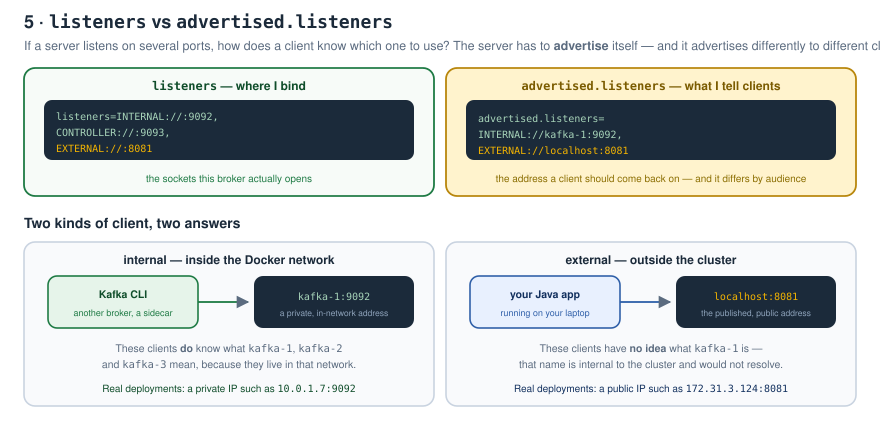
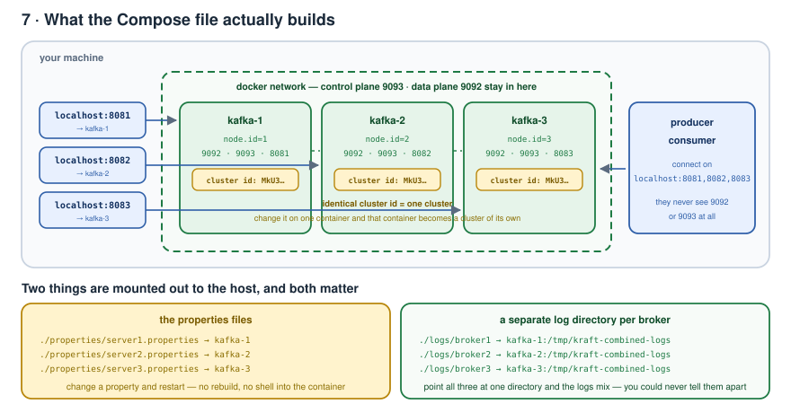
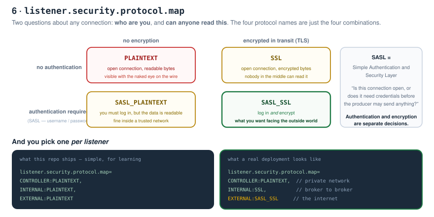
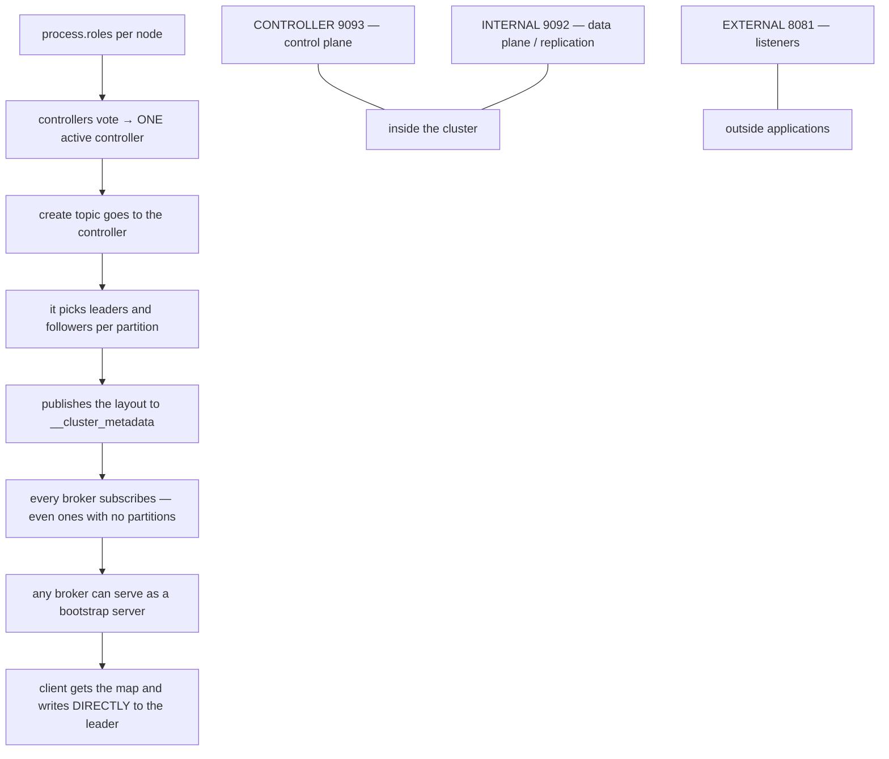

# Kafka Zero to Hero — Part 13: A Real Multi-Broker Cluster

> Notes from episode 13 of the *Kafka Zero to Hero* series.
> Up to now we've been running Kafka on **one node**. This part moves to a **proper multi-broker cluster** with Docker Compose, KRaft mode and replication configured properly — which is where Kafka starts behaving the way it does in production.
>
> **Working cluster:** [cluster/](cluster/docker-compose.yml) — `docker compose up -d` and you have three brokers.
>
> Prerequisites: parts [01](../01-why-kafka-and-what-is-kafka/README.md), [02](../02-kafka-fundamentals/README.md) and [03](../03-local-setup/README.md) — the fundamentals and the single-node setup this reuses.
>
> Previous: [12 — Rebalancing strategies and callbacks](../12-rebalance-strategies-and-callbacks/README.md)

---

## Contents

1. [Roles, and the controller election](#1-roles-and-the-controller-election)
2. [Topics, partitions and the replication factor](#2-topics-partitions-and-the-replication-factor)
3. [`__cluster_metadata` and the bootstrap server](#3-__cluster_metadata-and-the-bootstrap-server)
4. [Three kinds of traffic, three ports](#4-three-kinds-of-traffic-three-ports)
5. [Listeners and advertised listeners](#5-listeners-and-advertised-listeners)
6. [What we are about to build](#6-what-we-are-about-to-build)
7. [The Compose file](#7-the-compose-file)
8. [server.properties, line by line](#8-serverproperties-line-by-line)
9. [Security protocols](#9-security-protocols)
10. [Bring the cluster up](#10-bring-the-cluster-up)
11. [One-page recap](#11-one-page-recap)
12. [What comes next](#12-what-comes-next)
13. [Check yourself](#13-check-yourself)

---

## 1. Roles, and the controller election

Multiple servers are running — server 1, server 2, server 3 and so on. When each one comes up, **we specify its role**: it can act as a **controller**, as a **broker**, or as **broker + controller**.



And here's the part people get wrong:

> Even if we assign the **controller role to multiple nodes**, only **one of them will be the active / main controller at a time.**

They do a kind of **voting among themselves** and select their leader — the active controller. A voting algorithm runs behind the scenes and elects on a **majority of votes**.

Every node also needs a **`node.id`**, and **no two nodes in a cluster may share one** — that's what distinguishes them.

---

## 2. Topics, partitions and the replication factor

As a developer, **you** create the topics.

> A topic is abstract. **A topic is nothing but a collection of partitions.**

Want performance and scaling? Create the topic with **more partitions**.

```bash
kafka-topics.sh --bootstrap-server ... --topic order-events --partitions 2 --replication-factor 3 --create
```

**Somebody has to receive this command** — and that somebody is the **controller**. Any request of this kind goes to the controller.



The controller then **identifies the nodes** the partitions will live on: partition 0 → one node, partition 1 → another.

### Now add high availability

You don't want to depend on a single node. That's what the **replication factor** is for, specified at topic-create time.

With **2 partitions and replication factor 3**, the controller:

- picks a **leader** for partition 0 and a **leader** for partition 1
- identifies **two more nodes as followers** for each partition

> It is the **controller's responsibility** to assign the partitions — as and when any server comes up or goes down.

**Publishing:** the **leader receives the message first**, and then sends it on to the followers.

---

## 3. `__cluster_metadata` and the bootstrap server

When the controller has worked out who leads what and who follows what, it **sends all that information to the entire cluster** — using an internal topic: **`__cluster_metadata`**.

**Every broker subscribes to it.** So every broker knows what is going on in the cluster.



### "Do nodes with no partitions subscribe too?"

A very common question — and **yes, they do**.

Why? Because as a client, **you don't know which server will be used as a bootstrap server**. If *this* node is the bootstrap server, then it needs to know everything: who is the leader, who are the followers.

### "So the bootstrap server forwards my request to the leader?"

**No. It does not work like that.**

The bootstrap server has **everything about the cluster**:

```
topic     = order-events
partition = 0
leader    = node 1  (with its address)
followers = node 2, node 3
```

The **client library** fetches that metadata, works out the partition from the **partition key**, finds the leader's node address — and **publishes the message directly to the leader**.

---

## 4. Three kinds of traffic, three ports

We have two roles — **controller** and **broker** — plus **outside applications** (producers and consumers) that we don't manage.



| Traffic | Who talks | Called |
|---|---|---|
| Controllers talking among themselves | controller ↔ controller | the **control plane** |
| Brokers replicating data — leader to followers | broker ↔ broker | the **data plane** |
| Producers and consumers connecting in | outside ↔ cluster | the **listeners** |

**Both the control plane and the data plane happen entirely within the cluster.** The outside world doesn't have to worry about them at all.

Which means the server needs **three ports**: one for control-plane communication, one for data-plane communication, and one for publishing/consuming.

### But then how does a publisher know which port to use?

Each Kafka server has to **advertise its information** — and it exposes **two** kinds:

- a **private** address, e.g. `10.0.1.7:9092`, usable **only within the Kafka subnet** — internal communication
- a **public** address, e.g. `172.31.3.124:8081`, exposed for **external** communication

---

## 5. Listeners and advertised listeners



- **`listeners`** — the sockets this broker actually **binds**.
- **`advertised.listeners`** — the address it tells **clients** to come back on.

And there are **two types of client**:

| Client | What it's told | Why |
|---|---|---|
| **Internal services** — the Kafka CLI, another broker | `kafka-1:9092` | they live in the same network and **do** know what `kafka-1` means |
| **External applications** — your Java app | `localhost:8081` | they have **no idea** what `kafka-1` is; that name is internal to the cluster |

That's exactly why we publish port **8081** in the Compose file.

---

## 6. What we are about to build

Three Docker containers. **Controller and data-plane communication happens within the Docker network.** For external communication we expose ports **8081, 8082 and 8083** so producer and consumer applications can talk to our Kafka containers.



---

## 7. The Compose file

[cluster/docker-compose.yml](cluster/docker-compose.yml)

Three services — `kafka-1`, `kafka-2`, `kafka-3` — with the **same container names** for simplicity, and **the same image we built for the single-node broker** in part 03.

```yaml
kafka-1:
  build: ../../03-local-setup/docker
  image: kafka-kraft:3.8.1
  container_name: kafka-1
  environment:
    KAFKA_CLUSTER_ID: "MkU3OEVBNTcwNTJENDM2Qk"
  ports:
    - "8081:8081"
  volumes:
    - ./properties/server1.properties:/opt/kafka/config/kraft/server.properties:ro
    - ./logs/broker1:/tmp/kraft-combined-logs
  networks: [kafka-net]
```

Four things to notice:

**1. Port mappings.** `8081`, `8082`, `8083` from the local machine into the containers, so external applications can connect.

**2. The same cluster ID on all three.** To run all the containers **inside one cluster**, they must share it.

> Change the cluster ID on one container and **that container runs in a separate cluster of its own.**

**3. `server.properties` mounted out to the host.** The Kafka broker has its own properties, and we map them to the local machine — so we can **change any property quickly without logging into the container**.

**4. A separate log directory per broker.** Every container has its own logs. Point all three at the same directory and **the logs would get mixed up** — you'd never be able to tell which lines belong to broker 1, 2 or 3.

---

## 8. `server.properties`, line by line

[cluster/properties/server1.properties](cluster/properties/server1.properties)

```properties
process.roles=broker,controller
node.id=1

controller.quorum.voters=1@kafka-1:9093,2@kafka-2:9093,3@kafka-3:9093

listeners=INTERNAL://:9092,CONTROLLER://:9093,EXTERNAL://:8081
advertised.listeners=INTERNAL://kafka-1:9092,EXTERNAL://localhost:8081

listener.security.protocol.map=CONTROLLER:PLAINTEXT,INTERNAL:PLAINTEXT,EXTERNAL:PLAINTEXT
controller.listener.names=CONTROLLER
inter.broker.listener.name=INTERNAL

auto.create.topics.enable=false
offsets.topic.replication.factor=3

log.dirs=/tmp/kraft-combined-logs
```

| Property | What it does |
|---|---|
| **`process.roles`** | the key Kafka uses to identify what role this node has been assigned — here **broker and controller** |
| **`node.id`** | unique per node; this is what distinguishes every node in the cluster |
| **`listeners`** | the three listener names and their ports — EXTERNAL on **8081**, CONTROLLER on **9093**, INTERNAL on **9092** |
| **`controller.listener.names`** | the listener name **all controller nodes** listen on |
| **`inter.broker.listener.name`** | the listener name **brokers** use to communicate internally |
| **`advertised.listeners`** | what clients are told — `kafka-1` for internal services, `localhost` for external applications |
| **`controller.quorum.voters`** | **who may participate in the voting** for the active controller. Pattern: `nodeId@host:9093` — 9093 because that's the controller port |
| **`listener.security.protocol.map`** | the security protocol per listener — see below |
| **`auto.create.topics.enable=false`** | we don't want topics being created automatically |
| **`offsets.topic.replication.factor=3`** | how many replicas we want of the internal consumer-offsets topic |
| **`log.dirs`** | where this broker's log segments live |

`server2.properties` and `server3.properties` are almost identical — `node.id` is 2 and 3, the external port is 8082/8083, and you can change the role if you only want a **broker** rather than broker+controller.

---

## 9. Security protocols

Whenever we talk about communication, two questions come up automatically: **is it secured?** and **is it plain text?**

Kafka gives you four protocol names, which are really just the two questions combined:



| Protocol | Authentication | Encryption |
|---|---|---|
| **`PLAINTEXT`** | none | none — the data is visible with the naked eye |
| **`SSL`** | none | encrypted in transit |
| **`SASL_PLAINTEXT`** | required | none |
| **`SASL_SSL`** | required | encrypted in transit |

**SASL** — *Simple Authentication and Security Layer* — answers *"is this connection open, or do I need a username and password before the cluster will accept my messages?"* Authentication is one part; **what kind of data transfer** (plain vs encrypted) is the other.

You map a protocol **per listener**:

```properties
listener.security.protocol.map=CONTROLLER:PLAINTEXT,INTERNAL:SSL,EXTERNAL:SASL_SSL
```

Everything here is `PLAINTEXT` **for simplicity** — but you can flip EXTERNAL to `SSL` or `SASL_SSL` and tweak these settings as you like.

---

## 10. Bring the cluster up

```bash
cd kafka/13-kafka-cluster-setup/cluster
docker compose up -d

docker ps -a | grep kafka
# kafka-1   kafka-2   kafka-3
```

That's the cluster running. Quick sanity checks:

```bash
# create a topic with replicas spread across the brokers
docker exec -it kafka-1 kafka-topics.sh --bootstrap-server localhost:9092 \
  --topic order-events --partitions 3 --replication-factor 3 --create

# see the leader, replicas and ISR per partition
docker exec -it kafka-1 kafka-topics.sh --bootstrap-server localhost:9092 \
  --topic order-events --describe

# and from outside the cluster, on the published port
kafka-topics.sh --bootstrap-server localhost:8081 --list
```

> **Note on the cluster ID.** The video uses `test-cluster`; Kafka actually requires a base64-encoded UUID, so this repo ships a valid one. Generate your own with `docker exec -it kafka-1 kafka-storage.sh random-uuid` and put the same value on all three services.

---

## 11. One-page recap



| Thing | The one line |
|---|---|
| Role | `process.roles` — broker, controller, or both |
| Many controllers | only **one is active**, chosen by majority vote |
| `node.id` | must be unique across the cluster |
| Topic | an abstraction — **a collection of partitions** |
| Create topic | the request goes to the **controller** |
| Replication factor | how many copies; controller picks one leader + N−1 followers |
| Writes | **leader first**, then replicated to followers |
| `__cluster_metadata` | internal topic every broker subscribes to |
| Empty brokers | **still subscribe** — any of them may be a bootstrap server |
| Bootstrap server | hands over the map; it does **not** forward your request |
| Control plane | controller ↔ controller, port 9093 |
| Data plane | broker ↔ broker replication, port 9092 |
| Listeners | outside applications, port 8081/8082/8083 |
| `listeners` | where the broker **binds** |
| `advertised.listeners` | what it **tells clients** — container name internally, localhost externally |
| `controller.quorum.voters` | who is allowed to vote |
| Security protocols | PLAINTEXT / SSL / SASL_PLAINTEXT / SASL_SSL, mapped per listener |
| Same cluster ID | what makes three containers **one** cluster |
| Separate log dirs | so broker logs never get mixed up |

---

## 12. What comes next

The next videos cover a **fault tolerance demo**, the **Spring Boot application**, and how a **Java application connects to the cluster** — publishing, consuming, and much deeper concepts.

---

## 13. Check yourself

1. What three role combinations can a node have?
2. You assign the controller role to three nodes. How many are active, and how is that decided?
3. What must be unique on every node?
4. Define a topic in one sentence.
5. Who receives the create-topic command?
6. With 2 partitions and replication factor 3, what exactly does the controller lay out?
7. Who receives a published message first, and what happens next?
8. What is `__cluster_metadata` and who subscribes to it?
9. Does a broker with no partitions subscribe? Why?
10. Does the bootstrap server forward your write to the leader? Then what does it do?
11. Name the three communication channels and which ports they use.
12. Which two of them never leave the cluster?
13. Difference between `listeners` and `advertised.listeners`.
14. Why is the external advertised listener `localhost` and not `kafka-1`?
15. What does `controller.quorum.voters` control, and why port 9093?
16. Give the four security protocols and what each one does or doesn't provide.
17. What is SASL?
18. What happens if one container has a different cluster ID?
19. Why is `server.properties` mounted out to the host?
20. Why does each broker get its own log directory?

---

**Next:** [Part 14 · Kafka Connect and CDC](../14-kafka-connect-and-cdc/README.md) — moving data in and out of Kafka without writing a single producer or consumer, and streaming Postgres changes with Debezium.

---

<sub>Notes written up from the *Kafka Zero to Hero* series, episode 13. Diagrams, Compose file, broker configs and wording are mine; the teaching order follows the video.</sub>
