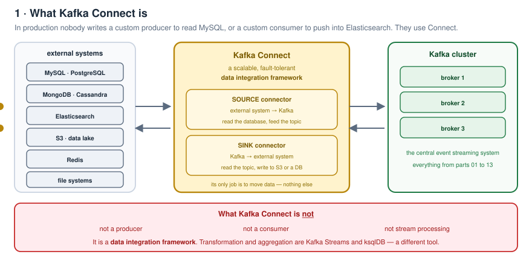
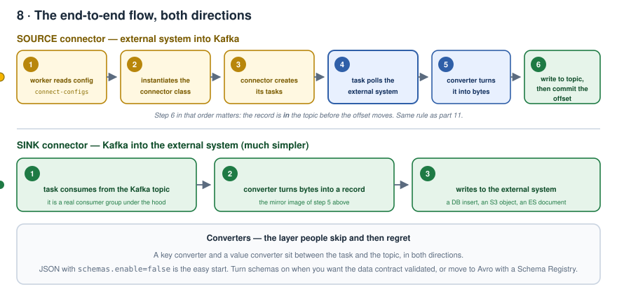
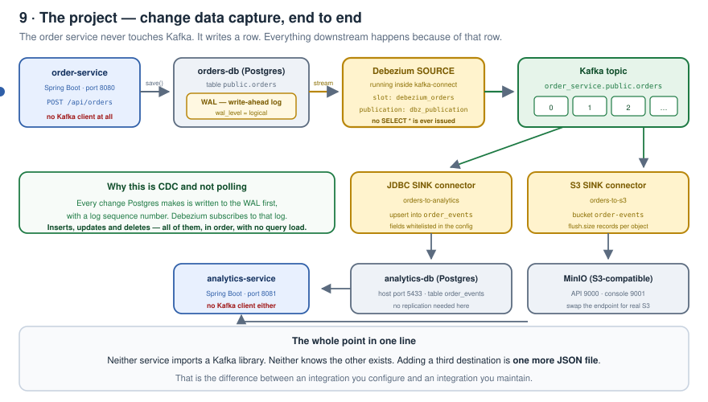

# Part 14 · Kafka Connect and CDC

> So far in this series we built producers, consumers, and understood partitions, rebalancing and offset management.
> But in real production systems **nobody writes a custom producer to read from MySQL**, and **nobody writes a custom consumer to push data into Elasticsearch**.
> They use **Kafka Connect** — a scalable, fault-tolerant data integration framework built on Kafka.

This part does two things: understand Connect deeply, then **build and run a complete working project** with **CDC (change data capture)** in action — the thing most distributed systems are actually using underneath.

---

## Contents

1. [What Kafka Connect is](#1-what-kafka-connect-is)
2. [Why it exists](#2-why-it-exists)
3. [The five layers](#3-the-five-layers)
4. [A connector is a jar file](#4-a-connector-is-a-jar-file)
5. [Tasks and configuration](#5-tasks-and-configuration)
6. [Workers, and the two modes](#6-workers-and-the-two-modes)
7. [The three internal topics](#7-the-three-internal-topics)
8. [Coordination — how workers agree](#8-coordination--how-workers-agree)
9. [Rebalancing](#9-rebalancing)
10. [The complete flow, both directions](#10-the-complete-flow-both-directions)
11. [The project](#11-the-project)
12. [Running it](#12-running-it)
13. [What to take away](#13-what-to-take-away)
14. [Interview answers](#14-interview-answers)

---

## 1. What Kafka Connect is

**Kafka Connect is a framework that moves large amounts of data between Kafka and external systems.**

External systems means the usual suspects: MySQL, PostgreSQL, MongoDB, Elasticsearch, S3, Redis, Cassandra, file systems. Connect sits **between** those systems and the Kafka cluster.



Be precise about what it is **not**:

- it is **not a producer**
- it is **not a consumer**
- it is **not stream processing**

It is a **data integration framework**. Its entire job is to move data from an external system into Kafka, and from Kafka out to an external system. Nothing else. Transformation and aggregation are Kafka Streams and ksqlDB — a different tool, a different video.

---

## 2. Why it exists

Fair question: Kafka already has producers and consumers. Why add another thing?

Take the use case. You have a **MySQL database**, and you have to read from it and push into Kafka.

**Without Kafka Connect**, you write a producer application. Now look at what that application actually has to do:

1. **continuously poll the database**
2. **handle retries** — because the database will be down at some point
3. **manage offsets** — what was the last record this producer published?
4. **handle scaling** — the DB has a million rows and traffic is growing
5. **handle fault tolerance** — the process will crash
6. **handle schema changes** — somebody will add a column



That is a **lot** of machinery for what is a very basic requirement: *whatever lands in MySQL, feed it into Kafka*.

And here is the part that matters. **You are not the only one with this requirement.** Many teams, many companies, have exactly the same one. So everyone in the world ends up writing the same integration logic again and again. That is duplication of effort on a global scale.

Kafka Connect solves it by providing **standardized data integration** — a framework, standard connectors, and a pluggable architecture.

### What else it solves

**Scalability.** Your custom producer is a single instance. What if the database has a million rows and your traffic increases? Now *you* have to manage partitions and parallel workers. Connect solves this with **tasks**, **distributed workers** and **automatic rebalancing**.

**Fault tolerance.** If your custom producer crashes — where was the last row read? Did we lose data? Did we duplicate data? You would have to build offset storage, recovery logic and retry handling yourself. Connect already does all of this via **internal topics** inside the Kafka cluster, which hold the offsets and the job status so distributed coordination works.

**Connectors that already exist.** MySQL, PostgreSQL, MongoDB, Elasticsearch, S3, JDBC, Redis, Cassandra — instead of building the integration yourself, you use **battle-tested connectors** that have already run against far more data than you have.

> Kafka is the central event streaming system.
> **Kafka Connect is the standardized bridge between Kafka and external systems.**
> It ensures loose coupling, standard data ingestion and reliable pipelines — so engineers don't reinvent data integration every time they connect Kafka to another system.

---

## 3. The five layers

Kafka Connect is a distributed, fault-tolerant data integration framework built on top of Kafka, and its architecture has **five layers**.



| # | Layer | What it is |
|---|---|---|
| 1 | **External systems** | databases (MySQL, Postgres), search engines (Elasticsearch), data lakes (S3), NoSQL (MongoDB, Cassandra), Redis, file systems |
| 2 | **Connectors** | the high-level job definition, connecting an external system to the Connect cluster |
| 3 | **Tasks** | created by the connector — reading from MySQL, from Mongo, from Redis, from a file, from S3 |
| 4 | **Workers** | the JVM processes that actually run the tasks |
| 5 | **Internal topics** | topics inside the Kafka cluster used for coordination — connector status, task assignment, last offset read |

### Layer 1 — external systems

Standardized systems that are already part of your stack and already used across distributed systems. Connect acts as the **bridge** between them and your Kafka cluster.

### Layer 2 — connectors

A connector is a **high-level job definition**. There are exactly two types:

| Type | Direction | Example |
|---|---|---|
| **Source connector** | external system → Kafka | read from MySQL, feed the data into Kafka |
| **Sink connector** | Kafka → external system | read from Kafka, write into Elasticsearch, S3, or another database |

**A connector does not move data itself.** It creates **tasks**, and the tasks move the data.

---

## 4. A connector is a jar file

This is where most people expect magic. There is none.

> A connector is **not** some built-in component that ships inside Kafka Connect. It is simply a **Java plug-in — a jar file**.



When you spin up the Connect cluster, you include those jars on the class path. There is a different connector for MySQL, a different one for PostgreSQL, a different one for S3, and so on.

You tell the worker where they live with **`plugin.path`**:

```properties
plugin.path=/usr/share/java/libs
```

All your connectors — all your jar files — must be in that path. The worker loads every one of them at startup.

Then, because many connectors are available, you have to say **which one you want to use**. That goes in the connector configuration:

```json
{
  "name": "orders-db-source",
  "connector.class": "io.debezium.connector.postgresql.PostgresConnector"
}
```

`connector.class` must be the **fully qualified name** — package name *and* class name. Get one character wrong and the connector never starts.

### What the class itself has to do

Kafka Connect provides standard APIs. For a class to act as a connector it must implement them:

- a source connector **extends `SourceConnector`** and implements its methods
- a sink connector **extends `SinkConnector`** and implements its methods
- and in both cases the class must **create the tasks** that workers will execute

Which is exactly what you would do if you wrote your own connector for a system nobody has covered yet.

---

## 5. Tasks and configuration

You have the jar. Now you give the connector its configuration:

- **which Kafka topic** it should feed (or read from)
- **which database table** it should read (or write to)
- **how many tasks** it wants

A connector must specify **at least one task**. If you need more parallelism, define more:

```json
"tasks.max": "3"
```

Three tasks means three parallel tasks — the same mental model as three partitions from [part 05](../05-consumer-groups-and-partitions/README.md).

Those tasks are then executed by the **workers**.

---

## 6. Workers, and the two modes

A **worker** is nothing but a **JVM process** running inside Kafka Connect. You give it a class path that includes the jars directory so it loads all available connectors, and at runtime you configure which connector you actually want to use.

Workers are responsible for **running connectors and tasks**. There are two modes of running them.



### Standalone mode

A **single worker JVM process**.

- **no fault tolerance** — if that worker crashes, you can't do anything
- good for **development and testing**
- stores its configuration **locally**
- and therefore **creates no internal topics at all**

Why no internal topics? Because it already knows only a single JVM process will ever run. There is no reason to push that information into the Kafka cluster when nobody else needs to read it.

### Distributed mode

**Multiple workers.**

- fault tolerance comes automatically, because you have more than one
- **automatic rebalancing** whenever a worker goes down
- **REST APIs** to configure connectors at runtime — in production you don't restart the cluster every time you want to add or change a connector
- this is the production-ready setup, and **the one we use in the demo**

### "Where do I set the Connect cluster ID?"

You don't. There isn't one.

Workers automatically form a Kafka Connect cluster when they share:

- the same **`group.id`** — e.g. `connect-cluster`
- the same **internal topics**
- the same **Kafka cluster** (`bootstrap.servers`)

That's it. No separate cluster to provision, no cluster ID to generate. **Just start the worker JVM on another machine** with those three things identical, and it joins.

---

## 7. The three internal topics

This is the most important layer. In distributed mode, **Connect uses Kafka itself for coordination**, and it creates three topics.



### `connect-configs`

Stores **all connector configurations**. Whenever you spin up a worker, the very first thing it does is read this topic to learn what connectors exist and how they are configured. It also holds the **task assignments** the leader computed.

> Centralized config storage, no local dependency.

### `connect-offsets`

Stores **source connector offsets** — and it is used **only by source connectors**. A sink connector never touches this topic.

What goes in it: the last row read from MySQL, the last file position read, the last WAL position streamed.

> No data loss, and clean recovery after a crash.

### `connect-status`

Stores the **status of connectors and tasks**: `RUNNING`, `FAILED`, `PAUSED`.

Every connector publishes a **heartbeat** to this topic on a configurable periodic interval. If a worker fails to ping within the interval — say a minute — the other workers know that worker is gone, and a rebalance is triggered.

> Monitoring, health tracking, and the rebalance trigger, all in one topic.

Each of these has a **single partition**: the ordering of configuration and status changes has to be total.

> **The design point worth stealing:** Connect stores no state of its own. Config store, offset store, leader election, task assignment — all of it offloaded to Kafka. That is a brilliant distributed design, and it is why a worker is disposable.

---

## 8. Coordination — how workers agree

The whole thing behaves like a consumer group, because underneath it **is** one.

1. A worker starts and connects to the Kafka cluster with a **`group.id`** and **bootstrap servers**.
2. It joins the three internal topics — think of the workers as consumers, each with the same group ID.
3. Kafka **elects one worker as the leader**, exactly like a consumer group leader.
4. The leader **assigns the tasks** — the same logic shape as `onPartitionsAssigned` from [part 12](../12-rebalance-strategies-and-callbacks/README.md).
5. The leader **writes the assignment into Kafka** (`connect-configs`).
6. Every worker **reads its own assignment back out of the topic** and starts running those tasks.



> **Workers never communicate with each other directly.** There is no worker-to-worker channel. They coordinate entirely through Kafka — Kafka is the config store, the offset store, the leader election system and the task assignment coordinator.

---

## 9. Rebalancing

> Prerequisite: the partition rebalancing material in [part 06](../06-rebalancing-and-scaling-scenarios/README.md) and [part 12](../12-rebalance-strategies-and-callbacks/README.md).

A rebalance happens when a **worker joins**, a **worker leaves**, or a **connector configuration changes**.

Take the example: **four workers**, **three connectors** — one reading JDBC into Kafka, one pushing Kafka into MongoDB, one pushing Kafka into Redis. Connectors declare how many tasks they need, and those tasks are spread across the workers:

| Connector | Tasks on |
|---|---|
| connector 1 (JDBC source) | worker 1, worker 2, worker 4 |
| connector 2 (Mongo sink) | worker 1, worker 3, worker 4 |
| connector 3 (Redis sink) | worker 1, worker 2, worker 3 |

Now **worker 4 crashes**.

**How does Kafka know?** Through the **`connect-status`** topic. That worker has not published a heartbeat within the periodic interval, so every other worker can see its status entry is stale — something is wrong. A rebalance is triggered.

Connector 1's task moves to worker 3. Connector 2's task moves to worker 2.

### "But now we lose data, right?"

**No.** The offsets were already stored in **`connect-offsets`**. Each worker fetches from that topic the last row it had already fed, and **resumes from the next row**.

---

## 10. The complete flow, both directions



### Source connector — six steps

1. The worker **reads the configuration** from `connect-configs`.
2. The worker **instantiates the connector**.
3. The connector **creates tasks** based on that configuration.
4. The **task polls the external system** — this is the main job unit doing the actual work.
5. The task **converts** the data using the **converters**.
6. It **writes to the Kafka topic**, and then **stores the offset** in `connect-offsets`.

Step 6's ordering is not incidental: the record is in the topic **before** the offset moves. It is the same *process first, then acknowledge* rule from [part 11](../11-java-producer-and-idempotency/README.md).

### Sink connector — three steps

Much simpler:

1. The task **consumes data from the Kafka topic**.
2. It **converts** the message.
3. It **writes to the external system**.

### Converters

A **key converter** and a **value converter** sit between the task and the topic, in both directions. In this project:

```properties
key.converter=org.apache.kafka.connect.json.JsonConverter
value.converter=org.apache.kafka.connect.json.JsonConverter
key.converter.schemas.enable=false
value.converter.schemas.enable=false
```

`schemas.enable` is the one you don't need to worry about on day one — turn it on when you want the **data contract validated**, or move to Avro with a Schema Registry.

---

## 11. The project

Two services: **order-service** and **analytics-service**.

The order service continuously inserts orders into a database — Postgres, for simplicity. Kafka Connect continuously streams that data out to external systems: the **analytics database** and **S3**, both consumed by the analytics service.

- Postgres → Kafka is the **source connector**
- Kafka → analytics DB / S3 is the **sink connector**
- both sinks read the **same topic** the source publishes to



```
14-kafka-connect-and-cdc/
├── order-service/                  Spring Boot, writes rows. No Kafka client.
│   └── src/main/java/com/suel/orderservice/
│       ├── entity/Order.java
│       ├── repository/OrderRepository.java
│       └── web/OrderController.java
└── project/
    ├── docker-compose.yml          kafka, both DBs, minio, connect, services
    ├── init/
    │   ├── orders-db.sql           table + debezium role + publication
    │   └── analytics-db.sql        order_events table
    ├── connectors/
    │   ├── debezium-orders-source.json
    │   ├── jdbc-analytics-sink.json
    │   └── s3-orders-sink.json
    ├── scripts/register-connectors.sh
    └── kafka-connect/
        ├── Dockerfile              puts the jars on the plugin path
        └── pom.xml                 declares which jars
```

### order-service

A normal, simple CRUD Spring Boot application on port **8080**. There is deliberately **no service layer** — our job here is Kafka Connect, not building every layer in a fine-grained way, so the repository is injected straight into the controller.

```java
@PostMapping
public ResponseEntity<Order> createOrder(@RequestBody CreateOrderRequest request) {
    Order order = Order.builder()
            .orderNumber("ORD-" + UUID.randomUUID().toString().substring(0, 8).toUpperCase())
            .customerId(request.customerId())
            .status("PENDING")
            .build();

    return ResponseEntity.ok(orderRepository.save(order));   // that's the whole integration
}
```

**Read that again: it is not publishing to Kafka.** It just persists to the database. The source connector will pull the change out of the database and publish it.

### analytics-service

Also a Spring Boot application, on port **8081**. Two or three dependencies, no more: the Postgres driver, and **MinIO**.

MinIO is an **S3-compatible object storage** that we run locally instead of real S3. Even if you do use real S3, you can use the MinIO client library to access the buckets — so the code doesn't change, only the endpoint.

The controller does nothing interesting: fetch orders from the analytics DB, list buckets, list object keys, return an object summary. And critically — **there is no sink configuration anywhere in this service**, because that is managed by Kafka Connect.

### docker-compose.yml

**kafka** — the same single-broker KRaft setup from [part 13](../13-kafka-cluster-setup/README.md): `9092` external, `29092` internal inter-broker, `9093` control plane, advertised listeners for both the outside world and inter-broker traffic, `controller.quorum.voters` pointing at itself, `node.id=1`, auto-create topics on, and a log directory.

**orders-db** — Postgres, user `order_user`, password `order_password`, database `orders`, port `5432`.

Here is the important bit:

```yaml
command:
  - postgres
  - -c
  - wal_level=logical
  - -c
  - max_replication_slots=4
  - -c
  - max_wal_senders=4
```

Why? Because the source connector is **not** firing `SELECT * FROM orders` on a timer. Every change made to a Postgres database is written to the **WAL — the write-ahead log** — with a log sequence number. Postgres provides functionality to **replicate those logs** to downstream systems, and that's what we enable here: **logical replication**, four replication slots, four WAL senders.

Plus a health check — Postgres already ships `pg_isready` — every 5 seconds, 5 retries.

**analytics-db** — more or less the same Postgres image, host name and container name `analytics-db`, user `analytics_user`, password `analytics_password`, database `analytics`. Since **no streaming is required out of this one**, there is no custom `command` block. It runs on `5432` inside the container, but we expose **`5433`** on the host so it doesn't collide with the orders DB.

**Init scripts.** `orders-db.sql` creates the orders table if it doesn't exist plus indexes on some columns, and then handles the replication side: it creates the **`debezium` role with the `REPLICATION` attribute** — that user is the one eligible to stream WAL logs into the application — grants it read access to all tables, and creates the **publication**.

`analytics-db.sql` has none of that. It just creates the `order_events` table if it doesn't exist, and some indexes.

**order-service / analytics-service** — built from their own directories, ports 8080 and 8081, pointed at their databases with the credentials above. The analytics service also gets the MinIO endpoint, access key, secret key and bucket, because it reads S3 as well as the database.

**kafka-connect** — again: nothing but a **JVM worker process**. It depends on kafka, both databases and minio. In distributed mode it exposes the **REST API** on `8083`, and it gets:

```yaml
CONNECT_GROUP_ID: connect-cluster
CONNECT_BOOTSTRAP_SERVERS: kafka:29092
CONNECT_REST_ADVERTISED_HOST_NAME: kafka-connect
CONNECT_CONFIG_STORAGE_TOPIC: connect-configs
CONNECT_OFFSET_STORAGE_TOPIC: connect-offsets
CONNECT_STATUS_STORAGE_TOPIC: connect-status
CONNECT_KEY_CONVERTER: org.apache.kafka.connect.json.JsonConverter
CONNECT_VALUE_CONVERTER: org.apache.kafka.connect.json.JsonConverter
CONNECT_PLUGIN_PATH: /usr/share/java,/usr/share/confluent-hub-components
```

Its health check is a curl against the REST API checking for `200 OK` — which exists precisely because distributed mode opens that API.

**minio** — ports `9000` and `9001`. You can reach MinIO two ways: the API/web on **9000**, or the console on **9001**.

**minio-init** — a container whose only purpose is to create the `order-events` bucket, and then **exit immediately**. One-time setup.

**connector-init** — same idea. It runs `register-connectors.sh` on startup, which POSTs each connector JSON to the REST API.

> This is **not mandatory**. In distributed mode you can hit the REST API manually whenever you like — that's the whole point of it. Automating it here just means one command gives you a working pipeline.

### Getting the jars onto the plugin path

The worker needs the connector jars in `plugin.path`. The `kafka-connect/pom.xml` declares them:

```xml
<dependency>
  <groupId>io.debezium</groupId>
  <artifactId>debezium-connector-postgres</artifactId>
</dependency>
<dependency>
  <groupId>io.confluent</groupId>
  <artifactId>kafka-connect-jdbc</artifactId>
</dependency>
<dependency>
  <groupId>io.confluent</groupId>
  <artifactId>kafka-connect-s3</artifactId>
</dependency>
```

The Dockerfile installs Maven, resolves those dependencies into a temp directory, and then copies each connector into **its own folder** under the plugin path:

```dockerfile
RUN mvn -B -q dependency:copy-dependencies -DoutputDirectory=/build/target/connectors

COPY --from=plugins /build/target/connectors/kafka-connect-jdbc*.jar \
                    /usr/share/confluent-hub-components/kafka-connect-jdbc/lib/
COPY --from=plugins /build/target/connectors/kafka-connect-s3*.jar \
                    /usr/share/confluent-hub-components/kafka-connect-s3/lib/
```

> Give each connector **its own directory**. Connect isolates classloaders per plugin folder, and mixing two connectors' jars in one folder is the classic `NoSuchMethodError` at startup.

### The source connector config

```json
{
  "name": "orders-db-source",
  "config": {
    "connector.class": "io.debezium.connector.postgresql.PostgresConnector",
    "database.hostname": "orders-db",
    "database.user": "debezium",
    "database.dbname": "orders",
    "topic.prefix": "order_service",
    "table.include.list": "public.orders",
    "plugin.name": "pgoutput",
    "slot.name": "debezium_orders",
    "publication.name": "dbz_publication"
  }
}
```

- **name** — every connector must have one
- **connector.class** — the Postgres connector jar
- **database.user** is `debezium`, because that is the only user we enabled replication for
- **table.include.list** — which tables you want streamed
- **slot.name** — the replication slot; we allowed four of them, and this user streams the database changes into Kafka through it
- **publication.name** — this must match the SQL

On that last point: **Postgres replication works on a publication/subscription model**. The source database creates a **publication**, and whoever wants to stream the data subscribes using **the same publication name** with replication. That's why the name appears in both `orders-db.sql` and this JSON, and why a typo produces "publication does not exist".

### The sink connector configs

The JDBC sink:

```json
{
  "name": "orders-to-analytics-jdbc-sink",
  "config": {
    "connector.class": "io.confluent.connect.jdbc.JdbcSinkConnector",
    "topics": "order_service.public.orders",
    "connection.url": "jdbc:postgresql://analytics-db:5432/analytics",
    "table.name.format": "order_events",
    "fields.whitelist": "id,order_number,customer_id,product,quantity,amount,status"
  }
}
```

`topics` is **the same topic the source connector publishes to**. `fields.whitelist` is where you list the fields you actually want carried across.

The S3 sink is more or less the same shape: same topic, S3 storage class, the store URL, bucket name, region, topics directory, flush size. The same orders we persist into the analytics database also get persisted into the S3 bucket.

### register-connectors.sh

It does nothing clever. It takes each connector JSON and curls it at the REST API:

```sh
curl -X POST "http://kafka-connect:8083/connectors" \
     -H "Content-Type: application/json" \
     -d @/connectors/debezium-orders-source.json
```

One after another: create the Debezium Postgres source, create the JDBC sink, create the S3 sink.

---

## 12. Running it

Full command reference with expected output: **[commands.md](commands.md)**.

```bash
cd project
docker compose up -d --build
docker ps -a
```

You get: analytics-service, kafka-connect, order-service, minio, orders-db, analytics-db, kafka, and the init containers that ran once and exited.

**Which connectors are registered?**

```bash
curl -s http://localhost:8083/connectors | jq
```

```json
["orders-to-s3-sink", "orders-db-source", "orders-to-analytics-jdbc-sink"]
```

**The config of one** — identical to the JSON we posted:

```bash
curl -s http://localhost:8083/connectors/orders-to-s3-sink/config | jq
```

**The status** — this is read out of the `connect-status` topic:

```bash
curl -s http://localhost:8083/connectors/orders-db-source/status | jq
```

```json
{
  "connector": { "state": "RUNNING" },
  "tasks": [ { "id": 0, "state": "RUNNING" } ]
}
```

One task, id `0` — because we asked for one.

**The source database, before anything:**

```bash
docker exec -it orders-db psql -U order_user -d orders -c "select * from orders;"
-- (0 rows)
```

**Create an order:**

```bash
curl -X POST http://localhost:8080/api/orders \
  -H "Content-Type: application/json" \
  -d '{"customerId": 1, "product": "Mechanical Keyboard", "quantity": 1, "amount": 5499.00}'
```

You get back order id `1` with an order number. Run the `select` again — the row is there.

**Now go into the Kafka container:**

```bash
docker exec -it kafka bash
cd /opt/kafka/bin
./kafka-topics.sh --bootstrap-server localhost:29092 --list
```

The topics were created automatically — including the three internal ones we discussed:

```
connect-configs
connect-offsets
connect-status
order_service.public.orders
```

**Was the data published?**

```bash
./kafka-console-consumer.sh --bootstrap-server localhost:29092 \
  --topic order_service.public.orders --from-beginning
```

```json
{"id":1,"order_number":"ORD-9F3A21C4","customer_id":1,"status":"PENDING", ...}
```

The order was published successfully — and nobody wrote a producer.

**Check the analytics side.** If the data is there, the analytics service will return it:

```bash
curl -s http://localhost:8081/api/analytics/orders | jq
```

Same order. Same order number as the Kafka payload. Validate it against the console consumer output — it matches.

**And S3.** Open the MinIO console at <http://localhost:9001>, go into the bucket, into the topic folder, into `partition=0` — one record.

**Create a second order**, change the body, use customer id 10:

```bash
curl -X POST http://localhost:8080/api/orders \
  -H "Content-Type: application/json" \
  -d '{"customerId": 10, "product": "DEF Monitor", "quantity": 2, "amount": 21998.00}'
```

Refresh MinIO — a second object. Call the analytics service GET — **both records** are available.

That's Kafka Connect.

---

## 13. What to take away

| | |
|---|---|
| **Connect is not a producer or consumer** | it is a data integration framework, and the only thing it does is move data |
| **A connector is a jar** | on `plugin.path`, selected by a fully qualified `connector.class` |
| **A connector creates tasks; workers run tasks** | tasks are your parallelism dial, exactly like partitions |
| **Standalone = no fault tolerance, no internal topics** | dev only |
| **Distributed = fault tolerance + REST API** | the only production answer |
| **Connect stores no state itself** | config, offsets, status, leader election — all in Kafka |
| **Workers never talk to each other** | they coordinate only through the internal topics |
| **Rebalancing loses nothing** | because offsets were committed to `connect-offsets` first |
| **CDC beats polling** | the WAL already has every insert, update and delete, in order, at zero query cost |
| **Neither service imports a Kafka library** | adding a third destination is one more JSON file |

### When Connect is the wrong tool

- you need **transformation or joins** → that's Kafka Streams / ksqlDB, not Connect (SMTs are for renaming fields, not business logic)
- you need **synchronous request/reply** → Connect is one-directional streaming
- the source is **an application, not a datastore** → have the app produce directly
- there is **no connector and the protocol is exotic** → writing a connector is real work; weigh it honestly

### The dual-write trap CDC solves

The naive version of this project publishes to Kafka **and** writes to the database inside the same method:

```java
orderRepository.save(order);
kafkaTemplate.send("orders", order);   // what if this throws?
```

Two systems, no shared transaction. Crash between them and they disagree forever. CDC removes the second write entirely: **there is one write, to the database, and Kafka is derived from its log.** That is why this pattern is everywhere in distributed systems.

---

## 14. Interview answers

1. **What is Kafka Connect?** A distributed, fault-tolerant framework for moving data between Kafka and external systems. Not a producer, not a consumer, not stream processing — data integration.

2. **Why not write my own producer?** You'd rebuild polling, retries, offset management, scaling, fault tolerance and schema handling — and so would everyone else. Connect standardizes it and ships tested connectors.

3. **Source vs sink connector?** Source pulls external → Kafka. Sink pushes Kafka → external. Only source connectors use `connect-offsets`.

4. **What actually moves the data?** Tasks. The connector is only a job definition; it creates tasks, and workers execute them. `tasks.max` is the parallelism dial.

5. **Standalone vs distributed?** Standalone is one JVM, config on local disk, no internal topics, no fault tolerance — dev only. Distributed is multiple workers, automatic rebalancing, and a REST API for runtime configuration.

6. **How do workers form a cluster?** Same `group.id`, same internal topics, same bootstrap servers. There is no cluster ID.

7. **Name the internal topics.** `connect-configs` (connector configuration and task assignments), `connect-offsets` (source offsets), `connect-status` (connector/task state and heartbeats).

8. **How is a rebalance triggered?** A worker's heartbeat goes stale in `connect-status`, or a worker joins, or a config changes. The leader recomputes assignments and writes them to `connect-configs`.

9. **Is data lost during a rebalance?** No. Offsets are already in `connect-offsets`; the new owner reads the last position and resumes from the next record.

10. **What is CDC and why is it better than polling?** Every change is written to the database's write-ahead log with a sequence number. Debezium subscribes to that log, so you get inserts, updates *and* deletes, in order, with no query load and no `updated_at` column to maintain.

11. **Why `wal_level=logical`?** Without it Postgres cannot do logical decoding, so Debezium cannot open a replication slot and the connector fails at startup.

12. **What's a publication and a slot?** Postgres logical replication is publish/subscribe: the database creates a publication naming the tables, and the connector subscribes using the same publication name through a named replication slot that tracks its position in the WAL.

13. **What do converters do?** They sit between the task and the topic in both directions, serializing and deserializing keys and values. `schemas.enable` turns on data-contract validation.

14. **How do you change a connector in production?** POST or PUT to the REST API. No restart — that's the reason distributed mode exposes one.

---

<div align="center">

**Part 14 of the Kafka Zero to Hero series**

[← Part 13 · Kafka cluster setup](../13-kafka-cluster-setup/README.md) · [Kafka with Salesforce →](../00-kafka-with-salesforce/README.md)

</div>
