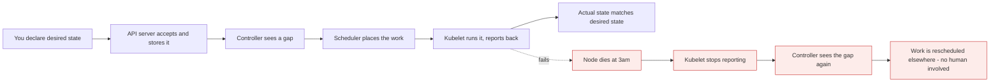

# Kubernetes Administration: Zero to Architect

*Course overview*

Containers solved packaging. They did not solve running hundreds of them across dozens of machines,
surviving node failure, rolling out a new version without downtime, and telling you why none of that is
working right now. That is the job Kubernetes took.

[Repo home](../README.md) / Kubernetes

---

## How to read this

Every lesson is built the same way:

| Block | What it gives you |
| --- | --- |
| **Mental model** | The one idea the rest of the lesson hangs off |
| **Mechanics** | What actually happens, component by component |
| **Build it** | Commands and manifests you type yourself |
| **What breaks** | The failure path, drawn next to the happy path |
| **Cost & performance** | The numbers you bring to a review |
| **Interview drill** | Questions answered the way an architect answers them |

Mermaid diagrams show the happy path in plain nodes and the failure path in red. Read both - the red one
is the half you get paid for.

> **Why it matters:** That loop is the entire product. Deployments, Services, autoscalers and operators are all the same loop with a different controller in the middle. Learn it once and the rest stops feeling like memorisation.

---

## Modules

### [What is Kubernetes](lessons/01-what-is-kubernetes.md)

`MODULE 01`

The definition, and the two words hiding inside it.

- physical machine to VM to container, and why the unit kept shrinking
- monolith to microservices, and what that did to the runtime
- why a container is "lightweight" - and where the "lightweight VM" analogy breaks
- the container host, and its single point of failure
- why more hosts alone gives you islands, not availability
- the eight jobs an orchestrator actually owns
- when Kubernetes is the wrong answer

### [Kubernetes defined, and the architecture](lessons/02-kubernetes-defined-and-architecture.md)

`MODULE 02`

The first interview question, answered three ways - and the picture it refers to.

- the formal definition, and the four jobs inside it
- control plane and worker nodes in one diagram
- the surprise: Kubernetes manages **Pods**, not containers
- why the Pod wrapper exists at all
- manual estate vs orchestrated, task by task
- the eight facilities, each with the caveat nobody mentions
- what Kubernetes is **not**, and why `CrashLoopBackOff` is not its fault

### [Architecture part 1: the control plane](lessons/03-control-plane-architecture.md)

`MODULE 03`

The diagram every Kubernetes interview is built on.

- kubectl, and why it is just an HTTP client
- the API server as the hub - nothing talks around it
- authentication, authorization, admission, validation
- etcd: the only stateful thing you own
- `kubectl apply` to `3/3 Running`, traced in twelve steps
- controllers and the reconciliation loop that *is* Kubernetes
- the scheduler: filter, score, bind - and why Pods sit in `Pending`
- what breaks when each component dies, and what keeps serving

### [Architecture part 2: the worker node](lessons/04-worker-node-architecture.md)

`MODULE 04`

Where the decision becomes a running container.

- kubelet: the control plane's agent posted on every node
- the direction that surprises people - nodes **pull** work, nothing is pushed
- CRI, containerd, runc, and why dockershim was removed
- steps 8 to 12, and how the status loop closes back at the controller
- kube-proxy, and the clusters that do not have one
- the complete twelve-step journey in one diagram
- what a dead node costs: 40 seconds, then 5 minutes - and the dead-kubelet trap

### [Choosing a lab](lessons/05-lab-setup-options.md)

`MODULE 05`

The hardest part of learning Kubernetes is not Kubernetes. It is the lab.

- K8s, kubeadm, kind, k3s, k3d, minikube - every name decoded
- two distributions, two ways to host their nodes: the whole landscape in one grid
- kubeadm and the three-VM, 16 GB trap
- why a cloud cluster is the wrong place to learn `kubectl`
- k3s is genuinely certified Kubernetes, not a lookalike
- **k3d: one machine, three containers - the lab this course uses**
- what you can never test locally, and when to pay for a cloud cluster

### [Building the lab, step by step](lessons/06-lab-build.md)

`MODULE 06`

Thirty minutes, no cloud account, a real multi-node cluster.

- Windows to VMware to Ubuntu to Docker to k3d to Kubernetes
- why installing straight onto Windows breaks the networking modules later
- the Ubuntu install, and the one checkbox you must not skip
- NAT, VMnet8, and what to do when there is no IP
- Docker, k3d and kubectl, with the `docker` group trap
- one control plane, two workers - and `docker ps` proving they are containers
- the final test: an nginx page from your cluster in your browser
- a troubleshooting table, and the snapshot habit that saves hours

### [Removing lab friction, and a 30-day plan](lessons/07-lab-friction-and-plan.md)

`MODULE 07`

Why people quit Kubernetes at the lab, not at the concepts.

- friction decides how often you practise, and practice decides everything
- bootstrap and cluster scripts: one command to a clean, known-good cluster
- OVA appliances - a lab that imports in three minutes
- the guided → practice → challenge ladder, and why skipping the middle fails
- what a complete 136-lab curriculum looks like
- write your own validation scripts - challenge mode, for free
- the CKA, and a realistic day-by-day 30-day plan

### [kubectl: the remote control](lessons/08-kubectl.md)

`MODULE 08`

The client. Not Kubernetes - and everything that follows from that.

- kubectl is a remote control; the remote is not the television
- prove it is just HTTP with `-v=8`
- kubeconfig: clusters, users, contexts - and the wrong-cluster trap
- the shape of every command, and the eight verbs that do 90% of the work
- `describe` before `logs`, always
- output formats, jsonpath, and generating YAML with `--dry-run=client`
- namespaces, RBAC, `auth can-i`, autocompletion and speed

---

## Before you start

You need the container fundamentals: images and layers, volumes, networking, and resource limits. If any
of those are shaky, work through [Docker: Zero to Architect](../docker/README.md) first - especially
modules 11 (storage and networking), 16 (resource limits) and 17 (monitoring and logging). Kubernetes
assumes all of it.

---

Kubernetes Administration: Zero to Architect · Himanshu Kumar.
