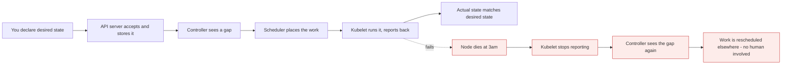

# Kubernetes Administration: Zero to Architect

*Course overview*

Containers solved packaging. They did not solve running hundreds of them across dozens of machines,
surviving node failure, rolling out a new version without downtime, and telling you why none of that is
working right now. That is the job Kubernetes took.

[Repo home](../README.md) / Kubernetes

---

## How to read this

Every lesson is built the same way:

| Block | What it gives you |
| --- | --- |
| **Mental model** | The one idea the rest of the lesson hangs off |
| **Mechanics** | What actually happens, component by component |
| **Build it** | Commands and manifests you type yourself |
| **What breaks** | The failure path, drawn next to the happy path |
| **Cost & performance** | The numbers you bring to a review |
| **Interview drill** | Questions answered the way an architect answers them |

Mermaid diagrams show the happy path in plain nodes and the failure path in red. Read both - the red one
is the half you get paid for.

> **Why it matters:** That loop is the entire product. Deployments, Services, autoscalers and operators are all the same loop with a different controller in the middle. Learn it once and the rest stops feeling like memorisation.

---

## Modules

### [What is Kubernetes](lessons/01-what-is-kubernetes.md)

`MODULE 01`

The definition, and the two words hiding inside it.

- physical machine to VM to container, and why the unit kept shrinking
- monolith to microservices, and what that did to the runtime
- why a container is "lightweight" - and where the "lightweight VM" analogy breaks
- the container host, and its single point of failure
- why more hosts alone gives you islands, not availability
- the eight jobs an orchestrator actually owns
- when Kubernetes is the wrong answer

---

## Before you start

You need the container fundamentals: images and layers, volumes, networking, and resource limits. If any
of those are shaky, work through [Docker: Zero to Architect](../docker/README.md) first - especially
modules 11 (storage and networking), 16 (resource limits) and 17 (monitoring and logging). Kubernetes
assumes all of it.

---

Kubernetes Administration: Zero to Architect · Himanshu Kumar.
