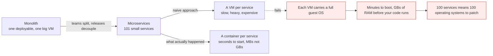
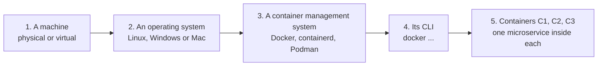
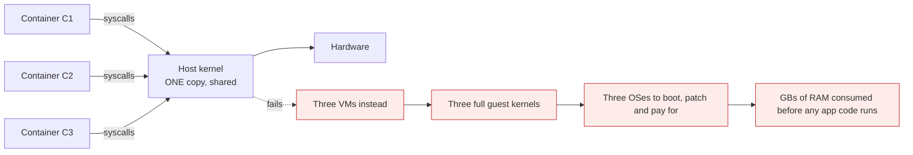
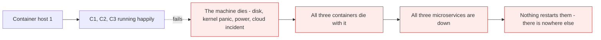
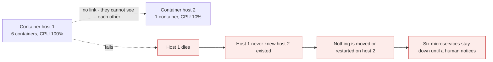

# What is Kubernetes

*Module 01 · Foundations*

The one-line answer is "a container orchestration tool", and it is useless until you can explain both
halves. This module builds the whole chain: why applications need compute, why the unit of deployment
shrank from a machine to a container, why one container host is a liability, and why the moment you have
two of them you need something above them.

[Course home](../index.md) / Module 01

## 1. The definition, and the two words hiding inside it

> **Kubernetes is a container orchestration system.**

That sentence contains two things a beginner does not yet know:

| Word | Question it raises |
| --- | --- |
| **Container** | What is it, and why not just use a virtual machine? |
| **Orchestration** | Orchestrating *what*, exactly? Containers already run fine. |

We answer them in that order. By section 8 the definition will feel obvious rather than circular.

## 2. Applications need compute - and how we supply it changed twice

Every application you use - Uber, Ola, Swiggy, Zomato, Amazon - needs somewhere to run. That "somewhere"
is compute, and the industry has changed its mind about it twice.


> **Why it matters:** Each step made the unit of deployment smaller and faster to create. That is a straight win until the count explodes - at which point managing the units by hand becomes the new bottleneck. Kubernetes exists at the end of that arrow, not the start.

Your laptop or desktop at home is a physical machine. Almost nothing serious runs that way in production
any more; applications run on virtual machines in a cloud, or - increasingly - in containers.

## 3. Why the unit got smaller: monolith to microservices

Old applications were **tightly coupled**: the entire codebase written as one flat structure, deployed as
one unit, on one big machine.

Modern applications are **loosely coupled**. When you shop on Amazon it feels like one application. It is
not. Amazon is many applications integrated together - search, catalogue, cart, pricing, payments,
recommendations, shipping - each owned by a different team, each deployed independently. That structure
is called **microservices architecture**.



> **Why it matters:** Microservices did not just change how code is organised - they changed the economics of the runtime. A unit you deploy 50 times a day cannot take two minutes to boot and 2 GB of RAM to idle. Containers are the answer to that pressure, and Kubernetes is the answer to having a thousand of them.

**Containers are, in one sentence: lightweight virtual machines, used mainly to host microservices.**
That is the working definition for now. Section 5 explains *why* they are lightweight, and section 5.1
explains where the analogy breaks.

## 4. Building a container, from zero

Five steps. Nothing else is required.



| Step | Detail |
| --- | --- |
| Machine | A physical box, or a VM - an EC2 instance, an Azure VM, anything |
| Operating system | Any OS. Linux is the normal production choice |
| Container management system | **Docker** is the familiar one; **containerd** and **CRI-O** are the ones Kubernetes actually uses |
| CLI | `docker` commands create, start, stop and remove containers |
| Containers | Each holds one microservice: `app inside the container` |

If your application has 101 microservices, three of them might run as `C1`, `C2` and `C3` on this
machine, and the rest elsewhere.

> **NOTE - Docker is one option, not the definition**
>
> This course says "container management system" rather than "Docker" on purpose. Docker popularised containers, but Kubernetes talks to a **container runtime** through a standard interface, and since v1.24 that runtime is usually containerd or CRI-O, not Docker. Everything you learn about images and containers still applies - only the daemon underneath changes.

## 5. Why containers are called "lightweight"

Every operating system - Windows, Linux, Mac - has a core called the **kernel**. The kernel is the part
that actually talks to the hardware: CPU, memory, disk, network. It is the largest and most privileged
part of the OS.



> **Why it matters:** This single diagram is the entire "lightweight" claim. A container does not carry its own kernel - it borrows the kernel of the machine where you installed Docker. No kernel to boot means startup in milliseconds, and no duplicated kernel in memory means you fit far more workloads on the same hardware.

| | Virtual machine | Container |
| --- | --- | --- |
| Carries a kernel | Yes, a full guest OS | No - shares the host kernel |
| Typical size | GBs | MBs |
| Start time | Tens of seconds to minutes | Milliseconds to seconds |
| Density per host | Tens | Hundreds |
| Isolation strength | Very strong - hardware-level | Strong, but process-level |

### 5.1 Where the "lightweight VM" analogy breaks

The analogy is the right starting point, and you should also know its limit, because interviewers probe
exactly here.

A container is **not a small machine**. It is an ordinary Linux process that the kernel has been told to
lie to - `namespaces` give it a private view of processes, network, mounts and hostnames, and `cgroups`
cap how much CPU and memory it may consume. Run `ps aux` on the host and you can see the container's
process sitting there in the host's process list.

| Consequence | Why it matters later |
| --- | --- |
| The kernel is **shared** | A kernel exploit crosses the container boundary. A VM boundary is harder |
| Linux containers need a **Linux kernel** | Docker Desktop on Windows/Mac quietly runs a Linux VM for you |
| There is no "guest OS" to log into | Debugging is different - there may be no shell at all |

> **TIP - The sentence that lands in an interview**
>
> "A container is an isolated process, not a small VM. It shares the host kernel, which is exactly why it is fast and exactly why the isolation is weaker than a hypervisor's." Saying both halves shows you understand the trade, not just the marketing.

## 6. The container host - and its fatal flaw

Once Docker is installed on that machine and containers are running on it, the machine has a name:
**container host** (you will also hear **Docker host** - treat them as the same thing).

So the full picture is: one machine, one OS, one container runtime, three containers, three
microservices. It works. And it has one serious problem.



> **Why it matters:** This is a **single point of failure**. In a real production environment a single point of failure is not allowed - the requirement is **high availability**. One host can never deliver it, no matter how good the containers on it are.

## 7. More hosts is the right instinct - islands are the wrong result

The obvious fix is correct: build more container hosts. Container host 1, container host 2, and so on.

The problem is what you get by default:



> **Why it matters:** Multiple hosts without something above them are **islands**. Host 1 manages its own containers, host 2 manages its own, and neither is aware the other exists. You bought hardware redundancy and got zero availability improvement.

Four concrete problems, all from the same root cause:

| Problem | What it looks like on a Tuesday |
| --- | --- |
| **Manual management** | To deploy a service you SSH into each host and run commands separately |
| **No high availability** | A dead host means dead services; recovery waits for a human |
| **No automation** | Scaling, restarting and updating are all somebody's checklist |
| **Terrible bin-packing** | Host 1 is at 100% CPU with six containers while host 2 sits at 10% with one. Nothing rebalances |

That last one is worth staring at. You are simultaneously **overloaded and idle**, paying for both, and
no component in the system has the job of noticing.

## 8. So: orchestration

An orchestration system sits above the hosts, treats them as one pool of resources, and takes over
everything in that table. Concretely, it owns these jobs:

| Job | What it means |
| --- | --- |
| **Scheduling** | Decide *which host* each container runs on, based on free CPU and memory |
| **Self-healing** | Notice a dead container or a dead host, and recreate the work elsewhere |
| **Scaling** | Add or remove copies on demand, manually or automatically |
| **Rolling updates** | Replace v1 with v2 gradually, and roll back if it goes wrong |
| **Service discovery** | Give services stable names so they can find each other as IPs change |
| **Load balancing** | Spread traffic across the healthy copies |
| **Config and secrets** | Inject settings and credentials without baking them into images |
| **Storage orchestration** | Attach the right disk to whichever host the container landed on |


> **Why it matters:** Notice what changed. You stopped issuing commands ("start this container here") and started declaring an outcome ("three copies should exist"). That shift from **imperative** to **declarative** is the real idea behind Kubernetes. Everything else is machinery serving it.

And the name of that orchestration system is **Kubernetes**.

## 9. Where Kubernetes came from, and why it won

| Fact | Detail |
| --- | --- |
| Origin | Built at Google, based on their internal system **Borg**, which ran containers at scale for a decade |
| Released | Open-sourced in 2014, donated to the **CNCF** in 2015 |
| Name | Greek for *helmsman* or *pilot* - the person steering the ship |
| Why "K8s" | K, then 8 letters, then s. Purely an abbreviation |
| Governance | Vendor-neutral under the CNCF, which is why every cloud offers it |

It was not the only option:

| Alternative | Why Kubernetes won anyway |
| --- | --- |
| Docker Swarm | Far simpler and genuinely good for small setups - but limited, and the ecosystem moved on |
| HashiCorp Nomad | Excellent scheduler, smaller ecosystem |
| Amazon ECS | Strong on AWS, but AWS-only |
| Apache Mesos | Powerful, complex, largely faded |

The decisive factor was not features - it was **neutrality plus extensibility**. Because Kubernetes is
CNCF-governed, AWS, Azure, Google and on-premise vendors all implemented it, so a skill learned once
transfers everywhere. And because its API is extensible, an enormous ecosystem grew on top of it.

## 10. When Kubernetes is the wrong answer

An architect is judged as much on this as on the previous section.

| Situation | Better answer |
| --- | --- |
| One application, one server, low traffic | A single container host, or plain Docker Compose |
| A small team with no platform engineer | Managed PaaS - Heroku, App Runner, Cloud Run, Container Apps |
| Three microservices with modest scale needs | Docker Compose on one host, or ECS |
| A stateful legacy app that cannot be restarted safely | Leave it on a VM |
| You need HA, autoscaling, multi-team self-service, 20+ services | **Kubernetes** |

> **WARNING - Kubernetes is a platform, not a feature**
>
> It brings a control plane to run, upgrades every few months, networking and storage plugins, RBAC, and a real learning curve for every developer who touches it. If the answer to "who operates this?" is "nobody yet", the honest recommendation is usually a managed service first. Choosing Kubernetes for three services is how teams end up spending more on the platform than on the product.

## 11. Extra points

- **Kubernetes does not build images.** It runs them. Building is still Docker/BuildKit's job, in CI.
- **Kubernetes does not replace Docker knowledge.** Images, layers, volumes, networking and resource
  limits are all assumed - see [Docker: Zero to Architect](../../docker/README.md).
- **Managed control planes are the norm**: EKS, AKS, GKE run the hard part for you. Learning the raw
  components still matters, because that is what you debug.
- **The unit you deploy is not a container** - it is a Pod. That is module 03's job, and it surprises
  everyone.
- **70% of this course is practical.** Read the diagrams, then type the commands. Neither alone works.

> **PRACTICE - Practice now**
>
> The goal today is to *feel* the two problems that create Kubernetes: no self-healing, and islands.
>
> 1. Install Docker on a machine or cloud VM. Confirm with `docker version`.
> 2. Create three containers, one per "microservice":
>    ```bash
>    docker run -d --name c1 nginx:1.25-alpine
>    docker run -d --name c2 httpd:2.4-alpine
>    docker run -d --name c3 redis:7-alpine
>    docker ps
>    ```
> 3. **Prove there is no desired state.** Delete one and watch nothing happen:
>    ```bash
>    docker rm -f c2
>    docker ps          # c2 is simply gone. Nobody noticed. Nobody replaced it.
>    ```
>    Sit with that for a second - it is the exact gap Kubernetes fills.
> 4. **Prove the single point of failure.** Stop the runtime and watch everything go together:
>    ```bash
>    sudo systemctl stop docker
>    docker ps -a       # all containers down, no alternative host exists
>    sudo systemctl start docker
>    ```
> 5. **Prove the islands.** Bring up a second host and confirm they cannot see each other:
>    ```bash
>    docker context create host2 --docker "host=ssh://user@host2-ip"
>    docker context use host2
>    docker ps          # host 1's containers are invisible here
>    docker context use default
>    ```
> 6. **Prove the bin-packing problem.** Run six containers on host 1 and one on host 2, then compare:
>    ```bash
>    docker stats --no-stream
>    ```
>    One host is busy, the other is idle, and nothing in the system will ever move a container between
>    them. Write down that observation - it is the scheduler's job description.

> **ASSIGNMENT - Assignment**
>
> Write one page for a manager who asks "why do we need Kubernetes?" Do not use the word Kubernetes until the last paragraph. Describe the current setup, what happens when a host dies, how long recovery takes today and who does it, and what the CPU utilisation looks like across your hosts. Then state what capability is missing. If the page still argues for Kubernetes after you have costed a control plane and the training, you have a real case. If it does not, you have just saved your company a year - and that is the more valuable document.

## 12. Interview drill

<details>
<summary><b>What is Kubernetes, in one sentence?</b></summary>

An open-source container orchestration system: it takes a pool of machines and runs containerised
workloads across them, scheduling them onto hosts, keeping them alive, scaling them, updating them and
giving them stable networking - all driven by declared desired state rather than manual commands.

</details>

<details>
<summary><b>What is a container, and why is it called lightweight?</b></summary>

A container is an isolated process on a host, given a private view of the system by kernel namespaces and
resource caps by cgroups. It is lightweight because it does **not** carry its own kernel - it shares the
host's. No kernel to boot means startup in milliseconds instead of minutes, and no duplicated kernel in
memory means far higher density per machine. The "lightweight VM" analogy is a useful starting point, but
technically a container is a process, not a machine.

</details>

<details>
<summary><b>Why not just use virtual machines for microservices?</b></summary>

Because the unit is the wrong size. A microservice deployed several times a day cannot afford a full
guest OS to boot, GBs of RAM to idle, and its own patch cycle. A hundred services would mean a hundred
operating systems to maintain. Containers give the same isolation-per-service at a fraction of the
startup time, size and operational overhead.

</details>

<details>
<summary><b>What exactly is wrong with running containers on a single Docker host?</b></summary>

Two things. First, it is a single point of failure - if the machine dies, every container on it dies with
it and nothing exists to restart them elsewhere. Second, Docker has no concept of desired state: delete a
container and it simply stays deleted. Production requires high availability, and a single host cannot
provide it however well configured.

</details>

<details>
<summary><b>If I just add more Docker hosts, is the problem solved?</b></summary>

No - you get islands. Each host manages only its own containers and has no knowledge that the others
exist. You must deploy to each one manually, nothing is rescheduled when a host dies, there is no
automation, and workloads distribute terribly: one host can sit at 100% CPU while another idles at 10%
with nothing to rebalance them. Redundant hardware without a control plane above it buys you very little.

</details>

<details>
<summary><b>What does an orchestrator actually do that a container runtime does not?</b></summary>

Scheduling across many hosts, self-healing when containers or hosts die, scaling up and down, rolling
updates with rollback, service discovery and load balancing, config and secret injection, and attaching
storage to wherever the workload landed. Underneath all of it is one shift: you declare the outcome you
want and a control loop makes reality match, instead of you issuing commands and hoping.

</details>

<details>
<summary><b>When would you advise a client NOT to use Kubernetes?</b></summary>

When the operational cost exceeds the benefit: a handful of services, modest scale, no platform team, or
a workload that a managed PaaS handles well. Kubernetes brings a control plane to operate, a frequent
upgrade cycle, networking and storage plugins, RBAC, and a learning curve for everyone. For three
services, Compose on a host or a managed container service is usually the honest recommendation.

</details>

---

[Course home](../index.md) &nbsp;&nbsp;|&nbsp;&nbsp; [Module 02: Kubernetes defined, and the architecture →](02-kubernetes-defined-and-architecture.md)

---

Kubernetes Administration: Zero to Architect · Himanshu Kumar.
