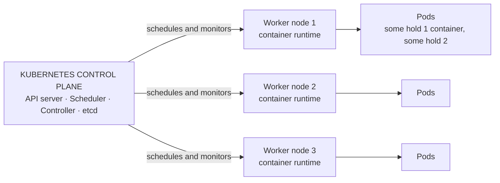
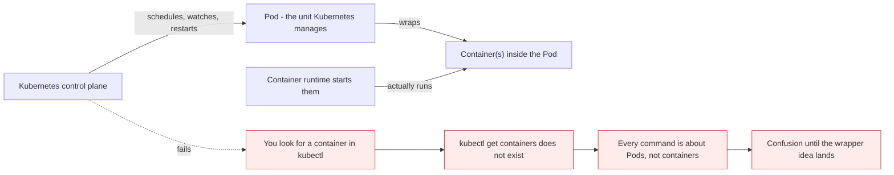
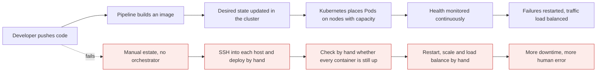

# Kubernetes defined, and the architecture in one picture

*Module 02 · Foundations*

"What is Kubernetes?" is the first question in almost every Kubernetes interview, and first impressions
are decided in the ninety seconds you spend answering it. This module gives you the full definition, the
architecture picture it refers to, the one surprise inside it - Kubernetes does not manage containers -
and an honest account of what it does *not* do.

[Course home](../index.md) / Module 02

## 1. The definition, in three sizes

Module 01 gave the small one: *Kubernetes is a container orchestration tool.* That is the opener, not the
answer. Have three versions ready and pick by the room.

**One line - when someone non-technical asks**

> Kubernetes is a manager for your containers. It makes sure your application is always running,
> connected, and ready to serve users.

**The formal definition - the one to say in an interview**

> Kubernetes is an **open-source platform that automates the deployment, scaling, networking and
> management of containerized applications.**

**Expanded - the four jobs that definition is made of**

| Job | What it means in practice |
| --- | --- |
| **Run containerized applications consistently** | The same workload behaves the same on any node, in any environment |
| **Scale up or down automatically based on demand** | Replicas added when traffic rises, removed when it falls |
| **Self-heal and recover from failures** | A dead container or a dead node is detected and the work is recreated |
| **Provide networking and load balancing** | Stable names for services, and traffic spread across healthy copies |

> **TIP - How to actually answer the interview question**
>
> Give the formal definition, then immediately ground it: *"Concretely, it takes a pool of machines, decides which machine each workload runs on, restarts it when it dies, scales it with demand, and gives it a stable network identity - all from declared desired state rather than manual commands."* One sentence of definition plus one of substance beats two minutes of buzzwords.

"Application" here almost always means **microservices** - the small, independently deployable services
from module 01, each running inside a container.

> **NOTE - Do not memorise the feature list**
>
> Everything in this module becomes obvious once you have typed the commands. Read it now for the shape, and let the practicals make it stick. Nobody remembers "self-healing" as a bullet point; everybody remembers the first time they deleted a Pod and watched a new one appear on its own.

## 2. The architecture, in one picture



> **Why it matters:** This is the whole system. One control plane, many worker nodes, Pods on the nodes, containers inside the Pods. Every later module adds detail to this picture but never changes its shape.

Reading it piece by piece:

| Element | What it is | Module 01 name |
| --- | --- | --- |
| **Worker node** | A machine that actually runs your workloads | Container host / Docker host |
| **Container runtime** | The software that creates and runs containers on that node | Docker, containerd |
| **Container** | Your microservice, running | Same |
| **Pod** | A wrapper around one or more containers - **new** | *did not exist yet* |
| **Control plane** | The brain that manages all the worker nodes | *the missing piece* |

You install the control plane on one system, and as many worker nodes as your requirement demands. Pods
are created **inside worker nodes** - that is where the work happens.

> **NOTE - The runtime is containerd now, not Docker**
>
> Kubernetes talks to a runtime through the Container Runtime Interface. Since v1.24 it no longer speaks to Docker directly; the standard runtimes are **containerd** and **CRI-O**. This changed nothing about your images - they are OCI images either way - it only removed a translation layer that existed for historical reasons.

The control plane contains four components - **API server, Scheduler, Controller, etcd**. What each one
does is module 03's entire job. For now, know only that they exist and that together they are the heart
of the system.

## 3. The surprise: Kubernetes does not manage containers

This is the single most important sentence in the module.



> **Why it matters:** Kubernetes schedules **Pods**. The runtime starts the containers inside them. Because Kubernetes manages the Pod, it manages the containers *indirectly*. This is why there is no `kubectl get containers` and why every error message, every scaling decision and every scheduling event is expressed in Pods.

**Each Pod is the wrapper.** Some Pods run one container; some run two or three. In the diagram above,
node 1 might hold a Pod with one container and a Pod with two, and that is completely normal.

### 3.1 Why a wrapper exists at all

The full answer comes later, but the short version prevents a lot of confusion now:

| Reason | Consequence |
| --- | --- |
| Containers in a Pod share one **network namespace** | They reach each other on `localhost` and share one IP |
| They share **storage volumes** | A helper container can read files the main container writes |
| They are always **scheduled together** | Both land on the same node, always - never split |
| They live and die **as a unit** | Kubernetes starts, stops and moves the whole Pod |

That is exactly what a **sidecar** needs - a log shipper, a proxy, a metrics agent living beside your
application. A single container could not express "these two things must be co-located and share a
network". A Pod can.

> **TIP - The default is one container per Pod**
>
> Most Pods hold exactly one container. Multi-container Pods are for helpers that genuinely cannot be separated. If you find yourself putting two of your own microservices in one Pod, that is almost always wrong - they should be two Pods so they can scale and fail independently.

## 4. Without Kubernetes vs with Kubernetes

Module 01 showed the islands problem. Here is what living with it actually costs, and what changes.



> **Why it matters:** Look at the red path honestly - every step is a task that only happens when a human remembers to do it, at the speed a human can do it. That is not a tooling gap, it is an availability gap. The blue path is the same work performed by a control loop that never sleeps and never forgets.

| Task | Manual estate | With Kubernetes |
| --- | --- | --- |
| Deploy containers | SSH to each host, run commands | Declare it once; Pods are placed automatically |
| Check everything is running | Someone looks | Continuous health monitoring |
| Restart a failed container | Someone notices, then restarts | Automatic restart |
| Scale for traffic | Someone decides and executes | Manual command or automatic on metrics |
| Load balance across copies | Configure a balancer by hand | Built in, via Services |
| Survive a host failure | Nothing happens until a human acts | Work is rescheduled onto healthy nodes |
| Risk profile | More downtime, more error | Self-healing and high availability |

What Kubernetes does **continuously**, without being asked:

- **Schedules Pods** onto nodes that have capacity
- **Places containers** by instructing the runtime on the chosen node
- **Monitors health** of nodes, Pods and containers
- **Self-heals** by recreating what has died

## 5. The eight facilities Kubernetes provides

The advantages list, with the caveat that makes each one true in practice. The caveats are what separate
someone who read the marketing page from someone who has run a cluster.

| Facility | What you get | The caveat nobody mentions |
| --- | --- | --- |
| **Scalability** | Scale up or down automatically on demand | Autoscaling needs `metrics-server` **and** resource requests set on your Pods. Without requests, the autoscaler has no baseline and does nothing |
| **High availability** | Self-healing and auto-recovery, aiming at zero downtime | One replica is never highly available. You need multiple replicas, spread across multiple nodes, with anti-affinity - otherwise all copies sit on the node that just died |
| **Load balancing** | Traffic distributed evenly across healthy Pods | "Healthy" means whatever your readiness probe says. No probe means traffic is sent to Pods that are still starting up |
| **Automation** | Deployment, updates, scaling and operations automated | Kubernetes does not build or test anything. That is your CI pipeline's job; Kubernetes only runs the result |
| **Networking** | Built-in networking, service discovery and DNS | The network is provided by a CNI plugin you choose - Calico, Cilium, Flannel. Kubernetes defines the model, not the implementation |
| **Security** | Secret management, RBAC, network policies | Secrets are base64-encoded, **not encrypted**, unless you enable encryption at rest. Network policies do nothing unless your CNI enforces them |
| **Efficient resource use** | Optimal utilisation of infrastructure | The scheduler packs by **requests**, not actual usage. Wrong requests mean a cluster that looks full at 30% real utilisation |
| **Portability** | Run workloads consistently across clouds and environments | Core objects are portable. `LoadBalancer` Services, storage classes and ingress controllers are cloud-specific - that is where "runs anywhere" leaks |

**Scalability, concretely:** your application is serving 1,000 visitors an hour. Traffic rises. You scale
the number of Pods, and the load balancer starts using the new ones. Traffic falls, the extra Pods go
away, and you stop paying for them.

**High availability, concretely:** a worker node goes down. Your application does not, because copies of
the Pod exist on other nodes and the control plane recreates the missing ones.

**Automation, concretely:** a developer pushes code, the pipeline builds an image, the cluster's desired
state is updated, and the new version rolls out onto the Pods - no one logs into a server.

**Portability, concretely:** the same manifests run on-premises and in any cloud. This is why Kubernetes
skills transfer between employers in a way that cloud-specific orchestrators do not.

## 6. What Kubernetes is NOT

Interviewers love this question because it separates users from architects.

| Kubernetes does not... | You still need |
| --- | --- |
| Build container images | Docker/BuildKit in CI |
| Run your CI/CD pipeline | GitHub Actions, GitLab CI, Jenkins, Argo CD |
| Provide application-level monitoring or logging | Prometheus, Grafana, Loki, or an EFK stack |
| Dictate your application architecture | It runs whatever you give it, monolith or microservice |
| Provide a database, message queue or middleware | You deploy them, or use managed services |
| Make a badly written application scale | Scaling copies a bottleneck; it does not remove it |
| Guarantee zero downtime by itself | Probes, PodDisruptionBudgets, multiple replicas and a sane rollout strategy do that |

> **WARNING - "Self-healing" does not mean "fixes your bug"**
>
> Kubernetes restarts a container that has crashed. If it crashes because of a bad config value, a missing secret or a failed migration, Kubernetes restarts it again, and again, with an increasing delay - `CrashLoopBackOff`. That status is not Kubernetes failing. It is Kubernetes reliably doing the only thing it can, while the actual fault is in your application or config.

## 7. Extra points

- **Everything is declarative.** You describe the end state in YAML; a controller works continuously to
  make reality match. There is no "deploy" verb underneath - only reconciliation.
- **Everything is an object in the API.** Pods, Services, Deployments, Secrets - all are records stored in
  etcd and served by the API server. Learning Kubernetes is largely learning its object model.
- **The control plane is itself made of Pods** on most clusters. You can literally
  `kubectl get pods -n kube-system` and see the API server and scheduler running as containers.
- **Managed control planes are normal.** EKS, AKS and GKE run and upgrade the control plane for you. You
  still need to understand it, because you still debug what runs on it.
- **A Pod is ephemeral by design.** It gets a new IP each time it is recreated. Every stable-address
  mechanism in Kubernetes exists because of this one fact.

> **PRACTICE - Practice now**
>
> Module 01 proved four problems. Today, prove that Kubernetes solves them. Any local cluster works - `kind`, `minikube`, or Docker Desktop's built-in Kubernetes.
>
> 1. Start a cluster and confirm it is alive:
>    ```bash
>    kubectl get nodes -o wide
>    kubectl cluster-info
>    ```
> 2. **See the architecture from module 02 as real objects.** The control plane components are Pods:
>    ```bash
>    kubectl get pods -n kube-system
>    ```
>    Find `kube-apiserver`, `kube-scheduler`, `kube-controller-manager` and `etcd` in that list. The
>    picture in section 2 is not a metaphor.
> 3. Deploy something with three copies:
>    ```bash
>    kubectl create deployment web --image=nginx:1.25-alpine --replicas=3
>    kubectl get pods -o wide
>    ```
>    Note the `NODE` column - the scheduler chose those placements, not you.
> 4. **The moment that matters.** In module 01, `docker rm -f c2` deleted a container and nothing
>    happened. Do the equivalent here:
>    ```bash
>    kubectl delete pod <one-of-the-pod-names>
>    kubectl get pods
>    ```
>    A replacement Pod is already being created. Nobody told it to. That is desired state, and it is the
>    entire difference between a runtime and an orchestrator.
> 5. **Prove Kubernetes manages Pods, not containers:**
>    ```bash
>    kubectl get containers        # error - no such resource
>    kubectl get pods
>    kubectl describe pod <name>   # containers appear INSIDE the Pod description
>    ```
> 6. **Prove self-healing has limits.** Deploy something guaranteed to fail and watch the honest result:
>    ```bash
>    kubectl run broken --image=nginx:1.25-alpine --command -- /bin/sh -c "exit 1"
>    kubectl get pod broken -w
>    ```
>    Watch it move through `Error` into `CrashLoopBackOff`. Kubernetes is restarting it faithfully and
>    will never fix it, because the fault is not Kubernetes'.
> 7. Clean up:
>    ```bash
>    kubectl delete deployment web
>    kubectl delete pod broken
>    ```

> **ASSIGNMENT - Assignment**
>
> Write your interview answer to "What is Kubernetes?" in three versions: one sentence, thirty seconds, and two minutes. The two-minute version must include at least one thing Kubernetes does *not* do, and one caveat from the table in section 5. Then say it out loud, timed. If the thirty-second version takes you ninety seconds, it is not ready - and that is the version you will actually need.

## 8. Interview drill

<details>
<summary><b>What is Kubernetes?</b></summary>

An open-source platform that automates the deployment, scaling, networking and management of
containerized applications. Concretely: it takes a pool of machines, decides which machine each workload
runs on, restarts workloads when they fail, scales them with demand, and gives them stable network
identities - all driven by declared desired state rather than manual commands. It came out of Google's
Borg system and is now governed by the CNCF, which is why every cloud offers it.

</details>

<details>
<summary><b>Does Kubernetes manage containers?</b></summary>

Not directly. Kubernetes manages **Pods**; a Pod is a wrapper around one or more containers, and the
container runtime on the node actually starts them. Because the Pod is the scheduled unit, containers are
managed indirectly. This is why there is no `kubectl get containers`, and why scheduling, scaling and
failure events are all expressed in terms of Pods.

</details>

<details>
<summary><b>Why does the Pod abstraction exist? Why not schedule containers directly?</b></summary>

Because some containers must be co-located and share context. Containers in a Pod share a network
namespace - same IP, reachable on `localhost` - share volumes, are always scheduled to the same node, and
live and die as a unit. That is exactly what a sidecar needs: a log shipper, proxy or metrics agent beside
the main application. A bare container cannot express "these must run together on one node with one
network identity". A Pod can.

</details>

<details>
<summary><b>What are the components of the control plane?</b></summary>

The API server, the scheduler, the controller manager and etcd. The API server is the single entry point
and the only component that talks to etcd; etcd stores all cluster state; the scheduler decides which node
each Pod runs on; the controller manager runs the loops that drive actual state toward desired state. On
most clusters these run as Pods, visible with `kubectl get pods -n kube-system`.

</details>

<details>
<summary><b>What does Kubernetes NOT do?</b></summary>

It does not build images, run your CI/CD pipeline, provide application-level logging or monitoring,
supply databases or middleware, dictate your application architecture, or make a badly written
application scale. It also does not guarantee zero downtime on its own - that comes from probes, multiple
replicas, disruption budgets and a sensible rollout strategy that you configure.

</details>

<details>
<summary><b>Kubernetes has self-healing, so why do Pods stay broken?</b></summary>

Self-healing means Kubernetes restarts what has died and reschedules what was lost. It cannot repair the
cause. If a container exits because of a bad config, a missing secret or a failed dependency, Kubernetes
restarts it with exponential backoff and the Pod settles into `CrashLoopBackOff`. That status means
Kubernetes is working correctly and the fault is in the application or its configuration.

</details>

<details>
<summary><b>Kubernetes gives high availability - is a running Pod highly available?</b></summary>

No. A single Pod on a single node is a single point of failure with extra steps. High availability
requires multiple replicas, spread across multiple nodes, with anti-affinity or topology spread
constraints so they do not all land on the same machine, plus readiness probes so traffic only reaches
healthy copies. Kubernetes provides the mechanisms; the availability comes from configuring them.

</details>

<details>
<summary><b>Kubernetes is portable - so can I move any workload between clouds unchanged?</b></summary>

The core objects move cleanly: Pods, Deployments, Services, ConfigMaps. What does not move is the
cloud-specific edge - `LoadBalancer` Service behaviour and annotations, storage classes and volume
provisioners, ingress controllers, IAM integration and node autoscaling. Portability is real and it stops
at the boundary where your cluster touches its cloud.

</details>

---

[← Module 01](01-what-is-kubernetes.md) &nbsp;&nbsp;|&nbsp;&nbsp; [Module 03: The control plane →](03-control-plane-architecture.md)

---

Kubernetes Administration: Zero to Architect · Himanshu Kumar.
