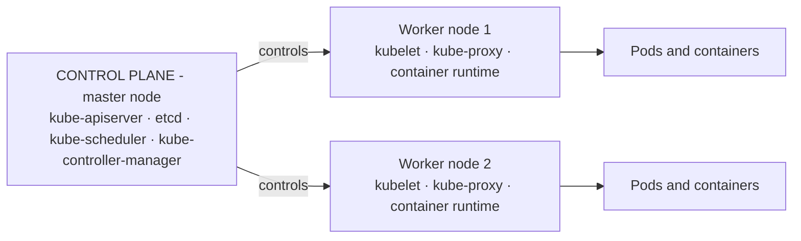
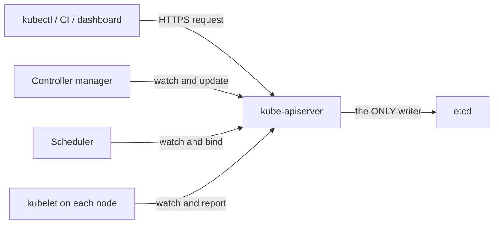
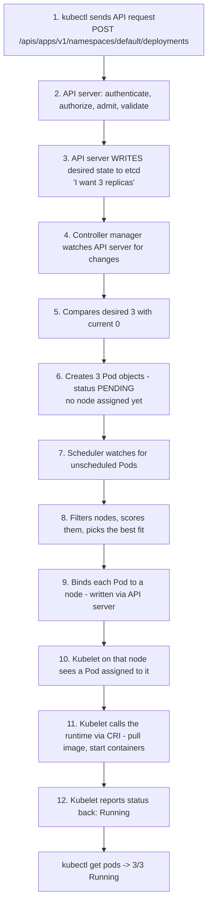
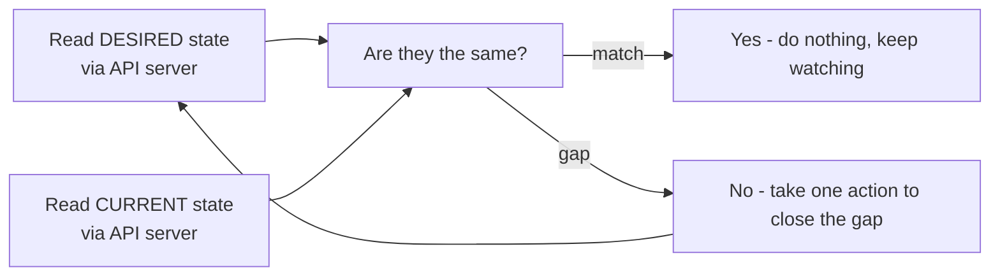
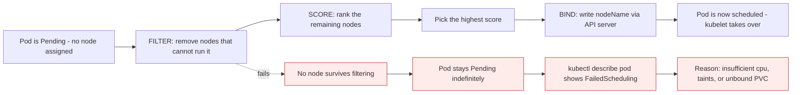

# Kubernetes architecture, part 1: the control plane

*Module 03 · Architecture*

If you learn one thing properly in this course, make it this. Kubernetes interviews start here, and every
strange behaviour you will ever debug is explained by this picture. Understand the architecture once and
Kubernetes stops feeling hard - it becomes a small number of components doing predictable things.

[Course home](../index.md) / Module 03

## 1. The two halves



> **Why it matters:** Two component types, one job each. The **control plane** decides what should happen. The **worker nodes** make it happen. Everything else in Kubernetes is a detail hanging off that split.

| | Control plane (master node) | Worker node |
| --- | --- | --- |
| Also called | Master node | Container host, Docker host |
| Job | Decide, store, watch, schedule | Actually run containers |
| Runs your application? | No | Yes |
| Components | API server, etcd, scheduler, controller manager | kubelet, kube-proxy, container runtime |

**Building a cluster from zero:** take a virtual machine (a physical machine works too), and install the
control plane on it. That installation is what puts `kube-apiserver`, `etcd`, `kube-scheduler` and
`kube-controller-manager` on the box. Then add as many worker nodes as you need.

This module covers the control plane components. Module 04 covers the worker node components. Keep this
picture - later modules add services, more controllers and the cloud controller manager to it, but the
skeleton never changes.

## 2. kubectl: how you talk to any of it

`kubectl` is the tool you use to manage a Kubernetes environment.

| You have | You manage it with |
| --- | --- |
| A Windows computer | Command Prompt or PowerShell |
| A Kubernetes cluster | **kubectl** |

There is also a REST API, and automation tools that use it, but in general every Kubernetes command you
type goes through kubectl. You can install it **on the control plane** or **remotely** - most people run
it from their own laptop.

```bash
kubectl apply -f deployment.yaml     # what this module traces, end to end
kubectl get pods
kubectl describe pod web-abc123
```

> **NOTE - kubectl is just an HTTP client**
>
> Everything kubectl does is an authenticated HTTPS call to the API server, using the credentials in your `~/.kube/config`. `kubectl get pods` is literally `GET /api/v1/namespaces/default/pods`. Nothing is magic, and `kubectl get pods -v=8` will show you the raw requests.

## 3. The API server is the hub - nothing talks around it



> **Why it matters:** The controller manager, the scheduler and etcd **never talk to each other directly**. Every interaction goes through the API server. That single rule is why Kubernetes can authenticate every action, validate every object, audit every change, and let you add new components without modifying the old ones.

What the API server does with a request, in order:

| Stage | What it checks |
| --- | --- |
| **Authentication** | Who are you? Certificate, token or cloud identity |
| **Authorization** | Are you allowed to do this? RBAC decides |
| **Admission** | Should this be modified or rejected? Defaults injected, policies enforced |
| **Validation** | Is the object well-formed and legal? |
| **Persist** | Write the accepted object to etcd |

The script version of this is: *"is this the right person, do they have permission, and is the command
correct?"* - authentication, authorization, validation. Admission is the fourth stage and it is where
most enterprise policy lives.

> **TIP - Admission control is where real clusters get opinionated**
>
> Mutating admission webhooks *change* your object on the way in - injecting a sidecar, adding default limits, setting labels. Validating webhooks *reject* it - "no `latest` tags", "every Pod must set resource requests". Tools like OPA Gatekeeper and Kyverno live here. When something you applied does not look like what you wrote, an admission webhook is usually why.

## 4. etcd: the cluster's memory

etcd is a **key-value database**. It stores every object in the cluster - Pods, Deployments, Secrets,
ConfigMaps, node records - as key-value data.

| Property | Detail |
| --- | --- |
| Type | Distributed key-value store |
| Holds | All cluster state: desired state **and** observed state |
| Who may write to it | **Only the API server.** Nothing else, ever |
| Consistency | Raft consensus - needs a quorum to accept writes |
| Member count | Always odd: 3 or 5. Same reasoning as Docker Swarm managers |

> **WARNING - etcd is the only stateful thing in your cluster**
>
> Lose every worker node and you lose running workloads, which reschedule. Lose etcd without a backup and you have lost the cluster itself - every object definition, gone. `etcdctl snapshot save` is the single most important backup in a self-managed cluster, and restoring it is the one disaster-recovery drill worth rehearsing. On EKS/AKS/GKE the provider does this for you, which is a large part of what you are paying for.

## 5. The full flow: `kubectl apply` to running Pods

This is the diagram to know cold. Example: `kubectl apply -f deployment.yaml` requesting **3 replicas**.



> **Why it matters:** Notice that no component ever *commands* another. The controller manager does not call the scheduler. The scheduler does not call the kubelet. Each one **watches the API server** for work that concerns it and acts independently. That is why a component can crash, restart, and simply pick up where the cluster currently is - there is no message to lose.

Walking the same flow in words:

1. You run `kubectl apply -f deployment.yaml` asking for 3 replicas.
2. The request reaches the **API server** first - always. It authenticates you, checks your permissions,
   applies admission policy, and validates the object.
3. The API server **writes to etcd**: desired state is 3 replicas. Nothing else may write there.
4. The **controller manager** is watching the API server for changes.
5. It sees: desired = 3, current = 0. Status `0/3`.
6. It creates 3 Pod objects. **They are not running.** Their status is `Pending`, because no node has been
   chosen yet.
7. The **scheduler** is watching for Pods with no node assigned.
8. It **filters** nodes that cannot take the Pod, then **scores** the survivors, and picks the best fit -
   looking at CPU, memory and current node state.
9. It **binds** each Pod to a node by writing that decision back through the API server. For example Pod 1
   to worker node 1; Pods 2 and 3 to worker node 2.
10. The **kubelet** on each chosen node sees a Pod assigned to it.
11. The kubelet tells the **container runtime** over CRI to pull the image if needed and start the
    containers.
12. The kubelet **reports status** back to the API server. `kubectl get pods` now shows `3/3 Running`.

> **NOTE - Steps 10 to 12 are module 04**
>
> Everything from the kubelet onward - how the Pod actually reaches the worker node and becomes running containers - is the worker node half of the architecture. This module ends at the binding decision.

## 6. The controller manager and the reconciliation loop

The controller manager is not one controller. It is a **manager of many controllers**, each responsible
for one kind of object.

| Controller | Watches for | Acts by |
| --- | --- | --- |
| Deployment controller | Deployment objects | Creating and updating ReplicaSets |
| ReplicaSet controller | ReplicaSet objects | Creating or deleting Pods to hit the replica count |
| Node controller | Node heartbeats | Marking a node `NotReady`, then evicting its Pods |
| Job controller | Job objects | Running Pods to completion |
| Endpoint controller | Services and Pods | Keeping the endpoint list current |

You do not need to memorise them. You need the pattern they all share:



> **Why it matters:** This loop *is* Kubernetes. Desired = 3, current = 0, so create 3. Desired = 3, current = 2 because a node died, so create 1. Desired = 3, current = 4 because someone made an extra, so delete 1. Every self-healing story in this course is that comparison running forever.

Two vocabulary items an interviewer will listen for:

| Term | Meaning |
| --- | --- |
| **Desired state** | What you asked for - stored in etcd by the API server |
| **Current state** | What actually exists right now |

And a design property worth naming:

> **TIP - Level-triggered, not edge-triggered**
>
> Controllers do not react to events like "a Pod was deleted". They repeatedly compare the whole current state to the whole desired state. Miss an event, restart mid-operation, disconnect for a minute - it does not matter, because the next comparison sees reality as it is. This is why Kubernetes recovers from its own failures so well, and it is a genuinely strong answer to "why is Kubernetes reliable?"

Note carefully: the controller manager **cannot read etcd directly**. It watches through the API server,
exactly like everything else.

## 7. The scheduler: filter, score, bind

At the end of step 6 there are three Pods in `Pending`. They exist as objects, but no node has been
chosen. That is the scheduler's entire job.



> **Why it matters:** A `Pending` Pod is the most common Kubernetes support ticket, and it almost always means the scheduler filtered out every node. `kubectl describe pod` tells you exactly which filter rejected them. Read the events before you touch anything.

| Phase | What happens |
| --- | --- |
| **Filter** | Eliminate nodes that *cannot* run the Pod: not enough free CPU or memory, wrong labels for a node selector, an untolerated taint, no available port, an unbound volume |
| **Score** | Rank the survivors: most free resources, spreading across zones, image already present locally, affinity preferences |
| **Bind** | Write `nodeName` on the Pod object, through the API server |

Common inputs to the decision:

| Input | Effect |
| --- | --- |
| **Resource requests** | The primary filter. This is what "free capacity" means |
| **Node selectors / node affinity** | "Only on GPU nodes", "prefer this zone" |
| **Taints and tolerations** | A node repels Pods unless they explicitly tolerate it |
| **Pod affinity / anti-affinity** | "Keep replicas apart", "keep me near the cache" |
| **Topology spread constraints** | Even distribution across zones or nodes |

> **WARNING - The scheduler uses requests, not actual usage**
>
> A node running at 5% real CPU will be treated as full if the Pods on it have *requested* all its CPU. Conversely a node with no requests set looks empty forever, so the scheduler keeps packing Pods onto it until it falls over. Wrong `requests` values are the single biggest cause of clusters that are simultaneously "full" and idle.

Also note: the scheduler **never contacts the node**. Binding is just another write to the API server.
The node finds out because its kubelet is watching.

## 8. What breaks when each component dies

This table is worth more in an interview than any definition, because it proves you understand the
separation of concerns.

| Component down | Running Pods | New deployments | Self-healing | Symptom you see |
| --- | --- | --- | --- | --- |
| **API server** | Keep running and serving traffic | Impossible | Stops | `kubectl` fails: connection refused |
| **etcd** | Keep running | Impossible - nothing can be written | Stops | API server errors, cluster effectively frozen |
| **Scheduler** | Keep running | Objects created, Pods stay `Pending` forever | Partial - replacements are created but never placed | New Pods stuck in `Pending`, no `FailedScheduling` event at all |
| **Controller manager** | Keep running | Deployment created but **no Pods appear** | Stops - a dead Pod is never replaced | `kubectl get deploy` shows `0/3`, nothing happens |
| **kubelet on one node** | That node's Pods keep running for a while, then go `NotReady` | Fine elsewhere | Works - Pods are rescheduled after the eviction timeout | Node shows `NotReady` |

> **Why it matters:** Notice the first column. Your application keeps serving users even when the entire control plane is down, because the control plane is not in the data path. It decides; it does not serve. That single fact reframes control plane outages from "site down" to "cannot change anything" - a very different incident.

## 9. Extra points

- **The control plane is usually HA**: three control plane nodes, three or five etcd members, one active
  scheduler and controller manager elected by lease. The API server is stateless and load balanced.
- **Only one scheduler and one controller manager are active** at a time - the others stand by via leader
  election. Two active schedulers would double-book nodes.
- **The API server is stateless.** All state is in etcd, which is why you can run several API servers
  behind a load balancer.
- **You can run your own scheduler.** Kubernetes supports multiple schedulers; a Pod picks one with
  `schedulerName`. Rarely needed, good to know it exists.
- **`kubectl apply` is declarative, `kubectl create` is imperative.** Apply says "make it look like this";
  create says "make this now, and fail if it exists". Production uses apply.
- **The cloud controller manager** is a fifth component on managed clusters - it talks to the cloud API for
  load balancers, volumes and node lifecycle. It appears in later modules.

> **PRACTICE - Practice now**
>
> Trace the exact flow from section 5 on a real cluster, one step at a time.
>
> 1. See the control plane components running as Pods:
>    ```bash
>    kubectl get pods -n kube-system -o wide
>    ```
>    `kube-apiserver`, `etcd`, `kube-scheduler`, `kube-controller-manager` - the picture, made real.
> 2. Watch the flow happen live. In one terminal:
>    ```bash
>    kubectl get pods -w
>    ```
>    In another:
>    ```bash
>    kubectl create deployment web --image=nginx:1.25-alpine --replicas=3
>    ```
>    Watch the status column move `Pending` to `ContainerCreating` to `Running`. Those are steps 6, 11 and
>    12 of the diagram.
> 3. Read the decisions Kubernetes made, in order:
>    ```bash
>    kubectl get events --sort-by=.metadata.creationTimestamp
>    ```
>    You will see `Scheduled`, then `Pulling`, `Pulled`, `Created`, `Started` - each attributed to the
>    component that did it.
> 4. See the scheduler's binding on a single Pod:
>    ```bash
>    kubectl describe pod <pod-name> | Select-String -Pattern "Node:|Scheduled"
>    ```
> 5. **Prove the scheduler is a separate decision.** Force a Pod that no node can satisfy:
>    ```bash
>    kubectl run huge --image=nginx:1.25-alpine --overrides='{"spec":{"containers":[{"name":"huge","image":"nginx:1.25-alpine","resources":{"requests":{"cpu":"500"}}}]}}'
>    kubectl get pod huge
>    kubectl describe pod huge
>    ```
>    It sits in `Pending` with a `FailedScheduling` event naming the exact reason. The Pod object exists -
>    the controller did its job. It simply has nowhere to go.
> 6. **Prove desired state lives in etcd, not in your terminal.** Delete a Pod and watch a replacement
>    appear:
>    ```bash
>    kubectl delete pod <one-web-pod>
>    kubectl get pods
>    ```
>    Nobody re-ran your command. The controller compared 2 with 3.
> 7. See the raw API call kubectl is making:
>    ```bash
>    kubectl get pods -v=8
>    ```
> 8. Clean up:
>    ```bash
>    kubectl delete deployment web
>    kubectl delete pod huge
>    ```

> **ASSIGNMENT - Assignment**
>
> Draw the section 5 diagram from memory, on paper, without looking. Label every arrow with which component initiates it. Then write one sentence per component answering "what breaks if this dies, and what keeps working?" Check it against section 8. Redo it the next day. This diagram is the backbone of every Kubernetes interview you will ever take, and it is worth being able to draw while talking.

## 10. Interview drill

<details>
<summary><b>Walk me through what happens when you run `kubectl apply -f deployment.yaml` with 3 replicas.</b></summary>

kubectl sends an HTTPS request to the API server. The API server authenticates the caller, authorizes via
RBAC, runs admission control, validates the object, and writes the desired state to etcd. The controller
manager - specifically the Deployment and ReplicaSet controllers - is watching the API server, sees
desired 3 versus current 0, and creates three Pod objects in `Pending` with no node assigned. The
scheduler watches for unscheduled Pods, filters out nodes that cannot run them, scores the rest, picks the
best fit and binds each Pod to a node by writing `nodeName` through the API server. The kubelet on each
node sees a Pod assigned to it, calls the container runtime over CRI to pull the image and start the
containers, and reports status back. `kubectl get pods` then shows 3/3 Running.

</details>

<details>
<summary><b>Why does everything go through the API server?</b></summary>

It is the single point of authentication, authorization, admission control, validation and audit, and the
only component permitted to write to etcd. Because components communicate only through it, they stay
decoupled - you can add a new controller or a second scheduler without changing anything else - and every
change to the cluster passes through one enforceable, observable gate.

</details>

<details>
<summary><b>What is etcd and who can write to it?</b></summary>

A distributed key-value store holding all cluster state - every object, desired and observed. Only the API
server writes to it; no other component, and no user, touches it directly. It uses Raft consensus so it
needs a quorum and an odd number of members, typically three or five. It is the only stateful component
in the cluster, which makes `etcdctl snapshot save` the most important backup you own.

</details>

<details>
<summary><b>What is the difference between the controller manager and the scheduler?</b></summary>

The controller manager decides **what should exist** - it compares desired state to current state and
creates or deletes objects to close the gap, which is how three Pod objects come into being. The scheduler
decides **where each Pod runs** - it takes Pods with no node assigned, filters and scores the nodes, and
binds each Pod to one. Controller manager: how many. Scheduler: which node.

</details>

<details>
<summary><b>A Pod is stuck in `Pending`. What is happening and how do you diagnose it?</b></summary>

The Pod object exists but the scheduler has not bound it to a node, which normally means every node was
eliminated during filtering. `kubectl describe pod` shows a `FailedScheduling` event with the reason:
insufficient CPU or memory against the Pod's *requests*, a node selector or affinity rule that matches
nothing, a taint with no matching toleration, or an unbound PersistentVolumeClaim. If there is no
`FailedScheduling` event at all, suspect the scheduler itself is not running.

</details>

<details>
<summary><b>The entire control plane goes down. What happens to my application?</b></summary>

It keeps running and keeps serving users. The control plane is not in the data path - kubelets continue
running the Pods already on their nodes, and kube-proxy keeps routing traffic. What you lose is the
ability to *change* anything: no new deployments, no scaling, no rescheduling if a node dies, and
`kubectl` stops responding. It turns a "site down" incident into a "frozen cluster" incident, which is far
less severe but must still be fixed quickly, because the next node failure will not be healed.

</details>

<details>
<summary><b>What does "level-triggered" mean and why does it matter here?</b></summary>

Controllers do not react to individual events; they repeatedly compare the full current state against the
full desired state and act on the difference. So a missed event, a crashed controller, or a network blip
causes no permanent damage - the next reconciliation sees reality as it is and corrects it. This is the
core reason Kubernetes tolerates its own component failures and why "eventually consistent" is a feature
here rather than an excuse.

</details>

<details>
<summary><b>How does the scheduler decide, and what is the most common mistake around it?</b></summary>

Two phases: filtering removes nodes that cannot run the Pod - resources, node selectors, taints, volumes -
and scoring ranks the rest by free capacity, spreading, image locality and affinity preferences. The most
common mistake is misunderstanding what "free capacity" means: the scheduler uses declared **requests**,
never actual usage. Set requests too high and nodes look full while idling; omit them and the scheduler
believes a node is empty forever and overloads it.

</details>

---

[← Module 02](02-kubernetes-defined-and-architecture.md) &nbsp;&nbsp;|&nbsp;&nbsp; [Module 04: The worker node →](04-worker-node-architecture.md)

---

Kubernetes Administration: Zero to Architect · Himanshu Kumar.
