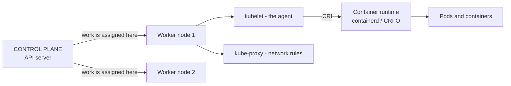
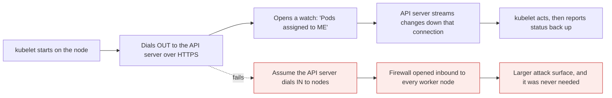
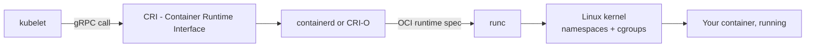
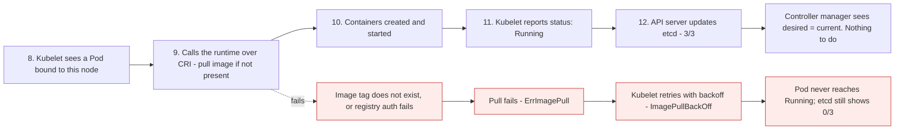
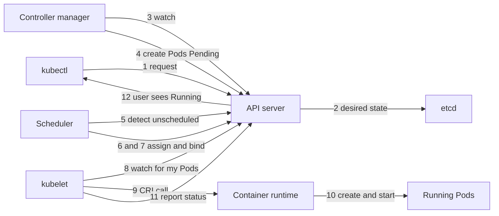
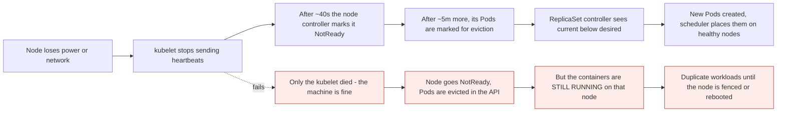

# Kubernetes architecture, part 2: the worker node

*Module 04 · Architecture*

Part 1 ended with a decision: the scheduler picked a node for each Pod. Nothing is running yet. This
module is the other half - how that decision reaches a machine, becomes real containers, and reports back.
Then we walk the complete twelve-step journey end to end.

[Course home](../index.md) / Module 04

## 1. Quick recap of part 1

The control plane half, at speed:

| Step | Component | What happened |
| --- | --- | --- |
| 1 | **kubectl** | You send a command |
| 2 | **API server** | Receives it, authenticates, validates |
| 3 | **etcd** | API server writes desired state: *3 Pods wanted, 0 exist* |
| 4 | **Controller manager** | The ReplicaSet controller watches through the API server, sees the gap |
| 5 | **Controller manager** | Creates 3 Pod objects - **registered, not placed**. Status `Pending` |
| 6 | **Scheduler** | Watches for Pods with no node, checks CPU and memory, picks the right node |
| 7 | **Scheduler** | Binds: Pod 1 to worker node 1; Pods 2 and 3 to worker node 2 - written via the API server |

The scheduler chose. Now something has to actually run them.

## 2. The worker node, and the agent inside it



> **Why it matters:** The control plane never runs your workload and never touches a container. It places an **agent** on every worker node and works through it. Every instruction the cluster gives a machine is really an instruction to that machine's agent.

**The agent analogy.** Think of a field agent posted inside another country, reporting home. The control
plane cannot act inside a worker node directly, so it plants its own operative there. Any time the master
node needs something done on that machine, it goes through the agent. The agent's name is **kubelet**.

The moment a worker node joins the cluster, the control plane configures its kubelet. From then on, that
node has a permanent representative of the control plane living on it.

| Component | Job on the worker node |
| --- | --- |
| **kubelet** | The agent. Makes sure the Pods assigned to this node are actually running |
| **Container runtime** | Pulls images and runs containers - containerd or CRI-O |
| **kube-proxy** | Programs the network rules that make Services reachable |

## 3. kubelet: what the agent actually does

"Runs Pods" is the headline. The real job list is wider, and each item explains a behaviour you will
otherwise find mysterious.

| Responsibility | What you observe because of it |
| --- | --- |
| **Register the node** | A new machine appears in `kubectl get nodes` |
| **Send heartbeats** | A node goes `NotReady` about 40 seconds after the heartbeats stop |
| **Watch for assigned Pods** | Pods bound to this node start without anyone pushing them |
| **Instruct the runtime** | Images get pulled, containers get created and started |
| **Run probes** | Liveness and readiness probes are executed *by the kubelet*, on the node |
| **Mount volumes** | ConfigMaps, Secrets and PVCs appear inside the container |
| **Report status** | `kubectl get pods` shows `Running`, `1/1`, restart counts |
| **Evict under pressure** | Pods are killed when the node runs out of memory or disk |
| **Run static Pods** | Pods defined by files on disk, with no API server involved |

> **NOTE - The kubelet is not a container runtime**
>
> The kubelet creates nothing itself. It decides *what should be running on this node*, then asks the runtime to do it. Keeping that boundary straight is what makes the CRI story in section 4 make sense.

### 3.1 The direction that surprises people

The natural mental model is "the API server calls the kubelet". It is the other way round.



> **Why it matters:** Worker nodes **pull** work; the control plane does not push it. Nodes need outbound access to the API server, not inbound access from it. This is why nodes can sit in a private subnet with no inbound rules, and it is why a node that loses network simply stops reporting rather than breaking the cluster.

The practical consequence, and a favourite interview follow-up: because the kubelet holds a watch rather
than waiting for a call, a control plane outage does not stop existing Pods. The kubelet already knows
what should be running on its node and keeps it running.

## 4. The container runtime and the CRI

The kubelet has decided a container must exist. It does not create it - it calls the runtime through a
standard interface.



> **Why it matters:** Two standards make this replaceable. **CRI** lets any runtime plug into the kubelet; **OCI** defines the image format and the low-level runtime. Because both are standards, Kubernetes swapped its default runtime without anyone rebuilding an image.

| Era | Runtime | Note |
| --- | --- | --- |
| Early Kubernetes | Docker, via `dockershim` | A translation layer maintained inside Kubernetes |
| v1.24 onward | **containerd** or **CRI-O** | dockershim removed; both speak CRI natively |
| Always | Images are **OCI images** | Images built with Docker run perfectly. Nothing about your Dockerfile changed |

The runtime's part of the job is exactly two steps:

1. **Pull the image**, if it is not already present on the node.
2. **Create and start the containers** inside the Pod.

## 5. Steps 8 to 12: the Pod becomes real



> **Why it matters:** Follow the blue path to its end. The status does not stop at the kubelet - it travels back to the API server, into etcd, and the controller manager reads it there. Only when it sees current = desired does it stop acting. The loop closes. That closing is what "3/3 Running" actually means.

Once the containers start, the kubelet reports back to its boss. The API server writes the observed state
into etcd: *you asked for three, three exist*. The controller manager, still watching, sees `3/3` and has
nothing left to do.

> **TIP - `ImagePullBackOff` is step 9, and nothing else**
>
> When you see it, the scheduler already succeeded, the node was already chosen, and the kubelet is already working. The failure is exactly one thing: the runtime cannot fetch that image. Wrong tag, private registry with no `imagePullSecret`, or no network route to the registry. Diagnosing Kubernetes gets much faster once each error maps to a step number.

## 6. kube-proxy: the third component

The script's flow covers kubelet and the runtime. There is a third process on every worker node, and it
is the reason Services work at all.

| | kubelet | kube-proxy |
| --- | --- | --- |
| Cares about | Pods on this node | Network rules on this node |
| Watches | Pods assigned here | Services and EndpointSlices |
| Produces | Running containers | iptables / IPVS rules |
| If it dies | Pods keep running, node goes `NotReady` | Pods keep running, **Service traffic stops being routed** |

kube-proxy turns "this Service has these healthy Pod IPs" into actual packet-forwarding rules on the node.
It runs as a DaemonSet - one copy per node - which you can see for yourself:

```bash
kubectl get pods -n kube-system -l k8s-app=kube-proxy -o wide
```

> **NOTE - Some clusters have no kube-proxy at all**
>
> Modern CNI plugins such as Cilium can replace it entirely with eBPF, which is faster at large scale than thousands of iptables rules. Services are a Kubernetes *concept*; kube-proxy is only the default *implementation*. Networking gets its own module later.

## 7. The complete twelve-step journey

The whole architecture, both halves, in one list. This is the thing to understand - not memorise.

| # | Step | Component |
| --- | --- | --- |
| 1 | User sends request | kubectl |
| 2 | Stores desired state in etcd | API server |
| 3 | Watches for changes | Controller manager |
| 4 | Creates desired number of Pods - status `Pending` | Controller manager |
| 5 | Detects unschedulable Pods | Scheduler |
| 6 | Assigns the best node | Scheduler |
| 7 | Pod is bound to the node | Scheduler, via API server |
| 8 | Picks up the Pod assigned to it | kubelet |
| 9 | Pulls the image | Container runtime |
| 10 | Containers are created and started | Container runtime |
| 11 | Status is reported back to the API server | kubelet |
| 12 | User sees Running Pods | kubectl |



> **Why it matters:** Count the arrows touching the API server: ten of twelve. Every component talks to it and to nothing else. Once you can see that, Kubernetes stops being a pile of services and becomes one hub with satellites - and that is the whole mental model.

Understand this once and you understand Kubernetes at level one. Later modules add detail - more
controllers, the cloud controller manager, Services, storage - but they attach to this skeleton rather
than replacing it.

## 8. What happens when a worker node dies

The reconciliation loop, applied to the worst case. The timings are worth knowing because people expect
this to be instant, and it is not.



> **Why it matters:** Recovery takes roughly five and a half minutes by default, not five seconds - so "Kubernetes self-heals" does not mean "no impact". And the red path is the genuinely dangerous case: Kubernetes only knows what the kubelet tells it, so a dead kubelet on a live machine leaves orphaned containers the cluster believes are gone. For anything that must never run twice, this is why StatefulSets need explicit fencing.

| Node condition | Meaning |
| --- | --- |
| `Ready` | kubelet is healthy and accepting Pods |
| `MemoryPressure` | Node is low on memory - kubelet starts evicting |
| `DiskPressure` | Node is low on disk - image garbage collection, then eviction |
| `PIDPressure` | Too many processes on the node |
| `NotReady` | Heartbeats stopped, or the kubelet reported itself unhealthy |

## 9. Extra points

- **The control plane components are themselves static Pods** on a kubeadm cluster - manifest files in
  `/etc/kubernetes/manifests` that the kubelet runs without any API server involvement. That is the
  bootstrap trick: the kubelet starts the API server that the kubelet then talks to.
- **A control plane node is just a worker node with a taint.** It runs a kubelet and a runtime like any
  other; a `NoSchedule` taint keeps your workloads off it.
- **`crictl` is the `docker` CLI of a Kubernetes node.** `crictl ps`, `crictl images`, `crictl logs` - use
  it when you need to see what the runtime sees, below the Kubernetes abstraction.
- **The kubelet reads only Pods bound to its own node.** It has no view of the cluster, which is exactly
  why nodes scale so well.
- **Node capacity vs allocatable**: capacity is the machine's total; allocatable subtracts what the kubelet
  and system reserve. The scheduler uses allocatable, which is why a "16 GB" node schedules less than that.

> **PRACTICE - Practice now**
>
> Steps 8 to 12, proved on a real cluster.
>
> 1. See the agent on every node, and what it reports:
>    ```bash
>    kubectl get nodes -o wide
>    kubectl describe node <node-name>
>    ```
>    Read the **Conditions**, **Capacity**, **Allocatable** and **Non-terminated Pods** sections. Every one
>    of those numbers came from the kubelet.
> 2. See the heartbeat itself:
>    ```bash
>    kubectl get leases -n kube-node-lease
>    ```
>    Watch the `AGE`/renew time move. That is the node saying "still alive" every few seconds.
> 3. Deploy and follow the events, mapping each to a step number:
>    ```bash
>    kubectl create deployment web --image=nginx:1.25-alpine --replicas=3
>    kubectl get events --sort-by=.metadata.creationTimestamp
>    ```
>    `Scheduled` is step 7. `Pulling`/`Pulled` is step 9. `Created`/`Started` is step 10.
> 4. **Break step 9 on purpose** and confirm the error names its own step:
>    ```bash
>    kubectl run bad --image=nginx:this-tag-does-not-exist
>    kubectl get pod bad
>    kubectl describe pod bad
>    ```
>    `ErrImagePull` then `ImagePullBackOff`. Note that it *was* scheduled - `describe` shows the node. Only
>    the pull failed.
> 5. Look underneath Kubernetes at the runtime, on the node itself. On a `kind` cluster:
>    ```bash
>    docker exec -it kind-worker crictl ps
>    docker exec -it kind-worker crictl images
>    ```
>    These are the same containers `kubectl get pods` showed you, seen from the runtime's side.
> 6. See kube-proxy running once per node:
>    ```bash
>    kubectl get pods -n kube-system -l k8s-app=kube-proxy -o wide
>    ```
> 7. **Watch a node failure recover.** Stop a worker (on `kind`: `docker stop kind-worker`) and run:
>    ```bash
>    kubectl get nodes -w
>    kubectl get pods -o wide -w
>    ```
>    Time it. Note how long until `NotReady`, and how long until Pods reappear elsewhere. That number is
>    your real recovery time, and it is not instant.
> 8. Restart the node and clean up:
>    ```bash
>    kubectl delete deployment web
>    kubectl delete pod bad
>    ```

> **ASSIGNMENT - Assignment**
>
> Take the twelve-step table and, for each step, write the single command you would run to prove that step succeeded or find out why it failed. Step 7 is `kubectl describe pod` looking for the `Scheduled` event; step 9 is the same command looking for `Pulling`. When you are finished you will have a one-page Kubernetes triage sheet built out of the architecture itself - which is exactly how experienced operators debug: they locate the failing step first, and only then look at logs.

## 10. Interview drill

<details>
<summary><b>What is the kubelet and what does it do?</b></summary>

It is the control plane's agent on every worker node. It registers the node, sends heartbeats, watches the
API server for Pods bound to *its* node, instructs the container runtime to pull images and start
containers, mounts volumes, runs liveness and readiness probes, evicts Pods under resource pressure, and
reports status back. It does not create containers itself - it tells the runtime to.

</details>

<details>
<summary><b>Does the API server call the kubelet, or does the kubelet call the API server?</b></summary>

The kubelet dials out to the API server and holds a watch for Pods assigned to its own node. Work is
pulled, not pushed. That means worker nodes need outbound access to the control plane but no inbound
access from it, which is why nodes can live in a private subnet. It also means a control plane outage does
not stop running Pods - the kubelet already knows what should be running.

</details>

<details>
<summary><b>What is the CRI, and why did Kubernetes drop Docker?</b></summary>

The Container Runtime Interface is the gRPC contract between the kubelet and any container runtime.
Docker did not implement it, so Kubernetes maintained a translation layer called dockershim; that was
removed in v1.24 and the defaults became containerd and CRI-O, which speak CRI natively. Nothing changed
for users, because images are OCI images either way - an image built with Docker runs fine.

</details>

<details>
<summary><b>Walk me through steps 8 to 12 of a Pod being created.</b></summary>

The kubelet on the bound node sees a Pod assigned to it. It calls the container runtime over CRI, which
pulls the image if it is not already on the node, then creates and starts the containers in the Pod. The
kubelet reports the resulting status back to the API server, the API server writes the observed state to
etcd, and the controller manager - still watching - sees current equals desired and stops acting. The user
runs `kubectl get pods` and sees 3/3 Running.

</details>

<details>
<summary><b>A Pod shows `ImagePullBackOff`. Which components already succeeded?</b></summary>

All of them up to step 9. The API server accepted the object, the controller created the Pod, the
scheduler filtered, scored and bound it to a node - `kubectl describe pod` will show that node - and the
kubelet picked it up. The only failure is the runtime being unable to fetch the image: a wrong tag, a
private registry with no `imagePullSecret`, or no network path to the registry.

</details>

<details>
<summary><b>What is kube-proxy and what breaks if it stops?</b></summary>

It runs on every node as a DaemonSet, watches Services and EndpointSlices, and programs the node's packet
forwarding rules - iptables or IPVS - so that Service IPs reach healthy Pods. If it stops, existing Pods
keep running and keep serving direct connections, but traffic addressed to Services on that node is no
longer routed. Some clusters replace it entirely with eBPF via Cilium, because Services are a concept and
kube-proxy is only the default implementation.

</details>

<details>
<summary><b>A worker node loses power. Exactly what happens, and how long does it take?</b></summary>

The kubelet stops sending heartbeats. After roughly 40 seconds the node controller marks the node
`NotReady`. After a further eviction timeout - about five minutes by default - the Pods on it are marked
for deletion. The ReplicaSet controller then sees fewer Pods than desired and creates replacements, which
the scheduler places on healthy nodes. So realistic recovery is around five and a half minutes, not
instant, which is why multiple replicas spread across nodes matter more than relying on rescheduling.

</details>

<details>
<summary><b>What is the danger if the kubelet dies but the machine keeps running?</b></summary>

Kubernetes only knows what the kubelet tells it. With no heartbeat the node goes `NotReady` and its Pods
are evicted in the API and recreated elsewhere - but the containers on the original machine are still
running, because nothing stopped them. You now have duplicates the cluster believes do not exist. For
workloads that must never run twice, this is exactly why StatefulSets require deliberate fencing and why
force-deleting a Pod on an unreachable node is dangerous.

</details>

---

[← Module 03](03-control-plane-architecture.md) &nbsp;&nbsp;|&nbsp;&nbsp; [Module 05: Choosing a lab →](05-lab-setup-options.md)

---

Kubernetes Administration: Zero to Architect · Himanshu Kumar.
