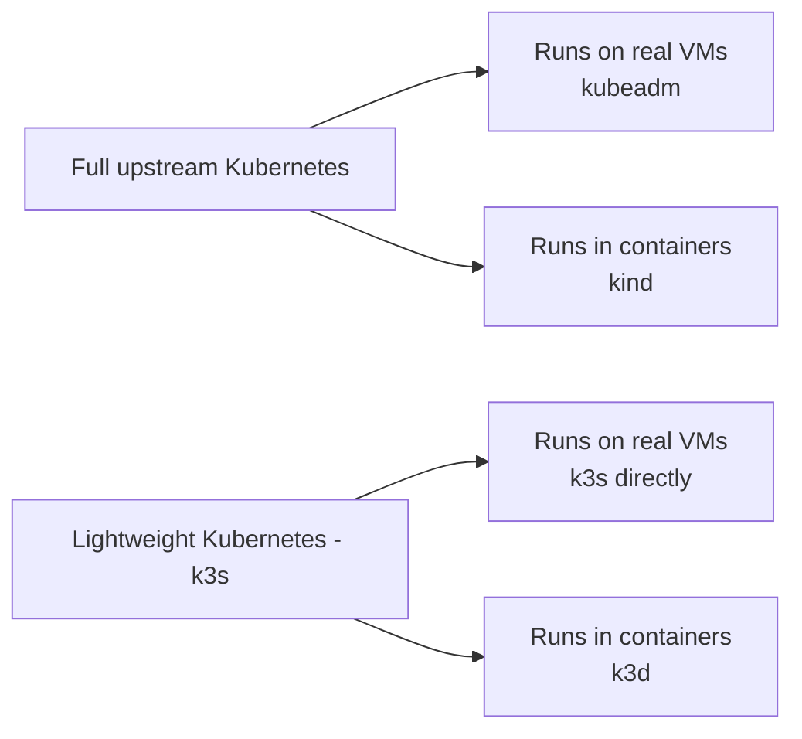
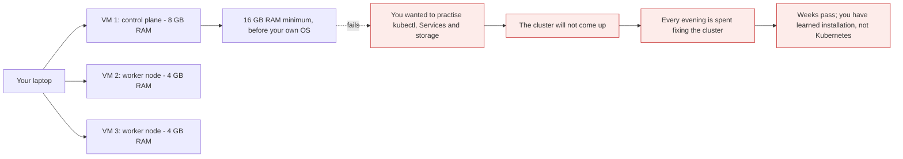
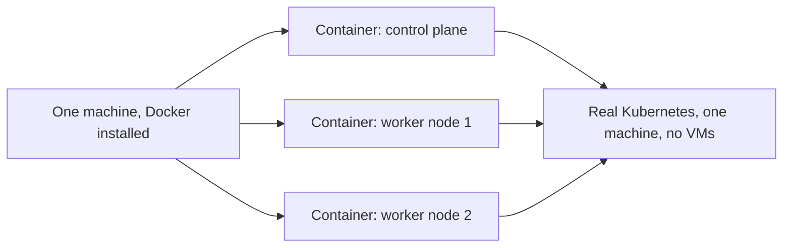
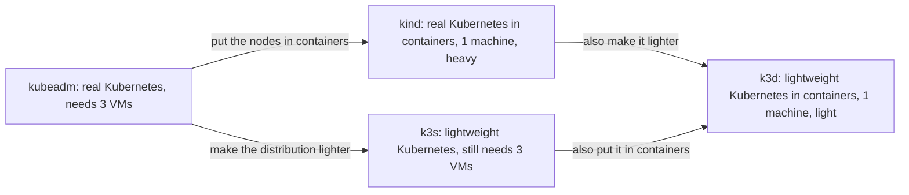
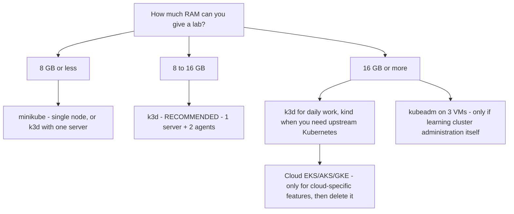

# Choosing a lab: kubeadm, cloud, kind, k3s, k3d and minikube

*Module 05 · Lab*

The hardest part of learning Kubernetes is not Kubernetes. It is the lab. You cannot learn this
theoretically - you have to type the commands - and the moment you go looking for somewhere to type them
you meet six options with confusing names and no clear guidance. This module ends that confusion
permanently.

[Course home](../index.md) / Module 05

## 1. The names, decoded first

Half the confusion is vocabulary. Fix that before anything else.

| Name | Say it as | What it actually is |
| --- | --- | --- |
| **K8s** | "kates" | Kubernetes. K, eight letters, s. An abbreviation, nothing more |
| **kubeadm** | "kube-ay-dee-em" | An **installer** that builds a real cluster on real machines |
| **kind** | "kind" | **K**ubernetes **IN** **D**ocker - real upstream Kubernetes, running inside Docker containers |
| **k3s** | "kay-three-ess" | A **lightweight Kubernetes distribution**. No full form; deliberately "smaller than k8s" |
| **k3d** | "kay-three-dee" | k3s **in Docker** - the same containerisation trick kind does, applied to k3s |
| **minikube** | "mini-cube" | A **single-node** local cluster. One machine that is both control plane and worker |
| **EKS / AKS / GKE** | | Managed Kubernetes from AWS, Azure and Google |

> **TIP - The relationship worth memorising**
>
> **kind is to Kubernetes what k3d is to k3s.** Both take a Kubernetes distribution and run its nodes as Docker containers instead of virtual machines. Once that clicks, the whole landscape collapses into two questions: *full Kubernetes or lightweight?* and *VMs or containers?*



> **Why it matters:** There are not six unrelated tools. There are two distributions and two ways to host their nodes. Every option in this module is one cell of that grid, plus the cloud, plus minikube's single-node special case.

## 2. Option 1 - kubeadm: the real thing

kubeadm is an **installer**. You give it machines; it turns them into a genuine Kubernetes cluster: one
control plane node and worker nodes. **You need at least two worker nodes** for anything realistic.

| Advantages | Disadvantages |
| --- | --- |
| Full control over the cluster | Complex installation and configuration |
| Complete customization | **You manage everything**: master, networking, storage, security |
| No vendor lock-in | High operational overhead |
| Learn Kubernetes deeply | Upgrades and maintenance are manual |
| Runs anywhere - on-prem, cloud, edge | Needs strong DevOps and Kubernetes knowledge |
| Suitable for advanced use cases | |

**Best suited for:** organisations wanting full control, on-prem or private cloud, deep learning, and
specific customization or compliance needs.

How it works, in four steps:

1. Install `kubeadm`, `kubelet` and `kubectl` on every machine.
2. Run `kubeadm init` on the control plane node.
3. Run `kubeadm join` on each worker node.
4. Cluster ready - deploy applications.

### 2.1 The problem nobody mentions until you try it



> **Why it matters:** Three virtual machines and 16 GB of RAM is the entry ticket. That is a real cost, but the real damage is the red path: **more of your time goes into building the cluster than into learning Kubernetes.** If you have time, a strong machine and you specifically want to learn cluster administration, kubeadm is excellent. As a beginner's first lab it is a trap.

## 3. Option 2 - EKS, AKS, GKE: let the cloud run the control plane

The cloud provider gives you a managed control plane. You never install it. You add worker nodes and get
straight to practising.

| Advantages | Disadvantages |
| --- | --- |
| Fully managed control plane | Vendor lock-in |
| High availability and automatic scaling | Less control over the underlying infrastructure |
| No need to manage masters - etcd, API, none of it | **Cost can be higher at scale** |
| Built-in integration with cloud services | Limited customization of the control plane |
| Security, backups and updates handled by the provider | Dependence on provider availability and regions |
| Pay-as-you-go pricing, faster setup, enterprise ready | |

**Best suited for:** organisations wanting production-ready managed Kubernetes, teams that want to focus
on applications rather than infrastructure, workloads needing real HA and scale.

```mermaid
flowchart LR
    S0["Create a managed cluster"]
    S1["Provider builds and runs the control plane"]
    S2["You add worker nodes"]
    S3["Deploy and practise immediately"]
    S0 --> S1
    S1 --> S2
    S2 --> S3
    F0["Left running overnight while learning"]
    F1["Control plane billed per hour even with zero Pods"]
    F2["Plus nodes, plus load balancers, plus NAT gateway"]
    F3["A surprise bill kills your motivation to practise"]
    S3 -.->|"fails"| F0
    F0 --> F1
    F1 --> F2
    F2 --> F3
    classDef bad fill:#fdecea,stroke:#c62828;
    class F0,F1,F2,F3 bad;
```



> **Why it matters:** A managed control plane saves you the installation, and it charges by the hour whether or not you deploy anything. Add a `LoadBalancer` Service and a NAT gateway and an idle learning cluster quietly costs real money every day. You end up watching the billing console instead of practising - which defeats the purpose.

> **WARNING - Not recommended as your learning lab**
>
> Everything you learn in this course runs identically on EKS/AKS/GKE and on kubeadm - the commands do not change. But learning needs **unlimited practice time without watching a meter**. Use the cloud when you are studying cloud-specific features: IAM integration, cloud load balancers, storage classes, autoscaling groups. Not for `kubectl` practice. And if you do spin one up, `terraform destroy` or `eksctl delete cluster` the same day.

## 4. Option 3 - kind: real Kubernetes inside Docker

kind runs **real, upstream Kubernetes**, but each node is a **Docker container** instead of a virtual
machine. The control plane runs in one container; each worker runs in another.



> **Why it matters:** This is the key move. The three virtual machines kubeadm demanded become three containers on one machine. You still get a genuine multi-node cluster with a real control plane - the nodes are just cheaper.

| Advantages | Disadvantages |
| --- | --- |
| Easy to install and use | **Not for production use** |
| Runs Kubernetes in Docker containers | Requires Docker |
| Fast and lightweight | Limited to a single machine |
| Production-like Kubernetes environment | Less control over underlying infrastructure |
| Great for local development and testing | Performance overhead of Docker containers |
| CI/CD friendly | Not suitable for testing network or infrastructure at scale |
| Supports multi-node clusters | |
| Easy to reset and recreate clusters | |

**Best suited for:** developers and local environments, application development and testing, CI/CD
pipelines and integration testing, learning and experimentation, prototyping and demos.

**The remaining catch:** it is still full Kubernetes. If you run it inside a VM on your laptop, that VM
still wants around 16 GB of RAM to be comfortable. You removed the three-VM problem, not the memory
problem.

## 5. Option 4 - k3s: lightweight, and still certified Kubernetes

k3s is a **lightweight, CNCF-certified Kubernetes distribution** built for edge, IoT and
resource-constrained environments. It packages **all Kubernetes components into a single binary under
100 MB**.

| Advantages | Disadvantages |
| --- | --- |
| Lightweight - binary under 100 MB | Not ideal for large-scale enterprise clusters |
| Easy to install and manage | Limited add-ons compared to full distributions |
| Low resource usage, CPU and memory efficient | Fewer customization options |
| Works in disconnected environments | Embedded datastore, not ideal for high-write workloads at scale |
| Built-in metrics-server, service LB and ingress controller | Not suitable for very complex enterprise requirements |
| Secure by default - TLS, RBAC | |
| Supports ARM, x86_64 and more | |
| Ideal for edge, IoT and CI/CD workloads | |

**Best suited for:** edge computing and IoT, CI/CD pipelines, development and testing, small to medium
production workloads, remote and disconnected environments.

> **NOTE - "CNCF certified" is not marketing**
>
> It means k3s passes the official Kubernetes conformance test suite. The API is the same API. Your manifests, your `kubectl` commands, your Deployments and Services behave identically. You are not learning a lookalike - you are learning Kubernetes, on a distribution that removed weight rather than features.

What k3s actually trims, for the curious:

| Full Kubernetes | k3s |
| --- | --- |
| etcd as a separate component | Embedded datastore by default - SQLite for single-server, etcd optional |
| Separate binaries per component | One binary running everything |
| Bring your own ingress and LB | Traefik ingress and a service load balancer included |
| Bring your own storage provisioner | `local-path` provisioner included |
| In-tree legacy cloud providers, alpha features | Removed |

**The trap it does not solve:** k3s is still Kubernetes, and Kubernetes still wants a control plane node
and worker nodes. Install it directly and you are back to building three virtual machines - lighter ones,
but three.

## 6. Option 5 - k3d: k3s inside Docker

k3d runs **k3s inside Docker containers**. It is the same trick kind performs, applied to the lightweight
distribution - and it removes the last problem.



> **Why it matters:** Both problems, solved together. One machine, three containers - one control plane, two workers - and a distribution light enough to run on a modest laptop. This is why k3d is the recommended lab for this course.

| Advantages | Disadvantages |
| --- | --- |
| Runs k3s in Docker - lightweight and fast | Requires Docker |
| Easy to install and use | Not suitable for very large-scale or production use |
| Production-like Kubernetes environment locally | Limited customization compared to full distributions |
| **Uses minimal resources** | Docker resource limits may impact performance |
| CI/CD friendly, isolated environment | Not ideal for testing bare-metal or cloud-specific features |
| Supports multi-node clusters | |
| Easy to reset and recreate clusters | |

**Best suited for:** developers and local environments, application development and testing, CI/CD
pipelines and integration testing, learning and experimentation, prototyping and demos.

> **TIP - Roughly 90% of this course runs on k3d**
>
> Almost every practical - Pods, Deployments, Services, ConfigMaps, Secrets, storage, probes, RBAC, scaling, rolling updates - works perfectly here. The remaining ~10% needs a real environment: cloud load balancers, cloud storage classes, IAM integration, genuine multi-zone topology and real node failure. Those get a live environment when we reach them. Do not let 10% of the syllabus dictate 100% of your setup.

## 7. Option 6 - minikube: when resources are genuinely tight

minikube runs a **single-node** cluster: one node acting as both control plane and worker. It was the
default recommendation for years, before k3s and k3d existed.

| Advantages | Disadvantages |
| --- | --- |
| Easy to set up | **Single-node cluster** - not production-like |
| Lightweight and fast | Limited scalability and high availability |
| Perfect for learning and experimentation | Not suitable for complex multi-node setups |
| Works offline | Bounded by your local machine's resources |
| Supports all Kubernetes features | Not ideal for production-like testing |
| Isolated environment, multiple drivers | |

If you cannot spare the resources for a multi-node setup and cannot buy a new laptop right now, minikube
still lets you practise the large majority of the syllabus. You lose the things that need more than one
node - scheduling across nodes, node failure, anti-affinity, drain and cordon - which is exactly the
tradeoff to be aware of.

## 8. Choosing, in one diagram



| Option | Multi-node? | Real k8s API? | Resource need | Use it when |
| --- | --- | --- | --- | --- |
| **kubeadm** | Yes | Yes | 16 GB+, 3 VMs | You are learning cluster administration and upgrades |
| **EKS/AKS/GKE** | Yes | Yes | A credit card | You need cloud-specific features - then delete it |
| **kind** | Yes | Yes, upstream | ~16 GB | You need exact upstream behaviour, or CI |
| **k3s** | Yes | Yes, certified | Low, but still VMs | Edge, IoT, or a small real deployment |
| **k3d** | Yes | Yes, certified | **Low** | **Daily learning and practice - the default here** |
| **minikube** | No | Yes | Lowest | Constrained hardware, single-node practice |

## 9. Extra points

- **Docker Desktop ships a one-click Kubernetes** - single node, like minikube, zero setup. Fine for a
  first look, poor for multi-node work.
- **Every option here is throwaway.** A lab you are afraid to break is not a lab. Deleting and recreating a
  k3d cluster takes under a minute; do it often and deliberately.
- **`LoadBalancer` Services behave differently in local labs.** k3s includes a service load balancer so
  they work; on kind they stay `Pending` unless you add MetalLB or cloud-provider-kind. Do not conclude
  your manifest is wrong.
- **Your `kubeconfig` can hold many clusters.** `kubectl config get-contexts` and
  `kubectl config use-context` switch between them. Every tool here writes its own context.
- **Names on the CV**: "built a multi-node Kubernetes lab" is true of k3d and kind. Say which one and why -
  that answer shows judgement, and interviewers ask it.
- **The 10% you cannot do locally** - cloud load balancers, IRSA/workload identity, real zone failure,
  bare-metal networking - is worth doing once in a cloud account you delete the same day.

> **PRACTICE - Practice now**
>
> Build the recommended lab: one k3d cluster with one server and two agents.
>
> 1. Install Docker, then k3d:
>    ```bash
>    docker version
>    curl -s https://raw.githubusercontent.com/k3d-io/k3d/main/install.sh | bash
>    k3d version
>    ```
> 2. Create a three-node cluster:
>    ```bash
>    k3d cluster create devlab --servers 1 --agents 2
>    kubectl get nodes -o wide
>    ```
>    Three nodes: one control plane, two workers. On one machine, in seconds.
> 3. **Prove the nodes really are containers** - the whole point of k3d:
>    ```bash
>    docker ps
>    ```
>    Each Kubernetes node appears as a Docker container. Module 04's architecture, running on your laptop.
> 4. Confirm the control plane components are there:
>    ```bash
>    kubectl get pods -A
>    kubectl cluster-info
>    ```
> 5. Deploy something and see it scheduled across the workers:
>    ```bash
>    kubectl create deployment web --image=nginx:1.25-alpine --replicas=4
>    kubectl get pods -o wide
>    ```
>    Read the `NODE` column - the scheduler is spreading Pods, exactly as module 03 described.
> 6. **Practise throwing it away**, so you never fear breaking it:
>    ```bash
>    k3d cluster delete devlab
>    k3d cluster create devlab --servers 1 --agents 2
>    ```
> 7. Optional - build the same shape with kind, to feel the difference:
>    ```yaml
>    # kind-config.yaml
>    kind: Cluster
>    apiVersion: kind.x-k8s.io/v1alpha4
>    nodes:
>      - role: control-plane
>      - role: worker
>      - role: worker
>    ```
>    ```bash
>    kind create cluster --name upstream --config kind-config.yaml
>    kubectl get nodes
>    ```
>    Compare start-up time and memory use against k3d. Now you have an opinion instead of a preference.
> 8. Switch between them and see how kubeconfig contexts work:
>    ```bash
>    kubectl config get-contexts
>    kubectl config use-context k3d-devlab
>    ```

> **ASSIGNMENT - Assignment**
>
> Write a short recommendation - the kind you would give a team lead - answering: "which Kubernetes lab should our five new joiners use?" State the constraint that decides it (laptop RAM), name the option, and list the two things they will *not* be able to practise locally and how you will cover those. Then actually build the lab and time it. If your setup takes longer than fifteen minutes, you chose wrong - and knowing that is the whole point of this module.

## 10. Interview drill

<details>
<summary><b>What is the difference between k8s, k3s, k3d and kind?</b></summary>

K8s is Kubernetes itself. k3s is a lightweight, CNCF-certified Kubernetes distribution that packs every
component into a single binary under 100 MB, built for edge and resource-constrained environments. kind
runs **upstream Kubernetes** with each node as a Docker container. k3d does the same for k3s - it runs
k3s nodes inside Docker containers. So: two distributions, and two tools that containerise their nodes.

</details>

<details>
<summary><b>What is kubeadm, and why is it a poor first lab?</b></summary>

It is the official installer that turns real machines into a real cluster - `kubeadm init` on the control
plane, `kubeadm join` on the workers. It gives full control and teaches you a great deal, but you manage
networking, storage, security and upgrades yourself, and a realistic setup needs three VMs and around
16 GB of RAM. For a beginner the time cost lands on installation rather than on Kubernetes itself.

</details>

<details>
<summary><b>Is k3s "real" Kubernetes?</b></summary>

Yes. It is CNCF-certified, meaning it passes the official conformance suite, so the API and behaviour match
upstream Kubernetes. It differs in packaging, not in API: a single binary, an embedded datastore instead of
a separate etcd, and bundled Traefik ingress, service load balancer, metrics-server and a local-path storage
provisioner. Manifests written against k3s run unchanged on EKS.

</details>

<details>
<summary><b>Why would you not use EKS or GKE to learn?</b></summary>

Because a managed control plane bills by the hour whether or not you deploy anything, and load balancers
and NAT gateways add to it. Learning requires unlimited, unmonitored practice time. The commands are
identical on a local cluster, so the cloud is worth paying for only when studying cloud-specific
behaviour - IAM integration, cloud load balancers, storage classes - and then the cluster should be
deleted the same day.

</details>

<details>
<summary><b>What can you NOT test in a local kind or k3d cluster?</b></summary>

Anything that depends on real infrastructure: cloud `LoadBalancer` provisioning and cloud-specific
annotations, cloud storage classes and volume attachment, IAM or workload identity integration, genuine
multi-zone topology and zone failure, bare-metal networking, and realistic performance or scale testing.
You also cannot properly test a hard node failure, because the "nodes" share one kernel and one machine.

</details>

<details>
<summary><b>Which lab would you set up for a team of new joiners, and why?</b></summary>

k3d with one server and two agents. It gives a genuine multi-node, certified Kubernetes cluster on a
single laptop with modest RAM, comes up in under a minute, and can be destroyed and recreated freely - so
people experiment instead of protecting a fragile cluster. I would add a shared cloud cluster, created and
deleted on demand, for the small set of cloud-specific exercises that cannot run locally.

</details>

---

[← Module 04](04-worker-node-architecture.md) &nbsp;&nbsp;|&nbsp;&nbsp; [Module 06: Building the lab →](06-lab-build.md)

---

Kubernetes Administration: Zero to Architect · Himanshu Kumar.
