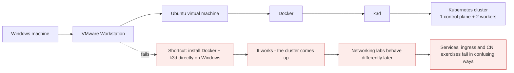
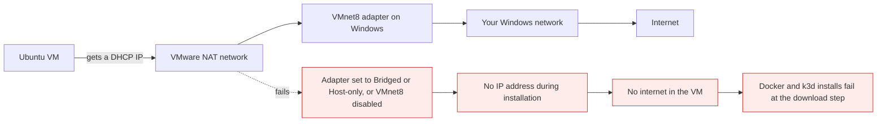
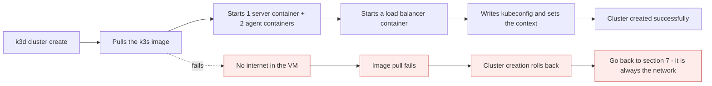
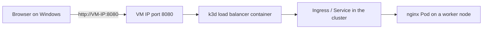

# Building the lab, step by step

*Module 06 · Lab*

This is the most important module in the series, because everything after it is practical. Thirty minutes
of setup buys you a real multi-node Kubernetes cluster on your own machine, with no cloud account and no
billing to watch, on which roughly 90% of this course can be performed.

[Course home](../index.md) / Module 06

## 1. What we are building



> **Why it matters:** People ask this constantly - *Docker Desktop runs on Windows, and k3d runs on Docker, so why the VM?* Because it works today and bites you later. Kubernetes networking is Linux networking - iptables, IPVS, network namespaces, CNI. Run the cluster on a real Linux host and every networking lesson in this course behaves the way the documentation says. The VM is not overhead; it is the thing that makes the later modules truthful.

**The goal:** a local Kubernetes lab running inside an Ubuntu VM. Windows runs VMware, VMware runs Ubuntu,
Ubuntu runs Docker, and k3d creates a Kubernetes cluster inside Docker containers.

**The final test:** open an nginx page served from your k3d cluster, in your Windows browser.

## 2. Virtual machine requirements

| Resource | Minimum | Comfortable |
| --- | --- | --- |
| vCPU | 2 | 4 |
| RAM | 4 GB | **8 GB** or more |
| Disk | 40 GB | 40 GB |
| Network mode | **NAT** | NAT |

Two vCPUs is genuinely enough. If you can give 8 GB of RAM, do - more is better, but 4 GB will run the
cluster.

## 3. Install VMware Workstation

VMware Workstation is now **free for everyone**. This is new - people used Oracle VirtualBox for years
precisely because Workstation was not free.

| Platform | Product |
| --- | --- |
| Windows / Linux | VMware Workstation |
| macOS | VMware Fusion |

Download it from Broadcom's site. You will need to create a **Broadcom account** - it is free, and the
download is free. Fill in the details, sign in, download, install. The installer is a straightforward
next-next-finish.

> **NOTE - VirtualBox works too**
>
> If you already use Oracle VirtualBox, keep it. Everything in this module applies; only the VM creation screens differ. The important settings are the same: 2 CPUs, 4-8 GB RAM, 40 GB disk, NAT networking.

## 4. Download the Ubuntu ISO

Get the latest Ubuntu **Server** LTS ISO from ubuntu.com. It is around 3 GB. Newer versions have fewer
installation surprises, so take the current LTS rather than an old one.

## 5. Create the virtual machine

In VMware Workstation:

| Step | Choice |
| --- | --- |
| **New Virtual Machine** | **Typical** |
| Installer disc image | Select the Ubuntu ISO you downloaded |
| Name | Anything - `K8S` is fine |
| Disk size | **40 GB** (change it from the default 20 GB) |
| Customize Hardware → Processors | **2** |
| Customize Hardware → Memory | 4 GB minimum, **8 GB** if you have it |
| Finish | The VM starts automatically |

> **TIP - If your mouse gets trapped in the VM**
>
> Press **Ctrl + Alt** together to release it back to Windows.

## 6. Install Ubuntu

Follow the installer. The choices that matter:

| Screen | What to choose |
| --- | --- |
| Language | English |
| Installation type | **Ubuntu Server** - the default. **Not** "minimized" |
| Network | You should see DHCPv4 and an IP address. If not, see section 7 |
| Proxy | Leave blank, continue |
| Storage | **Use entire disk** → Done → Yes, continue |
| Your name | Anything |
| Server name | `k8s` |
| Username / password | Choose your own and **remember them** |
| Ubuntu Pro | Skip for now |
| **Install OpenSSH server** | **SELECT THIS. Do not skip it** |

> **WARNING - OpenSSH is the one checkbox that matters**
>
> Without it you are stuck typing inside the VMware console window - no copy-paste, poor rendering, painful. With it you SSH in from a normal Windows terminal and the whole experience changes. If you missed it, install it afterwards with `sudo apt install -y openssh-server`.

Installation takes roughly 10 minutes. When it finishes, choose **Reboot now**.

### 6.1 Remove the installation media

If it complains about media on reboot:

1. Shut down the guest (**Power → Shut Down Guest**)
2. **Settings → CD/DVD** → remove the ISO
3. Start the VM again

## 7. Networking: NAT, and what to do when there is no IP



> **Why it matters:** Every later step - installing Docker, installing k3d, pulling the k3s image - needs internet inside the VM. Fix networking now, not after three failed installs.

**Check the mode:** right-click the VM → **Settings** → **Network Adapter** → it must be **NAT**.

**Still no IP?** On Windows, press `Windows + R`, type `ncpa.cpl`, and confirm **VMware Network Adapter
VMnet8** is present and **enabled**. That adapter is the NAT network; if it is disabled, the VM gets
nothing.

| Mode | What it does | Use here? |
| --- | --- | --- |
| **NAT** | VM shares the host's IP; reachable from the host | **Yes** |
| Bridged | VM gets its own IP on your LAN; visible to other devices | Works, but changes with every network you join |
| Host-only | No internet at all | No |

## 8. SSH in from Windows

Log into the VM console once with the username and password you set, then find its IP:

```bash
hostname -I
# 192.168.21.140
```

Now leave the VM console alone. From a Windows Command Prompt or PowerShell:

```powershell
ssh test@192.168.21.140
# type: yes
# then your password
```

You now have a proper terminal with copy-paste. Everything from here happens over SSH.

> **TIP - The IP will change one day**
>
> It is a DHCP lease. After a host reboot or a long shutdown you may get a different address - so if SSH suddenly fails, log into the VMware console and run `hostname -I` again before assuming anything is broken. If it annoys you, set a static IP in `/etc/netplan/` or add a DHCP reservation in VMware's virtual network editor.

## 9. Install Docker

k3d runs Kubernetes inside Docker containers, so Docker has to come first.

```bash
sudo apt update && sudo apt upgrade -y
```

```bash
# the simplest reliable install
curl -fsSL https://get.docker.com | sh
```

Enable the service, and give your user permission to run `docker` commands by adding it to the `docker`
group:

```bash
sudo systemctl enable --now docker
sudo usermod -aG docker $USER
```

**Now log out and back in.** Group membership is only applied at login:

```bash
exit
# then SSH in again
ssh test@192.168.21.140
```

Verify:

```bash
docker ps
docker version
```

An empty container list is the correct result - you have not created anything yet.

> **WARNING - The `docker` group is root**
>
> Anyone in the `docker` group can start a container that mounts the host filesystem and gives themselves root. That is fine on a throwaway lab VM and unacceptable on a shared or production machine. Same warning as the Docker course; it does not stop being true here.

> **TIP - Skip the logout with `newgrp`**
>
> `newgrp docker` applies the new group to your current shell immediately. Convenient, but it only affects that one shell - log out and in properly at some point anyway.

## 10. Install k3d

```bash
curl -s https://raw.githubusercontent.com/k3d-io/k3d/main/install.sh | bash
k3d version
```

If a version prints, k3d is installed.

## 11. Install kubectl

kubectl is the tool used to manage the cluster - the same kubectl used against real production
Kubernetes, not a special version.

```bash
curl -LO "https://dl.k8s.io/release/$(curl -Ls https://dl.k8s.io/release/stable.txt)/bin/linux/amd64/kubectl"
sudo install -o root -g root -m 0755 kubectl /usr/local/bin/kubectl
rm kubectl
kubectl version --client
```

Any version printing here means the installation worked.

> **NOTE - Where does kubectl get the cluster address?**
>
> From `~/.kube/config`. k3d writes that file for you when it creates a cluster, and merges each new cluster in as a new **context**. `kubectl config get-contexts` lists them; `kubectl config use-context` switches.

## 12. Create the cluster

One control plane and two worker nodes, all inside this single VM:

```bash
k3d cluster create cloudfox --servers 1 --agents 2 --port "8080:80@loadbalancer"
```

| Flag | Meaning |
| --- | --- |
| `cloudfox` | Cluster name - use whatever you like |
| `--servers 1` | One control plane node |
| `--agents 2` | Two worker nodes |
| `--port "8080:80@loadbalancer"` | Publish cluster port 80 on VM port 8080 - needed for the final test |

The first run pulls the k3s image, so **internet must be working** and it takes a minute or two.



Verify:

```bash
kubectl get nodes
```

```text
NAME                     STATUS   ROLES                  AGE   VERSION
k3d-cloudfox-server-0    Ready    control-plane,master   60s   v1.31.x+k3s1
k3d-cloudfox-agent-0     Ready    <none>                 55s   v1.31.x+k3s1
k3d-cloudfox-agent-1     Ready    <none>                 55s   v1.31.x+k3s1
```

One server - the control plane - and two agents, the worker nodes. **Your lab is ready.**

Prove the k3d claim from module 05 while you are here:

```bash
docker ps
```

Every Kubernetes node is a Docker container. Module 04's architecture, running on your laptop.

## 13. The final test: an nginx page from your cluster



```bash
kubectl create deployment nginx --image=nginx:1.25-alpine
kubectl expose deployment nginx --port=80 --type=LoadBalancer
kubectl get svc nginx
kubectl get pods -o wide
```

k3s includes a service load balancer, so the Service gets an external IP rather than sitting in
`Pending`. Now open a browser on Windows:

```text
http://192.168.21.140:8080
```

The nginx welcome page means the entire chain works: Windows → VMware → Ubuntu → Docker → k3d →
Kubernetes → Service → Pod.

If the browser cannot reach it, test from inside the VM first - this isolates the cluster from the
network path:

```bash
curl http://localhost:8080
kubectl port-forward deployment/nginx 8081:80    # then curl http://localhost:8081
```

Clean up when you are done:

```bash
kubectl delete svc nginx
kubectl delete deployment nginx
```

## 14. Managing the lab day to day

| Task | Command |
| --- | --- |
| List clusters | `k3d cluster list` |
| **Stop the cluster** (frees RAM, keeps everything) | `k3d cluster stop cloudfox` |
| Start it again | `k3d cluster start cloudfox` |
| Delete and start clean | `k3d cluster delete cloudfox` |
| Recreate | `k3d cluster create cloudfox --servers 1 --agents 2 --port "8080:80@loadbalancer"` |
| See node containers | `docker ps` |
| Switch context | `kubectl config use-context k3d-cloudfox` |

> **TIP - Take a VMware snapshot right now**
>
> With Docker, k3d and kubectl installed and the cluster working, take a snapshot of the VM. Every future experiment becomes free: break anything, revert in thirty seconds, carry on. This single habit will save you hours over the course.

## 15. Troubleshooting

| Symptom | Cause | Fix |
| --- | --- | --- |
| No IP during Ubuntu install | Adapter not NAT, or VMnet8 disabled | Settings → Network Adapter → NAT; `ncpa.cpl` → enable VMnet8 |
| `ssh: connect ... refused` | OpenSSH server not installed | In the VM console: `sudo apt install -y openssh-server` |
| SSH worked yesterday, not today | DHCP gave a new IP | `hostname -I` in the console; use the new address |
| `permission denied ... docker.sock` | Not logged out since `usermod -aG` | `exit`, SSH in again, or `newgrp docker` |
| `k3d cluster create` fails pulling images | No internet in the VM | Fix networking (section 7), then retry |
| `kubectl` says connection refused | Cluster stopped, or wrong context | `k3d cluster start cloudfox`; `kubectl config use-context k3d-cloudfox` |
| Nodes `NotReady`, everything slow | VM has too little RAM | Give the VM more memory, or run `--agents 1` |
| Browser cannot reach nginx | Port not published at cluster creation | Recreate with `--port "8080:80@loadbalancer"` |

## 16. Extra points

- **This is a real cluster, not a simulator.** Every command you learn here runs unchanged on EKS, AKS,
  GKE or a kubeadm cluster.
- **Roughly 90% of the course runs here.** The remaining 10% - cloud load balancers, cloud storage
  classes, IAM integration, true node failure - needs a real environment, and gets one when we reach it.
- **A full kubeadm installation comes later.** The final chapter of this course builds real Kubernetes on
  real machines. This lab exists so you can learn Kubernetes first and cluster administration second.
- **Do not treat the cluster as precious.** Deleting and recreating takes a minute. A lab you are afraid to
  break teaches you nothing.
- **`k3d cluster stop` beats deleting** when you just need your RAM back for the day.

> **PRACTICE - Practice now**
>
> Do the whole build, then prove each layer independently. If a step fails, you will know exactly which layer to fix.
>
> 1. VM alive and reachable:
>    ```bash
>    hostname -I
>    ssh test@<vm-ip>
>    ```
> 2. Internet inside the VM:
>    ```bash
>    curl -I https://get.docker.com
>    ```
> 3. Docker layer:
>    ```bash
>    docker run --rm hello-world
>    ```
> 4. k3d and kubectl layers:
>    ```bash
>    k3d version
>    kubectl version --client
>    ```
> 5. Cluster layer:
>    ```bash
>    k3d cluster create cloudfox --servers 1 --agents 2 --port "8080:80@loadbalancer"
>    kubectl get nodes
>    ```
> 6. Prove nodes are containers:
>    ```bash
>    docker ps
>    ```
> 7. Application layer - the final test:
>    ```bash
>    kubectl create deployment nginx --image=nginx:1.25-alpine
>    kubectl expose deployment nginx --port=80 --type=LoadBalancer
>    ```
>    Open `http://<vm-ip>:8080` from Windows.
> 8. **Take a VMware snapshot** and name it `lab-ready`.
> 9. Practise destroying and rebuilding, so you stop fearing it:
>    ```bash
>    k3d cluster delete cloudfox
>    k3d cluster create cloudfox --servers 1 --agents 2 --port "8080:80@loadbalancer"
>    kubectl get nodes
>    ```
> 10. Learn the daily habit that saves RAM:
>     ```bash
>     k3d cluster stop cloudfox
>     k3d cluster start cloudfox
>     ```

> **ASSIGNMENT - Assignment**
>
> Write your own one-page setup runbook - every command in order, with the expected output of each, and a troubleshooting line for each step. Then hand your VM to a friend, have them delete the cluster, and rebuild it using only your runbook. If they get stuck, your runbook is wrong, not them. Being able to rebuild your environment from a document is the same discipline that later becomes infrastructure-as-code, and it starts here.

## 17. Interview drill

<details>
<summary><b>Why run the lab in a Linux VM instead of directly on Windows?</b></summary>

Because Kubernetes networking is Linux networking - network namespaces, iptables or IPVS, and CNI plugins.
Docker Desktop plus k3d on Windows will create a working cluster, but the networking path is translated
through a virtualisation layer, so Services, ingress and CNI exercises behave differently from the
documentation. Running on a real Linux host means every networking lesson is truthful.

</details>

<details>
<summary><b>What does `k3d cluster create --servers 1 --agents 2` actually create?</b></summary>

Four Docker containers on one machine: one k3s server acting as the control plane, two k3s agents acting
as worker nodes, and a load balancer container that fronts the API server and any published ports. From
Kubernetes' point of view it is a genuine three-node cluster - `kubectl get nodes` shows one control plane
and two workers - and `docker ps` shows the same nodes as containers.

</details>

<details>
<summary><b>Why must you log out after `usermod -aG docker $USER`?</b></summary>

Group membership is evaluated when a session is created, so an existing shell keeps its old groups. Until
you start a new login session, `docker ps` fails with a permission error on `/var/run/docker.sock`.
`newgrp docker` applies it to the current shell as a shortcut. Worth remembering that this group is
effectively root on the host.

</details>

<details>
<summary><b>You created a Service of type LoadBalancer in your local cluster. Why does it work on k3s but stay `Pending` on kind?</b></summary>

k3s ships a built-in service load balancer, so it can assign an external address locally. Upstream
Kubernetes expects a cloud controller to provision one, and kind has none, so the Service waits forever in
`Pending` until you install something like MetalLB or cloud-provider-kind. The manifest is identical and
correct in both cases - the difference is the environment, which is exactly the kind of distinction worth
naming in an interview.

</details>

<details>
<summary><b>Your kubectl suddenly reports "connection refused" after a reboot. How do you diagnose it?</b></summary>

Work up the stack. Is the VM up and is the IP still the same - DHCP may have changed it. Is Docker
running. Are the k3d node containers running, or did the cluster stop with the host - `docker ps` and
`k3d cluster list`. Is kubectl pointing at the right context - `kubectl config get-contexts`. The fix is
usually `k3d cluster start`, because stopping the host stops the containers.

</details>

---

[← Module 05](05-lab-setup-options.md) &nbsp;&nbsp;|&nbsp;&nbsp; [Module 07: Removing lab friction →](07-lab-friction-and-plan.md)

---

Kubernetes Administration: Zero to Architect · Himanshu Kumar.
