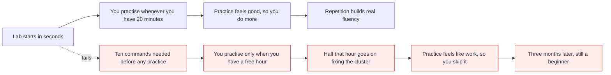
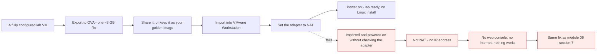
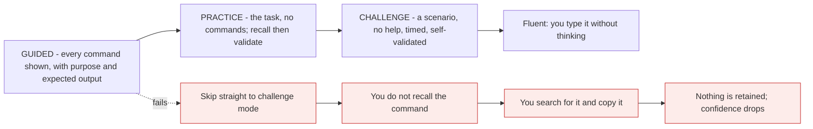

# Removing lab friction, and a 30-day plan

*Module 07 · Lab*

How long does it take to become good at Kubernetes - ninety days, sixty, forty-five, or under thirty? The
honest answer is that it depends almost entirely on one variable, and it is not your intelligence or your
background. It is how much friction sits between you and typing a command.

[Course home](../index.md) / Module 07

## 1. Friction is the bottleneck, not difficulty

Kubernetes is not hard. People get stuck at the lab.



> **Why it matters:** Nobody quits Kubernetes because Deployments are conceptually hard. They quit because every session begins with a broken cluster, a forgotten command, and twenty minutes of searching for "how do I do this again". Remove those twenty minutes and the same person practises three times as often - and *that* is what compresses ninety days into thirty.

Two things fix it, and they are the whole of this module:

| Fix | What it removes |
| --- | --- |
| **A lab you can rebuild in minutes** | "My cluster is broken and I have no time to fix it" |
| **A structured practice ladder** | "I don't know what to practise next, or whether I got it right" |

## 2. Fix one: make the lab reproducible

Module 06 built a lab in about thirty minutes. Doing that once is fine. Doing it again after a bad
experiment, on a new laptop, or for a teammate is exactly the friction we are trying to delete.

Three techniques, in increasing order of power:

| Technique | Rebuild time | Good for |
| --- | --- | --- |
| **VM snapshot** | ~30 seconds | Undoing your own experiments |
| **Bootstrap script** | ~5 minutes | A fresh VM, or a colleague's machine |
| **OVA appliance** | ~3 minutes | Handing a complete working lab to anyone |

### 2.1 The bootstrap script

Everything from module 06, in one file you keep in git:

```bash
#!/usr/bin/env bash
# lab-bootstrap.sh - fresh Ubuntu VM to working Kubernetes cluster
set -euo pipefail

sudo apt update && sudo apt upgrade -y

curl -fsSL https://get.docker.com | sh
sudo systemctl enable --now docker
sudo usermod -aG docker "$USER"

curl -s https://raw.githubusercontent.com/k3d-io/k3d/main/install.sh | bash

curl -LO "https://dl.k8s.io/release/$(curl -Ls https://dl.k8s.io/release/stable.txt)/bin/linux/amd64/kubectl"
sudo install -o root -g root -m 0755 kubectl /usr/local/bin/kubectl && rm kubectl

echo "Log out and back in, then run: ./lab-cluster.sh"
```

```bash
#!/usr/bin/env bash
# lab-cluster.sh - destroy and recreate the cluster, idempotently
set -euo pipefail

CLUSTER="${1:-devlab}"

k3d cluster delete "$CLUSTER" 2>/dev/null || true
k3d cluster create "$CLUSTER" --servers 1 --agents 2 --port "8080:80@loadbalancer"
kubectl wait --for=condition=Ready nodes --all --timeout=120s
kubectl get nodes
```

> **TIP - `lab-cluster.sh` is the most valuable file in your lab**
>
> One command that guarantees a clean, known-good cluster. Run it whenever an experiment goes sideways instead of debugging your own mess. Being willing to destroy the cluster is what lets you experiment freely, and experimenting freely is how you actually learn.

## 3. The OVA appliance: a lab that imports in three minutes

An **OVA** is a virtual machine exported as a single portable file - disk, settings and all. Import it and
you get someone's fully configured machine, already built.



> **Why it matters:** This is how teams distribute environments - and how a thirty-minute build becomes a three-minute import. There is no Ubuntu installation, no partitioning, no package downloads. Everything is already inside the file.

**Importing one, step by step:**

| Step | Action |
| --- | --- |
| 1 | Right-click the `.ova` file → **Open with VMware Workstation** |
| 2 | Give it a name, choose a location, click **Import** (takes 2-4 minutes) |
| 3 | **Settings → Network Adapter → NAT** - check this *before* powering on |
| 4 | **Power on.** First boot is slower; later boots are fast |
| 5 | The console prints an IP and port, e.g. `192.168.21.143:3000` |
| 6 | Open that address in your browser on the host machine |

**Making your own:** in VMware Workstation, shut the VM down, then **File → Export to OVF/OVA**. You now
own a portable copy of your working lab. Keep it; rebuild from it whenever you want a clean start.

> **NOTE - Ready-made lab appliances exist**
>
> Prebuilt Kubernetes lab consoles are distributed exactly this way - **CloudFox Workstation** is one, shipped as a ~3 GB OVA with a browser-based console and a structured lab library. Whether you use one or export your own, the technique is identical, and knowing it is the point: a lab should be a file you can hand to someone, not a procedure they have to follow.

> **WARNING - Use VMware Workstation, not VirtualBox, for OVA imports**
>
> Workstation is free now and handles OVA import cleanly. VirtualBox will usually work but its import settings, network adapter naming and guest additions cause avoidable problems. If you are already comfortable in VirtualBox, keep it; if you are choosing today, choose Workstation.

## 4. Fix two: the three-tier practice ladder

This is the part most people get wrong. They read documentation, then attempt an exam question, fail, and
conclude Kubernetes is hard. What is missing is the middle rung.



> **Why it matters:** Guided teaches, practice *encodes*, challenge *proves*. Skipping the middle rung is why people who have "read all the docs" freeze at a terminal. Retrieval - trying to recall before you look - is what moves knowledge into memory. Copying a command teaches you nothing you will still have next week.

| Tier | You are given | You must supply | Use it when |
| --- | --- | --- | --- |
| **Guided** | The concept, every command, the purpose of each, the expected output | Attention, and typing it yourself | Learning something for the first time |
| **Practice** | The task and a hidden solution | The commands, from memory | You have understood it and want it to stick |
| **Challenge** | A scenario and a time limit | Everything, then a validation check | Proving readiness - CKA prep |

A well-built guided lab step has four parts, and it is worth copying this shape into your own notes:

| Part | Example |
| --- | --- |
| **Command** | `kubectl version --client` |
| **Purpose** | Confirm kubectl is installed and ready to use |
| **Explanation** | kubectl is the command-line tool used to interact with Kubernetes |
| **Expected output** | Client version information displayed, without an error |

> **WARNING - Type it, do not paste it**
>
> Copy-paste gets the lab finished; typing gets the command learned. In an exam or an incident there is nothing to paste from. This is the single most common reason people complete a hundred labs and still cannot work unaided.

## 5. What a complete practice curriculum looks like

A serious Kubernetes lab library has roughly this shape - useful whether you buy one or build your own
checklist:

| Layer | Volume | Purpose |
| --- | --- | --- |
| Concepts | ~11 major areas | kubectl, Pods, workloads, Services, config, storage, scheduling, security, networking, observability, cluster admin |
| Guided labs | ~136 | One per idea, from first command to full scenario |
| Practice labs | ~3 per concept | Recall and validate what the guided labs taught |
| Challenge labs | ~29, around 7 questions each - roughly 210 tasks | Exam-style, timed, self-validated |

Two numbers worth noting. **Six guided labs on `kubectl` alone** - the tool you will use ten thousand
times deserves that. And **challenge labs are far fewer than guided labs**, because each one bundles many
tasks; that ratio is correct, and reversing it is the mistake described in section 4.

> **TIP - Track completion, visibly**
>
> Mark each lab done. It sounds trivial; it is the difference between "I've been learning Kubernetes for a while" and "I have completed 84 of 136 labs." The second one tells you where you are, shows progress on days that feel slow, and is a far better answer in an interview.

## 6. Build your own equivalent, for free

You do not need a product to get this structure. You need three files and a habit.

**A progress checklist** - one line per topic, in git next to your notes:

```text
[x] 01 kubectl basics          guided  practice  challenge
[x] 02 Pods                    guided  practice  ________
[ ] 03 Deployments             guided  ________  ________
[ ] 04 Services                ________ ________ ________
```

**Your own validation script** - this is challenge mode, built by you. Write the check *before* you attempt
the task:

```bash
#!/usr/bin/env bash
# validate-03.sh - task: run a Deployment named web with 3 replicas of nginx
set -uo pipefail
pass=0; fail=0

check() {
  if eval "$2" >/dev/null 2>&1; then echo "PASS  $1"; pass=$((pass+1))
  else echo "FAIL  $1"; fail=$((fail+1)); fi
}

check "deployment 'web' exists" \
  "kubectl get deployment web"
check "3 replicas are ready" \
  "[ \$(kubectl get deployment web -o jsonpath='{.status.readyReplicas}') = 3 ]"
check "image is nginx" \
  "kubectl get deployment web -o jsonpath='{.spec.template.spec.containers[0].image}' | grep -q nginx"

echo "---- passed: $pass  failed: $fail"
exit $((fail > 0))
```

**The habit:** every new topic gets one guided pass (type everything), one practice pass a day later from
memory, and one validation script. Three passes, spaced. That is the entire method.

> **NOTE - Spacing beats volume**
>
> Twenty minutes a day for thirty days beats a ten-hour weekend, by a wide margin. Memory consolidates between sessions, not during them. This is also why a low-friction lab matters so much - it is what makes a twenty-minute session possible at all.

## 7. Where this is heading: the CKA

The **Certified Kubernetes Administrator** exam is entirely hands-on: a live cluster, real tasks, a time
limit, no multiple choice.

| CKA reality | What it means for your practice |
| --- | --- |
| You perform tasks on a real cluster | Reading is not preparation. Only typing is |
| Strict time limit | Speed matters - hence typing, not pasting |
| Documentation is allowed | Learn to *navigate* kubernetes.io fast, not to memorise YAML |
| Multiple clusters and contexts | Practise `kubectl config use-context` until it is automatic |
| Partial credit per task | Finish what you can; do not stall on one question |

Challenge-mode practice exists to simulate exactly this. Whether or not you sit the exam, preparing as if
you will is the fastest route to being genuinely useful with Kubernetes.

## 8. A realistic 30-day plan

Twenty to forty minutes a day, against this course.

| Days | Focus | Outcome |
| --- | --- | --- |
| **1-2** | Modules 01-04: what and why, both halves of the architecture | You can draw the twelve-step flow from memory |
| **3** | Modules 05-07: build the lab, snapshot it, write the scripts | A cluster you can destroy and rebuild in one command |
| **4-7** | kubectl fluency: get, describe, logs, exec, explain, output formats, contexts | You stop searching for basic syntax |
| **8-11** | Pods and workloads: Pods, ReplicaSets, Deployments, rollouts and rollbacks | You can deploy and update an app without notes |
| **12-15** | Services and networking: ClusterIP, NodePort, LoadBalancer, DNS, ingress | You can explain why a Service is unreachable |
| **16-18** | Configuration: ConfigMaps, Secrets, environment variables, probes | You can externalise all config from an image |
| **19-21** | Storage: volumes, PV, PVC, StorageClass, StatefulSets | You know what happens to data when a Pod moves |
| **22-24** | Scheduling: requests and limits, taints, affinity, topology spread | You can explain any `Pending` Pod |
| **25-27** | Security and operations: RBAC, service accounts, network policy, upgrades, drain | You can safely take a node out of service |
| **28-30** | Challenge mode: timed scenarios, self-validated, no notes | You prove it to yourself |

> **PRACTICE - Practice now**
>
> Today's job is to remove friction permanently. Do not learn any Kubernetes today.
>
> 1. Write `lab-bootstrap.sh` and `lab-cluster.sh` from section 2 and put them in a git repository.
> 2. Delete your cluster and rebuild it using only `./lab-cluster.sh`. Time it.
> 3. Take a VMware snapshot named `lab-ready`.
> 4. **Export your VM to OVA**: shut it down, then File → Export to OVF/OVA. You now own a portable lab.
> 5. Import that OVA back as a second VM named `lab-spare`, set the adapter to **NAT**, and power it on.
>    Confirm you get an IP. You have just proved you can rebuild your environment anywhere in minutes.
> 6. Create the progress checklist from section 6, with a line for every module in this course.
> 7. Write `validate-03.sh`, delete everything in your cluster, and then complete the task it checks -
>    a Deployment named `web` with 3 nginx replicas - **without looking anything up**. Run the script.
> 8. Whatever you had to look up, write on a card. That card is your real syllabus for tomorrow.

> **ASSIGNMENT - Assignment**
>
> Commit to the thirty-day plan in section 8 in a way you cannot quietly abandon: put the checklist in a public repository and update it daily. Each day, record the date, the topic, and one thing you got wrong. At the end of thirty days you will have a Kubernetes skill log with roughly thirty recorded mistakes - which is a far better artefact than a certificate, and reads better in an interview than any course completion badge. The mistakes are the evidence that you practised rather than watched.

## 9. Interview drill

<details>
<summary><b>How would you set up a Kubernetes learning environment for a team of new joiners?</b></summary>

Make it reproducible rather than documented. A bootstrap script that takes a fresh Ubuntu VM to a working
k3d cluster, a second script that destroys and recreates the cluster idempotently, both in git - and a
prebuilt OVA so anyone can import a working lab in three minutes instead of following a thirty-minute
procedure. Then give them a structured ladder of tasks rather than a pile of documentation links.

</details>

<details>
<summary><b>What is an OVA and why is it useful?</b></summary>

A single portable file containing a virtual machine - its disks, hardware configuration and metadata.
Importing one gives you a fully configured machine with no operating system installation, which turns
environment setup from a procedure into a file transfer. It is how vendors ship appliances and how teams
distribute standard lab or demo environments. Export with File → Export to OVF/OVA; on import, always
check the network adapter is set correctly before powering on.

</details>

<details>
<summary><b>How do you actually get good at Kubernetes quickly?</b></summary>

Remove friction and structure retrieval. Friction: a cluster that rebuilds in one command, so a
twenty-minute session is possible and experiments are free. Retrieval: a three-tier ladder - guided, where
every command is shown; practice, where you recall from memory and then validate; challenge, where you
work timed with no help. Skipping the middle tier is why people who have read everything still freeze at a
terminal. Spacing sessions across days beats long weekend sessions, because memory consolidates between
sessions.

</details>

<details>
<summary><b>What is the CKA and how do you prepare for it?</b></summary>

The Certified Kubernetes Administrator exam - fully hands-on, performed against live clusters under time
pressure, with official documentation allowed. Preparation is therefore about speed and fluency rather
than memorisation: type commands instead of pasting them, learn to navigate kubernetes.io quickly, become
automatic with contexts and namespaces, and practise timed scenarios that you validate with your own
scripts. Reading is not preparation for a practical exam.

</details>

<details>
<summary><b>Why write the validation script before attempting the task?</b></summary>

Because it forces you to state precisely what "done" means before you start, which is the same discipline
as writing acceptance criteria or a test first. It also removes self-deception - a Deployment that exists
is not the same as three replicas actually being ready - and it gives you a repeatable check you can rerun
after every future change. It is challenge mode, built by you, for free.

</details>

---

[← Module 06](06-lab-build.md) &nbsp;&nbsp;|&nbsp;&nbsp; [Module 08: kubectl →](08-kubectl.md)

---

Kubernetes Administration: Zero to Architect · Himanshu Kumar.
