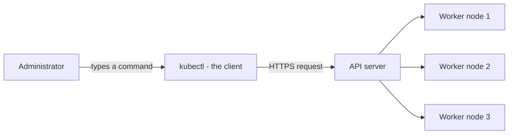
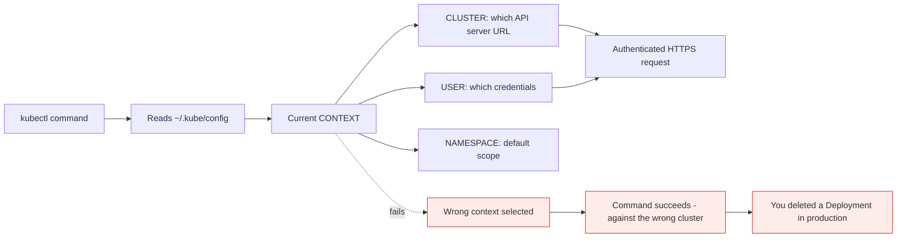

# kubectl: the remote control

*Module 08 · kubectl*

Every Kubernetes command you will ever type goes through one tool. It is worth being precise about what
that tool is - and, more usefully, what it is not.

[Course home](../index.md) / Module 08

## 1. What kubectl is

- kubectl is a **command line tool** - the **client**
- **It is NOT Kubernetes**
- It communicates with the **Kubernetes API server**
- **Everything goes through the API server**



> **Why it matters:** kubectl is a **remote control used to communicate with a Kubernetes cluster.** A remote control is not the television. It holds no state, runs no workloads, and makes no decisions - it sends requests to something that does. Everything you see in `kubectl get` came from the API server, and everything you change was decided by the API server.

## 2. "It is NOT Kubernetes" - why that sentence earns its capital letters

It sounds pedantic until you notice how much it explains.

| Because kubectl is only a client... | ...this follows |
| --- | --- |
| Deleting kubectl breaks nothing | The cluster keeps running; you have simply lost your remote |
| It runs anywhere | Your laptop, a CI runner, a jump host - it does not need to be on the cluster |
| It is not the only client | Lens, k9s, the Dashboard, Argo CD, Terraform and every client library do the same thing |
| It has no privileges of its own | Your permissions come from your credentials and RBAC, not from the binary |
| A control plane outage kills kubectl, not your app | Running Pods keep serving - you just cannot change anything (module 03, section 8) |

> **TIP - The one-line interview answer**
>
> "kubectl is a client. It turns commands into authenticated HTTPS calls against the Kubernetes API server, which is the only component that reads or writes cluster state." That sentence rules out every common misconception at once.

Proof that it is just HTTP, available right now:

```bash
kubectl get pods -v=8
```

You will see the exact request - `GET https://.../api/v1/namespaces/default/pods` - the headers, the
response code and the JSON that came back. There is no magic layer.

## 3. How kubectl knows which cluster to talk to

kubectl reads `~/.kube/config`. That one file answers three questions.



> **Why it matters:** kubectl will happily run the right command against the wrong cluster, and it will not warn you. This is the single most dangerous property of the tool. Checking your context before a destructive command is not paranoia - it is the habit that separates people who have caused an outage from people who have not yet.

| Concept | Meaning |
| --- | --- |
| **Cluster** | The API server address and its CA certificate |
| **User** | Your credentials - certificate, token, or a cloud auth plugin |
| **Context** | A named pairing of cluster + user + default namespace |

```bash
kubectl config get-contexts          # list them; * marks the current one
kubectl config current-context       # just the current one
kubectl config use-context k3d-devlab
kubectl config set-context --current --namespace=dev
```

> **NOTE - `KUBECONFIG` can point somewhere else**
>
> The `KUBECONFIG` environment variable overrides the default path, and can list several files separated by `:` which kubectl merges. This is how tools hand you a cluster without touching your main config - and why "it works in my terminal but not in the script" is usually a `KUBECONFIG` difference.

## 4. The shape of every command

```text
kubectl [COMMAND] [TYPE] [NAME] [FLAGS]
```

| Part | Example | Meaning |
| --- | --- | --- |
| COMMAND | `get`, `describe`, `delete`, `apply` | The verb - what to do |
| TYPE | `pod`, `deployment`, `svc`, `node` | The resource kind |
| NAME | `web-abc123` | Which one. Omit it for all of them |
| FLAGS | `-n dev`, `-o wide`, `--all-namespaces` | Modifiers |

```bash
kubectl get pods                          # every Pod in the current namespace
kubectl get pod web-abc123                # one Pod
kubectl get pods -n kube-system -o wide   # another namespace, more columns
kubectl get pods -A                       # every namespace
```

Kubernetes accepts singular, plural and short names - `pod`, `pods`, `po` are the same. See them all:

```bash
kubectl api-resources
```

## 5. The commands that do 90% of the work

| Command | What it is for |
| --- | --- |
| `kubectl get` | What exists, and its status |
| `kubectl describe` | Full detail **plus events** - the first stop when something is wrong |
| `kubectl logs` | What the application printed |
| `kubectl exec -it ... -- sh` | A shell inside a running container |
| `kubectl apply -f` | Declarative create-or-update from a file |
| `kubectl delete` | Remove an object |
| `kubectl edit` | Open the live object in an editor |
| `kubectl explain` | Documentation for any field, offline |

> **TIP - `describe` before `logs`, always**
>
> Most failures are visible in events long before they reach application logs. `ImagePullBackOff`, `FailedScheduling`, `Unhealthy`, `OOMKilled`, `FailedMount` - every one of those appears in `kubectl describe` and none of them appear in `kubectl logs`. Reaching for logs first is the most common wasted five minutes in Kubernetes.

`kubectl explain` deserves special mention, because it removes your dependency on searching the web:

```bash
kubectl explain pod.spec.containers.resources
kubectl explain deployment.spec.strategy --recursive
```

## 6. Output formats: where kubectl becomes powerful

```bash
kubectl get pods -o wide                       # node, IP, and more
kubectl get pod web -o yaml                    # the full live object
kubectl get pods -o jsonpath='{.items[*].spec.nodeName}'
kubectl get pods -o custom-columns='NAME:.metadata.name,NODE:.spec.nodeName'
kubectl get pods --sort-by=.status.startTime
kubectl get events --sort-by=.metadata.creationTimestamp
```

`-o yaml` is a learning tool as much as an operational one. Create something imperatively, then read what
Kubernetes actually stored - including every default it filled in for you.

## 7. Imperative and declarative

| Style | Command | Meaning |
| --- | --- | --- |
| **Imperative** | `kubectl create deployment web --image=nginx` | "Do this now. Fail if it exists" |
| **Declarative** | `kubectl apply -f deployment.yaml` | "Make reality match this file" |

Both are useful, for different reasons:

- **Imperative** is faster to type, ideal for learning and for exams.
- **Declarative** is what production uses - the file is reviewed, versioned and repeatable.

> **TIP - The trick that makes YAML painless**
>
> ```bash
> kubectl create deployment web --image=nginx:1.25-alpine --dry-run=client -o yaml > deploy.yaml
> ```
> Generate the manifest imperatively, then edit it. You get correct structure and correct field names without memorising the schema or copying from a blog. This is also the fastest way to answer YAML questions under exam time pressure.

## 8. Namespaces: the flag people forget

```bash
kubectl get pods                 # only the current namespace
kubectl get pods -n dev
kubectl get pods -A              # all namespaces
kubectl config set-context --current --namespace=dev   # change the default
```

> **WARNING - "My Pod disappeared"**
>
> It is almost always in another namespace. `kubectl get pods` is scoped to one namespace by default, and there is no warning that others exist. `-A` is the first thing to try before believing something is gone.

## 9. Permissions: kubectl has none of its own

Your request is authenticated as **you**, and RBAC decides what you may do. The binary grants nothing.

```bash
kubectl auth can-i delete deployments
kubectl auth can-i create pods -n production
kubectl auth can-i --list
```

> **NOTE - `Error from server (Forbidden)` is not a bug**
>
> It means authentication worked - the API server knows exactly who you are - and authorization refused. That is RBAC doing its job. Compare it with `Unauthorized`, which means your credentials were not accepted at all.

## 10. Speed, and why it matters

Fluency with kubectl is not a nice-to-have. It is the difference between debugging an incident calmly and
fumbling, and it is most of what the CKA exam measures.

```bash
# autocompletion - the single biggest speed win
source <(kubectl completion bash)
echo 'source <(kubectl completion bash)' >> ~/.bashrc

# the alias almost everyone uses
alias k=kubectl
complete -o default -F __start_kubectl k

# useful shortcuts
kubectl get po,svc,deploy                 # several types at once
kubectl get pods -w                       # watch changes live
kubectl delete pod web --now              # skip the grace period
kubectl logs -f deploy/web                # follow logs by controller, not Pod name
kubectl exec -it deploy/web -- sh
```

> **TIP - Reference a controller, not a Pod name**
>
> `kubectl logs -f deploy/web` keeps working after the Pod is replaced; `kubectl logs -f web-abc123` breaks the moment it restarts. Pod names are generated and disposable - build the habit of addressing the thing that outlives them.

## 11. Extra points

- **kubectl version skew**: kubectl is supported within one minor version of the cluster. A far newer or
  older client can behave oddly - `kubectl version` shows both.
- **Plugins via krew**: `kubectl krew install ctx ns` gives you `kubectl ctx` and `kubectl ns` for fast
  switching. Any executable named `kubectl-foo` on your PATH becomes `kubectl foo`.
- **k9s and Lens are alternative clients**, not alternative Kubernetes. They call the same API.
- **`kubectl proxy`** opens an authenticated local proxy to the API - handy for exploring raw endpoints
  with `curl`.
- **`kubectl diff -f file.yaml`** shows what `apply` would change, before you apply it. Use it in reviews.
- **kubectl is not the audit log.** The API server records who did what; your shell history does not.

> **PRACTICE - Practice now**
>
> 1. Confirm the client is present and see what it is talking to:
>    ```bash
>    kubectl version --client
>    kubectl cluster-info
>    kubectl get nodes
>    ```
> 2. **Prove kubectl is just an HTTP client:**
>    ```bash
>    kubectl get pods -v=8
>    ```
>    Find the `GET https://...` line in the output.
> 3. **Prove it is not Kubernetes.** Note the cluster is fine, then look at where its brain actually lives:
>    ```bash
>    kubectl get pods -n kube-system
>    ```
> 4. Read your own kubeconfig and understand every line:
>    ```bash
>    kubectl config view
>    kubectl config get-contexts
>    kubectl config current-context
>    ```
> 5. Build the habit that prevents outages - check context before anything destructive:
>    ```bash
>    kubectl config current-context && kubectl get all
>    ```
> 6. Practise the four verbs on one object:
>    ```bash
>    kubectl create deployment web --image=nginx:1.25-alpine
>    kubectl get deploy web -o wide
>    kubectl describe deploy web
>    kubectl logs deploy/web
>    ```
> 7. Generate YAML instead of writing it:
>    ```bash
>    kubectl create deployment api --image=nginx --dry-run=client -o yaml > api.yaml
>    kubectl apply -f api.yaml
>    kubectl diff -f api.yaml
>    ```
> 8. Learn the schema without leaving the terminal:
>    ```bash
>    kubectl explain deployment.spec.template.spec.containers
>    ```
> 9. Test your own permissions:
>    ```bash
>    kubectl auth can-i delete nodes
>    kubectl auth can-i --list
>    ```
> 10. Turn on autocompletion and the `k` alias. Then clean up:
>     ```bash
>     kubectl delete deployment web api
>     ```

> **ASSIGNMENT - Assignment**
>
> Write your own kubectl cheat sheet - not copied, but built from commands you have actually run - organised by intent rather than alphabetically: *what exists*, *why is it broken*, *change something*, *get inside it*, *find out what I am allowed to do*. Then delete it and rewrite it from memory a week later. The second version is the one worth keeping, and the gaps between the two are exactly what you still need to practise.

## 12. Interview drill

<details>
<summary><b>What is kubectl?</b></summary>

A command-line **client** for Kubernetes. It is not Kubernetes itself - it holds no state and runs no
workloads. It turns commands into authenticated HTTPS requests against the Kubernetes API server, which is
the only component that reads or writes cluster state. It is best described as a remote control: the
remote is not the television.

</details>

<details>
<summary><b>How does kubectl know which cluster to talk to, and how does it authenticate?</b></summary>

From `~/.kube/config`, or whatever `KUBECONFIG` points at. That file defines clusters - API server URLs
and CA certificates - users, which hold credentials such as client certificates, tokens or cloud auth
plugins, and contexts, which pair a cluster with a user and a default namespace. The current context
decides all three. kubectl itself has no privileges; the API server authenticates the credentials and RBAC
authorizes the action.

</details>

<details>
<summary><b>If kubectl stops working, is the cluster down?</b></summary>

Not necessarily, and this distinction matters during an incident. kubectl failing means you cannot reach
or authenticate to the API server. Running Pods keep serving traffic because the control plane is not in
the data path - kubelets keep their assigned workloads running and kube-proxy keeps routing. What you lose
is the ability to change anything: no deployments, no scaling, and no rescheduling if a node then fails.

</details>

<details>
<summary><b>Difference between `kubectl create` and `kubectl apply`?</b></summary>

`create` is imperative - "make this now", and it fails if the object already exists. `apply` is
declarative - "make the live object match this file" - and it works for both creation and update,
recording the applied configuration so subsequent applies can compute a correct patch. Production uses
`apply` with files in version control; `create` is convenient for learning and for exams.

</details>

<details>
<summary><b>A Pod is not working. Which kubectl command do you run first, and why?</b></summary>

`kubectl describe pod <name>` - because the Events section names the failure directly:
`FailedScheduling`, `ImagePullBackOff`, `Unhealthy`, `OOMKilled`, `FailedMount`. None of those appear in
`kubectl logs`, and several occur before the container ever starts, so there are no logs to read. Describe
first to find *which step* failed, then logs to see what the application said.

</details>

<details>
<summary><b>What is the most dangerous thing about kubectl?</b></summary>

That it runs the right command against the wrong cluster without warning. The current context is a piece
of state in a file you cannot see while typing, so `kubectl delete deployment web` behaves identically
whether you are pointed at your laptop cluster or production. The mitigation is habit and tooling: check
`kubectl config current-context` before destructive commands, use a prompt that displays the context, and
keep production behind a separate, deliberately awkward context.

</details>

---

[← Module 07](07-lab-friction-and-plan.md) &nbsp;&nbsp;|&nbsp;&nbsp; Module 09 coming next

---

Kubernetes Administration: Zero to Architect · Himanshu Kumar.
