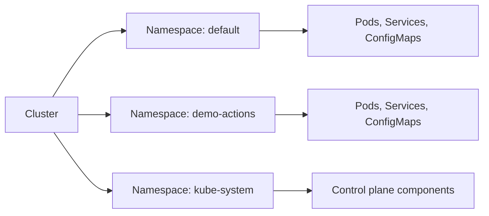

# kubectl actions: get, run, describe, create, delete

*Module 09 · kubectl*

kubectl is the remote control. This module is about the buttons on it. Five actions do almost everything
you will do in your first month, and the fastest way to learn them is to watch one object being born,
inspected and destroyed.

[Course home](../index.md) / Module 09

## 1. Actions, not commands

When you write `kubectl get`, you are not running a program called "get". You are **asking Kubernetes to
do something**. The word after `kubectl` is the **action** - the verb.

| Action | You are asking Kubernetes to... |
| --- | --- |
| `get` | Show me what exists |
| `run` | Start a Pod |
| `describe` | Tell me everything about this one thing |
| `create` | Make this resource |
| `delete` | Remove this resource |

> **NOTE - Do not memorise these**
>
> You will not remember commands by reading them. You will remember them because you used `get` forty times this week. Read this module for the *shape*, then type it. The commands stick by themselves once you are doing real work with Pods and Deployments.

We will use **Pods** and **Namespaces** as demo objects only. If you do not know what those are yet,
that is completely fine - they are covered properly in modules 13 onward. **Concentrate on the action,
not on the object.**

## 2. The full lifecycle, in six steps

```mermaid
flowchart LR
    S0["1. get - is anything there?"]
    S1["No resources found"]
    S2["2. run - create a Pod"]
    S3["3. get - ContainerCreating"]
    S4["4. get again - Running"]
    S5["5. describe - full detail"]
    S6["6. delete - remove it"]
    S7["get - No resources found"]
    S0 --> S1
    S1 --> S2
    S2 --> S3
    S3 --> S4
    S4 --> S5
    S5 --> S6
    S6 --> S7
```



> **Why it matters:** This loop - *look, change, look again* - is how you will work with Kubernetes forever. Never run a command that changes something without running `get` before and after. That habit alone will save you from most self-inflicted confusion.

### Step 1 - `get`: check what already exists

```bash
kubectl get pods
```

```text
No resources found in default namespace.
```

That message means exactly what it says: this cluster currently has no Pods in the default namespace.
The action was `get` - "I want some detail out of the cluster".

### Step 2 - `run`: create a Pod

```bash
kubectl run demo-pod --image=nginx
```

```text
pod/demo-pod created
```

The action was `run`. `get` told us nothing was there; `run` put something there.

### Step 3 - `get` again: watch it come up

```bash
kubectl get pods
```

```text
NAME       READY   STATUS              RESTARTS   AGE
demo-pod   0/1     ContainerCreating   0          32s
```

`ContainerCreating` means the Pod exists but is not ready yet - the image is still being pulled and the
container is still being started. Press the up arrow and run it again:

```text
NAME       READY   STATUS    RESTARTS   AGE
demo-pod   1/1     Running   0          58s
```

Now it is ready.

> **TIP - The up arrow is your friend**
>
> Repeating `kubectl get pods` while something is starting is normal and correct. If you get tired of it, `kubectl get pods -w` watches continuously until you press Ctrl-C.

### Step 4 - `describe`: full detail on one object

```bash
kubectl describe pod demo-pod
```

You get its name, which namespace it was created in, when it was created, which node it landed on, the
image it used, its events - all of it. You do not need to understand every line yet. What matters is the
idea: **`describe` gives detail about one specific object.**

### Step 5 - `delete`: remove it

```bash
kubectl delete pod demo-pod
```

```text
pod "demo-pod" deleted from default namespace
```

> **NOTE - `delete` is almost the same for everything**
>
> `kubectl delete pod x`, `kubectl delete deployment y`, `kubectl delete namespace z`. The verb barely changes across resource types, which is why learning the verbs is more valuable than learning individual commands.

### Step 6 - `get`: confirm

```bash
kubectl get pods
```

```text
No resources found in default namespace.
```

Back where we started. **get → run → get → describe → delete → get.**

## 3. `run` versus `create`

Now create a different kind of object - a Namespace - and notice the verb changes:

```bash
kubectl create namespace demo-actions
```

```text
namespace/demo-actions created
```

Why `create` here and `run` for the Pod?

| Verb | Used for | Mental model |
| --- | --- | --- |
| `run` | Pods only | A kind of **execution** - "start this running" |
| `create` | Namespaces, Deployments, Services, ConfigMaps, Secrets, jobs... | A kind of **construction** - "make this object" |

```bash
kubectl create deployment web --image=nginx
kubectl create configmap app-config --from-literal=color=blue
kubectl create secret generic db --from-literal=password=s3cret
kubectl create job backup --image=busybox
```

> **TIP - `kubectl run` is now Pods-only**
>
> Early Kubernetes let `kubectl run` create Deployments, Jobs and CronJobs too. That was removed to stop the confusion. Today: `run` makes a Pod, `create` makes everything else. If a tutorial shows `kubectl run --generator=...`, it predates 2019.

## 4. Namespaces, briefly

A Namespace is **a kind of folder**.



> **Why it matters:** When you have hundreds of files on your C: drive, you make folders. When you have hundreds of resources in a cluster, you make Namespaces. Same problem, same solution.

| Fact | Detail |
| --- | --- |
| A default one always exists | It is literally called `default` |
| No namespace given = `default` | Which is why deletion said "deleted **from the default namespace**" |
| Kubernetes has its own | `kube-system` holds the control plane components |

```bash
kubectl get namespaces
kubectl get ns                      # short name - module 10
```

You will see a long list. Concentrate on two things: `default` is always there, and `demo-actions` -
which you just created - is now there too.

Clean up with the same verb as always:

```bash
kubectl delete namespace demo-actions
kubectl get namespaces
```

`demo-actions` is gone. Notice that by now you could have guessed both the delete command and the verify
command without being told - that is the point of learning verbs.

> **WARNING - Deleting a namespace deletes everything inside it**
>
> Every Pod, Service, Secret and ConfigMap in it, with one command and no confirmation prompt. In a real cluster this is one of the most destructive things you can type. Check `kubectl config current-context` first, every time.

## 5. The rest of the verbs

The five above cover most of your first month. Here is the wider set so you recognise them:

| Verb | Purpose |
| --- | --- |
| `apply -f` | Declarative create-or-update from a file - module 12 |
| `edit` | Open the live object in an editor and change it |
| `patch` | Change one field without opening an editor |
| `scale` | Change replica count |
| `expose` | Create a Service for an existing workload |
| `logs` | Read container output - module 16 |
| `exec` | Run a command inside a container - module 16 |
| `port-forward` | Reach a Pod from your machine - module 16 |
| `cp` | Copy files in or out of a container |
| `label` / `annotate` | Add metadata |
| `rollout` | Manage and roll back Deployment updates |
| `top` | CPU and memory usage |
| `wait` | Block until a condition is met - useful in scripts |
| `explain` | Documentation for any field - module 10 |
| `api-resources` | What can I even create? - module 10 |

## 6. Things that will bite you

| Behaviour | What actually happens |
| --- | --- |
| `delete` is **asynchronous** | The object enters `Terminating` and gets a grace period - usually 30s - before it is gone |
| `get` is scoped to one namespace | Add `-n <name>`, or `-A` for all namespaces |
| `create` fails if it exists | `Error ... already exists`. `apply` does not - that is the difference |
| `describe` shows **Events** | Which is where failures are explained. `get` will not show you those |
| Deleting a Pod created by a Deployment | A replacement appears immediately - the controller recreated it |

```mermaid
flowchart LR
    S0["kubectl delete pod web"]
    S1["Pod enters Terminating"]
    S2["SIGTERM sent, grace period runs"]
    S3["Pod removed"]
    S0 --> S1
    S1 --> S2
    S2 --> S3
    F0["Pod is owned by a Deployment"]
    F1["ReplicaSet controller sees 2 of 3"]
    F2["A new Pod is created instantly"]
    F3["It looks like your delete did nothing"]
    S3 -.->|"fails"| F0
    F0 --> F1
    F1 --> F2
    F2 --> F3
    classDef bad fill:#fdecea,stroke:#c62828;
    class F0,F1,F2,F3 bad;
```



> **Why it matters:** "I deleted the Pod and it came back" is not a bug and not a haunting. It is desired state doing its job - the same behaviour you proved in module 02. To actually remove it, delete the thing that owns it.

> **PRACTICE - Practice now**
>
> Run the whole lifecycle yourself. Type it; do not paste it.
>
> 1. Check what exists:
>    ```bash
>    kubectl get pods
>    ```
> 2. Create a Pod with the `run` action:
>    ```bash
>    kubectl run demo-pod --image=nginx
>    ```
> 3. Watch it start, twice, until the status changes:
>    ```bash
>    kubectl get pods
>    kubectl get pods
>    ```
> 4. Get full detail:
>    ```bash
>    kubectl describe pod demo-pod
>    ```
> 5. Delete it and confirm:
>    ```bash
>    kubectl delete pod demo-pod
>    kubectl get pods
>    ```
> 6. Now a different object, with a different verb:
>    ```bash
>    kubectl create namespace demo-actions
>    kubectl get namespaces
>    kubectl delete namespace demo-actions
>    kubectl get namespaces
>    ```
> 7. **Prove `create` is not `apply`.** Run the same create twice:
>    ```bash
>    kubectl create namespace demo-actions
>    kubectl create namespace demo-actions
>    ```
>    Read the error. Then clean up.
> 8. **Prove deletion is asynchronous.** In one terminal:
>    ```bash
>    kubectl get pods -w
>    ```
>    In another:
>    ```bash
>    kubectl run slow --image=nginx
>    kubectl delete pod slow
>    ```
>    Watch `Terminating` appear before the Pod disappears.
> 9. **Prove the "it came back" behaviour:**
>    ```bash
>    kubectl create deployment web --image=nginx --replicas=2
>    kubectl get pods
>    kubectl delete pod <one-of-them>
>    kubectl get pods
>    kubectl delete deployment web
>    ```

> **ASSIGNMENT - Assignment**
>
> Write out the six-step lifecycle on paper from memory - the verb at each step and the output you expect. Then perform it against a namespace you create, rather than `default`, using `-n` on every command. Getting the namespace flag into your muscle memory now prevents the single most common beginner mistake: running the right command in the wrong namespace and concluding that something is broken.

## 7. Interview drill

<details>
<summary><b>What is the difference between `kubectl run` and `kubectl create`?</b></summary>

`run` creates a **Pod** and nothing else - it is a kind of execution. `create` builds other resource
types: namespaces, deployments, services, configmaps, secrets, jobs. Older Kubernetes allowed `run` to
generate Deployments and Jobs via generators; that was removed to end the ambiguity, so today `run` means
"start a Pod".

</details>

<details>
<summary><b>What is the difference between `kubectl get` and `kubectl describe`?</b></summary>

`get` lists objects and their high-level status, in a table, across many objects. `describe` gives the
full detail of one object - including its **Events**, which is where scheduling failures, image pull
failures and probe failures are reported. If something is wrong, `describe` is the command that tells you
why; `get` only tells you that.

</details>

<details>
<summary><b>You deleted a Pod and it immediately reappeared. Why?</b></summary>

Because the Pod was owned by a controller - a ReplicaSet behind a Deployment. Deleting the Pod made
current state fall below desired state, so the controller created a replacement within milliseconds. That
is self-healing working correctly. To remove it permanently, delete the owning Deployment.

</details>

<details>
<summary><b>What is a Namespace, in one sentence?</b></summary>

A logical folder that groups and isolates resources inside a cluster - the same idea as directories for
files. Every cluster has a `default` namespace, resources created without a namespace go there, and
Kubernetes keeps its own control plane components in `kube-system`. Namespaces also form a boundary for
RBAC, resource quotas and network policy.

</details>

<details>
<summary><b>Is `kubectl delete` immediate?</b></summary>

No. The object is marked for deletion and enters `Terminating`, containers receive SIGTERM, and a grace
period - 30 seconds by default - allows a clean shutdown before SIGKILL. You can shorten it with
`--grace-period`, but forcing deletion with `--force --grace-period=0` on an unreachable node is
dangerous: the API forgets the Pod while the container may still be running, which is exactly the
duplicate-workload trap from module 04.

</details>

---

[← Module 08](08-kubectl.md) &nbsp;&nbsp;|&nbsp;&nbsp; [Module 10: Discovering resources →](10-api-resources-and-explain.md)

---

Kubernetes Administration: Zero to Architect · Himanshu Kumar.
