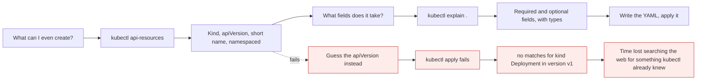

# Discovering resources: `api-resources` and `explain`

*Module 10 · kubectl*

Many engineers hear "kubectl is a command line utility" and assume it must be complex and memory-heavy.
That is wrong. Used smartly, kubectl tells you everything you need - what you can create, what fields
exist, which are required - without a browser and without memorising anything.

[Course home](../index.md) / Module 10

## 1. Two questions, two commands



> **Why it matters:** These two commands remove the need to memorise the object model. `api-resources` answers *what*; `explain` answers *how*. Both work offline, both are always correct for the exact cluster version you are on, and both are allowed in the CKA exam.

## 2. Warming up: `get` across different resources

```bash
kubectl get nodes            # one control plane, plus worker nodes
kubectl get namespaces       # the folders
kubectl get pods
kubectl get services
kubectl get deployments
```

Do not worry about what Services and Deployments are - they arrive later. Right now the point is that
`get` is the same verb regardless of the noun, and the obvious next question is: **how do I know which
nouns exist?**

## 3. `kubectl api-resources`: the full catalogue

```bash
kubectl api-resources
```

```text
NAME                    SHORTNAMES   APIVERSION   NAMESPACED   KIND
configmaps              cm           v1           true         ConfigMap
endpoints               ep           v1           true         Endpoints
namespaces              ns           v1           false        Namespace
nodes                   no           v1           false        Node
persistentvolumeclaims  pvc          v1           true         PersistentVolumeClaim
pods                    po           v1           true         Pod
services                svc          v1           true         Service
deployments             deploy       apps/v1      true         Deployment
```

Every column earns its place:

| Column | What it tells you |
| --- | --- |
| **NAME** | What you type after a verb: `kubectl get pods` |
| **SHORTNAMES** | The shortcut - section 4 |
| **APIVERSION** | What goes in the `apiVersion:` line of your YAML |
| **NAMESPACED** | `true` = lives inside a namespace, `false` = cluster-wide |
| **KIND** | What goes in the `kind:` line of your YAML |

**This is the list of everything you can create in this cluster.** Including custom resources installed
by operators - which is why it is per-cluster and not something to memorise.

### 3.1 Namespaced or not

```bash
kubectl api-resources --namespaced=true     # things that live inside a namespace
kubectl api-resources --namespaced=false    # things that belong to the whole cluster
```

| Namespaced (`true`) | Cluster-scoped (`false`) |
| --- | --- |
| Pods, Services, Deployments | Nodes |
| ConfigMaps, Secrets | Namespaces themselves |
| PersistentVolumeClaims | PersistentVolumes |
| Roles, RoleBindings | ClusterRoles, ClusterRoleBindings, StorageClasses |

> **TIP - This explains a confusing error**
>
> `kubectl get nodes -n dev` silently ignores the namespace, because Nodes are cluster-scoped. And `error: the server doesn't have a resource type` usually means you spelled the resource wrong - check `api-resources` rather than guessing.

### 3.2 Why `apiVersion` is sometimes `v1` and sometimes `apps/v1`

This trips up everyone writing their first YAML.

| apiVersion | Group | Examples |
| --- | --- | --- |
| `v1` | The **core** group - no prefix, it came first | Pod, Service, ConfigMap, Secret, Namespace, Node |
| `apps/v1` | The `apps` group | Deployment, StatefulSet, DaemonSet, ReplicaSet |
| `batch/v1` | The `batch` group | Job, CronJob |
| `networking.k8s.io/v1` | Networking | Ingress, NetworkPolicy |
| `rbac.authorization.k8s.io/v1` | RBAC | Role, ClusterRole, bindings |

```bash
kubectl api-resources --api-group=apps
kubectl api-versions
```

> **WARNING - `no matches for kind "Deployment" in version "v1"`**
>
> This is the single most common YAML error, and it means exactly one thing: you wrote `apiVersion: v1` for a resource that lives in a named group. Deployments are `apps/v1`. Never guess - `kubectl api-resources` prints the correct value for every kind.

## 4. Short names: the smart way to type

Look at that first column again. `cm`, `ep`, `pvc`, `po`, `ns`, `svc`. Those are **shortcuts**, and they
exist for a reason: some resource names are long, easy to misspell, and slow to type under exam pressure.
`persistentvolumeclaims` is a genuine hazard; `pvc` is not.

```bash
kubectl get po          # pods
kubectl get ns          # namespaces
kubectl get svc         # services
kubectl get deploy      # deployments
kubectl get cm          # configmaps
kubectl get pvc         # persistentvolumeclaims
kubectl get no          # nodes
```

| Full | Short |
| --- | --- |
| `pods` | `po` |
| `services` | `svc` |
| `deployments` | `deploy` |
| `replicasets` | `rs` |
| `namespaces` | `ns` |
| `nodes` | `no` |
| `configmaps` | `cm` |
| `persistentvolumeclaims` | `pvc` |
| `persistentvolumes` | `pv` |
| `serviceaccounts` | `sa` |
| `statefulsets` | `sts` |
| `daemonsets` | `ds` |
| `ingresses` | `ing` |

> **NOTE - Mixing full and short names is normal**
>
> Most people end up with habits rather than rules - typing `pods` in full but always writing `svc`. Both work everywhere, including in the exam. There is nothing to be consistent about; use whichever comes out of your fingers faster.

You did not need to memorise that table, either. It is the SHORTNAMES column of `api-resources`.

## 5. `kubectl explain`: the documentation that ships with your cluster

You know you can create a Pod. Now: what does a Pod actually need?

```bash
kubectl explain pod
```

```text
KIND:     Pod
VERSION:  v1

DESCRIPTION:
     Pod is a collection of containers that can run on a host...

FIELDS:
   apiVersion   <string>
   kind         <string>
   metadata     <Object>
   spec         <Object>
   status       <Object>
```

So a Pod is `apiVersion`, `kind`, `metadata`, `spec` and `status`. Drill down:

```bash
kubectl explain pod.spec
```

Among the many fields you will find:

```text
   containers   <[]Object> -required-
     List of containers belonging to the pod. Cannot be updated.
```

**`-required-`** is the word to look for. `containers` is mandatory. Keep going:

```bash
kubectl explain pod.spec.containers
```

```text
   name    <string> -required-
   image   <string>
   ports   <[]Object>
   env     <[]Object>
   ...
```

And one more level, to see the type:

```bash
kubectl explain pod.spec.containers.name
kubectl explain pod.spec.containers.image
```

### 5.1 From `explain` to a working manifest

Everything needed to write the file came from those five commands:

| Where it came from | Line in the YAML |
| --- | --- |
| `api-resources` → APIVERSION `v1` | `apiVersion: v1` |
| `api-resources` → KIND `Pod` | `kind: Pod` |
| `explain pod` → `metadata` | `metadata:` |
| `explain pod.spec` → `containers` is required | `spec.containers:` |
| `explain pod.spec.containers` → `name` required, `image` | `- name:` / `image:` |

```yaml
apiVersion: v1
kind: Pod
metadata:
  name: explain-pod
spec:
  containers:
    - name: nginx
      image: nginx
```

```bash
kubectl apply -f explain-pod.yaml
kubectl get pods
kubectl delete -f explain-pod.yaml
```

Writing that file by hand is covered properly in module 17. The point here is different and worth
stating plainly: **you did not look anything up on the internet.** The cluster told you.

### 5.2 `--recursive`: the whole structure at once

```bash
kubectl explain pod --recursive
```

Long output - and exactly what you want when you are hunting for a field name. Every field, nested,
with `-required-` marked. Combine it with a search:

```bash
kubectl explain pod --recursive | Select-String -Pattern "restartPolicy|nodeName|resources"
```

### 5.3 It works for every resource

```bash
kubectl explain deployment.spec
kubectl explain deployment.spec.strategy
kubectl explain service.spec
kubectl explain service.spec.type
kubectl explain ingress.spec.rules
```

You do not know what Deployments or Services are yet, and it does not matter. When you meet them, this is
how you will find their fields.

> **TIP - This is allowed in the CKA exam**
>
> The CKA permits the official documentation, but navigating a website under time pressure is slow. `kubectl explain` is instant, local, and correct for the exact cluster version in front of you. If you forget a field name mid-exam, this is the fastest recovery available.

## 6. The three discovery tools together

| Question | Command |
| --- | --- |
| What kinds exist, and what is their apiVersion? | `kubectl api-resources` |
| What fields does this kind take, and which are required? | `kubectl explain <kind>[.<path>]` |
| Just give me a working starting file | `kubectl create ... --dry-run=client -o yaml` |

```bash
kubectl create deployment web --image=nginx --dry-run=client -o yaml
kubectl run demo --image=nginx --dry-run=client -o yaml
```

> **NOTE - Generate first, then explain**
>
> The fastest real-world workflow is: generate a skeleton with `--dry-run=client -o yaml`, then use `explain` to look up any field you want to add to it. Writing manifests from a blank file is a beginner exercise worth doing twice - and then never again.

> **PRACTICE - Practice now**
>
> Prove to yourself that you never need to search the web for the object model.
>
> 1. See the whole catalogue, and find Pod in it:
>    ```bash
>    kubectl api-resources
>    ```
> 2. Split it by scope and note which things are cluster-wide:
>    ```bash
>    kubectl api-resources --namespaced=false
>    ```
> 3. Find the correct apiVersion for a Deployment, without guessing:
>    ```bash
>    kubectl api-resources --api-group=apps
>    ```
> 4. **Prove the classic error.** Write a file with `apiVersion: v1` and `kind: Deployment`, apply it, and
>    read the message. Then fix it to `apps/v1`.
> 5. Use short names for everything for one full session:
>    ```bash
>    kubectl get po
>    kubectl get ns
>    kubectl get svc
>    ```
> 6. Walk down a Pod, one level at a time, and note every `-required-`:
>    ```bash
>    kubectl explain pod
>    kubectl explain pod.spec
>    kubectl explain pod.spec.containers
>    kubectl explain pod.spec.containers.image
>    ```
> 7. Now write the minimal Pod YAML using only what `explain` told you, apply it, and delete it:
>    ```bash
>    kubectl apply -f explain-pod.yaml
>    kubectl get pods
>    kubectl delete -f explain-pod.yaml
>    ```
> 8. Search the full structure for a field you have heard of but not used:
>    ```bash
>    kubectl explain pod --recursive | Select-String -Pattern "restartPolicy"
>    ```
> 9. Try it on resources you have not met yet, just to see it works:
>    ```bash
>    kubectl explain deployment.spec.replicas
>    kubectl explain service.spec.type
>    ```

> **ASSIGNMENT - Assignment**
>
> Pick any resource you have never used - a `CronJob`, a `NetworkPolicy`, a `PodDisruptionBudget` - and write a valid manifest for it using **only** `kubectl api-resources` and `kubectl explain`. No web search, no AI, no copying. Apply it, confirm it was accepted, then delete it. When you can do that reliably, you have stopped depending on examples, and there is no version of Kubernetes you cannot work with.

## 7. Interview drill

<details>
<summary><b>How do you find out what resources a cluster supports?</b></summary>

`kubectl api-resources`. It lists every kind the API server currently serves - including CustomResource
Definitions installed by operators - along with its short names, its apiVersion, whether it is namespaced,
and the exact `kind` string. Because it is generated from the live API server, it is always correct for
that cluster and that version, which a web search is not.

</details>

<details>
<summary><b>Why is a Pod `apiVersion: v1` but a Deployment `apiVersion: apps/v1`?</b></summary>

Kubernetes groups its API. Pod, Service, ConfigMap, Secret, Namespace and Node are in the original
**core** group, which has no prefix and so appears simply as `v1`. Later resources were added in named
groups - `apps` for Deployments, StatefulSets and DaemonSets, `batch` for Jobs, `networking.k8s.io` for
Ingress. Using `v1` for a Deployment produces `no matches for kind "Deployment" in version "v1"`, and
`kubectl api-resources` gives the right answer every time.

</details>

<details>
<summary><b>What is the difference between a namespaced and a cluster-scoped resource?</b></summary>

Namespaced resources live inside a namespace and can share a name with a resource in another namespace -
Pods, Services, Deployments, ConfigMaps, Secrets, Roles. Cluster-scoped resources belong to the whole
cluster and have no namespace - Nodes, Namespaces themselves, PersistentVolumes, StorageClasses,
ClusterRoles. The `NAMESPACED` column of `kubectl api-resources` tells you which, and it also determines
whether a Role or a ClusterRole is needed to grant access.

</details>

<details>
<summary><b>You cannot remember the exact field name for something in a Pod spec. What do you do?</b></summary>

`kubectl explain pod --recursive` and search the output, or walk down the path -
`kubectl explain pod.spec`, then `pod.spec.containers`, and so on. It shows every field, its type, and
which are `-required-`. It is offline, instant, correct for the running cluster version, and permitted in
the CKA exam - which makes it faster and safer than the website under time pressure.

</details>

<details>
<summary><b>What is the fastest way to produce a correct manifest?</b></summary>

Generate rather than write: `kubectl create deployment web --image=nginx --dry-run=client -o yaml` gives
a valid skeleton with the correct apiVersion, kind and structure. Then use `kubectl explain` to look up
any additional field you want to add. Writing manifests from an empty file is a useful exercise once, but
in real work generating and editing is both faster and less error-prone.

</details>

---

[← Module 09](09-kubectl-actions.md) &nbsp;&nbsp;|&nbsp;&nbsp; [Module 11: Output formats →](11-output-formats.md)

---

Kubernetes Administration: Zero to Architect · Himanshu Kumar.
