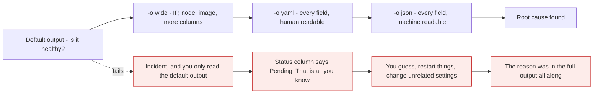
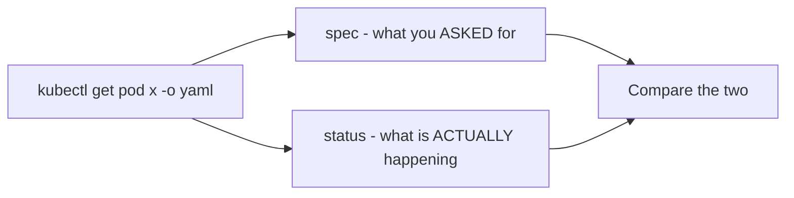

# Output formats: default, wide, YAML and JSON

*Module 11 · kubectl*

There are two kinds of people learning Kubernetes. Some want it on a CV and are done. Others are in it
for the long race - they intend to deploy real applications, script things, and automate them. This
module is for the second group, because output formats are how you stop reading Kubernetes and start
querying it.

[Course home](../index.md) / Module 11

## 1. YAML and JSON, before we touch the cluster

We are not writing files yet - only reading output. Still, knowing the difference makes everything after
this easier.

| | YAML | JSON |
| --- | --- | --- |
| Stands for | YAML Ain't Markup Language | JavaScript Object Notation |
| Readability | **Very easy to read** - key and value, line by line | Less easy to read and compare |
| The thing that bites you | **Indentation** must be exact | Curly braces, square brackets, commas, quotes |
| Used in Kubernetes for | **Writing manifest files** | **Structured output for tools and scripts** |
| File extension | `.yaml` or `.yml` | `.json` |
| Best for | Humans - learning, editing, troubleshooting | Machines - automation, filtering, pipelines |
| Used with | `kubectl apply -f`, directly | Scripts, the API, automation |

> **NOTE - The complexity argument has weakened**
>
> People used to avoid JSON because it was fiddly to write by hand. That matters much less now - you rarely hand-write JSON for Kubernetes, and when structure is awkward, an AI assistant will convert or generate it in seconds. Choose the format by *who is reading it*, not by which one feels harder.

**The rule to remember:** output for a human → YAML. Output for a machine → JSON.

## 2. The escalation ladder



> **Why it matters:** When everything is fine, the default output is enough - that is why it is the default. The moment a customer says *"I cannot open the application"*, the default output stops being useful. Knowing how to escalate to full detail, on demand, is the difference between diagnosing and guessing.

## 3. Walking the ladder on real objects

### Default

```bash
kubectl get nodes
```

```text
NAME                    STATUS   ROLES                  AGE   VERSION
k3d-devlab-server-0     Ready    control-plane,master   2d    v1.31.x+k3s1
k3d-devlab-agent-0      Ready    <none>                 2d    v1.31.x+k3s1
```

Neither YAML nor JSON - a human-friendly table. Enough to answer "is the cluster healthy?"

### `-o wide`

```bash
kubectl get nodes -o wide
```

Now you also get internal IP, external IP, OS image, kernel version and container runtime. Still a table,
just more columns.

```bash
kubectl get pods -o wide
```

For Pods this adds the two columns you will use constantly: **IP** and **NODE**.

### `-o yaml`

```bash
kubectl get nodes -o yaml
```

The complete object - everything Kubernetes stores. `items`, `kind`, `metadata`, `spec`, `status`, all
as key-value pairs, all indented. Do not try to read it line by line yet; notice only that **nothing is
hidden here.**

### `-o json`

```bash
kubectl get nodes -o json
```

The same information, with braces and brackets. Compare the two side by side and pick whichever your eye
prefers - **the content is identical, only the format differs.**

## 4. A worked troubleshooting example

```bash
kubectl run output-demo --image=nginx
kubectl get pod output-demo
```

```text
NAME          READY   STATUS              RESTARTS   AGE
output-demo   0/1     ContainerCreating   0          5s
```

Run it again and it becomes `Running`. Fine. But **imagine it does not** - imagine it sits at `0/1`
`ContainerCreating` and never moves. Something is wrong with creating that Pod. How do you find out?

```bash
kubectl get pod output-demo -o wide       # which node? does it even have an IP?
kubectl get pod output-demo -o yaml       # everything
kubectl describe pod output-demo          # events, in plain English
```

```bash
kubectl delete pod output-demo
```

> **TIP - The modern shortcut**
>
> Take the `-o yaml` output, paste it into an AI assistant, and ask what is wrong with it. It is genuinely effective for unfamiliar failures, because the answer is almost always somewhere in that output. What matters is that you know *which output to capture* - that judgement is the skill, and it is yours, not the model's.

## 5. `spec` and `status`: the most useful thing in `-o yaml`



> **Why it matters:** This is module 03's reconciliation loop, made visible in a file. `spec` is desired state - the image, the resources, the node selector you asked for. `status` is observed state - the phase, the conditions, the container states, the real IP, the reason a container was killed. When they disagree, the difference *is* your bug, and `-o yaml` is where you see both at once.

```bash
kubectl get pod web -o yaml | Select-String -Pattern "phase|reason|message|exitCode" -Context 0,2
```

> **NOTE - `-o yaml` shows you the defaults you never wrote**
>
> Create a Pod with three lines of YAML, then read it back with `-o yaml`. You will find dozens of fields you never specified - `restartPolicy: Always`, `dnsPolicy: ClusterFirst`, `terminationGracePeriodSeconds: 30`, a service account, tolerations. Kubernetes filled them in. Reading your own objects back is one of the fastest ways to learn what the platform actually does on your behalf.

## 6. Beyond yaml and json

Once output is structured, you can select from it.

```bash
kubectl get pods -o name
kubectl get pods -o jsonpath='{.items[*].metadata.name}'
kubectl get pods -o jsonpath='{range .items[*]}{.metadata.name}{"\t"}{.spec.nodeName}{"\n"}{end}'
kubectl get pods -o custom-columns='NAME:.metadata.name,NODE:.spec.nodeName,IMAGE:.spec.containers[0].image'
kubectl get pods --sort-by=.status.startTime
kubectl get nodes -o jsonpath='{.items[*].status.addresses[?(@.type=="InternalIP")].address}'
```

| Format | Use it for |
| --- | --- |
| `-o wide` | Daily work - the extra columns you actually want |
| `-o yaml` | Troubleshooting, learning, saving an object |
| `-o json` | Piping into scripts, `jq`, or any tool |
| `-o name` | Feeding object names into another command |
| `-o jsonpath` | Extracting one value - the automation workhorse |
| `-o custom-columns` | Building your own table for a report |

```bash
kubectl get pods -o json | jq '.items[] | {name: .metadata.name, phase: .status.phase}'
```

> **TIP - Saving an object is not a backup, quite**
>
> `kubectl get deploy web -o yaml > web.yaml` captures the live object - but it includes `status`, `resourceVersion`, `uid`, `creationTimestamp` and `managedFields`, none of which should be reapplied. Strip them before reusing the file. The clean way to keep a deployable copy is to keep the manifest you applied, in git - which is exactly where module 12 goes next.

## 7. Extra points

- **`managedFields` is noise.** It records which controller last changed each field. Hide it with
  `kubectl get pod x -o yaml --show-managed-fields=false` on newer versions, or just scroll past it.
- **`-o yaml` works on `get`, not on `describe`.** `describe` is a human-formatted report and has no
  machine format at all - which is why it is for reading and `-o yaml` is for parsing.
- **`kubectl get events -o json`** is how you feed cluster events into an alerting or analysis pipeline.
- **jsonpath is not quite JSONPath.** Kubernetes implements a subset with its own `range`/`end` syntax.
  When something does not work, that is usually why.
- **`-o json | jq` beats jsonpath for anything complex.** Use jsonpath for one value, `jq` for real work.

> **PRACTICE - Practice now**
>
> 1. Walk the ladder on nodes and read what each level adds:
>    ```bash
>    kubectl get nodes
>    kubectl get nodes -o wide
>    kubectl get nodes -o yaml
>    kubectl get nodes -o json
>    ```
> 2. Create a Pod and do the same:
>    ```bash
>    kubectl run output-demo --image=nginx
>    kubectl get pod output-demo
>    kubectl get pod output-demo -o wide
>    ```
> 3. **Find the defaults you never wrote.** Read your three-line Pod back in full:
>    ```bash
>    kubectl get pod output-demo -o yaml
>    ```
>    Find `restartPolicy`, `dnsPolicy` and `terminationGracePeriodSeconds`. You did not set any of them.
> 4. **Separate spec from status** and see the reconciliation loop in a file:
>    ```bash
>    kubectl get pod output-demo -o jsonpath='{.spec.containers[0].image}'
>    kubectl get pod output-demo -o jsonpath='{.status.phase}'
>    ```
> 5. **Break something and escalate properly.** Create a Pod that cannot pull its image, then read it at
>    each level:
>    ```bash
>    kubectl run broken --image=nginx:no-such-tag
>    kubectl get pod broken
>    kubectl get pod broken -o wide
>    kubectl get pod broken -o yaml
>    kubectl describe pod broken
>    ```
>    Note which level first told you the real reason.
> 6. Extract single values, the way a script would:
>    ```bash
>    kubectl get pods -o jsonpath='{.items[*].metadata.name}'
>    kubectl get pods -o custom-columns='NAME:.metadata.name,NODE:.spec.nodeName'
>    ```
> 7. Clean up:
>    ```bash
>    kubectl delete pod output-demo broken
>    ```

> **ASSIGNMENT - Assignment**
>
> Write a one-line command that prints every Pod in the cluster with its node and its current phase, sorted, using `custom-columns`. Then write the same thing again with `-o json | jq`. Keep both in your notes. The first is what you will type during an incident; the second is what you will put in a script. Being able to move between "look at it" and "compute over it" is the exact point where you stop being a Kubernetes user and start being an operator.

## 8. Interview drill

<details>
<summary><b>When do you use YAML output and when do you use JSON?</b></summary>

YAML when a human is reading it - troubleshooting, inspecting an object, learning what fields Kubernetes
defaulted. JSON when a machine is reading it - scripts, `jq` pipelines, automation, anything that parses.
The content is identical; only the encoding differs. YAML is also what you write manifests in, because
indentation is easier to author and review than braces and commas.

</details>

<details>
<summary><b>What is the difference between `spec` and `status` in an object?</b></summary>

`spec` is desired state - what you asked for. `status` is observed state - what the controllers and
kubelet report is actually true right now. Controllers exist to make the second match the first, so when
they disagree, the difference is either work in progress or your bug. `kubectl get ... -o yaml` shows both
in one place, which is why it is the most useful troubleshooting output there is.

</details>

<details>
<summary><b>Can you use `-o yaml` with `kubectl describe`?</b></summary>

No. `describe` produces a human-formatted report assembled from several API calls, including events - it
has no machine-readable form. `get` returns the actual API object, so it supports `-o yaml`, `-o json`,
`-o jsonpath` and `custom-columns`. In practice you use `describe` to read the story and `get -o yaml` to
extract the data.

</details>

<details>
<summary><b>How would you extract just the node name for every Pod?</b></summary>

`kubectl get pods -o custom-columns='NAME:.metadata.name,NODE:.spec.nodeName'` for a readable table, or
`kubectl get pods -o jsonpath='{range .items[*]}{.metadata.name}{"\t"}{.spec.nodeName}{"\n"}{end}'` for a
script. For anything more complex, `-o json | jq` is easier than fighting Kubernetes' jsonpath subset.

</details>

<details>
<summary><b>Is `kubectl get deploy x -o yaml > file.yaml` a valid backup?</b></summary>

Partially, and it is a common mistake to treat it as one. The output includes runtime fields -
`status`, `resourceVersion`, `uid`, `creationTimestamp`, `managedFields` - that should not be reapplied,
and cluster-assigned values that will conflict on restore. It is useful for capturing a live object
during an incident, but the real backup is the manifest you applied, kept in version control, plus an
etcd snapshot for the cluster itself.

</details>

---

[← Module 10](10-api-resources-and-explain.md) &nbsp;&nbsp;|&nbsp;&nbsp; [Module 12: Imperative vs declarative →](12-imperative-vs-declarative.md)

---

Kubernetes Administration: Zero to Architect · Himanshu Kumar.
