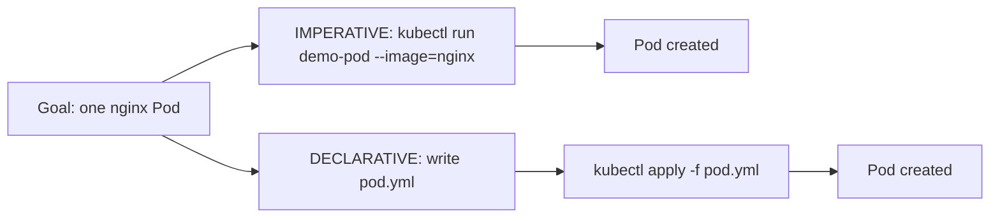
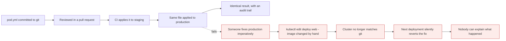

# Imperative vs declarative

*Module 12 · kubectl*

Usually we take a concept, explain the theory, then do the lab. This module reverses it deliberately -
we build the same Pod twice, two different ways, and only then compare them. For this particular topic
the practical comes first, because the difference is obvious once you have felt it and abstract before
that.

[Course home](../index.md) / Module 12

## 1. The same Pod, two roads



> **Why it matters:** Both roads end at the same Pod. Nothing about the result differs. What differs is everything *around* the result - whether it can be reviewed, repeated, versioned, or handed to a pipeline. That is the entire argument, and it has nothing to do with the Pod.

## 2. The imperative way

You give Kubernetes a **direct command**.

```bash
kubectl run demo-pod --image=nginx
```

```text
pod/demo-pod created
```

Verify, wait for it to be ready, then remove it:

```bash
kubectl get pods
# NAME       READY   STATUS              RESTARTS   AGE
# demo-pod   0/1     ContainerCreating   0          4s

kubectl get pods
# demo-pod   1/1     Running             0          38s

kubectl delete pod demo-pod
```

Every Pod you have created so far in this course has been imperative. One line, immediate result.

## 3. The declarative way

Now the same Pod, by a different road. First a file:

```yaml
# pod.yml
apiVersion: v1
kind: Pod
metadata:
  name: declarative-pod
spec:
  containers:
    - name: nginx
      image: nginx
```

Confirm the file exists, and read it back:

```bash
ls
cat pod.yml
```

**No Pod exists yet.** All that exists is a file describing one. Now apply it:

```bash
kubectl apply -f pod.yml
```

```text
pod/declarative-pod created
```

| Part of the command | Meaning |
| --- | --- |
| `kubectl apply` | Make the cluster match what I am about to give you |
| `-f` | The next thing is a **file** |
| `pod.yml` | Use whatever is in this file |

Check it, then delete it - **using the same file**:

```bash
kubectl get pods
kubectl delete -f pod.yml
kubectl get pods
```

> **NOTE - Created by file, deleted by file**
>
> Imperative: created with `run`, deleted by naming the object. Declarative: created with `apply -f`, deleted with `delete -f`. Keeping both sides in terms of the file is what makes the file the single source of truth - which is the whole point.

## 4. Now the theory

You have walked both roads. Here is what actually separates them.

| | Imperative | Declarative |
| --- | --- | --- |
| **What you do** | Give a direct command to Kubernetes | Define desired state in a YAML file |
| **Main idea** | "Create this Pod, now" | "Here is what I want to exist - make it so" |
| **Command** | `kubectl run`, `kubectl create` | `kubectl apply -f` |
| **When to use** | Quick testing, learning, troubleshooting | Real projects, production, CI/CD, GitOps, automation |
| **Speed** | Fast for a quick task - one line | Slower to start: write YAML, and indentation must be right |
| **Reusability** | Not easily reusable | **Highly reusable** - one file, used forever |
| **Team review** | Hard to review a command afterwards | The file goes in git; the team reviews it before it runs |
| **Version control** | Not suitable for git-based tracking | **Best for GitHub/GitLab tracking** - full history |
| **Production** | Not recommended for regular production changes | Production needs documentation and repeatable work |
| **Beginner friendly** | Easy to start - one command to remember | You must learn YAML first |
| **Real-world use** | Temporary Pod, quick debug, exam practice | Application deployment, repeatable setup, teamwork |
| **Main benefit** | Speed and simplicity | Consistency and repeatability |
| **Main limitation** | Hard to track and repeat | YAML syntax can be confusing at first |

> **TIP - The YAML objection has an answer**
>
> "But I have to write YAML" is the usual reason people stay imperative. Two things dissolve it. First, you rarely write from scratch - `kubectl create ... --dry-run=client -o yaml` generates a correct skeleton, and `kubectl explain` supplies any field you need. Second, an AI assistant will produce a valid manifest from a sentence. The cost of declarative is now roughly the cost of reviewing YAML, which you should be doing anyway.

## 5. What "repeatable" actually buys you



> **Why it matters:** The red path is called **configuration drift**, and it is one of the most common causes of "it worked yesterday" in real clusters. An imperative fix in production is invisible - it lives in one person's shell history. The next `apply` overwrites it, the incident returns, and the person who fixed it has left for the day.

## 6. Why `apply` can update but `create` cannot

A detail worth knowing, because it explains a real error.

```bash
kubectl create -f pod.yml    # first time: created
kubectl create -f pod.yml    # second time: Error ... already exists
kubectl apply -f pod.yml     # first time: created
kubectl apply -f pod.yml     # second time: unchanged  (or: configured)
```

`apply` stores what you sent in an annotation - `kubectl.kubernetes.io/last-applied-configuration` - so
next time it can compare three things: what you applied before, what you are applying now, and what is
live. That three-way merge is how it can add, change and remove fields correctly.

```bash
kubectl diff -f pod.yml       # show what apply WOULD change, before doing it
```

> **TIP - `kubectl diff` before `kubectl apply`, in production, always**
>
> It prints exactly what would change. Thirty seconds of reading a diff has prevented more outages than any monitoring tool. Treat it the way you treat `git diff` before a commit.

Officially there are three approaches, not two:

| Approach | Command | Notes |
| --- | --- | --- |
| Imperative commands | `kubectl run`, `kubectl create deployment` | Fastest; nothing to keep |
| Imperative object configuration | `kubectl create -f`, `kubectl replace -f` | Uses a file, but overwrites blindly and fails if it exists |
| **Declarative object configuration** | `kubectl apply -f` | Merges intelligently; this is what production means by "declarative" |

## 7. Where this ends up: GitOps

Follow declarative to its conclusion and you get GitOps: the manifests live in git, a controller in the
cluster - Argo CD or Flux - continuously compares git to the cluster and reconciles any difference.

| Property | Consequence |
| --- | --- |
| Git is the source of truth | The cluster is a *projection* of the repository |
| Every change is a pull request | Reviewed, approved, attributable |
| Rollback is `git revert` | No special tooling, no remembering what the old value was |
| Drift is detected automatically | An imperative change in the cluster gets reverted or flagged |

Notice that this is module 03's reconciliation loop again, one level up. Controllers reconcile Pods to
their spec; GitOps reconciles the whole cluster to a repository. Same idea, larger scope.

## 8. So which should you use?

Both. Deliberately.

| Situation | Use |
| --- | --- |
| Trying an image out for two minutes | Imperative |
| Debugging - a temporary Pod to run `curl` from | Imperative |
| CKA exam, under time pressure | Imperative to generate, then edit |
| Anything that must exist tomorrow | **Declarative** |
| Anything a colleague must be able to review | **Declarative** |
| Anything a pipeline runs | **Declarative** |

The workflow that gets you both:

```bash
kubectl create deployment web --image=nginx --dry-run=client -o yaml > web.yaml
# edit web.yaml, commit it
kubectl apply -f web.yaml
```

> **NOTE - This course leans declarative from here on**
>
> That is a deliberate choice. Declarative is slower to start with and can feel tedious, and it is what real projects run on - so it is what gets taught. Where imperative is genuinely the better tool, such as generating a skeleton or spinning up a throwaway debug Pod, it is used without apology.

> **PRACTICE - Practice now**
>
> Build the same Pod twice, exactly as in sections 2 and 3. Type the YAML - do not paste it.
>
> 1. Imperative:
>    ```bash
>    kubectl run demo-pod --image=nginx
>    kubectl get pods
>    kubectl delete pod demo-pod
>    ```
> 2. Declarative - write `pod.yml` yourself, then:
>    ```bash
>    cat pod.yml
>    kubectl apply -f pod.yml
>    kubectl get pods
>    kubectl delete -f pod.yml
>    ```
> 3. **Prove `create` is not `apply`.** Run each twice and read both messages:
>    ```bash
>    kubectl create -f pod.yml
>    kubectl create -f pod.yml
>    kubectl delete -f pod.yml
>    kubectl apply -f pod.yml
>    kubectl apply -f pod.yml
>    ```
> 4. **Prove `apply` updates in place.** Change the image in `pod.yml` to `nginx:1.25-alpine`, then:
>    ```bash
>    kubectl diff -f pod.yml
>    kubectl apply -f pod.yml
>    kubectl get pod declarative-pod -o jsonpath='{.spec.containers[0].image}'
>    ```
> 5. **Find the annotation that makes it work:**
>    ```bash
>    kubectl get pod declarative-pod -o jsonpath='{.metadata.annotations}'
>    ```
> 6. **Simulate drift.** Change something by hand, then re-apply the file and watch it revert:
>    ```bash
>    kubectl label pod declarative-pod owner=manual
>    kubectl get pod declarative-pod --show-labels
>    kubectl apply -f pod.yml
>    kubectl get pod declarative-pod --show-labels
>    ```
> 7. Use the hybrid workflow you will actually use at work:
>    ```bash
>    kubectl run demo --image=nginx --dry-run=client -o yaml > demo.yaml
>    kubectl apply -f demo.yaml
>    kubectl delete -f demo.yaml
>    ```
> 8. Clean up:
>    ```bash
>    kubectl delete -f pod.yml
>    ```

> **ASSIGNMENT - Assignment**
>
> Take something you created imperatively earlier in this course and convert it to a manifest you keep. Put it in a git repository with a short README explaining what it does and how to apply it. Then delete the object from the cluster and recreate it from the file alone. If you can rebuild it with no memory of the original command, you have made the shift that matters - and that repository is the beginning of the one that will eventually run your production cluster.

## 9. Interview drill

<details>
<summary><b>What is the difference between imperative and declarative in Kubernetes?</b></summary>

Imperative means issuing a direct command that performs an action now - `kubectl run`,
`kubectl create deployment`. Declarative means describing the desired end state in a file and letting
Kubernetes reconcile toward it - `kubectl apply -f`. Imperative is faster for a one-off; declarative is
reviewable, version-controlled, repeatable and safe to run in a pipeline, which is why production uses it.

</details>

<details>
<summary><b>Why can `kubectl apply` update an existing object when `kubectl create` cannot?</b></summary>

`apply` records the configuration you submitted in the
`kubectl.kubernetes.io/last-applied-configuration` annotation, so on the next run it can perform a
three-way merge between the previously applied config, the new config and the live object - correctly
adding, changing and removing fields. `create` has no such record; it is a one-shot create and fails with
`already exists`. `replace` overwrites the whole object blindly, which loses fields set by other
controllers.

</details>

<details>
<summary><b>What is configuration drift, and how does declarative management help?</b></summary>

Drift is when the running cluster no longer matches the configuration that is supposed to define it -
typically because someone made a manual fix with `kubectl edit`, `scale` or `patch`. It is dangerous
because the change is invisible and unattributable, and the next deployment silently reverts it.
Declarative management makes the file the source of truth, so changes are reviewed before they happen and
any divergence is detectable - and with GitOps, a controller reconciles it automatically.

</details>

<details>
<summary><b>When would you deliberately choose imperative commands?</b></summary>

Quick testing, learning, live troubleshooting, throwaway debug Pods, and the CKA exam - where typing one
line beats authoring a manifest. Also as a generator: `kubectl create ... --dry-run=client -o yaml`
produces a correct skeleton far faster than writing YAML from a blank file. The rule is that imperative is
fine for anything that does not need to exist tomorrow.

</details>

<details>
<summary><b>What is GitOps, and how does it relate to this?</b></summary>

The logical end point of declarative management. Manifests live in a git repository, and a controller in
the cluster - Argo CD or Flux - continuously compares the repository to the live cluster and reconciles
any difference. Git becomes the source of truth, every change is a reviewed pull request, rollback is
`git revert`, and drift is detected automatically. It is the same reconciliation loop Kubernetes uses
internally, applied one level up to the whole cluster.

</details>

---

[← Module 11](11-output-formats.md) &nbsp;&nbsp;|&nbsp;&nbsp; [Module 13: What is a Pod →](13-what-is-a-pod.md)

---

Kubernetes Administration: Zero to Architect · Himanshu Kumar.
