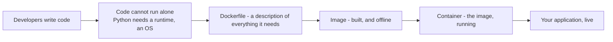
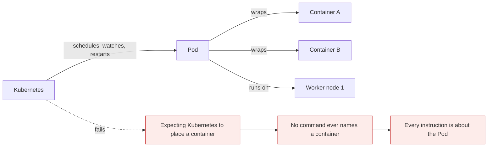
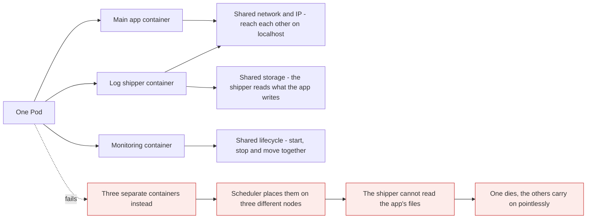
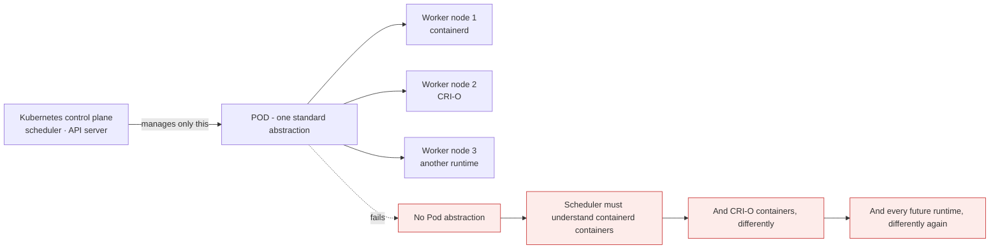

# What is a Pod

*Module 13 · Pods*

Kubernetes is a container orchestration tool - it exists to manage containers, because our applications
run inside containers. But there is a twist that catches everyone: **Kubernetes does not manage
containers directly.** It manages Pods. Understand the Pod properly and you understand roughly half of
Kubernetes.

[Course home](../index.md) / Module 13

## 1. The definition

> A **Pod** is the **smallest deployable unit** in Kubernetes. It can contain **one or more containers**
> that **share network and storage**.

Read it once more and pull out the three claims:

| Claim | Meaning |
| --- | --- |
| Smallest deployable unit | You never deploy a container. You deploy a Pod |
| One **or more** containers | Usually one. Sometimes two or three, for a good reason |
| Share network and storage | They behave as if they were on the same small machine |

Network and storage get full modules later. For now, even reading it cold, one thing is clear: **a Pod
contains containers.** So containers had better be clear first.

## 2. The journey from code to container



> **Why it matters:** An **image is offline** - a packaged, inert artefact. A **container is that image running**. Everything Kubernetes does happens to the running thing, which is why the distinction matters far more than it first appears.

A container behaves like a lightweight virtual machine running your application:

| It has | Consequence |
| --- | --- |
| An IP address, like any computer | Other things can talk to it over the network |
| A power on and off | It can be started, stopped, replaced |
| A finite capacity | More users means more copies - it must **scale** |
| A host it runs on | If that worker node dies, it must **move** |

All four of those - addressing, lifecycle, scaling, relocation - are exactly what Kubernetes gives you
ready to use. And it delivers all of them through the Pod.

## 3. The twist



> **Why it matters:** Kubernetes never says *"run this container on worker node 1"*. It says **"run this Pod on worker node 1"** - and because the containers are inside the Pod, they run there too. Kubernetes does manage your containers, but **indirectly, through the Pod.** Every scheduling decision, every restart, every scaling event is expressed in Pods.

So the obvious question is the right one to ask:

> **Why doesn't Kubernetes just run containers directly on worker nodes?**

If it did, we would never have to learn about Pods and the whole system would be simpler. There are two
reasons it does not.

## 4. Reason 1 - some containers must live together

A container is an isolated, lightweight virtual machine. Isolation is the point - and sometimes it is
exactly the problem.

Real applications often need several containers working as one unit. A common shape:

| Container | Job |
| --- | --- |
| **Main app** | Serves the actual application |
| **Log shipper** | Collects the logs the app writes and sends them somewhere |
| **Monitoring agent** | Watches the app and reports metrics |

You want those three to **always be together**, and whenever they run, to run **on the same worker node**.
By default containers are isolated, so there is no way to express that.



> **Why it matters:** Put the three in one Pod and they share a network and an IP address, share storage, and share a lifecycle - started, stopped and moved as one. You stop managing three containers and start managing **one Pod**. That is a real reduction in complexity, not a reshuffle of it.

This shape has a name - the **sidecar pattern** - and it is used constantly:

| Sidecar | What it does |
| --- | --- |
| Log shipper | Fluent Bit, Filebeat - collects and forwards logs |
| Service mesh proxy | Envoy in Istio or Linkerd - handles all network traffic |
| Metrics exporter | Translates app metrics into a Prometheus format |
| Config reloader | Watches a ConfigMap and signals the app to reload |
| **Init container** | Runs to completion *before* the app starts - migrations, waiting for a dependency |

> **WARNING - Do not put two of your own microservices in one Pod**
>
> A Pod scales as a unit. Two services in one Pod means you can never scale, update or fail them independently - which removes the entire reason you split them into microservices. A sidecar is a *helper* that cannot exist apart from its app. If both containers would make sense on their own, they belong in two Pods.

## 5. Reason 2 - a standard layer over different runtimes

Kubernetes is an orchestration system. But **who actually creates the container?** Not Kubernetes - the
**container runtime** on the worker node does. That used to be Docker; today it is containerd or CRI-O,
and different nodes could in principle run different ones.



> **Why it matters:** Different runtimes create containers with different properties. Without a common wrapper, the scheduler, the API server and every controller would each need to understand every runtime. Kubernetes wanted **one standard process**, so it defined one: whatever runtime built the container, it goes inside a Pod, and Kubernetes components only ever deal with Pods.

Everything Kubernetes does is therefore applied to the Pod:

| Kubernetes applies this... | ...to the Pod |
| --- | --- |
| Scheduling | Which node the **Pod** runs on |
| Scaling | How many **Pods** exist |
| Networking | The **Pod** gets an IP |
| Starting and restarting | The **Pod** is started or recreated |
| Health checking | Probes are defined on the **Pod** |
| Storage | Volumes are attached to the **Pod** |

Because the containers are inside, they are managed automatically. That is the whole design.

## 6. What if I only have one container?

Then it still goes in a Pod. There is no "direct container" mode, and reason 2 is why - the standard
abstraction only works if it has no exceptions. A single-container Pod is not a workaround; it is the
normal case, and the large majority of Pods you will ever see contain exactly one container.

> **NOTE - The container you never asked for**
>
> Every Pod quietly runs a tiny extra container - the **pause** or infrastructure container. It does nothing except hold the Pod's network and IPC namespaces open, so your containers can join them and so the namespaces survive a container restart. You will spot it in `crictl ps` on a node and wonder what it is. Now you know.

## 7. Extra points

- **A Pod is ephemeral.** It is not repaired - it is replaced. The replacement is a new Pod with a new
  name and a **new IP**. Every stable-addressing feature in Kubernetes exists because of this.
- **You rarely create bare Pods in production.** A Deployment creates and manages them for you. A Pod you
  created by hand is not recreated if its node dies - nothing owns it.
- **All containers in a Pod share one port space.** Two containers cannot both listen on port 80 in the
  same Pod, exactly as on one machine.
- **They reach each other on `localhost`.** Not by service name, not by IP - `localhost:8080`, because
  they share a network namespace.
- **The Pod is the unit of resource accounting.** Requests and limits are set per container, but the
  scheduler sums them to place the Pod.

> **PRACTICE - Practice now**
>
> The real practical is module 14. Today, prove the claims in this module.
>
> 1. Create a Pod and confirm Kubernetes talks about Pods, never containers:
>    ```bash
>    kubectl run demo-pod --image=nginx
>    kubectl get pods
>    kubectl get containers
>    ```
>    The second command does not exist. That is the module in one line.
> 2. Find the containers *inside* the Pod:
>    ```bash
>    kubectl describe pod demo-pod
>    kubectl get pod demo-pod -o jsonpath='{.spec.containers[*].name}'
>    ```
> 3. Confirm the Pod - not the container - was scheduled to a node:
>    ```bash
>    kubectl get pod demo-pod -o wide
>    ```
> 4. **Build a two-container Pod and prove they share a network.** Create `shared.yaml`:
>    ```yaml
>    apiVersion: v1
>    kind: Pod
>    metadata:
>      name: shared
>    spec:
>      containers:
>        - name: web
>          image: nginx
>        - name: helper
>          image: busybox
>          command: ["sh", "-c", "sleep 3600"]
>    ```
>    ```bash
>    kubectl apply -f shared.yaml
>    kubectl get pod shared
>    kubectl exec -it shared -c helper -- wget -qO- http://localhost:80
>    ```
>    The helper reached nginx on **localhost**, because they share one network namespace.
> 5. Confirm they share one IP:
>    ```bash
>    kubectl get pod shared -o wide
>    kubectl exec shared -c helper -- hostname -i
>    ```
> 6. **Prove the port conflict.** Change `helper` to another nginx and re-apply. Both want port 80. Read
>    what happens.
> 7. Clean up:
>    ```bash
>    kubectl delete pod demo-pod shared
>    ```

> **ASSIGNMENT - Assignment**
>
> Write two short paragraphs, in your own words, answering "why does the Pod abstraction exist?" - one for each reason. Then find a real example of each in the wild: a public Helm chart or Kubernetes manifest that uses a sidecar, and the CRI documentation showing the runtime interface. Being able to point at a real system rather than a diagram is what separates someone who has read about Pods from someone who understands why they were invented.

## 8. Interview drill

<details>
<summary><b>What is a Pod?</b></summary>

The smallest deployable unit in Kubernetes: a wrapper around one or more containers that share a network
namespace - the same IP, reachable on localhost - shared storage volumes, and a shared lifecycle. You
never deploy a container directly; you deploy a Pod, and Kubernetes schedules, scales, restarts and
addresses the Pod, which manages the containers inside it indirectly.

</details>

<details>
<summary><b>Why doesn't Kubernetes manage containers directly?</b></summary>

Two reasons. First, some containers must run together - a main application with a log shipper, a proxy or
a monitoring agent - sharing a network, storage and lifecycle, and an isolated container cannot express
"we must be co-located". Second, containers are created by the container runtime, not by Kubernetes, and
different nodes may run containerd or CRI-O. Without a common wrapper, the scheduler and every controller
would need to understand each runtime's containers separately. The Pod is a standard management layer
between Kubernetes and any runtime.

</details>

<details>
<summary><b>What does "share network and storage" actually mean?</b></summary>

All containers in a Pod are placed in the same network namespace, so they have one IP address, one port
space, and can reach each other on `localhost` - which also means two of them cannot listen on the same
port. Volumes are defined at the Pod level and can be mounted into several containers, so one container
can read files another writes. The namespaces are held open by a tiny pause container that runs in every
Pod.

</details>

<details>
<summary><b>When should a Pod have more than one container?</b></summary>

When a helper genuinely cannot exist without the main application and must share its network or
filesystem - a log shipper reading the app's files, a service mesh proxy intercepting its traffic, a
metrics exporter, a config reloader, or an init container that runs to completion before the app starts.
Never for two of your own microservices: a Pod scales as a unit, so putting two services in one removes
their ability to scale, update and fail independently.

</details>

<details>
<summary><b>Is a Pod permanent?</b></summary>

No - Pods are ephemeral by design. They are not repaired, they are replaced, and the replacement is a new
Pod with a new name and a new IP address. That single fact is why Services, DNS names and stable
identities exist at all, and it is why a Pod you create by hand is not recreated when its node dies -
nothing owns it. In production, controllers such as Deployments create Pods so that something is always
responsible for recreating them.

</details>

---

[← Module 12](12-imperative-vs-declarative.md) &nbsp;&nbsp;|&nbsp;&nbsp; [Module 14: Creating a Pod →](14-creating-pods.md)

---

Kubernetes Administration: Zero to Architect · Himanshu Kumar.
