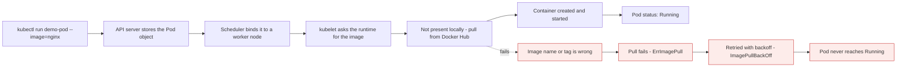

# Creating and inspecting a Pod

*Module 14 · Pods*

Module 13 explained what a Pod is. This one creates one, watches it come up, finds out where it landed
and what image it used, and removes it. Every command here is one you will type thousands of times.

[Course home](../index.md) / Module 14

## 1. Start from the cluster

To create a Pod you need a Kubernetes cluster. Confirm yours is there:

```bash
kubectl get nodes
```

```text
NAME                    STATUS   ROLES                  AGE   VERSION
k3d-devlab-server-0     Ready    control-plane,master   2d    v1.31.x+k3s1
k3d-devlab-agent-0      Ready    <none>                 2d    v1.31.x+k3s1
k3d-devlab-agent-1      Ready    <none>                 2d    v1.31.x+k3s1
```

One control plane and two worker nodes. **The Pod will be created on a worker node** - the control plane
decides, it does not host.

Now check whether anything is already running:

```bash
kubectl get pods
```

```text
No resources found in default namespace.
```

Nothing. Good - a clean starting point.

## 2. The command, word by word

We will use the **imperative** way. The declarative way needs a YAML file, which is module 17.

```bash
kubectl run demo-pod --image=nginx
```

| Part | Meaning |
| --- | --- |
| `kubectl` | The command line tool |
| `run` | The action that creates a **Pod** |
| `demo-pod` | The name of the Pod |
| `--image=nginx` | The image the container inside will use |

A Pod creates a container inside itself, and to create a container you need an **image**. Hence
`--image`.

### 2.1 "But I never downloaded nginx"

A fair question. In the real world you build **your own image** - your application code plus its
prerequisites - and use that. But this is your first Pod, so we use a ready-made public image.

Where does it come from? **By default, Kubernetes pulls from Docker Hub's public repository.** Nothing to
configure, nothing to download in advance.



> **Why it matters:** This is modules 03 and 04 happening to a real object. The failure branch is step 9 of the twelve-step flow and nothing else - the scheduler already succeeded and a node was already chosen. Recognising *which step* failed is most of Kubernetes troubleshooting.

> **NOTE - `nginx` is short for three things**
>
> `--image=nginx` is expanded to `docker.io/library/nginx:latest` - registry, repository and tag, all defaulted. That is why `kubectl describe` will show you `docker.io/library/nginx` rather than what you typed, and why a private registry needs the full path and an `imagePullSecret`.

## 3. Create it

```bash
kubectl run demo-pod --image=nginx
```

```text
pod/demo-pod created
```

## 4. Watch it come up

```bash
kubectl get pods
```

```text
NAME       READY   STATUS              RESTARTS   AGE
demo-pod   0/1     ContainerCreating   0          6s
```

Read that line properly:

| Column | Meaning right now |
| --- | --- |
| `READY 0/1` | The Pod has 1 container, and **0** of them are ready |
| `STATUS ContainerCreating` | The image is being pulled and the container started |

Run it again after a moment:

```text
NAME       READY   STATUS    RESTARTS   AGE
demo-pod   1/1     Running   0          51s
```

`1/1 Running`. Everything is good. The Pod exists, one container runs inside it, and that container uses
the nginx image - which was downloaded from Docker Hub automatically because we did not have it.

> **TIP - Waiting is normal, not a problem**
>
> The first Pod using a given image is always the slow one, because the image has to be pulled. A second Pod from the same image on the same node starts almost instantly - the layers are already there. If you get bored of pressing the up arrow, use `kubectl get pods -w`.

## 5. `-o wide`: where is it, and what IP does it have?

```bash
kubectl get pods -o wide
```

```text
NAME       READY   STATUS    RESTARTS   AGE   IP           NODE                   NOMINATED NODE
demo-pod   1/1     Running   0          2m    10.42.1.14   k3d-devlab-agent-0     <none>
```

Two new columns, and both matter:

| Column | What it tells you |
| --- | --- |
| **IP** | The Pod's IP address - assigned to the **Pod**, not the container |
| **NODE** | Which worker node it is running on |

**Who chose that node?** The **scheduler** in the control plane - module 03, section 7, doing its job on
your object. You did not choose it, and you should not want to.

> **WARNING - You cannot open that IP from your laptop**
>
> `10.42.1.14` is a cluster-internal address. It works from other Pods and from the nodes; it means nothing on your machine. Reaching an application from outside is a separate mechanism - `port-forward` in module 16, and Services later.

## 6. `describe`: the full story

```bash
kubectl describe pod demo-pod
```

A lot of output. Do not try to absorb all of it - look for these:

| Section | What to notice |
| --- | --- |
| `Node:` | The worker node, again |
| `IP:` | The Pod IP, again |
| `Containers:` | The container inside - here just one |
| `Image:` | `nginx` |
| `Image ID:` | `docker.io/library/nginx@sha256:...` - **proof it came from Docker Hub** |
| `State:` | `Running` |
| `Events:` | `Scheduled`, `Pulling`, `Pulled`, `Created`, `Started` |

That Image ID is worth pausing on. You typed `nginx`; Kubernetes resolved it to a full registry path and
a content digest. Right now the Pod holds one container - later you will run several, and they will all
be listed in this same section.

The Events list is the twelve-step flow, printed in order, for your Pod. `Scheduled` is step 7,
`Pulling`/`Pulled` is step 9, `Created`/`Started` is step 10.

## 7. Delete it

```bash
kubectl delete pod demo-pod
kubectl get pods
```

```text
pod "demo-pod" deleted
No resources found in default namespace.
```

Back to a clean cluster.

## 8. Things worth knowing before module 15

| Point | Detail |
| --- | --- |
| **A bare Pod is not resilient** | Nothing owns it. If its node dies, it is gone and nothing recreates it. Production uses Deployments |
| **Pod names must be DNS-safe** | Lowercase letters, digits and `-` only. `Demo_Pod` is rejected |
| **`imagePullPolicy` is inferred** | Tag `latest` or no tag → `Always`. A specific tag → `IfNotPresent` |
| **Pin your tags** | `nginx` means `nginx:latest`, which changes under you. `nginx:1.25-alpine` does not |
| **Generate instead of typing** | `kubectl run demo --image=nginx --dry-run=client -o yaml` gives you the manifest |
| **`--` passes a command** | `kubectl run x --image=busybox -- sh -c "echo hi"` runs that inside the container |

```bash
kubectl run demo --image=nginx --dry-run=client -o yaml
kubectl run demo-pod --image=nginx:1.25-alpine
kubectl get pod demo-pod -o jsonpath='{.spec.nodeName}'
```

> **PRACTICE - Practice now**
>
> 1. Confirm the cluster and that nothing is running:
>    ```bash
>    kubectl get nodes
>    kubectl get pods
>    ```
> 2. Create the Pod and watch it move through both states:
>    ```bash
>    kubectl run demo-pod --image=nginx
>    kubectl get pods
>    kubectl get pods
>    ```
> 3. Find where it landed and what IP it got:
>    ```bash
>    kubectl get pods -o wide
>    ```
> 4. Read the full story, and find the events in order:
>    ```bash
>    kubectl describe pod demo-pod
>    ```
>    Locate `Scheduled`, `Pulling`, `Pulled`, `Created`, `Started`.
> 5. **Prove the image came from Docker Hub** even though you never downloaded it:
>    ```bash
>    kubectl get pod demo-pod -o jsonpath='{.status.containerStatuses[0].imageID}'
>    ```
> 6. **Prove `nginx` is not really `nginx`:**
>    ```bash
>    kubectl get pod demo-pod -o jsonpath='{.spec.containers[0].image}'
>    kubectl describe pod demo-pod | Select-String -Pattern "Image"
>    ```
> 7. **Prove the second Pod is faster.** Create another from the same image and time it:
>    ```bash
>    kubectl run demo-pod-2 --image=nginx
>    kubectl get pods -w
>    ```
> 8. **Break it deliberately** and confirm which step failed:
>    ```bash
>    kubectl run broken --image=nginx:no-such-tag
>    kubectl get pods
>    kubectl describe pod broken
>    ```
>    Note that `describe` still shows a `Node:` - scheduling succeeded, only the pull failed.
> 9. Generate the manifest instead of the object:
>    ```bash
>    kubectl run demo --image=nginx --dry-run=client -o yaml
>    ```
> 10. Clean up:
>     ```bash
>     kubectl delete pod demo-pod demo-pod-2 broken
>     kubectl get pods
>     ```

> **ASSIGNMENT - Assignment**
>
> Create a Pod, then answer these five questions using only kubectl, writing down the exact command for each: which node is it on, what is its IP, what image digest is it actually running, how long did the image pull take, and what would happen to it if that node died right now. The last one has no command - it is a reasoning question, and getting it right is the reason module 15 and Deployments exist.

## 9. Interview drill

<details>
<summary><b>Walk me through `kubectl run demo-pod --image=nginx`.</b></summary>

kubectl sends a create request to the API server, which authenticates, validates and stores a Pod object.
The scheduler sees an unscheduled Pod, filters and scores the nodes, and binds it to a worker node. The
kubelet on that node sees a Pod assigned to it and asks the container runtime over CRI to pull the image -
`nginx` resolves to `docker.io/library/nginx:latest` from Docker Hub - and start the container. The
kubelet reports status back, and `kubectl get pods` shows `1/1 Running`.

</details>

<details>
<summary><b>Where does the image come from if you never downloaded it?</b></summary>

Docker Hub, by default. `--image=nginx` is expanded to `docker.io/library/nginx:latest` - the registry,
the `library` namespace and the `latest` tag are all implied. The kubelet instructs the container runtime
to pull it on first use, which is why the first Pod takes longer to start than the second one from the
same image on the same node. A private registry requires the full image path and an `imagePullSecret`.

</details>

<details>
<summary><b>Does the container have the IP address, or the Pod?</b></summary>

The **Pod**. One IP is allocated per Pod, and every container in it shares that address and port space,
reaching each other on `localhost`. The address is cluster-internal, so it is reachable from other Pods
and from nodes but not from your laptop, and it changes whenever the Pod is replaced - which is precisely
why Services exist.

</details>

<details>
<summary><b>Who decided which node the Pod runs on?</b></summary>

The scheduler in the control plane. It filters out nodes that cannot run the Pod - insufficient resources
against the Pod's requests, unmatched node selectors, untolerated taints, unbound volumes - then scores
the survivors and binds the Pod to the best fit by writing `nodeName` through the API server. You can see
the result in `kubectl get pods -o wide` or the `Scheduled` event in `kubectl describe`.

</details>

<details>
<summary><b>What happens to a Pod created with `kubectl run` if its node dies?</b></summary>

It is gone, and nothing recreates it. A bare Pod has no owner, so there is no controller comparing desired
state to current state on its behalf. That is the core reason production workloads are created by
Deployments, StatefulSets or DaemonSets rather than as bare Pods - the controller is what makes
self-healing possible.

</details>

<details>
<summary><b>Why should you avoid the `latest` tag?</b></summary>

Because it is a moving target, so two Pods created a week apart can be running different code with no
record of the change - and rollback becomes impossible since there is no earlier tag to return to. It also
sets `imagePullPolicy` to `Always`, adding a registry round trip to every Pod start. Pin a specific
version, ideally a digest, so that what you deployed is what is running.

</details>

---

[← Module 13](13-what-is-a-pod.md) &nbsp;&nbsp;|&nbsp;&nbsp; [Module 15: Pod status and lifecycle →](15-pod-status-lifecycle.md)

---

Kubernetes Administration: Zero to Architect · Himanshu Kumar.
