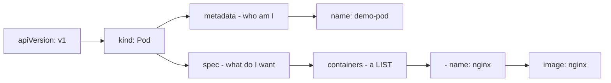
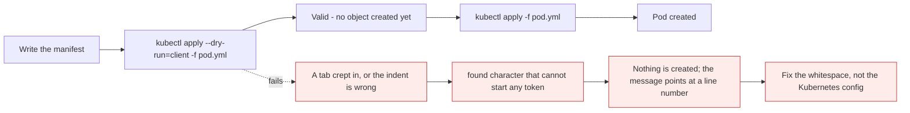

# Creating a Pod with YAML

*Module 17 · Pods*

You can create Pods with a command very easily. That is the imperative way. In the real world we use the
declarative way - we write a YAML file and create the Pod from it. This module builds that file by hand,
line by line, and the instruction that matters most is this: **type it, do not copy it.**

[Course home](../index.md) / Module 17

## 1. Find the apiVersion first - do not guess it

```bash
kubectl api-resources
```

Find the row for `pods`:

```text
NAME    SHORTNAMES   APIVERSION   NAMESPACED   KIND
pods    po           v1           true         Pod
```

**`v1`**. Remember it - it is the first line of the file. This is module 10 doing real work: two seconds
of `api-resources` removes any chance of the `no matches for kind` error.

## 2. Open an editor

```bash
vi pod.yml
```

Any editor you are comfortable with works - `nano`, `vim`, whatever. If you use `vi`:

| Key | Does |
| --- | --- |
| `i` | Enter INSERT mode - now you can type |
| `Esc` | Leave INSERT mode |
| `:wq` | Write and quit |
| `:q!` | Quit without saving - when you have made a mess |

## 3. Write the file, line by line

```yaml
apiVersion: v1
```

**Case matters.** `apiVersion` has a capital `V`. `apiversion` is not the same thing and will be rejected.

```yaml
kind: Pod
```

What are we creating? A Pod - and `Pod` has a **capital P**. Both `kind` and its value came from
`api-resources`.

> **Why it matters:** You only learn details like the capital `V` and capital `P` by **writing the file yourself**. Copy from a blog and it works, and you learn nothing - then in a real project, from memory, you type `pod` and spend ten minutes on an error you have never seen before.

```yaml
metadata:
  name: demo-pod
```

`metadata` holds the details about the Pod. Right now we need only a name.

**Indentation: use two spaces. Never a tab.** Two spaces is the convention for Kubernetes YAML, and tabs
are not valid YAML at all.

```yaml
spec:
  containers:
    - name: nginx
      image: nginx
```

`spec` is the specification - and inside a Pod we create containers.

Notice the `-`. A Pod can contain **more than one container**, so `containers` is a **list**, and every
item in a YAML list begins with a dash. `metadata.name` had no dash because there is exactly one name;
`containers` can have many, and each one needs its own `name`.

Then the image the container should use.

Save and exit: **`Esc`**, then **`:wq`**.

### 3.1 The finished file

```yaml
apiVersion: v1
kind: Pod
metadata:
  name: demo-pod
spec:
  containers:
    - name: nginx
      image: nginx
```

```bash
ls
cat pod.yml
```



> **Why it matters:** Every Kubernetes object you will ever write has these same four top-level keys - `apiVersion`, `kind`, `metadata`, `spec`. Deployments, Services, ConfigMaps, Ingresses: the top of the file is always identical, and only `spec` changes. Learn this shape once and every future manifest is familiar.

## 4. Apply it

```bash
kubectl apply -f pod.yml
```

```text
pod/demo-pod created
```

```bash
kubectl get pods
```

```text
NAME       READY   STATUS              RESTARTS   AGE
demo-pod   0/1     ContainerCreating   0          5s
```

`ContainerCreating` means **everything is fine** - it is starting. If instead you see `Pending`, there is
a problem, and the next command is always the same:

```bash
kubectl describe pod demo-pod
```

Wait a moment and check again:

```text
demo-pod   1/1   Running   0   42s
```

## 5. Inspect it

```bash
kubectl describe pod demo-pod
```

Which node did it land on, what image is it running, any problems? Right now, none - the Pod is running
happily on a worker node.

```bash
kubectl get pod demo-pod -o yaml
```

The same object, read back as YAML - exactly what module 11 covered. Compare it to the seven lines you
wrote and notice how many fields Kubernetes filled in for you.

## 6. Delete it - with the file

```bash
kubectl delete -f pod.yml
kubectl get pods
```

```text
pod "demo-pod" deleted
No resources found in default namespace.
```

> **NOTE - The file must be in your current directory**
>
> `-f pod.yml` is a relative path. If you have moved directories, either `cd` back or give the full path. `kubectl delete -f ./manifests/pod.yml` works fine.

## 7. YAML errors, and what they actually say

The four you will meet, with their real messages:

| Mistake | Error you get |
| --- | --- |
| Used a **tab** for indentation | `found character that cannot start any token` |
| Wrong indentation level | `error converting YAML to JSON: yaml: line N: did not find expected key` |
| `apiVersion: v1` for a Deployment | `no matches for kind "Deployment" in version "v1"` |
| Forgot `containers` | `Pod "x" is invalid: spec.containers: Required value` |
| Forgot the `-` before `name` | `cannot unmarshal object into ... []v1.Container` |



> **Why it matters:** Most first-week YAML failures are **whitespace**, not Kubernetes. The error mentions tokens and unmarshalling and looks alarming, but the fix is almost always a tab or an indent. Configure your editor to insert two spaces for the Tab key and half of these disappear permanently.

```bash
kubectl apply --dry-run=client -f pod.yml     # validate without creating anything
kubectl diff -f pod.yml                       # what would change, if it exists
```

## 8. Things you will add to this same file

Seven lines is the smallest useful Pod. The file grows as the course does - and it is always the same
file, with more inside `spec`:

| Coming later | Where it goes |
| --- | --- |
| Environment variables | `spec.containers[].env` - **module 18** |
| Labels | `metadata.labels` |
| Ports | `spec.containers[].ports` |
| Resource requests and limits | `spec.containers[].resources` |
| Liveness and readiness probes | `spec.containers[].livenessProbe` |
| Volumes | `spec.volumes` and `spec.containers[].volumeMounts` |
| Restart policy | `spec.restartPolicy` |

And when you do not know a field name, you already know the answer: `kubectl explain pod.spec.containers`.

> **TIP - Several objects in one file**
>
> Separate them with `---` on its own line and `kubectl apply -f` creates all of them. You can also apply a whole directory with `kubectl apply -f ./manifests/`. That is how real projects are organised.

> **WARNING - Please do not copy-paste this, and do not ask an AI for it**
>
> Not for this one. Write the seven lines yourself, two or three times, and you will never forget them - the capital `V`, the capital `P`, two spaces, the dash before a list item. Once that is genuinely automatic, generate and use AI freely; you will be reviewing output instead of trusting it. This is the one file in the course worth typing by hand.

> **PRACTICE - Practice now**
>
> 1. Get the apiVersion from the cluster, not from memory:
>    ```bash
>    kubectl api-resources | Select-String -Pattern "^pods"
>    ```
> 2. Write `pod.yml` in an editor. **Type every character.** No pasting.
> 3. Check it before applying:
>    ```bash
>    cat pod.yml
>    kubectl apply --dry-run=client -f pod.yml
>    ```
> 4. Apply and watch it start:
>    ```bash
>    kubectl apply -f pod.yml
>    kubectl get pods
>    kubectl get pods
>    ```
> 5. Inspect it two ways:
>    ```bash
>    kubectl describe pod demo-pod
>    kubectl get pod demo-pod -o yaml
>    ```
>    Count how many fields Kubernetes added that you did not write.
> 6. **Break it on purpose**, four times, and read each message before fixing it:
>    - replace one indent with a tab
>    - change `kind: Pod` to `kind: pod`
>    - change `apiVersion: v1` to `apiVersion: apps/v1`
>    - delete the `-` before `name: nginx`
> 7. Add a second container to the list and re-apply from a clean start:
>    ```yaml
>        - name: helper
>          image: busybox
>          command: ["sh", "-c", "sleep 3600"]
>    ```
>    ```bash
>    kubectl delete -f pod.yml
>    kubectl apply -f pod.yml
>    kubectl get pods
>    ```
>    Note the `READY` column now reads `2/2`.
> 8. Delete with the file, and confirm:
>    ```bash
>    kubectl delete -f pod.yml
>    kubectl get pods
>    ```
> 9. Tomorrow, write the file again from memory. Then once more the day after.

> **ASSIGNMENT - Assignment**
>
> Delete `pod.yml`. Wait a day. Now write it again from scratch with no reference of any kind - not this page, not your history, not an AI - and apply it successfully on the first try. If you cannot, you have not learned it yet, and repeating that exercise is worth more than reading three more modules. Every manifest for the rest of your career starts with these four keys.

## 9. Interview drill

<details>
<summary><b>What are the four top-level fields of every Kubernetes manifest?</b></summary>

`apiVersion`, `kind`, `metadata` and `spec`. `apiVersion` names the API group and version - `v1` for core
objects like Pods, `apps/v1` for Deployments. `kind` is the object type. `metadata` carries identity -
name, namespace, labels, annotations. `spec` is the desired state and is the only part that differs
meaningfully between object types. Objects also have a `status`, but that is written by Kubernetes, not by
you.

</details>

<details>
<summary><b>Why does `containers` need a dash but `metadata.name` does not?</b></summary>

Because `containers` is a **list** - a Pod can hold more than one container - and in YAML each item in a
list begins with a dash. `metadata.name` is a single scalar value, so there is nothing to enumerate.
That is also why every container in the list needs its own `name` field: the list has to distinguish
them.

</details>

<details>
<summary><b>Your manifest fails with "found character that cannot start any token". What is wrong?</b></summary>

A tab character. YAML does not allow tabs for indentation - only spaces. The error looks like a parser
problem but is purely whitespace, and it usually appears when an editor auto-inserts tabs. Configure the
editor to expand Tab to two spaces. The related error, `did not find expected key`, is the same family of
problem: an indentation level that does not line up.

</details>

<details>
<summary><b>How do you validate a manifest before applying it?</b></summary>

`kubectl apply --dry-run=client -f file.yml` parses and validates locally without contacting the cluster;
`--dry-run=server` sends it to the API server for full validation and admission checks without persisting
anything. `kubectl diff -f file.yml` shows exactly what would change if the object already exists. In
production the diff is the one that matters - reading it before applying prevents far more incidents than
it costs in time.

</details>

<details>
<summary><b>How would you find a field name you cannot remember?</b></summary>

`kubectl explain`, walking down the path - `kubectl explain pod.spec`, then `pod.spec.containers`, then
the field itself - or `kubectl explain pod --recursive` and search the output. It shows types and marks
required fields, works offline, is correct for the exact cluster version, and is allowed in the CKA exam.
For a starting skeleton, `kubectl run x --image=nginx --dry-run=client -o yaml` generates a valid file to
edit.

</details>

---

[← Module 16](16-logs-exec-portforward.md) &nbsp;&nbsp;|&nbsp;&nbsp; [Module 18: Environment variables →](18-pod-environment-variables.md)

---

Kubernetes Administration: Zero to Architect · Himanshu Kumar.
