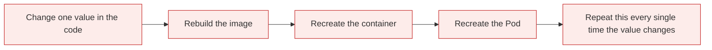
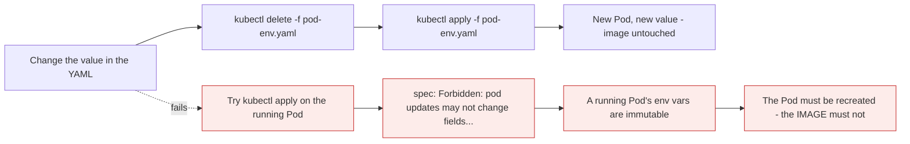

# Pod environment variables

*Module 18 · Pods*

If you jump straight to the practical here you will be confused, so this module does the foundation
first: **why** environment variables exist at all. Then it sets them, reads them from inside a running
container, changes one, and hits the error that teaches the real lesson.

[Course home](../index.md) / Module 18

## 1. The problem, without environment variables

The standard journey by now is familiar:


There is one difficulty hiding in it. **What happens when you need to change something in the code?**



> **Why it matters:** Every step of that chain costs time - a build, a push, a pull, a rollout - and it happens for a one-line change. Worse, the artefact you tested is no longer the artefact you ship, because you rebuilt it.

### 1.1 A concrete example

Your application uses a database. In testing, that database is at **10.10.10.10**, so the developer puts
that address in the code. It is a **hard-coded value**.

Then production is built, and its database is at **11.11.11.11**.

| Step | What you must do |
| --- | --- |
| 1 | Edit the code: remove `10.10.10.10`, write `11.11.11.11` |
| 2 | Rebuild the image |
| 3 | Create a new container |
| 4 | Recreate the Pod |

And every time that value changes again, the whole process repeats. **We do not want this.** Changing a
value should not require rebuilding an image.

## 2. The solution

Use an **environment variable**.

You cannot bolt this on afterwards - it is a decision made when the code is written. The developer writes
the code to **read the value from an environment variable** instead of containing the value.


> **Why it matters:** The variable is **defined in the code**; the **value is supplied in the Pod YAML**. Those two must match by name - that is the contract. Once they do, the value can change as often as you like with **no code change and no image rebuild**. The same image serves testing and production; only the YAML differs.

Back to the example: put `DB_HOST` in the code, then write `10.10.10.10` in the test Pod's YAML and
`11.11.11.11` in the production Pod's YAML. One image, two environments.

| Without env vars | With env vars |
| --- | --- |
| Value lives in the code | Value lives in the Pod manifest |
| Change means rebuilding the image | **No code change, no image rebuild** |
| A separate image per environment | **The same image everywhere** |
| The tested artefact is rebuilt before shipping | The tested artefact is the one that ships |

> **NOTE - This is a principle, not a Kubernetes trick**
>
> "Store config in the environment" is one of the twelve-factor app rules and predates Kubernetes by years. It is why the same container image can run on your laptop, in CI, on staging and in production - and why an image containing an environment-specific value is considered broken, not convenient.

## 3. The practical: setting them

A Pod manifest with environment variables:

```yaml
# pod-env.yaml
apiVersion: v1
kind: Pod
metadata:
  name: demo-pod
spec:
  containers:
    - name: demo-container
      image: busybox
      command: ["sh", "-c", "sleep 3600"]
      env:
        - name: UI_COLOR
          value: "blue"
        - name: CUSTOMER_NAME
          value: "Customer-A"
```

Two parts are new; everything else is module 17.

**`command: ["sh", "-c", "sleep 3600"]`** - busybox normally starts, runs a command and stops. We need it
**alive** so we can look inside it, so it sleeps for 3600 seconds - one hour.

**`env:`** - a **list**, hence the dashes, of `name` and `value` pairs. Two variables here:

| Variable | Value |
| --- | --- |
| `UI_COLOR` | `blue` |
| `CUSTOMER_NAME` | `Customer-A` |

```bash
kubectl apply -f pod-env.yaml
kubectl get pods
# demo-pod   0/1   ContainerCreating   0   4s
# demo-pod   1/1   Running             0   20s
```

## 4. Reading them from inside

The variables are set **inside the container**, so to see them you have to run a command inside the
container - module 16's `exec`, now doing real work.

```bash
kubectl exec demo-pod -- printenv UI_COLOR
```

```text
blue
```

```bash
kubectl exec demo-pod -- printenv CUSTOMER_NAME
```

```text
Customer-A
```

That confirms the whole chain: the Pod was created, the container inside it was created, and the
environment variables were set inside that container.

See all of them:

```bash
kubectl exec demo-pod -- printenv
```

You will find far more than two - `PATH` and the usual Linux defaults, several `KUBERNETES_*` variables
Kubernetes injects automatically, and at the end, yours. Concentrate on your two.

> **NOTE - `printenv` is a Linux command**
>
> There is nothing Kubernetes-specific about it. `kubectl exec` simply runs it inside the container, which is exactly the point of module 16 - once you can run commands in there, everything you already know about Linux applies.

## 5. Changing a value - and the error that teaches the lesson

Environment variables exist so values can change. Change one.

Edit `pod-env.yaml` and replace `blue` with `green` - use `vi`, `nano`, or a one-liner:

```bash
sed -i 's/blue/green/' pod-env.yaml
cat pod-env.yaml
```

Confirm it now says `green`. **Note carefully where that change was made: in the YAML file. Nothing has
been changed inside the container.**

Now re-apply:

```bash
kubectl apply -f pod-env.yaml
```

```text
The Pod "demo-pod" is invalid: spec: Forbidden: pod updates may not change fields
other than `spec.containers[*].image`, `spec.initContainers[*].image`,
`spec.activeDeadlineSeconds`, `spec.tolerations` (only additions to existing tolerations)
or `spec.terminationGracePeriodSeconds`
```



> **Why it matters:** This is the sentence to take away: **you must recreate the Pod, but you do not have to rebuild the image.** Environment variables do not mean "no restart" - they mean "no rebuild". The expensive part of the chain in section 1 is gone; the cheap part remains.

Recreate it:

```bash
kubectl delete -f pod-env.yaml
kubectl get pods                   # wait until it is gone
kubectl apply -f pod-env.yaml
kubectl get pods                   # wait for Running
kubectl exec demo-pod -- printenv UI_COLOR
```

```text
green
```

> **TIP - Why show you an error deliberately?**
>
> Because the CKA is a practical exam and production is a practical job. You need to have *seen* what an error looks like and know what your decision is when it appears. An error you recognise costs thirty seconds; an error you have never seen costs half an hour and your confidence.

> **NOTE - Deployments do not have this problem**
>
> A bare Pod is immutable in these fields, so you delete and recreate it by hand. Change the env of a **Deployment** and the Deployment controller does it for you - it creates new Pods with the new value and retires the old ones, with zero downtime. That is one of several reasons production never uses bare Pods, and it is coming shortly.

## 6. The other ways to supply a value

Hard-coding `value:` in the manifest is the starting point, not the destination.

| Source | YAML | Use for |
| --- | --- | --- |
| Literal | `value: "blue"` | Simple, non-sensitive settings |
| **ConfigMap** | `valueFrom.configMapKeyRef` | Config shared by many Pods |
| **Secret** | `valueFrom.secretKeyRef` | Passwords, tokens, keys |
| Pod metadata | `valueFrom.fieldRef` | The Pod's own name, namespace, node, IP |
| Resource values | `valueFrom.resourceFieldRef` | The container's own CPU or memory limit |
| Whole ConfigMap or Secret | `envFrom` | Import every key at once |

```yaml
env:
  - name: DB_HOST
    valueFrom:
      configMapKeyRef:
        name: app-config
        key: db_host
  - name: DB_PASSWORD
    valueFrom:
      secretKeyRef:
        name: db-secret
        key: password
  - name: MY_POD_NAME
    valueFrom:
      fieldRef:
        fieldPath: metadata.name
envFrom:
  - configMapRef:
      name: app-config
```

> **WARNING - Never put a password in `value:`**
>
> It sits in plain text in your manifest, in git, in `kubectl get pod -o yaml`, and in anyone's terminal history. Use a Secret - and know that a Kubernetes Secret is only base64-encoded, not encrypted, unless encryption at rest is enabled. ConfigMaps and Secrets get their own module; for now, just do not type a password into `value:`.

## 7. Extra points

- **Environment variables are set at container start.** They can never change in a running process -
  which is exactly why the Pod must be recreated.
- **`fieldRef` is called the Downward API.** It lets a container learn its own Pod name, namespace, node
  and IP - useful for logging and for registering with a service.
- **The `KUBERNETES_*` variables are injected automatically** for every Service in the namespace. They are
  legacy; DNS is the modern way to find a Service.
- **Only four things can change on a running Pod**: container images, `activeDeadlineSeconds`, added
  tolerations, and `terminationGracePeriodSeconds`. Everything else needs a new Pod.
- **`command` in YAML is Docker's `ENTRYPOINT`**, and `args` is Docker's `CMD`. The names differ; the
  behaviour is the same.

> **PRACTICE - Practice now**
>
> 1. Write `pod-env.yaml` from section 3 - by hand - and apply it:
>    ```bash
>    kubectl apply -f pod-env.yaml
>    kubectl get pods
>    ```
> 2. Read each variable from inside the container:
>    ```bash
>    kubectl exec demo-pod -- printenv UI_COLOR
>    kubectl exec demo-pod -- printenv CUSTOMER_NAME
>    ```
> 3. See everything, including what Kubernetes injected:
>    ```bash
>    kubectl exec demo-pod -- printenv
>    ```
> 4. **Prove the value is in the object, not the image:**
>    ```bash
>    kubectl get pod demo-pod -o jsonpath='{.spec.containers[0].env}'
>    ```
> 5. Change `blue` to `green` in the file, confirm the file changed, and **hit the error on purpose**:
>    ```bash
>    sed -i 's/blue/green/' pod-env.yaml
>    cat pod-env.yaml
>    kubectl apply -f pod-env.yaml
>    ```
>    Read the message fully. Note which fields it says *can* be changed.
> 6. **Prove the image can be changed** while other fields cannot - edit only the image in the file and
>    apply. It is accepted.
> 7. Recreate properly and confirm the new value:
>    ```bash
>    kubectl delete -f pod-env.yaml
>    kubectl apply -f pod-env.yaml
>    kubectl exec demo-pod -- printenv UI_COLOR
>    ```
> 8. **Use the Downward API** - add this and recreate:
>    ```yaml
>        - name: MY_POD_NAME
>          valueFrom:
>            fieldRef:
>              fieldPath: metadata.name
>    ```
>    ```bash
>    kubectl exec demo-pod -- printenv MY_POD_NAME
>    ```
> 9. Clean up:
>    ```bash
>    kubectl delete -f pod-env.yaml
>    ```

> **ASSIGNMENT - Assignment**
>
> Take the database example from section 1 literally. Write two manifests, `pod-test.yaml` and `pod-prod.yaml`, that are **byte-for-byte identical except for the value of `DB_HOST`** and the Pod name. Apply both, and prove with `printenv` that each container sees a different address while running the same image. Then write one sentence explaining to a manager why this removes a build step from every configuration change. That sentence is the business case for twelve-factor config, and you will use it more often than the YAML.

## 8. Interview drill

<details>
<summary><b>Why use environment variables instead of putting values in the code?</b></summary>

Because a hard-coded value means every change requires editing code, rebuilding the image, and recreating
the container and Pod - for a one-line difference such as a database address. With an environment
variable the code reads the value at runtime and the value lives in the Pod manifest, so the **same image**
runs in testing and production with different configuration. It also means the artefact you tested is the
artefact you ship, because nothing is rebuilt between them.

</details>

<details>
<summary><b>Where is the variable defined, and where is the value set?</b></summary>

The variable is defined in the **application code**, which reads it at runtime. The value is supplied in
the **Pod manifest**, under `spec.containers[].env`. The two must agree on the name - that is the entire
contract. Nothing about the image knows or cares what the value will be.

</details>

<details>
<summary><b>You changed an env var in a Pod manifest and `kubectl apply` failed. Why?</b></summary>

Because a running Pod is largely immutable. The API rejects it with `spec: Forbidden: pod updates may not
change fields other than...` - only container images, `activeDeadlineSeconds`, added tolerations and
`terminationGracePeriodSeconds` can change in place. You must delete and recreate the Pod. Crucially you
do **not** have to rebuild the image, which is the saving environment variables actually deliver. With a
Deployment you would not do this by hand at all - the controller rolls out new Pods for you.

</details>

<details>
<summary><b>What are the ways to set an environment variable in a Pod?</b></summary>

A literal `value:`; `valueFrom.configMapKeyRef` for shared configuration; `valueFrom.secretKeyRef` for
sensitive values; `valueFrom.fieldRef` for the Pod's own metadata such as its name, namespace, node or IP
- the Downward API; `valueFrom.resourceFieldRef` for the container's own CPU or memory limits; and
`envFrom` to import an entire ConfigMap or Secret at once. Literals are fine for simple non-sensitive
settings and wrong for anything else.

</details>

<details>
<summary><b>Why should a password never go in `value:`?</b></summary>

Because it is stored in plain text in the manifest, which means it is in git, in `kubectl get pod -o
yaml`, in shell history, and visible to anyone with read access to the namespace. Use a Secret with
`secretKeyRef` - while remembering that Kubernetes Secrets are base64-encoded rather than encrypted unless
encryption at rest is enabled, so RBAC and an external secret manager still matter.

</details>

<details>
<summary><b>Can an environment variable change while the container is running?</b></summary>

No. Environment variables are handed to a process when it starts, so they are fixed for that process's
lifetime - this is a Linux property, not a Kubernetes limitation. Any change requires a new container,
which means a new Pod. If you need configuration that can change without a restart, mount a ConfigMap as a
volume - the file contents are updated in place - and have the application watch the file or accept a
reload signal.

</details>

---

[← Module 17](17-pod-yaml.md) &nbsp;&nbsp;|&nbsp;&nbsp; Module 19 coming next

---

Kubernetes Administration: Zero to Architect · Himanshu Kumar.
